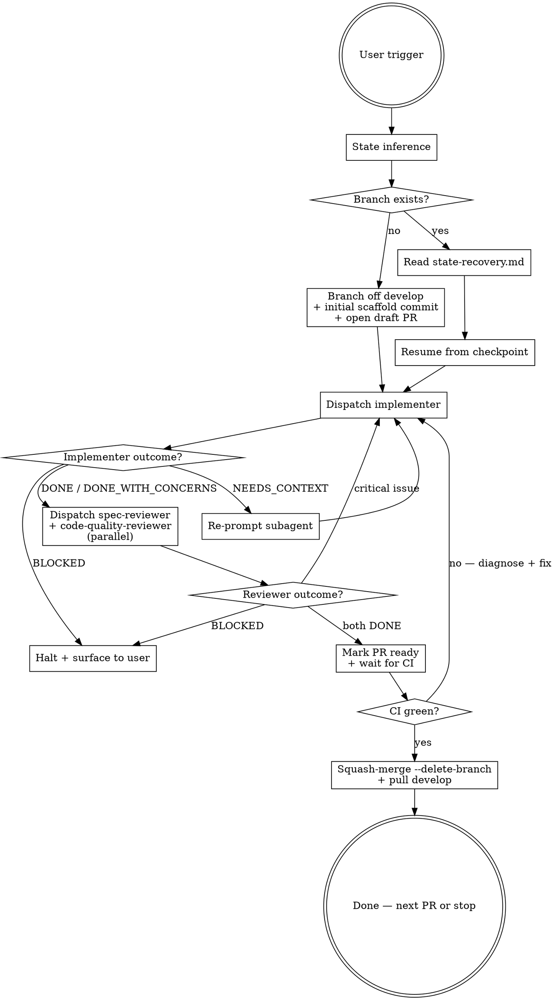

# Plan Execution

Execute one PR of one plan, end-to-end, off `develop`. Implements [ADR-024](../../../docs/decisions/024-agentic-plan-execution-methodology.md).

## When This Skill Triggers

The user says any of:

- `execute Plan-NNN` — auto-detect next PR
- `execute Plan-NNN PR #M` — explicit PR number
- `kick off Plan-NNN`, `start Plan-NNN`, `work on Plan-NNN`, `continue Plan-NNN`
- `resume Plan-NNN` — resume an in-flight PR (state recovery)

If the user names a plan but the trigger phrase is ambiguous, use this skill anyway and confirm the inferred PR before dispatching subagents.

## Why This Methodology

[ADR-024](../../../docs/decisions/024-agentic-plan-execution-methodology.md) is the decision document. Read it once when you first invoke this skill so the trade-offs (three-subagent overhead, four-mode failure taxonomy, state-canonicality order) are in context. The skill body is the executable form; the ADR is the *why*.

## Workflow



## Step-by-Step

### 1. State inference (always first)

Run these in parallel:

```bash
git branch --show-current
git status --short
gh pr list --state open --head "$(git branch --show-current)" --json number,title,isDraft 2>/dev/null
gh pr list --state merged --search "Plan-NNN in:title" --json number,title --limit 20
```

Decision tree:

- **Branch is `feat/plan-NNN-*` with open PR** → in-progress PR. Read `references/state-recovery.md` for the resumption protocol.
- **Branch is `develop` (or anything else) and no PR open** → fresh start. Determine `M` (next PR):
  - If user said `PR #M` explicitly, use that.
  - Else: count merged PRs whose title contains `Plan-NNN`; next-up `M` = count + 1.
- **Mismatch** (e.g., on `feat/plan-001-*` but user said `PR #5` and the branch is for `PR #3`) → halt, ask the user to disambiguate. Do not silently switch branches.

Confirm to the user in one sentence: *"Executing Plan-NNN PR #M (`<inferred-or-explicit>`) — branching off `develop`."* Then proceed without waiting for ack unless the inference was ambiguous.

### 2. Read the plan task for PR #M

Read `docs/plans/NNN-*.md` and find the section describing PR #M (typically a heading like "PR #M:" or "## Step M"). Extract:

- The PR's goal and deliverables.
- Files to create / modify.
- Test plan / acceptance criteria.
- Required ADRs cited.
- Cross-plan dependencies (consult `docs/architecture/cross-plan-dependencies.md` if the plan task touches files another plan owns).

The plan section is the implementer's brief. Capture it verbatim — do not paraphrase into the subagent prompt.

### 3. Branch off `develop` (fresh start only)

```bash
git switch develop && git pull --ff-only
git switch -c <type>/plan-NNN-<short-topic>
```

`<type>` is the [Conventional Branch](https://conventional-branch.github.io/) type that matches the plan task's primary intent (`feat`, `fix`, `chore`, `docs`, `test`). Most plan PRs are `feat/`. See [CONTRIBUTING.md §Branch Naming](../../../CONTRIBUTING.md#branch-naming) for the type taxonomy.

`<short-topic>` is hyphenated, lowercase, no underscores or dots, action-verbed. Example: `feat/plan-001-monorepo-scaffold`.

Make a scaffold commit so the PR thread can open:

```bash
git commit --allow-empty -m "chore(<scope>): scaffold Plan-NNN PR #M"
git push -u origin HEAD
```

Open the draft PR base `develop`:

```bash
gh pr create --draft --base develop \
  --title "<conventional-commit-subject>" \
  --body "$(cat <<'EOF'
## Summary
<one-paragraph description from the plan>

## Test plan
- [ ] <criterion 1>
- [ ] <criterion 2>

Refs: ADR-NNN[, BL-NNN], Plan-NNN
Co-Authored-By: Claude Opus 4.7 (1M context) <noreply@anthropic.com>
EOF
)"
```

The PR title MUST be a valid Conventional Commit subject; it becomes the squash-commit subject on `develop`.

### 4. Dispatch the implementer subagent

Use the `general-purpose` subagent (or a more specialized one if the plan task warrants — e.g., `Plan` for design-heavy tasks). Prompt template lives in `references/subagent-roles.md` under "Implementer".

Pass the implementer:

- The plan task verbatim (Section 2 extract).
- The current branch and PR number.
- Hard rules: stay on this branch, do not push to `develop` or `main`, follow [CONTRIBUTING.md commit format](../../../CONTRIBUTING.md#commit-format).
- Expected outcome shape: one of `DONE`, `DONE_WITH_CONCERNS`, `NEEDS_CONTEXT`, `BLOCKED`.

Wait for the implementer to return. Route per `references/failure-modes.md`.

### 5. Dispatch reviewers (parallel)

After implementer returns `DONE` or `DONE_WITH_CONCERNS`, dispatch **both** reviewers in the same message (single multi-Agent block) so they run concurrently:

- **Spec-reviewer** — checks the diff against the plan task, the governing spec, and any cited ADRs. Looks for spec drift, missing fields, wrong return shapes, unimplemented branches. Prompt template: `references/subagent-roles.md` "Spec Reviewer".
- **Code-quality-reviewer** — checks idiomatic style, test coverage, type safety, and maintainability against [`.claude/rules/coding-standards.md`](../../rules/coding-standards.md). Prompt template: `references/subagent-roles.md` "Code Quality Reviewer".

Both reviewers must return `DONE` (or `DONE_WITH_CONCERNS` where concerns are non-blocking) before proceeding. If either returns critical findings, loop back to step 4 with the findings as additional context to the implementer.

#### Small-PR collapse rule

If the PR's diff is genuinely tiny (≤ 50 lines, single file, no new behavior — e.g., a typo fix, a config bump, a dependency upgrade), you MAY skip the spec-reviewer and dispatch only code-quality-reviewer. Document this collapse in the PR body under a "Review notes" section so it's auditable. Default is fan-out; collapse is the documented exception.

### 6. Mark PR ready and wait for CI

```bash
gh pr ready
gh pr checks --watch
```

If CI fails, diagnose:

- Lint / format failures → re-dispatch implementer with the failing lint output.
- Test failures → re-dispatch implementer with the failing test output and the test file.
- Infrastructure failures (e.g., GitHub Actions environment issue) → surface to user; do not endlessly retry.

### 7. Squash-merge

When CI is green and both reviewers signed off:

```bash
gh pr merge --squash --delete-branch
git switch develop && git pull --ff-only
```

Confirm the squash-commit on `develop` matches the PR title. Done.

### 8. Next PR or stop

If the plan has more PRs and the user requested multi-PR execution, return to step 1 with `M = M + 1`. Otherwise, stop and report to the user with:

- The squash-commit SHA on `develop`.
- Next-up PR (if any).
- Anything that surfaced during DONE_WITH_CONCERNS that should inform the next PR.

## State Canonicality (Important)

Per ADR-024, the canonicality order is:

**branch commits > TaskCreate > PR description**

- The branch commits are the durable cross-session truth. On resume, `git log` is the first thing you read.
- TaskCreate is in-session bookkeeping for the current Claude session. Use it to track step progress (e.g., "implementer dispatched", "reviewers dispatched", "ready for merge"); do not rely on it across sessions.
- The PR description is a UI surface — useful for humans, but not authoritative state.

`references/state-recovery.md` covers the resumption protocol when a session ends mid-PR.

## Reference Files

Read these only when the workflow step calls for them:

- [`references/state-recovery.md`](references/state-recovery.md) — resumption protocol when a session compacts or crashes mid-PR.
- [`references/subagent-roles.md`](references/subagent-roles.md) — prompt templates for implementer, spec-reviewer, code-quality-reviewer. Read before dispatching the first subagent.
- [`references/failure-modes.md`](references/failure-modes.md) — taxonomy and routing for `BLOCKED`, `NEEDS_CONTEXT`, `DONE_WITH_CONCERNS`, `DONE`.

## Anti-Patterns

- **Branching off `main`.** Always branch off `develop` per [ADR-023 §Decision Log 2026-04-26 amendment](../../../docs/decisions/023-v1-ci-cd-and-release-automation.md#decision-log).
- **Skipping the state inference step.** Even on a fresh-looking session, run the four `git`/`gh` commands first. Surprises (uncommitted changes, an unexpected branch) must be resolved before dispatching.
- **Single-shot reviewer (collapsing both reviewer roles into one).** Do not collapse spec-review and code-quality-review into a single subagent call without the small-PR collapse rule applying. The two roles catch different failure classes.
- **Editing the PR description as state.** It's a UI surface; the branch is the truth.
- **Citing `.agents/tmp/` paths or scratch files in the PR body.** Per [AGENTS.md](../../../AGENTS.md), surface citations into the consuming doc — the PR body is a consuming doc.
- **`--no-verify` to skip pre-commit hooks.** CI re-runs them per ADR-023 §Axis 2; bypassing the hook only delays the failure to CI.
- **Force-push to a shared branch.** The PR branch is shared once it's pushed. Always create a new commit; squash-merge collapses history.

## After PR #1: Refine the Skill

This skill is designed to learn. After Plan-001 PR #1 completes, before starting PR #2, look at:

- Were the four failure modes sufficient, or did a fifth case appear?
- Did the small-PR collapse rule trigger correctly, or was the threshold wrong?
- Did the parallel reviewer dispatch produce duplicate findings?
- Did state recovery work cleanly, or did the branch / TaskCreate / PR diverge?

If the answer to any is "no," edit this SKILL.md (and supersede ADR-024 if the methodology decision itself changes). Treat the skill as living code; the ADR captures the policy.
