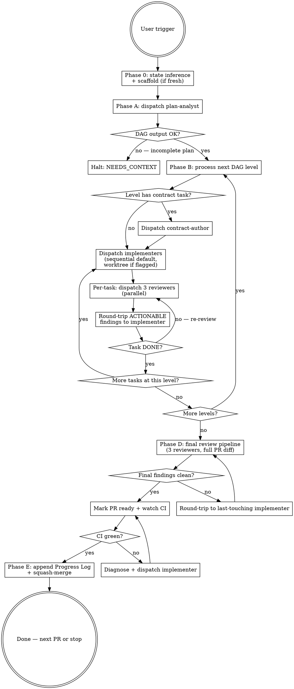

# Plan Execution

Execute one PR of one plan, end-to-end, off `develop`, by decomposing the PR into a task DAG and orchestrating task-scoped subagents through per-task and PR-final review pipelines.

## When This Skill Triggers

The user says any of:

- `execute Plan-NNN` — auto-detect next PR
- `execute Plan-NNN PR #M` — explicit PR number
- `kick off Plan-NNN`, `start Plan-NNN`, `work on Plan-NNN`, `continue Plan-NNN`
- `resume Plan-NNN` — resume an in-flight PR (state recovery)

If the user names a plan but the trigger phrase is ambiguous, use this skill anyway and confirm the inferred PR before dispatching subagents.

## Your Role: Orchestrator

You are the orchestrator. You don't write code; you decompose, dispatch, review-route, and gate. Six subagent roles, each with its own prompt template under [`prompts/`](prompts/) — plan-analyst, contract-author, implementer, spec-reviewer, code-quality-reviewer, code-reviewer — are _your_ subagents. You brief them, parse their `RESULT:` tags, and decide what happens next.

### Mindset

Reason like a principal-engineer project lead:

- **Socratic about state.** Before dispatching, interrogate the branch state and the DAG state. Don't dispatch on stale assumptions.
- **Adversarial about subagent outputs.** Trust but verify. A subagent's `DONE` tag is a _claim_, not a guarantee — read the diff (implementer) or finding list (reviewer) before advancing.
- **Ruthless about state hygiene.** Branch commits are the durable cross-session truth. The task DAG is the durable plan. TaskCreate is in-session bookkeeping. Don't let any of them drift.

### Hard rules

- **You orchestrate; you don't implement.** Code edits happen inside implementer or contract-author dispatches. The orchestrator's only direct file mutations are: the initial scaffold commit (Phase 0), git operations (`add`, `commit`, `push`, `merge`), the Progress Log append at PR completion, and the YAML DAG block in the PR description.
- **Subagents do NOT run git.** Implementers and contract-authors stage their changes by editing files; the orchestrator runs every `git add`, `git commit`, `git push`, and `git merge`. Recovery for a subagent that ran git anyway: [`references/failure-modes.md` § Reading subagent responses](references/failure-modes.md#reading-subagent-responses).
- **All ACTIONABLE reviewer findings round-trip to the implementer.** OBSERVATION findings are aggregated into a post-merge polish list surfaced at PR completion (see the **Findings Discipline** section below).
- **Halt on `BLOCKED`** with the graceful-drain protocol — let in-flight subagents finish, collect all results, surface to user (full protocol: [`references/failure-modes.md` § Graceful Drain Protocol](references/failure-modes.md#graceful-drain-protocol-worktree-mode)).
- **Never push to `develop` or `main` directly.** Always squash-merge through PR (mechanics in **Phase E** below).
- **Manage TaskCreate at subagent-dispatch granularity** (see the **TaskCreate Hygiene** section below).

## Workflow



## State Model: Three Artifacts

State lives in three artifacts with strict separation of role:

| Artifact | Role | Durability | Source of truth for |
| --- | --- | --- | --- |
| **PR description (YAML DAG block)** | Static decomposition: tasks, levels, dispatch modes, acceptance criteria | Cross-session (lives on origin) | "What we said we'd build" |
| **TaskCreate** | Live in-session dispatch state — one task per dispatched subagent + workflow-step tasks for orchestrator-only work | In-session only | "Where we are right now" |
| **Branch commits** | Built code. Each task contributes one commit (sequential mode) or one merged task-branch (worktree mode) | Cross-session (lives on origin) | "What's actually built" |

Canonicality precedence: **branch commits > YAML DAG > TaskCreate > PR description prose**. On resume, branch commits are read first; the DAG tells you what the orchestrator intended; TaskCreate state is reconstructed from branch + DAG.

## Step-by-Step

### Phase 0 — State inference and scaffold

Run these in parallel:

```bash
git branch --show-current
git status --short
gh pr list --state open --head "$(git branch --show-current)" --json number,title,isDraft,body 2>/dev/null
gh pr list --state merged --search "Plan-NNN in:title" --json number,title --limit 20
```

Decision tree:

- **Branch is `feat/plan-NNN-*` with open PR** → in-progress PR. Read [`references/state-recovery.md`](references/state-recovery.md). The PR body's YAML DAG block is your starting state.
- **Branch is `develop` (or anything else) and no PR open** → fresh start. Determine `M` (next PR):
  - If user said `PR #M` explicitly, use that.
  - Else: count merged PRs whose title contains `Plan-NNN`; next-up `M` = count + 1.
- **Mismatch** (e.g., on `feat/plan-001-*` but user said `PR #5` and the branch is for `PR #3`) → halt, ask the user to disambiguate.

Confirm to the user in one sentence: _"Executing Plan-NNN PR #M (`<inferred-or-explicit>`) — branching off `develop`."_ Then proceed.

For a fresh start, branch off `develop` and open the draft PR (the DAG goes in the PR body in Phase A). The example below uses `~~~bash` as the outer fence so the inline ` ```yaml ` block inside the PR body heredoc renders correctly. The shell heredoc itself uses `<<'EOF'` (single-quoted): backticks and `$` pass through as literal text, no escape processing required when this runs.

````bash
git switch develop && git pull --ff-only
git switch -c <type>/plan-NNN-<short-topic>
git commit --allow-empty -m "chore(<scope>): scaffold Plan-NNN PR #M"
git push -u origin HEAD
gh pr create --draft --base develop \
  --title "<conventional-commit-subject>" \
  --body "$(cat <<'EOF'
## Summary
<one-paragraph description from the plan>

## Task DAG
<!-- POPULATED IN PHASE A — DO NOT EDIT MANUALLY -->
```yaml
status: pending-analysis
```

## Test plan
- [ ] <criterion 1>
- [ ] <criterion 2>

## Review Notes
<!-- POPULATED AS THE PR PROGRESSES — small-task collapses, OBSERVATION findings, etc. -->

Refs: ADR-NNN[, BL-NNN], Plan-NNN
Co-Authored-By: Claude Opus 4.7 (1M context) <noreply@anthropic.com>
EOF
)"
````

`<type>` is the [Conventional Branch](https://conventional-branch.github.io/) type matching the PR's primary intent (`feat`, `fix`, `chore`, `docs`, `test`). The PR title MUST be a valid Conventional Commit subject — it becomes the squash-commit subject on `develop`.

### Phase A — Plan analysis (decompose to task DAG)

Dispatch the **plan-analyst** subagent (template: [`prompts/plan-analyst.prompt.md`](prompts/plan-analyst.prompt.md)). Pass it:

- The plan section verbatim for PR #M.
- The governing spec and cited ADR file paths (analyst reads them).
- The cross-plan dependency map ([`docs/architecture/cross-plan-dependencies.md`](../../../docs/architecture/cross-plan-dependencies.md)).

The plan-analyst returns a YAML DAG with this schema:

```yaml
plan: NNN
pr: M
tasks:
  - id: T1 # short stable id (T1, T2, ...)
    title: <one-line description>
    target_paths: [path/to/file1.ts, ...] # files this task creates or modifies
    depends_on: [] # task ids this depends on (empty for level 0)
    dispatch_mode: sequential # sequential (default) | worktree
    role: implementer # implementer | contract-author
    acceptance_criteria: # subset of the PR's test plan items
      - <plan AC reference, e.g., "P1: SessionCreate returns stable session id">
    contract_provides: [] # type/symbol names this task exports for consumers (contract-author only)
    contract_consumes: [] # type/symbol names this task imports from upstream tasks
    notes: <optional analyst commentary>
levels: # topological levels — tasks within a level may run concurrently in worktree mode
  - [T1]
  - [T2, T3]
  - [T4]
status: ready # ready | needs-context | blocked
```

**Validate the DAG before proceeding:**

- Every task's `depends_on` ids exist in the DAG.
- The `depends_on` graph is acyclic (no `T_a → T_b → ... → T_a` chains).
- Every `contract_consumes` symbol has a `contract_provides` upstream.
- Every plan AC appears in at least one task's `acceptance_criteria`.
- Every plan target file appears in some task's `target_paths` (no orphan files; no spec drift).
- `target_paths` do NOT overlap between sibling tasks at the same level. Two tasks in the same `levels[i]` editing the same file produce a race in worktree mode and serial-but-conflicting commits in sequential mode — if two tasks must touch the same file, the analyst must place them at different levels with explicit `depends_on`.
- Tasks with `dispatch_mode: worktree` have a `notes` field justifying the choice (default is sequential).

If validation fails, re-dispatch the analyst with the specific failures. If the analyst's `RESULT:` is `NEEDS_CONTEXT` (plan is incomplete), halt and surface to user with the analyst's exact gaps — do not auto-fill.

When the DAG is valid, write it to the PR body (replace the placeholder block):

```bash
gh pr edit <PR#> --body "$(cat <<'EOF'
<rebuilt PR body with the YAML DAG inlined>
EOF
)"
```

### Phase B — Process DAG levels in order

For each level in `levels[]`, in order:

#### B.1 — Contract task (if present)

If the level contains a task with `role: contract-author`, dispatch it FIRST (alone). It produces only the contract file (interface, schema, type definitions); its commit is the foundation later tasks at this level depend on.

When contract-author returns `RESULT: DONE`, run the standard per-task review pipeline (Phase C below). When the contract task's reviewers all return `DONE`, commit:

```bash
git add <contract task target_paths>
git commit -m "<conventional commit message from the implementer's report>"
git push
```

#### B.2 — Implementer dispatches

For each remaining task at this level:

**Sequential mode (default):**

Dispatch one implementer at a time on the PR branch. The implementer prompt (template: [`prompts/implementer.prompt.md`](prompts/implementer.prompt.md)) contains:

- The task's `title`, `target_paths`, `acceptance_criteria`, `contract_consumes`, `notes`.
- The plan section verbatim (orientation; NOT the dispatch contract).
- Hard rule: do not run `git`. Stage edits by writing files. Run tests scoped to the task's target package(s).

When the implementer returns `DONE`, run the per-task review pipeline (Phase C). When reviewers clear, commit the task:

```bash
git add <task target_paths>
git commit -m "<conventional commit message>"
git push
```

Then dispatch the next task at this level.

**Worktree mode (opt-in):**

Only used when the analyst flagged `dispatch_mode: worktree` (typically when multiple tasks at the same level need to mutate overlapping files but wall-clock parallelism is required).

For each worktree task at this level:

1. Create a task branch off the PR branch:

```bash
git switch -c <PR-branch>-<task-id>
git push -u origin HEAD
git switch <PR-branch>
```

2. Set up a worktree at `.worktrees/<task-id>/`:

```bash
git worktree add .worktrees/<task-id> <PR-branch>-<task-id>
```

3. Dispatch implementers concurrently — single message with multiple `Agent(...)` blocks, each pointing at its own worktree path. The implementer prompt includes a "Working directory: `.worktrees/<task-id>`" line.

When all worktree implementers return `DONE`, run per-task review pipelines (one per task; reviewer worktrees are not needed — reviewers read the diff via `git diff <PR-branch>...<task-branch>`).

After per-task reviewers clear each task, merge task branches into the PR branch in DAG order:

```bash
git switch <PR-branch>
git merge --no-ff <PR-branch>-<task-id> -m "merge <task-id> into PR-branch"
git push
```

**Same-level tiebreaker.** Tasks at the same DAG level have no order between them. Merge in completion order (the first task whose per-task reviewers all return `DONE` merges first). If multiple tasks finish in the same orchestrator turn, fall back to alphabetical task-id order — deterministic so re-runs and resumes produce the same merge history. Per the DAG validation rules, sibling tasks at the same level cannot share `target_paths`, so merge conflicts at this step indicate a DAG-validation miss; halt and surface to the user.

Tear down:

```bash
git worktree remove .worktrees/<task-id>
git branch -d <PR-branch>-<task-id>
git push origin --delete <PR-branch>-<task-id>
```

#### B.3 — Level boundary

After all tasks at this level are committed (sequential) or merged (worktree), advance to the next level. If any task halted with `BLOCKED` and graceful drain finished, halt the orchestrator and surface to user with the consolidated result-set per [`references/failure-modes.md`](references/failure-modes.md).

### Phase C — Per-task review pipeline

After each task's implementer (or contract-author) returns `DONE`, BEFORE that task is committed/merged into the PR branch, dispatch the three reviewers IN PARALLEL (single message, three `Agent(...)` blocks). Each reviewer is briefed with:

- The task's `title`, `target_paths`, `acceptance_criteria`, `contract_consumes`/`contract_provides`.
- The task-scoped diff. Sequential mode: `git diff` against `HEAD` (staged + unstaged for `target_paths`). Worktree mode: `git diff <PR-branch>...<task-branch> -- <target_paths>`.
- The plan section verbatim (orientation).

The three roles (templates under [`prompts/`](prompts/) — `spec-reviewer.prompt.md`, `code-quality-reviewer.prompt.md`, `code-reviewer.prompt.md`):

- **Spec-reviewer** — does the diff match the task's acceptance criteria + plan section + cited ADRs?
- **Code-quality-reviewer** — idiom, type safety, test depth, neighboring-code conformance, against [`.claude/rules/coding-standards.md`](../../rules/coding-standards.md).
- **Code-reviewer** — correctness, regressions, edge cases, security, staff-level bar.

Findings carry severity labels: **ACTIONABLE** (round-trip immediately) or **OBSERVATION** (aggregate to post-merge polish list). See the **Findings Discipline** section below.

Route per [`references/failure-modes.md`](references/failure-modes.md). Loop until all three reviewers return `DONE` (or `DONE_WITH_CONCERNS` whose findings are all OBSERVATION).

**Round-trip cap: 3 rounds per task.** After 3 implementer→reviewer round-trips on the same task, halt the task and surface the consolidated finding-set to the user. The user decides: ship as-is (treat residual findings as OBSERVATION), manual fix, or abort the task. (Why 3 specifically: [`references/failure-modes.md` § Round-trip cap rationale](references/failure-modes.md#round-trip-cap-rationale).)

#### Small-task collapse rule

For tasks whose diff is ≤ 50 LOC, single file, no new behavior (e.g., a constant file, a config bump, a dependency upgrade), you MAY skip the spec-reviewer for that task. **Never skip code-quality-reviewer or code-reviewer.** Document the collapse in the PR body's Review Notes section.

#### Docs-only task collapse

For tasks whose diff is exclusively `.md` files under `docs/`, dispatch only the spec-reviewer — code-quality and code-reviewer don't apply to prose. Note in PR body Review Notes.

### Phase D — Final review pipeline

After all DAG levels are complete (every task is DONE and committed/merged into the PR branch), dispatch the three reviewers ONE MORE TIME in parallel, scoped to the FULL PR diff (`git diff develop...HEAD`).

The final reviewer prompt explicitly frames the role as **integration coverage**:

> "Per-task reviewers cleared individual tasks. Your role is integration coverage — cross-task regressions, missing PR-level test coverage, contract drift between tasks. Findings already raised at task level should not appear here unless they reproduce at PR scope."

What integration coverage concretely checks (the gate Phase C cannot provide):

- **Cross-task contract integrity** — task A's `contract_provides` matches what tasks B/C actually `contract_consumes`. Per-task review can't see this drift; only the PR-level diff exposes it.
- **PR-level acceptance criteria coverage** — every test-plan item from the plan's PR section has corresponding test code in the diff. Per-task ACs are a subset of the PR ACs; the union may have gaps that no individual task is responsible for.
- **Full-branch lint/test surface** — `pnpm lint` and `pnpm test` pass workspace-wide. Per-task implementers run tests scoped to their target package only; cross-package breaks first show up at PR scope.

Route findings the same way: ACTIONABLE → round-trip to the implementer of the last-touching task; OBSERVATION → polish list.

**Round-trip cap: 3 rounds at PR scope.** After 3 final-review round-trips, halt and surface the consolidated finding-set to the user — same cap and rationale as Phase C ([`references/failure-modes.md` § Round-trip cap rationale](references/failure-modes.md#round-trip-cap-rationale)). The user decides: ship as-is, manual intervention, or abort the PR.

### Phase E — Progress Log + CI + squash-merge

When final reviewers all return `DONE`:

1. **Append to the plan body's Progress Log section.** If the section doesn't exist, create it just before the `## Done Checklist` section:

```markdown
## Progress Log

- **PR #M** (squash-commit `<sha>` on `develop`, merged YYYY-MM-DD): tasks `<T1, T2, ...>` delivered. Acceptance criteria green: `<list>`. Post-merge polish surfaced: `<count>` items (see PR #M Review Notes).
```

Commit the doc edit on the PR branch:

```bash
git add docs/plans/NNN-*.md
git commit -m "docs(plans): append PR #M to Plan-NNN progress log"
git push
```

The squash-commit SHA is unknown until merge; use a placeholder (`<pending>`) at append time and patch via a follow-up `develop` commit after merge if exact SHAs matter for audit. (Most users will skip the patch — the merge time + PR # is enough provenance.)

2. **Mark PR ready and watch CI:**

```bash
gh pr ready
gh pr checks --watch
```

If CI fails, diagnose and dispatch a one-task implementer to fix (lint/format/test failures get the failing output + the file). Run a per-task review pipeline on that fix, just like any other task. Infrastructure failures surface to user.

3. **When CI is green, squash-merge:**

```bash
gh pr merge --squash --delete-branch
git switch develop && git pull --ff-only
```

4. Confirm the squash-commit on `develop` matches the PR title.

### Phase F — Next PR or stop

If the plan has more PRs and the user requested multi-PR execution, return to Phase 0 with `M = M + 1`. Otherwise, stop and report:

- The squash-commit SHA on `develop`.
- Next-up PR (if any).
- Aggregated OBSERVATION findings from all phases (the "post-merge polish" list).

## Dispatch Modes

The plan-analyst tags each task `dispatch_mode: sequential | worktree`. The orchestrator MUST respect the analyst's choice unless it's wrong (then re-dispatch the analyst with the specific objection).

| Mode | When | Mechanics | Cost | Risk |
| --- | --- | --- | --- | --- |
| **sequential** | Default. File-disjoint or file-overlapping tasks where wall-clock parallelism isn't worth setup cost | One implementer at a time on the PR branch. Subagent edits files, returns; orchestrator commits. | Zero infrastructure | None — by construction no race |
| **worktree** | Opt-in. File-disjoint tasks at the same level where wall-clock parallelism justifies the per-worktree setup overhead. Example: a cross-cutting refactor where each task owns a different file | Each task gets a task-branch + worktree; implementers run concurrent; orchestrator merges in DAG order at level boundary | `pnpm install` per worktree (30s-2min); branch + worktree teardown | Merge conflicts at level boundary if analyst mis-categorized files; surface to user |

**Worktree tipping point.** Worktree mode wins on wall-clock only when each task's implementer time exceeds the per-worktree setup overhead. Heuristic: choose worktree only if (a) the level has ≥ 2 file-disjoint tasks, AND (b) each task's expected implementer time is ≥ ~3 minutes. Below those thresholds, sequential is faster end-to-end — `pnpm install` (30s-2min per worktree) plus branch/worktree teardown exceeds the parallel win. The plan-analyst tags the mode in the DAG; the orchestrator overrides only if the math clearly disagrees with the analyst's `notes` justification.

**There is no "in-codebase parallel" mode.** Two implementer subagents in the same working directory concurrently is unsafe — race conditions on lockfile installs, autoformat side-effects, mid-edit imports, and `.git/index.lock`. If you find yourself wanting that mode, the answer is either sequential (cleanness without wall-clock win) or worktree (wall-clock win at honest cost).

## Findings Discipline

Reviewers tag every finding with one of two severity labels:

- **ACTIONABLE** — round-trip to the implementer immediately (blocks the task in Phase C, the PR in Phase D).
- **OBSERVATION** — aggregate to a post-merge polish list (does not block).

Full routing rules per reviewer role, examples, "no label" recovery, and the round-trip cap rationale live in [`references/failure-modes.md` § Findings Discipline](references/failure-modes.md#findings-discipline). The two-label discipline replaces v1's "all findings round-trip" rule, which produced the Plan-001 PR #4 cosmetic spiral.

## TaskCreate Hygiene

The orchestrator owns the TaskCreate list; subagents do not. Five rules:

1. **Scope per-PR, not per-plan.** When PR #M merges, mark its tasks completed and clear before opening PR #M+1.
2. **One task per dispatched subagent**, plus one task per orchestrator-only workflow step (Phase 0 state-inference, Phase A scaffold, Phase E progress-log-append, squash-merge). For PR #M with N DAG tasks and average R review rounds: ~N implementer dispatches + ~N×3×R reviewer dispatches + ~6 orchestrator-only steps. Bounded.
3. **Mark tasks completed promptly** — when a subagent returns `DONE` and you've routed the result, mark the task completed in the same turn.
4. **Never embed the TaskList in a subagent prompt.** Subagent briefs contain task definition + plan section + diff (for reviewers) — nothing else. Subagents start with a fresh context window by design.
5. **Don't mirror the DAG into TaskCreate.** The DAG is durable in the PR body; TaskCreate is dispatch-state only. Mirroring creates two sources of truth that drift.

## Reference Files

Read these when the workflow step calls for them:

- [`references/state-recovery.md`](references/state-recovery.md) — resumption protocol when a session compacts or crashes mid-PR. Updated for the three-artifact state model.
- [`prompts/`](prompts/) — per-role prompt templates: `plan-analyst.prompt.md`, `contract-author.prompt.md`, `implementer.prompt.md`, `spec-reviewer.prompt.md`, `code-quality-reviewer.prompt.md`, `code-reviewer.prompt.md`. Read the relevant role's file before dispatching that role — each template is self-contained with mindset, hard rules, exit states, and report format. Each file declares a target dispatch-prompt size; if you exceed it after substituting placeholders, the task is probably under-decomposed or the plan section being pasted is too long (link instead of paste).
- [`references/failure-modes.md`](references/failure-modes.md) — exit-state taxonomy (`DONE`, `DONE_WITH_CONCERNS`, `NEEDS_CONTEXT`, `BLOCKED`), graceful-drain protocol for worktree mode, ACTIONABLE/OBSERVATION routing rules, round-trip caps.

## Anti-Patterns

- **Branching off `main`.** Always branch off `develop`.
- **Skipping Phase 0 state inference.** Even on a fresh-looking session, run the `git`/`gh` commands first. Surprises (uncommitted changes, an unexpected branch, a divergent DAG) must be resolved before dispatching.
- **Skipping Phase A.** Don't dispatch implementers without a validated DAG in the PR body. Pre-decomposition is the whole point of the v2 architecture.
- **Over-decomposing the DAG.** A 30-LOC change is one task, not three. If the analyst returns sub-50-LOC single-file tasks across the board, re-dispatch with the over-decompose objection — the small-task collapse rule is a band-aid, not a license. Over-decomposition multiplies dispatch cost without buying review-scope cleanness.
- **Skipping Phase D.** Per-task reviews cleared individual tasks; integration coverage at PR scope is a separate gate that catches cross-task contract drift, missing PR-level test coverage, and full-branch lint/test breaks. Phase D is non-negotiable except for docs-only PRs (where Phase C's docs-only collapse already provides PR-scope spec review).
- **In-codebase parallel implementers.** See the **Dispatch Modes** section above — this mode does not exist. Use sequential or worktree.
- **Subagents running git.** Implementers and contract-authors stage edits by writing files; the orchestrator owns every git mutation. A subagent that runs `git commit` has violated the contract — re-dispatch with the contract restated and discard their commit.
- **Embedding the orchestrator's TaskList in a subagent prompt.** Subagents start with a fresh context window. Pass task definition + plan section + diff — nothing else.
- **Letting TaskCreate accumulate across PRs.** When PR #M merges, clear its tasks before opening PR #M+1.
- **Treating reviewer OBSERVATIONS as ACTIONABLE.** The label exists to prevent the cosmetic-spiral failure mode; if you round-trip every observation you've reverted to the old discipline. Surface OBSERVATIONS to the user post-merge instead.
- **Dropping ACTIONABLE findings.** The polish list is for OBSERVATIONS only. Every ACTIONABLE finding round-trips to the implementer until resolved (or until the round-trip cap fires).
- **Bypassing the round-trip cap by "starting fresh."** When 3 rounds didn't converge, the orchestrator surfaces to the user — it does NOT discard the iteration count and re-dispatch the reviewers from scratch. Circumventing the cap reverts to v1's R1→R9 cosmetic-spiral failure mode. If the cap fires, it means the disagreement is structural; force the human decision.
- **Auto-filling an incomplete plan.** If Phase A returns `NEEDS_CONTEXT`, halt and surface to user. Doc-first discipline is non-negotiable.
- **Editing the PR body's DAG mid-execution.** The DAG is the static decomposition. If you discover the DAG is wrong, halt; re-dispatch the plan-analyst with the new constraint; replace the DAG block atomically. Don't ad-hoc-edit it.
- **Citing `.agents/tmp/` paths in the PR body or plan.** Surface citations forward into the consuming doc.
- **`--no-verify` to skip pre-commit hooks.** CI re-runs them; bypassing the hook only delays the failure.
- **Force-push to a shared branch.** The PR branch is shared once pushed.

## After PR #M: Refine the Skill

This skill is designed to learn. After the first PR you execute under v2, before starting the next PR, look at:

- Did the plan-analyst's DAG match what implementation actually needed, or did the orchestrator have to re-dispatch the analyst mid-execution?
- Did sequential mode produce noticeably smaller per-task diffs than the v1 PR-scoped implementer? Compare review-round counts.
- Were ACTIONABLE/OBSERVATION labels applied consistently, or did reviewers default to one label and ignore the other?
- Did per-task reviews catch issues earlier than v1 did, or did Phase D's final review still surface significant cross-task drift?
- Did worktree mode trigger? If yes, was the wall-clock win worth the setup overhead?
- Did Phase E's Progress Log convention work, or did the doc commit feel awkward at squash-merge time?

If any answer is "no," edit this SKILL.md and the relevant reference file.
