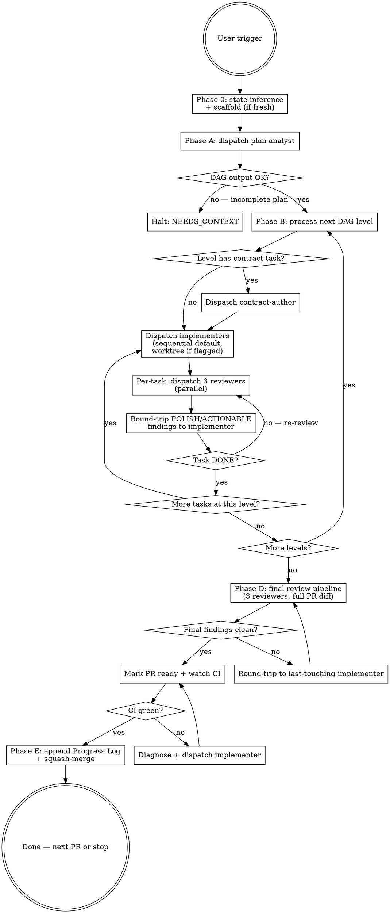

# Plan Execution

Execute one PR of one plan, end-to-end, off `develop`, by decomposing the PR into a task DAG and orchestrating task-scoped subagents through per-task and PR-final review pipelines.

## When This Skill Triggers

The user says any of:

- `execute Plan-NNN` — auto-detect next PR
- `execute Plan-NNN PR #M` — explicit PR number
- `kick off Plan-NNN`, `start Plan-NNN`, `work on Plan-NNN`, `continue Plan-NNN`
- `resume Plan-NNN` — resume an in-flight PR (state recovery)

If the user names a plan but the trigger phrase is ambiguous, use this skill anyway and confirm the inferred PR before dispatching subagents.

## Your Role: Orchestrator

You are the orchestrator. You don't write code; you decompose, dispatch, review-route, and gate. Six subagent roles, each defined at `.claude/agents/plan-execution-<role>.md` — `plan-execution-plan-analyst`, `plan-execution-contract-author`, `plan-execution-implementer`, `plan-execution-spec-reviewer`, `plan-execution-code-quality-reviewer`, `plan-execution-code-reviewer` — are _your_ subagents. You dispatch them via `Agent({subagent_type: "plan-execution-<role>", prompt: "<runtime brief>"})`; the runtime auto-loads each agent's contract from its definition file. You brief them with the runtime data their `## Inputs` section names, parse their `RESULT:` tags, and decide what happens next.

### Mindset

Reason like a principal-engineer project lead:

- **Socratic about state.** Before dispatching, interrogate the branch state and the DAG state. Don't dispatch on stale assumptions.
- **Adversarial about subagent outputs.** Trust but verify. A subagent's `DONE` tag is a _claim_, not a guarantee — read the diff (implementer) or finding list (reviewer) before advancing.
- **Ruthless about state hygiene.** Branch commits are the durable cross-session truth. The task DAG is the durable plan. TaskCreate is in-session bookkeeping. Don't let any of them drift.

### Hard rules

- **You orchestrate; you don't implement.** Code edits happen inside implementer or contract-author dispatches. The orchestrator's only direct file mutations are: the initial scaffold commit (Phase 0), git operations (`add`, `commit`, `push`, `merge`), the Progress Log append at PR completion, and the YAML DAG block in the PR description.
- **Subagents do NOT run git.** Implementers and contract-authors stage their changes by editing files; the orchestrator runs every `git add`, `git commit`, `git push`, and `git merge`. Mechanically enforced for five of six roles: the agent definitions for plan-analyst, contract-author, spec-reviewer, code-quality-reviewer, and code-reviewer omit `Bash` from `tools:`, so `git` is unavailable. The implementer role retains `Bash` because its test-scope contract (`pnpm --filter <pkg> test`) requires it; for that role the no-git rule is enforced by prose discipline. Recovery for a subagent that ran git anyway (now structurally restricted to the implementer role): [`references/failure-modes.md` § Reading subagent responses](references/failure-modes.md#reading-subagent-responses).
- **All ACTIONABLE and POLISH reviewer findings round-trip to the implementer.** VERIFICATION is reasoning, not a finding — it lives in the reviewer's `## Verification narrative` section and is never re-dispatched (see the **Findings Discipline** section below).
- **Halt on `BLOCKED`** with the graceful-drain protocol — let in-flight subagents finish, collect all results, surface to user (full protocol: [`references/failure-modes.md` § Graceful Drain Protocol](references/failure-modes.md#graceful-drain-protocol-worktree-mode)).
- **Never push to `develop` or `main` directly.** Always squash-merge through PR (mechanics in **Phase E** below).
- **Manage TaskCreate at subagent-dispatch granularity** (see the **TaskCreate Hygiene** section below).

## Workflow



## State Model: Three Artifacts

State lives in three artifacts with strict separation of role:

| Artifact | Role | Durability | Source of truth for |
| --- | --- | --- | --- |
| **PR description (YAML DAG block)** | Static decomposition: tasks, levels, dispatch modes, acceptance criteria | Cross-session (lives on origin) | "What we said we'd build" |
| **TaskCreate** | Live in-session dispatch state — one task per dispatched subagent + workflow-step tasks for orchestrator-only work | In-session only | "Where we are right now" |
| **Branch commits** | Built code. Each task contributes one commit (sequential mode) or one merged task-branch (worktree mode) | Cross-session (lives on origin) | "What's actually built" |

Canonicality precedence: **branch commits > YAML DAG > TaskCreate > PR description prose**. On resume, branch commits are read first; the DAG tells you what the orchestrator intended; TaskCreate state is reconstructed from branch + DAG.

## Step-by-Step

### Phase 0 — State inference and scaffold

Phase 0 has three sequential checks: repo state → preflight (mechanical gates) → branch decision.

#### 0.1 — Repo + PR state inference

Run in parallel:

```bash
git branch --show-current
git status --short
gh pr list --state open --head "$(git branch --show-current)" --json number,title,isDraft,body 2>/dev/null
gh pr list --state merged --search "Plan-NNN in:title" --json number,title --limit 20
```

#### 0.2 — Preflight (mechanical gates)

Run the preflight tool with the plan file (and optional explicit phase if the user override-supplied one):

```bash
node .claude/skills/plan-execution/scripts/preflight.mjs docs/plans/NNN-*.md [phase-number]
```

The tool resolves the next-up phase, runs all mechanical gates (project-locality, audit checkbox, phase un-shipped, tasks-block G4 cites, phase preconditions), and emits the phase number on `stdout` when it passes. Full contract: [`references/preflight-contract.md`](references/preflight-contract.md).

**On non-zero exit:** halt with `RESULT: NEEDS_CONTEXT` and surface the tool's `stdout` verbatim — the message is self-contained (failure type, file paths, remediation hint). Do not paraphrase; the message is the contract.

The preflight is the authoritative source for these gates; SKILL.md prose does NOT duplicate the gate logic. To add a new mechanical check (e.g., a future "minimum CI version" gate), edit the tool, not this file. The motivating shape — `gh`-mediated phase-walk over title-count to handle substrate/namespace and partial/remainder carve-outs that ship phases non-contiguously across tiers (Plan-007 ships Phases 1-3 in Tier 1 and Phases 4+ in Tier 4) — lives in the tool source and its contract; SKILL.md does not restate it.

#### 0.3 — Branch + scaffold decision

After 0.1 and 0.2 resolve cleanly, decide branch state:

- **Branch is `feat/plan-NNN-*` with open PR matching the selected Phase** → in-progress PR. Read [`references/state-recovery.md`](references/state-recovery.md). The PR body's YAML DAG block is your starting state.
- **Branch is `develop` (or anything else) and no PR open for the selected Phase** → fresh start; scaffold below.
- **Mismatch** (e.g., on `feat/plan-001-phase-3-*` but the eligible Phase is 5) → halt, ask the user to disambiguate.

Confirm to the user in one sentence: _"Executing Plan-NNN Phase N — `<phase title>` (PR #M) — branching off `develop`."_ Then proceed.

For a fresh start, branch off `develop` and open the draft PR (the DAG goes in the PR body in Phase A). The example below uses `~~~bash` as the outer fence so the inline ` ```yaml ` block inside the PR body heredoc renders correctly. The shell heredoc itself uses `<<'EOF'` (single-quoted): backticks and `$` pass through as literal text, no escape processing required when this runs.

````bash
git switch develop && git pull --ff-only
git switch -c <type>/plan-NNN-<short-topic>
git commit --allow-empty -m "chore(<scope>): scaffold Plan-NNN PR #M"
git push -u origin HEAD
gh pr create --draft --base develop \
  --title "<conventional-commit-subject>" \
  --body "$(cat <<'EOF'
## Summary
<one-paragraph description from the plan>

## Task DAG
<!-- POPULATED IN PHASE A — DO NOT EDIT MANUALLY -->
```yaml
status: pending-analysis
```

## Test plan
- [ ] <criterion 1>
- [ ] <criterion 2>

## Review Notes
<!-- POPULATED AS THE PR PROGRESSES — small-task collapses, residual cap-fire findings (exception, not norm), etc. -->

Refs: ADR-NNN[, BL-NNN], Plan-NNN
Co-Authored-By: Claude Opus 4.7 (1M context) <noreply@anthropic.com>
EOF
)"
````

`<type>` is the [Conventional Branch](https://conventional-branch.github.io/) type matching the PR's primary intent (`feat`, `fix`, `chore`, `docs`, `test`). The PR title MUST be a valid Conventional Commit subject — it becomes the squash-commit subject on `develop`.

### Phase A — Plan analysis (decompose to task DAG)

Dispatch the **plan-analyst** subagent via `Agent({subagent_type: "plan-execution-plan-analyst", prompt: "<runtime brief>"})`. Definition: [`.claude/agents/plan-execution-plan-analyst.md`](../../agents/plan-execution-plan-analyst.md). The runtime brief passes:

- **The audit-derived `#### Tasks` block for the selected Phase, verbatim.** This is the dispatch contract — Tasks rows map 1:1 to DAG tasks. The audit runbook's G4 traceability gate produced these rows with `Files`, `Spec coverage`, `Verifies invariant`, and optional `BLOCKED-ON-C*` markers. Do NOT have the analyst re-derive task structure from plan prose; re-deriving discards the cites that downstream review depends on.
- The Phase section (Goal, Scope, Precondition) for orientation only — not the dispatch contract.
- The plan's `## Invariants` section — the analyst must validate that every Tasks-row `Verifies invariant:` cite resolves to a real I-NNN-M entry.
- The governing spec and cited ADR file paths (analyst reads them; spec is needed to validate `Spec coverage:` cites).
- The cross-plan dependency map ([`docs/architecture/cross-plan-dependencies.md`](../../../docs/architecture/cross-plan-dependencies.md)).

Tasks-block field shapes vary across plans (sub-header style in Plan-001 Phase 5; parenthesized inline in Plan-007 Phases 1-3); both carry the same fields. The analyst extracts them verbatim into DAG fields.

The plan-analyst returns a YAML DAG with this schema:

```yaml
plan: NNN
phase: N # Phase number from the plan's Implementation Phase Sequence
pr: M # GitHub PR number for the Phase
tasks:
  - id: T1 # short stable id matching the audit Tasks-row id (T5.1, T-007p-1-1, etc.)
    title: <one-line description>
    target_paths: [path/to/file1.ts, ...] # from audit Tasks-row "Files:"
    depends_on: [] # task ids this depends on (empty for level 0)
    dispatch_mode: sequential # sequential (default) | worktree
    role: implementer # implementer | contract-author
    spec_coverage: [Spec-NNN row 4, ...] # from audit Tasks-row "Spec coverage:" — load-bearing for spec-reviewer
    verifies_invariant: [I-NNN-M, ...] # from audit Tasks-row "Verifies invariant:" — load-bearing for spec-reviewer
    blocked_on: [] # from audit Tasks-row BLOCKED-ON-C* markers; empty if none
    acceptance_criteria: # subset of the Phase's test plan items (orientation; spec_coverage is the audit-derived authority)
      - <plan AC reference, e.g., "P1: SessionCreate returns stable session id">
    contract_provides: [] # type/symbol names this task exports for consumers (contract-author only)
    contract_consumes: [] # type/symbol names this task imports from upstream tasks
    notes: <optional analyst commentary>
levels: # topological levels — tasks within a level may run concurrently in worktree mode
  - [T1]
  - [T2, T3]
  - [T4]
status: ready # ready | needs-context | blocked
```

**Validate the DAG before proceeding:**

- **Audit Tasks-block coverage:**
  - Every Tasks-block row appears as exactly one DAG task (1:1 — no merging or splitting; the audit's granularity is authoritative).
  - Every Tasks-row `Spec coverage:` cite appears in the corresponding DAG task's `spec_coverage`.
  - Every Tasks-row `Verifies invariant:` cite appears in the corresponding DAG task's `verifies_invariant`.
  - Every Tasks-row `BLOCKED-ON-C*` marker appears in the corresponding DAG task's `blocked_on`.
- **Topology + contracts:**
  - Every task's `depends_on` ids exist in the DAG.
  - The `depends_on` graph is acyclic (no `T_a → T_b → ... → T_a` chains).
  - Every `contract_consumes` symbol has a `contract_provides` upstream.
  - `levels[]` is a valid topological sort.
- **File + AC coverage:**
  - Every plan AC appears in at least one task's `acceptance_criteria`.
  - Every plan target file appears in some task's `target_paths` (no orphan files; no spec drift).
  - `target_paths` do NOT overlap between sibling tasks at the same level. Two tasks in the same `levels[i]` editing the same file produce a race in worktree mode and serial-but-conflicting commits in sequential mode — if two tasks must touch the same file, the analyst must place them at different levels with explicit `depends_on`.
- **Dispatch mode:**
  - Tasks with `dispatch_mode: worktree` have a `notes` field justifying the choice (default is sequential).

If validation fails, re-dispatch the analyst with the specific failures. If the analyst's `RESULT:` is `NEEDS_CONTEXT` (plan is incomplete), halt and surface to user with the analyst's exact gaps — do not auto-fill.

When the DAG is valid, write it to the PR body (replace the placeholder block):

```bash
gh pr edit <PR#> --body "$(cat <<'EOF'
<rebuilt PR body with the YAML DAG inlined>
EOF
)"
```

### Phase B — Process DAG levels in order

For each level in `levels[]`, in order:

#### B.1 — Contract task (if present)

If the level contains a task with `role: contract-author`, dispatch it FIRST (alone). It produces only the contract file (interface, schema, type definitions); its commit is the foundation later tasks at this level depend on.

When contract-author returns `RESULT: DONE`, run the standard per-task review pipeline (Phase C below). When the contract task's reviewers all return `DONE`, run typecheck against the contract task's target package (`pnpm --filter <pkg> exec tsc --noEmit` for a single workspace package; `pnpm typecheck` at root when the contract spans multiple packages or the package filter is unclear) — the contract-author has no shell access, so this typecheck is the orchestrator's responsibility, restoring the verification the pre-migration subagent ran inline. If typecheck fails, halt Phase B.1 and round-trip the type errors back to the contract-author as a follow-on dispatch (same pattern as a reviewer ACTIONABLE finding); do NOT commit a contract that fails typecheck. When typecheck passes, run per-package tests with the same single-vs-multi fork (`pnpm --filter <pkg> test` for a single workspace package; `pnpm test` at root when the contract spans multiple packages or the package filter is unclear) — the contract-author may have written a tooling-sanity test but cannot execute it (pre-migration the subagent ran only `tsc --noEmit` inline, never general tests, so this test step is new gate coverage rather than a restoration); it closes the runtime-test gap the typecheck step alone does not cover, blocking a `RESULT: DONE` from advancing past Phase B.1 with an unrun sanity test. If tests fail, halt and round-trip the failures back to the contract-author exactly like the typecheck case; do NOT commit a contract whose tests fail. When both typecheck and tests pass, commit:

```bash
git add <contract task target_paths>
git commit -m "<conventional commit message from the implementer's report>"
git push
```

After `git push`, record the resulting commit SHA against the contract task's id (e.g., `T1.1: <sha>`) — Phase D's reviewer brief packs this per-task manifest to disambiguate findings on files touched by multiple tasks across DAG levels.

#### B.2 — Implementer dispatches

For each remaining task at this level:

**Sequential mode (default):**

Dispatch one implementer at a time on the PR branch via `Agent({subagent_type: "plan-execution-implementer", prompt: "<runtime brief>"})`. Definition: [`.claude/agents/plan-execution-implementer.md`](../../agents/plan-execution-implementer.md). The runtime brief passes:

- The task's `title`, `target_paths`, `spec_coverage`, `verifies_invariant`, `blocked_on`, `acceptance_criteria`, `contract_consumes`, `notes`.
- The plan section verbatim (orientation; NOT the dispatch contract).
- The plan's `## Invariants` section (the implementer must read I-NNN-M entries cited in `verifies_invariant` to know what's load-bearing).
- Hard rule: do not run `git`. Stage edits by writing files. Run tests scoped to the task's target package(s).
- Hard rule: when `blocked_on` is non-empty, prefer conservative inline shapes (no new abstractions, no premature interfaces) until the cited C-N concern resolves in a separate PR.

When the implementer returns `DONE`, run the per-task review pipeline (Phase C). When reviewers clear, commit the task:

```bash
git add <task target_paths>
git commit -m "<conventional commit message>"
git push
```

After `git push`, record the resulting commit SHA against the task's id — same per-task manifest used by Phase B.1; Phase D depends on it.

Then dispatch the next task at this level.

**Worktree mode (opt-in):**

Only used when the analyst flagged `dispatch_mode: worktree` (typically when multiple tasks at the same level need to mutate overlapping files but wall-clock parallelism is required).

For each worktree task at this level:

1. Create a task branch off the PR branch:

```bash
git switch -c <PR-branch>-<task-id>
git push -u origin HEAD
git switch <PR-branch>
```

2. Set up a worktree at `.worktrees/<task-id>/`:

```bash
git worktree add .worktrees/<task-id> <PR-branch>-<task-id>
```

3. Dispatch implementers concurrently — single message with multiple `Agent(...)` blocks, each pointing at its own worktree path. The implementer prompt includes a "Working directory: `.worktrees/<task-id>`" line.

When all worktree implementers return `DONE`, run per-task review pipelines (one per task; reviewer worktrees are not needed — reviewers read the diff via `git diff <PR-branch>...<task-branch>`).

After per-task reviewers clear each task, merge task branches into the PR branch in DAG order. For each merge, capture the task-branch tip SHA against the task's id BEFORE merging — same per-task manifest used by Phase B.1; Phase D's labeled `git show` block needs it. The SHA stays reachable after teardown via the merge commit's second parent (`<merge-sha>^2`), so `git show <task-tip-sha>` continues to produce the per-task diff for Phase D dispatch.

```bash
git switch <PR-branch>
TASK_TIP_SHA=$(git rev-parse <PR-branch>-<task-id>)  # record against <task-id> for Phase D manifest
git merge --no-ff <PR-branch>-<task-id> -m "merge <task-id> into PR-branch"
git push
```

**Same-level tiebreaker.** Tasks at the same DAG level have no order between them. Merge in completion order (the first task whose per-task reviewers all return `DONE` merges first). If multiple tasks finish in the same orchestrator turn, fall back to alphabetical task-id order — deterministic so re-runs and resumes produce the same merge history. Per the DAG validation rules, sibling tasks at the same level cannot share `target_paths`, so merge conflicts at this step indicate a DAG-validation miss; halt and surface to the user.

Tear down:

```bash
git worktree remove .worktrees/<task-id>
git branch -d <PR-branch>-<task-id>
git push origin --delete <PR-branch>-<task-id>
```

#### B.3 — Level boundary

After all tasks at this level are committed (sequential) or merged (worktree), advance to the next level. If any task halted with `BLOCKED` and graceful drain finished, halt the orchestrator and surface to user with the consolidated result-set per [`references/failure-modes.md`](references/failure-modes.md).

### Phase C — Per-task review pipeline

After each task's implementer (or contract-author) returns `DONE`, BEFORE that task is committed/merged into the PR branch, dispatch the three reviewers IN PARALLEL (single message, three `Agent(...)` blocks). Each reviewer is briefed with:

- The task's `title`, `target_paths`, `spec_coverage`, `verifies_invariant`, `acceptance_criteria`, `contract_consumes`/`contract_provides`, `blocked_on`.
- The task-scoped diff. Sequential mode: `git diff` against `HEAD` (staged + unstaged for `target_paths`). Worktree mode: `git diff <PR-branch>...<task-branch> -- <target_paths>`.
- The plan section verbatim, including `## Invariants` (orientation; spec-reviewer reads I-NNN-M entries cited in `verifies_invariant`).

The three roles (defined at [`.claude/agents/`](../../agents/) — `plan-execution-spec-reviewer`, `plan-execution-code-quality-reviewer`, `plan-execution-code-reviewer`; dispatch via `Agent({subagent_type: "plan-execution-<role>", prompt: "<runtime brief>"})`):

- **Spec-reviewer** — does the diff match the task's acceptance criteria + plan section + cited ADRs?
- **Code-quality-reviewer** — idiom, type safety, test depth, neighboring-code conformance, against [`.claude/rules/coding-standards.md`](../../rules/coding-standards.md).
- **Code-reviewer** — correctness, regressions, edge cases, security, staff-level bar.

Findings carry severity labels: **VERIFICATION** (narrative — reviewer showing work, no fix), **POLISH** (real improvement — fix in-PR), or **ACTIONABLE** (round-trip immediately — must fix to merge). See the **Findings Discipline** section below.

**Validate the responses before routing.** Save each reviewer's response (or pipe via stdin) and run:

```bash
node .claude/skills/plan-execution/scripts/validate-review-response.mjs --conflicts spec.md quality.md code.md
```

Exit 0 means no inter-reviewer conflicts at the same `file:line`. Exit 1 emits a JSON conflict report to `stdout`; resolve per [`references/failure-modes.md` § Inter-reviewer conflict adjudication](references/failure-modes.md#inter-reviewer-conflict-adjudication) (severity precedence ACTIONABLE > POLISH > VERIFICATION; opposing-direction same-severity halts to user).

Route per [`references/failure-modes.md`](references/failure-modes.md). Loop until all three reviewers return `DONE` (no POLISH or ACTIONABLE findings; VERIFICATION narrative may still appear in their reports).

**Round-trip cap: 3 rounds per task.** After 3 implementer→reviewer round-trips on the same task, halt the task and surface the consolidated finding-set to the user. The user decides: ship as-is (residual POLISH/ACTIONABLE lands in a follow-up PR — exception, not norm), manual fix, or abort the task. (Why 3 specifically: [`references/failure-modes.md` § Round-trip cap rationale](references/failure-modes.md#round-trip-cap-rationale).)

#### Small-task collapse rule

For tasks whose diff is ≤ 50 LOC, single file, no new behavior (e.g., a constant file, a config bump, a dependency upgrade), you MAY skip the spec-reviewer for that task. **Never skip code-quality-reviewer or code-reviewer.** Document the collapse in the PR body's Review Notes section.

#### Docs-only task collapse

For tasks whose diff is exclusively `.md` files under `docs/`, dispatch only the spec-reviewer — code-quality and code-reviewer don't apply to prose. Note in PR body Review Notes.

### Phase D — Final review pipeline

After all DAG levels are complete (every task is DONE and committed/merged into the PR branch), dispatch the three reviewers ONE MORE TIME in parallel, scoped to the FULL PR diff (`git diff develop...HEAD`). Each reviewer's brief carries:

- The full PR diff (`git diff develop...HEAD`) — for integration-coverage assessment.
- The YAML DAG block from the PR description (provides `target_paths` per task — the first-level filter for `Round-trip target` resolution).
- A per-task commit manifest produced by the orchestrator from the per-task SHAs recorded in Phases B.1/B.2: one `<task-id>: <commit-sha>` line per task, plus the `git show <commit-sha>` output for each commit, labeled in the brief with the task-id (e.g., `### T1.1 (commit abc123)`). This is load-bearing when multiple tasks share `target_paths` (normal across DAG levels — a contract-author task at level 0 plus an implementer task at level 1 both list the same file): the reviewer locates the cited line inside the labeled per-task diff to pick the introducing task, without needing shell access to run `git log` themselves.
- The plan section verbatim, including `## Invariants`.
- The integration-coverage framing prompt below.

The final reviewer prompt explicitly frames the role as **integration coverage**:

> "Per-task reviewers cleared individual tasks. Your role is integration coverage — cross-task regressions, missing PR-level test coverage, contract drift between tasks. Findings already raised at task level should not appear here unless they reproduce at PR scope."

What integration coverage concretely checks (the gate Phase C cannot provide):

- **Cross-task contract integrity** — task A's `contract_provides` matches what tasks B/C actually `contract_consumes`. Per-task review can't see this drift; only the PR-level diff exposes it.
- **PR-level acceptance criteria coverage** — every test-plan item from the plan's PR section has corresponding test code in the diff. Per-task ACs are a subset of the PR ACs; the union may have gaps that no individual task is responsible for.
- **Full-branch lint/test surface** — `pnpm lint` and `pnpm test` pass workspace-wide. Per-task implementers run tests scoped to their target package only; cross-package breaks first show up at PR scope.

**Validate Phase D stamps before routing.** Phase D scope is the full PR, not one task — so each finding MUST carry a `Round-trip target: <task-id>` stamp identifying which task receives the round-trip. For each reviewer response, run:

```bash
node .claude/skills/plan-execution/scripts/validate-review-response.mjs --phase=D response.md
```

Exit 1 lists findings missing the stamp. Re-dispatch the reviewer asking specifically for the missing stamps; do NOT route the response with unstamped findings.

Route findings by the `Round-trip target:` value: with `Round-trip target: <task-id>` → round-trip POLISH/ACTIONABLE to that task's implementer; with `Round-trip target: cross-task — escalate to user` → halt and surface the consolidated finding-set to the user (the reviewer judged no single task is responsible — typically a cross-task contract drift or missing PR-level coverage). VERIFICATION lives in the reviewer's narrative section (no orchestrator action).

**Round-trip cap: 3 rounds at PR scope.** After 3 final-review round-trips, halt and surface the consolidated finding-set to the user — same cap and rationale as Phase C ([`references/failure-modes.md` § Round-trip cap rationale](references/failure-modes.md#round-trip-cap-rationale)). The user decides: ship as-is, manual intervention, or abort the PR.

### Phase E — Post-merge housekeeping

- Per Plan §Decisions-Locked D-3: Phase E ticks ALL Done-Checklist boxes for the merged Phase, not just the most recent task — this matches the orchestrator's complete-Phase-merge trigger.

Phase E fires AFTER `gh pr merge --squash --delete-branch` returns success — i.e., after the squash-merge commit is on `develop`. It updates the §6 NS catalog and the plan's `Done Checklist` so the catalog stays a faithful index of what shipped. The housekeeper is a 7th plan-execution role (color: blue, tools: Read/Grep/Glob/Edit/Write); see `references/post-merge-housekeeper-contract.md` for the full contract.

The phase has 8 steps in this exact order — DO NOT reorder; step 6 (Progress Log) explicitly moves AFTER housekeeping per spec §6.1 design choice (a single commit bundles housekeeping + log so the post-merge state is atomic):

1. **Run candidate-lookup** over `docs/architecture/cross-plan-dependencies.md` §6 per the four heading-only matching rules in `references/post-merge-housekeeper-contract.md` § Candidate-Lookup Rules:[^d7]
   - Rule 1: Plan + Phase match (e.g., diff touches `docs/plans/024-rust-pty-sidecar.md` + commit cites Phase 1 → match `### NS-NN: Plan-024 Phase 1 — ...`)
   - Rule 2: Plan + task-id match (e.g., commit cites `T5.1` → match `### NS-NN: Plan-001 Phase 5 Lane A` whose `PRs:` block has a `T5.1` row)
   - Rule 3: Plan + Tier-K match (e.g., diff is a Tier-3 plan-readiness audit → match `### NS-15..NS-21: Tier 3-9 plan-readiness audits` via the lower-endpoint of the range form `tier-3`)
   - Rule 4: No-match fallback (drop to step 2 NEEDS_CONTEXT branch)

2. **Dispatch the script** `node --experimental-strip-types .claude/skills/plan-execution/scripts/post-merge-housekeeper.mjs` based on rule outcome:
   - 1 candidate match → `--candidate-ns NS-NN <plan/phase/task flags>`
   - 0 candidate matches → `--auto-create <plan/phase/task flags>` (script reserves next free NS-NN, writes a stub entry with `<TODO subagent prose>` placeholders)
   - 2+ candidate matches → halt with NEEDS_CONTEXT (orchestrator surfaces both candidates to the user; do NOT auto-disambiguate)

3. **Validate the script-stage manifest** at `.agents/tmp/housekeeper-manifest-PR<N>.json` against the script-stage invariants per spec §5.3:
   - exit code matches `script_exit_code`
   - `mechanical_edits.status_flip.to_line` contains `<TODO subagent prose>` literal placeholder string (subagent fills this)
   - `affected_files` is a subset of files actually edited by the script

4. **Dispatch the `plan-execution-housekeeper` subagent** with the manifest path. The subagent reads the manifest, composes completion-prose for each `<TODO subagent prose>` placeholder using merged-commit context, then re-derives set-quantifier claims by reading ONLY `docs/architecture/cross-plan-dependencies.md` §6 prose (per Plan §Decisions-Locked D-2 — NOT the design spec §6, which is `## 6. Data flow`). Writes back via Edit tool. Returns one of the four canonical exit-states (DONE / DONE_WITH_CONCERNS / NEEDS_CONTEXT / BLOCKED) — no new exit-state per Plan Invariant I-2.

5. **Validate the subagent-stage manifest**:
   - `<TODO subagent prose>` literal is GONE from every line the script touched
   - subagent's edits are confined to `affected_files` (out-of-scope edits → DONE_WITH_CONCERNS routing per `references/failure-modes.md`)
   - schema_violations from script stage are reconciled (each one either fixed or surfaced in `concerns`)

6. **Append the Progress Log entry** to the active session's progress log file (`.agents/tmp/<session-id>/progress.md`). This step explicitly MOVED from before-merge to after-housekeeping per spec §6.1 — the log entry references the squash-merge commit hash + housekeeping commit message + any subagent concerns, so callers reading the log see "shipped + housekept" as one event.

7. **Single `git commit`** that bundles housekeeping (steps 4-5 edits) + Progress Log (step 6 edit) into one commit on `develop`. The commit message follows the contract:

```
chore(repo): housekeeping for PR #<N> — NS-XX <flip-or-create>
```

(subagent's manifest provides the suggested message; orchestrator may amend to add concerns annotations).

8. **Push + verify** — `git push origin develop`. The housekeeping commit is now part of the develop-bound history; subsequent plan-execution runs see the updated catalog. Phase E ENDS here; the orchestrator drains the session.

[^d7]: See Plan §Decisions-Locked D-7 (the §5.5 17-row coverage matrix) for which fixture validates which lookup rule.

### Phase F — Next PR or stop

If the plan has more PRs and the user requested multi-PR execution, return to Phase 0 with `M = M + 1`. Otherwise, stop and report:

- The squash-commit SHA on `develop`.
- Next-up PR (if any).
- Residual cap-fire findings, if any (only present when a round-trip cap fired and the user chose ship-as-is — exception, not norm).

## Dispatch Modes

The plan-analyst tags each task `dispatch_mode: sequential | worktree`. The orchestrator MUST respect the analyst's choice unless it's wrong (then re-dispatch the analyst with the specific objection).

| Mode | When | Mechanics | Cost | Risk |
| --- | --- | --- | --- | --- |
| **sequential** | Default. File-disjoint or file-overlapping tasks where wall-clock parallelism isn't worth setup cost | One implementer at a time on the PR branch. Subagent edits files, returns; orchestrator commits. | Zero infrastructure | None — by construction no race |
| **worktree** | Opt-in. File-disjoint tasks at the same level where wall-clock parallelism justifies the per-worktree setup overhead. Example: a cross-cutting refactor where each task owns a different file | Each task gets a task-branch + worktree; implementers run concurrent; orchestrator merges in DAG order at level boundary | `pnpm install` per worktree (30s-2min); branch + worktree teardown | Merge conflicts at level boundary if analyst mis-categorized files; surface to user |

**Worktree tipping point.** Worktree mode wins on wall-clock only when each task's implementer time exceeds the per-worktree setup overhead. Heuristic: choose worktree only if (a) the level has ≥ 2 file-disjoint tasks, AND (b) each task's expected implementer time is ≥ ~3 minutes. Below those thresholds, sequential is faster end-to-end — `pnpm install` (30s-2min per worktree) plus branch/worktree teardown exceeds the parallel win. The plan-analyst tags the mode in the DAG; the orchestrator overrides only if the math clearly disagrees with the analyst's `notes` justification.

**There is no "in-codebase parallel" mode.** Two implementer subagents in the same working directory concurrently is unsafe — race conditions on lockfile installs, autoformat side-effects, mid-edit imports, and `.git/index.lock`. If you find yourself wanting that mode, the answer is either sequential (cleanness without wall-clock win) or worktree (wall-clock win at honest cost).

## Findings Discipline

Reviewers tag every finding with one of three severity labels:

- **VERIFICATION** — reviewer showing their work (call-stack trace, idiom-match check, cite-resolution). Lives in the report's `## Verification narrative` section, not as a numbered finding. The orchestrator does not re-dispatch the implementer for VERIFICATION; there is nothing to fix.
- **POLISH** — real improvement that does not block correctness or contract: tighter naming, drift comments, missing JSDoc, redundant defensive checks, idiom mismatch with neighboring code, citation drift, an under-cited cite traceable via a less-obvious route. Round-trips to the implementer (consolidated with ACTIONABLE); fix in-PR — the PR is the cheapest moment under AI-implementer economics (see `feedback_review_label_framework`).
- **ACTIONABLE** — must fix to merge: bugs, regressions, races, security boundary violations, silent failures, type unsoundness on exported APIs, premature abstraction on `blocked_on` surfaces, citation that names a non-existent ID, invariant cite that doesn't preserve the I-NNN-M property. Round-trips immediately.

Full routing rules per reviewer role, examples, "no label" recovery, and the round-trip cap rationale live in [`references/failure-modes.md` § Findings Discipline](references/failure-modes.md#findings-discipline). The three-label discipline replaces the prior binary OBSERVATION/ACTIONABLE scheme, which conflated VERIFICATION (no-op narrative) with POLISH (real fix needed) and bucketed both as "skip" — surfacing the failure mode in Plan-007 PR #19, where 10 of 11 OBSERVATIONs were verification statements but 1 was a real polish finding (citation drift) deferred only because of the bucket name.

## TaskCreate Hygiene

The orchestrator owns the TaskCreate list; subagents do not. Five rules:

1. **Scope per-PR, not per-plan.** When PR #M merges, mark its tasks completed and clear before opening PR #M+1.
2. **One task per dispatched subagent**, plus one task per orchestrator-only workflow step (Phase 0 state-inference, Phase A scaffold, Phase E progress-log-append, squash-merge). For PR #M with N DAG tasks and average R review rounds: ~N implementer dispatches + ~N×3×R reviewer dispatches + ~6 orchestrator-only steps. Bounded.
3. **Mark tasks completed promptly** — when a subagent returns `DONE` and you've routed the result, mark the task completed in the same turn.
4. **Never embed the TaskList in a subagent prompt.** Subagent briefs contain task definition + plan section + diff (for reviewers) — nothing else. Subagents start with a fresh context window by design.
5. **Don't mirror the DAG into TaskCreate.** The DAG is durable in the PR body; TaskCreate is dispatch-state only. Mirroring creates two sources of truth that drift.

## Reference Files

Read these when the workflow step calls for them:

- [`scripts/preflight.mjs`](scripts/preflight.mjs) — preflight tool invoked at Phase 0.2; runs all five mechanical gates (project-locality, audit checkbox, phase un-shipped, tasks-block G4 cites, phase preconditions). Exit 0 = pass + phase number on stdout; exit 1 = halt with verbatim message; exit 2 = internal error.
- [`references/preflight-contract.md`](references/preflight-contract.md) — authoritative contract for the preflight tool: invocation, exit codes, gate-by-gate definitions, design rationale (phase-walk vs title-count). Edit gates here and in `preflight.mjs`; do NOT add gate logic to SKILL.md prose.
- [`scripts/validate-review-response.mjs`](scripts/validate-review-response.mjs) — reviewer-response validator invoked at Phase C (`--conflicts` mode, inter-reviewer conflict detection by `file:line`) and Phase D (`--phase=D` mode, Round-trip target stamp validation).
- [`references/state-recovery.md`](references/state-recovery.md) — resumption protocol when a session compacts or crashes mid-PR. Updated for the three-artifact state model.
- **Subagent definitions** at [`.claude/agents/`](../../agents/) — six files: `plan-execution-plan-analyst.md`, `plan-execution-contract-author.md`, `plan-execution-implementer.md`, `plan-execution-spec-reviewer.md`, `plan-execution-code-quality-reviewer.md`, `plan-execution-code-reviewer.md`. Each definition is auto-loaded by the runtime when the orchestrator dispatches via `Agent({subagent_type: "plan-execution-<role>", prompt: "<runtime brief>"})`; the orchestrator never `Read`s these files. The runtime brief carries only what varies per dispatch (task definition, plan section, diff text); invariant content (mindset, hard rules, exit states, output schema, severity calibration) lives in the definition. **Iteration caveat:** Claude Code does NOT live-reload `.claude/agents/` — edits to a definition require a session restart before the runtime picks them up. Iterate the orchestrator's runtime brief in `SKILL.md` (which IS live-reloaded) when possible; touch the agent definitions only when the contract genuinely needs to change.
- [`references/failure-modes.md`](references/failure-modes.md) — exit-state taxonomy (`DONE`, `DONE_WITH_CONCERNS`, `NEEDS_CONTEXT`, `BLOCKED`), graceful-drain protocol for worktree mode, three-label routing rules (VERIFICATION/POLISH/ACTIONABLE), round-trip caps, inter-reviewer conflict adjudication.

## Anti-Patterns

- **Branching off `main`.** Always branch off `develop`.
- **Skipping Phase 0 state inference.** Even on a fresh-looking session, run the `git`/`gh` commands first. Surprises (uncommitted changes, an unexpected branch, a divergent DAG) must be resolved before dispatching.
- **Skipping or paraphrasing preflight halts.** Plan-readiness audit is not optional — preflight Gate 2 (audit checkbox) blocks dispatch on un-audited plans. Running on un-audited plans means the analyst infers ACs from prose, producing the drift the audit's G4 traceability gate was built to prevent. Surface the tool's halt message verbatim; the message is the contract.
- **Inferring next PR by counting merged "Plan-NNN" titles.** Plans with substrate/namespace or partial/remainder carve-outs ship phases non-contiguously across tiers — title-counting silently maps post-carve-out work to a tier whose preconditions may not be met. The preflight's phase-walk (Gate 3 + Gate 5) gates each phase on its declared Precondition; rationale at [`references/preflight-contract.md` § Gate 3](references/preflight-contract.md).
- **Skipping Phase A.** Don't dispatch implementers without a validated DAG in the PR body. Pre-decomposition is the whole point of the v2 architecture.
- **Re-deriving task structure from plan prose when the audit Tasks block exists.** The audit produced the granularity; the Tasks block is the dispatch contract. Re-deriving discards the `Spec coverage:` and `Verifies invariant:` cites that downstream spec-review depends on. If the audit's granularity is wrong, fix the audit (re-run); do not silently re-decompose in the analyst.
- **Over-decomposing the DAG.** A 30-LOC change is one task, not three. If the analyst returns sub-50-LOC single-file tasks across the board, re-dispatch with the over-decompose objection — the small-task collapse rule is a band-aid, not a license. Over-decomposition multiplies dispatch cost without buying review-scope cleanness.
- **Skipping Phase D.** Per-task reviews cleared individual tasks; integration coverage at PR scope is a separate gate that catches cross-task contract drift, missing PR-level test coverage, and full-branch lint/test breaks. Phase D is non-negotiable except for docs-only PRs (where Phase C's docs-only collapse already provides PR-scope spec review).
- **In-codebase parallel implementers.** See the **Dispatch Modes** section above — this mode does not exist. Use sequential or worktree.
- **Subagents running git.** Implementers and contract-authors stage edits by writing files; the orchestrator owns every git mutation. A subagent that runs `git commit` has violated the contract — re-dispatch with the contract restated and discard their commit.
- **Embedding the orchestrator's TaskList in a subagent prompt.** Subagents start with a fresh context window. Pass task definition + plan section + diff — nothing else.
- **Letting TaskCreate accumulate across PRs.** When PR #M merges, clear its tasks before opening PR #M+1.
- **Surfacing VERIFICATION as a finding.** VERIFICATION is the reviewer showing their work — "I traced X, no race"; "I read Spec-NNN row 4 and the diff implements it." It belongs in the report's `## Verification narrative` section, not as a numbered finding entry. Promoting verification statements to numbered findings produces the cosmetic-spiral failure mode the three-label scheme was designed to eliminate.
- **Deferring POLISH to a follow-up PR by default.** Both POLISH and ACTIONABLE round-trip to the implementer; both fix in-PR. Under AI-implementer economics, the PR is the cheapest moment to fix POLISH (context loaded, mental model hot, no human reviewer fatigue to defend). Deferring pays a context-reload cost and risks the polish rotting in a backlog item that never lands. Cap-fire residual is the only legitimate post-merge POLISH path — and it's exception, not norm.
- **Dropping POLISH or ACTIONABLE findings.** Every POLISH or ACTIONABLE finding round-trips to the implementer until resolved (or until the round-trip cap fires and the user adjudicates).
- **Bypassing the round-trip cap by "starting fresh."** When 3 rounds didn't converge, the orchestrator surfaces to the user — it does NOT discard the iteration count and re-dispatch the reviewers from scratch. Circumventing the cap reverts to v1's R1→R9 cosmetic-spiral failure mode. If the cap fires, it means the disagreement is structural; force the human decision.
- **Auto-filling an incomplete plan.** If Phase A returns `NEEDS_CONTEXT`, halt and surface to user. Doc-first discipline is non-negotiable.
- **Editing the PR body's DAG mid-execution.** The DAG is the static decomposition. If you discover the DAG is wrong, halt; re-dispatch the plan-analyst with the new constraint; replace the DAG block atomically. Don't ad-hoc-edit it.
- **Citing `.agents/tmp/` paths in the PR body or plan.** Surface citations forward into the consuming doc.
- **`--no-verify` to skip pre-commit hooks.** CI re-runs them; bypassing the hook only delays the failure.
- **Force-push to a shared branch.** The PR branch is shared once pushed.

## After PR #M: Refine the Skill

This skill is designed to learn. After the first PR you execute under v2, before starting the next PR, look at:

- Did the plan-analyst's DAG match what implementation actually needed, or did the orchestrator have to re-dispatch the analyst mid-execution?
- Did sequential mode produce noticeably smaller per-task diffs than the v1 PR-scoped implementer? Compare review-round counts.
- Were VERIFICATION/POLISH/ACTIONABLE labels applied consistently, or did reviewers default to one label (especially: did POLISH findings actually surface, or did reviewers conflate them with VERIFICATION and bucket them as no-op narrative)?
- Did per-task reviews catch issues earlier than v1 did, or did Phase D's final review still surface significant cross-task drift?
- Did worktree mode trigger? If yes, was the wall-clock win worth the setup overhead?
- Did Phase E's Progress Log convention work, or did the doc commit feel awkward at squash-merge time?

If any answer is "no," edit this SKILL.md and the relevant reference file.
