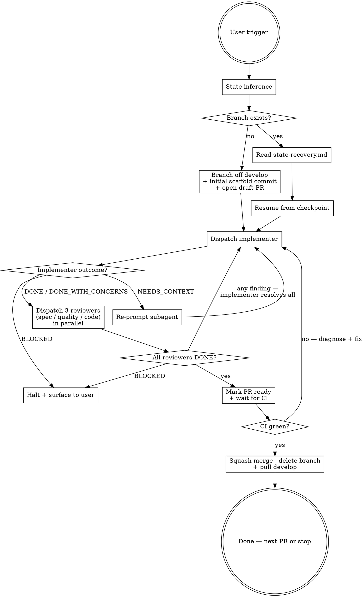

# Plan Execution

Execute one PR of one plan, end-to-end, off `develop`.

## When This Skill Triggers

The user says any of:

- `execute Plan-NNN` — auto-detect next PR
- `execute Plan-NNN PR #M` — explicit PR number
- `kick off Plan-NNN`, `start Plan-NNN`, `work on Plan-NNN`, `continue Plan-NNN`
- `resume Plan-NNN` — resume an in-flight PR (state recovery)

If the user names a plan but the trigger phrase is ambiguous, use this skill anyway and confirm the inferred PR before dispatching subagents.

## Your Role: Orchestrator

You are the orchestrator. You don't implement code; you dispatch subagents who do, then route their outputs and gate the merge. The four roles defined in [`references/subagent-roles.md`](references/subagent-roles.md) (one implementer + three reviewers) are *your* subagents — you brief them, parse their `RESULT:` tags, and decide what happens next.

### Mindset

Reason like a principal-engineer project lead:

- **Socratic about state.** Before dispatching, interrogate the branch state (Step 1). What's already committed? What's the next step? Don't dispatch on stale assumptions.
- **Adversarial about subagent outputs.** Trust but verify. A subagent's `DONE` tag is a *claim*, not a guarantee — read the diff (implementer) or finding list (reviewer) before advancing.
- **Ruthless about state hygiene.** Branch commits are the durable truth. TaskCreate is in-session bookkeeping. Don't let either drift.

### Hard rules

- **You orchestrate, you don't implement.** Code edits happen inside implementer dispatches. Do not write code yourself in this skill — exception: the initial scaffold commit before opening the draft PR (Step 3).
- **All reviewer findings round-trip to the implementer**, regardless of severity. No "non-blocking nit" pass-through.
- **Halt on `BLOCKED`** — surface to the user with the subagent's exact blocker; do not dispatch the next subagent.
- **Never push to `develop` or `main` directly.** Always squash-merge through PR.
- **Manage TaskCreate at workflow-step granularity per PR** (see [TaskCreate Hygiene](#taskcreate-hygiene) below).

## Workflow



## Step-by-Step

### 1. State inference (always first)

Run these in parallel:

```bash
git branch --show-current
git status --short
gh pr list --state open --head "$(git branch --show-current)" --json number,title,isDraft 2>/dev/null
gh pr list --state merged --search "Plan-NNN in:title" --json number,title --limit 20
```

Decision tree:

- **Branch is `feat/plan-NNN-*` with open PR** → in-progress PR. Read `references/state-recovery.md` for the resumption protocol.
- **Branch is `develop` (or anything else) and no PR open** → fresh start. Determine `M` (next PR):
  - If user said `PR #M` explicitly, use that.
  - Else: count merged PRs whose title contains `Plan-NNN`; next-up `M` = count + 1.
- **Mismatch** (e.g., on `feat/plan-001-*` but user said `PR #5` and the branch is for `PR #3`) → halt, ask the user to disambiguate. Do not silently switch branches.

Confirm to the user in one sentence: *"Executing Plan-NNN PR #M (`<inferred-or-explicit>`) — branching off `develop`."* Then proceed without waiting for ack unless the inference was ambiguous.

### 2. Read the plan task for PR #M

Read `docs/plans/NNN-*.md` and find the section describing PR #M (typically a heading like "PR #M:" or "## Step M"). Extract:

- The PR's goal and deliverables.
- Files to create / modify.
- Test plan / acceptance criteria.
- Required ADRs cited.
- Cross-plan dependencies (consult `docs/architecture/cross-plan-dependencies.md` if the plan task touches files another plan owns).

The plan section is the implementer's brief. Capture it verbatim — do not paraphrase into the subagent prompt.

### 3. Branch off `develop` (fresh start only)

```bash
git switch develop && git pull --ff-only
git switch -c <type>/plan-NNN-<short-topic>
```

`<type>` is the [Conventional Branch](https://conventional-branch.github.io/) type that matches the plan task's primary intent (`feat`, `fix`, `chore`, `docs`, `test`). Most plan PRs are `feat/`. See [CONTRIBUTING.md §Branch Naming](../../../CONTRIBUTING.md#branch-naming) for the type taxonomy.

`<short-topic>` is hyphenated, lowercase, no underscores or dots, action-verbed. Example: `feat/plan-001-monorepo-scaffold`.

Make a scaffold commit so the PR thread can open:

```bash
git commit --allow-empty -m "chore(<scope>): scaffold Plan-NNN PR #M"
git push -u origin HEAD
```

Open the draft PR base `develop`:

```bash
gh pr create --draft --base develop \
  --title "<conventional-commit-subject>" \
  --body "$(cat <<'EOF'
## Summary
<one-paragraph description from the plan>

## Test plan
- [ ] <criterion 1>
- [ ] <criterion 2>

Refs: ADR-NNN[, BL-NNN], Plan-NNN
Co-Authored-By: Claude Opus 4.7 (1M context) <noreply@anthropic.com>
EOF
)"
```

The PR title MUST be a valid Conventional Commit subject; it becomes the squash-commit subject on `develop`.

### 4. Dispatch the implementer subagent

Use the `general-purpose` subagent (or a more specialized one if the plan task warrants — e.g., `Plan` for design-heavy tasks). Prompt template lives in `references/subagent-roles.md` under "Implementer".

Pass the implementer:

- The plan task verbatim (Section 2 extract).
- The current branch and PR number.
- Hard rules: stay on this branch, do not push to `develop` or `main`, follow [CONTRIBUTING.md commit format](../../../CONTRIBUTING.md#commit-format).
- Expected outcome shape: one of `DONE`, `DONE_WITH_CONCERNS`, `NEEDS_CONTEXT`, `BLOCKED`.

Wait for the implementer to return. Route per `references/failure-modes.md`.

### 5. Dispatch reviewers (parallel)

After implementer returns `DONE` or `DONE_WITH_CONCERNS`, dispatch **all three** reviewers in the same message (single multi-Agent block) so they run concurrently. Each is an adversarial staff-level reviewer; each catches a distinct failure class:

- **Spec-reviewer** — *intent match*. Diff against plan task, governing spec, cited ADRs. Spec drift, missing fields, wrong shapes, unimplemented branches. Prompt template: `references/subagent-roles.md` "Spec Reviewer".
- **Code-quality-reviewer** — *style and maintainability*. Idiom, test depth, type safety, naming, dead code, comment drift, against [`.claude/rules/coding-standards.md`](../../rules/coding-standards.md). Prompt template: `references/subagent-roles.md` "Code Quality Reviewer".
- **Code-reviewer** — *correctness and regressions*. Bugs, off-by-ones, null derefs, race conditions, security boundaries, broken consumers of touched files, edge cases, staff-level bar. Prompt template: `references/subagent-roles.md` "Code Reviewer".

**All findings round-trip to the implementer** — regardless of severity. There is no "non-blocking nit" pass-through; if a reviewer surfaces a concern, the implementer addresses it and the reviewers re-run. The PR advances only when all three reviewers return `DONE`.

If any reviewer returns `DONE_WITH_CONCERNS`, `BLOCKED`, or `NEEDS_CONTEXT`, route per `references/failure-modes.md` (typically: loop back to step 4 with the finding list).

#### Docs-only PRs

For PRs whose diff is exclusively `.md` files under `docs/` (no code, no config), dispatch only the **spec-reviewer** — code-quality-reviewer and code-reviewer don't apply to prose. Note this in the PR body under "Review notes".

#### Small code-PR collapse rule

For genuinely tiny code PRs (≤ 50 lines, single file, no new behavior — e.g., a config bump, a dependency upgrade), you MAY skip the spec-reviewer (no spec drift possible at that size). **Never skip code-quality-reviewer or code-reviewer.** Document the collapse in the PR body under "Review notes". Default is full fan-out; collapse is the documented exception.

### 6. Mark PR ready and wait for CI

```bash
gh pr ready
gh pr checks --watch
```

If CI fails, diagnose:

- Lint / format failures → re-dispatch implementer with the failing lint output.
- Test failures → re-dispatch implementer with the failing test output and the test file.
- Infrastructure failures (e.g., GitHub Actions environment issue) → surface to user; do not endlessly retry.

### 7. Squash-merge

When CI is green and all reviewers signed off `DONE`:

```bash
gh pr merge --squash --delete-branch
git switch develop && git pull --ff-only
```

Confirm the squash-commit on `develop` matches the PR title. Done.

### 8. Next PR or stop

If the plan has more PRs and the user requested multi-PR execution, return to step 1 with `M = M + 1`. Otherwise, stop and report to the user with:

- The squash-commit SHA on `develop`.
- Next-up PR (if any).
- Anything that surfaced during DONE_WITH_CONCERNS that should inform the next PR.

## State Canonicality (Important)

The canonicality order is:

**branch commits > TaskCreate > PR description**

- The branch commits are the durable cross-session truth. On resume, `git log` is the first thing you read.
- TaskCreate is in-session bookkeeping for the current Claude session. Use it to track step progress (e.g., "implementer dispatched", "reviewers dispatched", "ready for merge"); do not rely on it across sessions.
- The PR description is a UI surface — useful for humans, but not authoritative state.

`references/state-recovery.md` covers the resumption protocol when a session ends mid-PR.

## TaskCreate Hygiene

The orchestrator owns the TaskCreate list; subagents do not. Three rules keep parent context clean across multi-PR runs:

1. **Scope per-PR, not per-plan.** Active tasks reflect the *current* PR (5–10 workflow steps + iteration rounds), not all PRs of the plan. When PR #M merges, mark its tasks completed and clear before opening PR #M+1.
2. **Workflow-step granularity.** One task per skill step (`state-inference`, `branch-off-develop`, `dispatch-implementer`, `dispatch-3-reviewers`, `address-findings-round-N`, `mark-ready`, `watch-CI`, `squash-merge`). The implementer subagent decomposes its own internal work; the orchestrator does not mirror that decomposition.
3. **Never embed the TaskList in a subagent prompt.** Subagent briefs contain branch + PR + plan task verbatim — nothing else. Subagents start with a fresh context window by design; preserving that protects them from parent-state pollution and keeps each role focused on its single responsibility.

Why this matters: parent context rot is the silent killer of long-running plan-execution sessions. A 50-task list across all of Plan-001 pollutes every dispatch decision the orchestrator makes; a 5-task list keeps the orchestrator focused on the current PR and lets a future session resume cleanly from `git log` rather than a noisy TaskList.

## Reference Files

Read these only when the workflow step calls for them:

- [`references/state-recovery.md`](references/state-recovery.md) — resumption protocol when a session compacts or crashes mid-PR.
- [`references/subagent-roles.md`](references/subagent-roles.md) — prompt templates with staff-level mindset framing for implementer, spec-reviewer, code-quality-reviewer, code-reviewer. Read before dispatching the first subagent of the PR.
- [`references/failure-modes.md`](references/failure-modes.md) — exit-state taxonomy and routing rules for `BLOCKED`, `NEEDS_CONTEXT`, `DONE_WITH_CONCERNS`, `DONE`.

## Anti-Patterns

- **Branching off `main`.** Always branch off `develop`.
- **Skipping the state inference step.** Even on a fresh-looking session, run the `git`/`gh` commands in Step 1 first. Surprises (uncommitted changes, an unexpected branch) must be resolved before dispatching.
- **Collapsing reviewer roles into one subagent.** Each role catches a distinct failure class (intent / style / correctness). Collapse only via the documented exceptions (docs-only or small-code-PR rules).
- **Treating reviewer findings as "non-blocking nits."** Every finding round-trips to the implementer. There is no informational severity that bypasses resolution.
- **Embedding the orchestrator's TaskList in a subagent prompt.** Subagents start with a fresh context window by design. Pass branch + PR + plan task verbatim — nothing else. Including parent state pollutes the subagent's reasoning and dilutes single-role focus. See [TaskCreate Hygiene](#taskcreate-hygiene).
- **Letting TaskCreate accumulate across PRs.** When PR #M merges, clear its tasks before opening PR #M+1. Stale parent tasks compound into context rot across multi-PR runs.
- **Editing the PR description as state.** It's a UI surface; the branch is the truth.
- **Citing `.agents/tmp/` paths or scratch files in the PR body.** Surface citations into the consuming doc — the PR body is a consuming doc.
- **`--no-verify` to skip pre-commit hooks.** CI re-runs them; bypassing the hook only delays the failure.
- **Force-push to a shared branch.** The PR branch is shared once pushed. Always create a new commit; squash-merge collapses history.

## After PR #1: Refine the Skill

This skill is designed to learn. After Plan-001 PR #1 completes, before starting PR #2, look at:

- Were the four exit states (`DONE`, `DONE_WITH_CONCERNS`, `NEEDS_CONTEXT`, `BLOCKED`) sufficient, or did a fifth case appear?
- Did the small-code-PR collapse threshold (≤ 50 LOC, single file, no new behavior) trigger correctly?
- Did the three parallel reviewers surface meaningfully distinct findings, or did findings overlap (signal that role boundaries need adjustment)?
- Did the all-findings-round-trip rule produce productive iteration, or did it spiral into trivial back-and-forth (signal that severity gates need re-introducing)?
- Did state recovery work cleanly, or did the branch / TaskCreate / PR diverge?

If the answer to any is "no," edit this SKILL.md and the relevant reference file. The methodology rationale is recorded in [ADR-024](../../../docs/decisions/024-agentic-plan-execution-methodology.md); supersede the ADR only if the *decision itself* changes (Type 1 reversibility — supersede is hours of work, not weeks).

---

*See [ADR-024 — Agentic Plan Execution Methodology](../../../docs/decisions/024-agentic-plan-execution-methodology.md) for the decision rationale, antithesis, and trade-offs behind this skill.*
