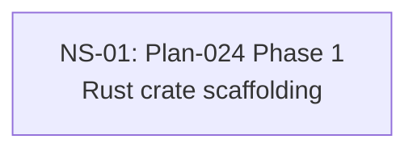

# Cross-Plan Dependencies (Test Fixture)

## 6. NS Catalog

### NS-01: Plan-024 Phase 1 — Rust crate scaffolding

- Status: `completed` (resolved 2026-05-03 via PR #30 — <TODO subagent prose>)
- Type: code
- Priority: `P1`
- Upstream: none
- References: [Plan-024](../plans/024-rust-pty-sidecar.md)
- Summary: Scaffold the Rust PTY sidecar crate.
- Exit Criteria: T-024-1-1..5 merged.

