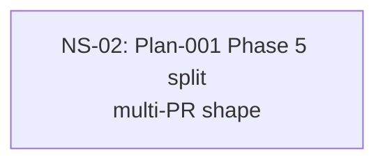

# Cross-Plan Dependencies (Test Fixture)

## 6. NS Catalog

### NS-02: Plan-001 Phase 5 split + dep alignment

- Status: `todo`
- Type: code (recommended split into 3 atomic PRs)
- Priority: `P1`
- Upstream: none
- References: [Plan-001](../plans/001-shared-session-core.md)
- Summary: Multi-PR fixture entry — first sub-task ships, leaves remaining ticks open.
- Exit Criteria: All `PRs:` ticks checked.
- PRs:
  - [ ] T-001-5-1 — first task
  - [ ] T-001-5-2 — second task
  - [ ] T-001-5-3 — third task

