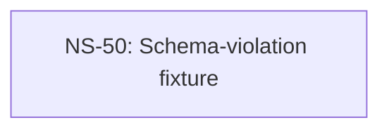

# Cross-Plan Dependencies (Test Fixture)

## 6. NS Catalog

### NS-50: Schema-violation fixture (missing Type sub-field)

- Status: `todo`
- Priority: `P1`
- Upstream: none
- References: [Plan-024](../plans/024-rust-pty-sidecar.md)
- Summary: Body deliberately omits the `- Type:` sub-field to exercise §5.1 step 2 schema-validation.
- Exit Criteria: Housekeeper exit 5 with schema_violations=[{kind:schema_violation,field:type}].

