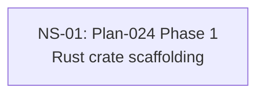

# Cross-Plan Dependencies (Test Fixture)

## 6. NS Catalog

### NS-01: Plan-024 Phase 1 — Rust crate scaffolding

- Status: `todo`
- Type: code
- Priority: `P1`
- Upstream: none
- References: [Plan-024](../plans/024-rust-pty-sidecar.md)
- Summary: Type-signature-violation fixture — Type:code requires ≥1 non-docs touched file; harness passes docs-only.
- Exit Criteria: Housekeeper exit 2 with schema_violations=[{kind:type_signature_violation}].

