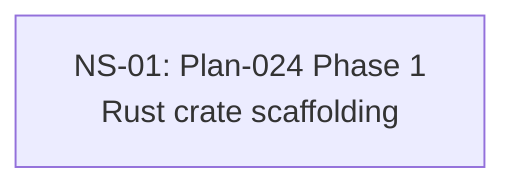

# Cross-Plan Dependencies (Test Fixture)

## 6. NS Catalog

### NS-01: Plan-024 Phase 1 — Rust crate scaffolding

- Status: `todo`
- Type: code
- Priority: `P1`
- Upstream: none
- References: [Plan-024](../plans/024-rust-pty-sidecar.md)
- Summary: File-overlap-violation fixture — Type:code passes type-sig (touched has code), but References cite only docs/plans/024 and touched cites packages/different-pkg → zero overlap.
- Exit Criteria: Housekeeper exit 2 with verification_failures=[{kind:file_overlap_zero}].

