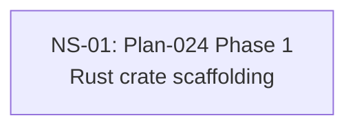

# Cross-Plan Dependencies (Test Fixture)

## 6. NS Catalog

### NS-01: Plan-024 Phase 1 — Rust crate scaffolding

- Status: `todo`
- Type: code
- Priority: `P1`
- Upstream: none
- References: [Plan-024](../plans/024-rust-pty-sidecar.md)
- Summary: Plan-identity-violation fixture — heading mentions Plan-024 but args.plan=999 → mismatch.
- Exit Criteria: Housekeeper exit 2 with verification_failures=[{kind:plan_identity_missing}].

