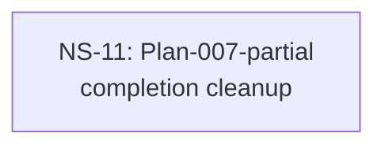

# Cross-Plan Dependencies (Test Fixture)

## 6. NS Catalog

### NS-11: Plan-007-partial completion cleanup

- Status: `completed` (resolved 2026-05-03 via PR #44 — <TODO subagent prose>)
- Type: cleanup
- Priority: `P2`
- Upstream: none
- References: [Plan-007](../plans/007-something.md)
- Summary: Cleanup-skip fixture — Type:cleanup; verifier trio carves out (type-sig permissive, file-overlap skip, plan-identity skip) so verifier passes regardless of diff shape.
- Exit Criteria: Housekeeper exit 0; status flips todo→completed; mermaid :::ready→:::completed.

