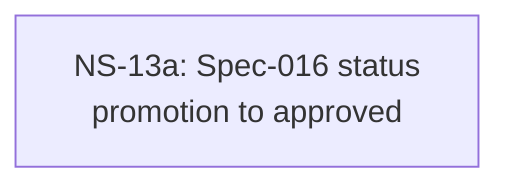

# Cross-Plan Dependencies (Test Fixture)

## 6. NS Catalog

### NS-13a: Spec-016 status promotion to approved

- Status: `completed` (resolved 2026-05-03 via PR #45 — <TODO subagent prose>)
- Type: governance
- Priority: `P2`
- Upstream: none
- References: [Spec-016](../specs/016-multi-agent-channels.md)
- Summary: Governance-skip fixture — Type:governance; verifier trio carves out (type-sig requires docs-only & this PR is docs-only ✓; file-overlap skip; plan-identity skip).
- Exit Criteria: Housekeeper exit 0; status flips todo→completed; mermaid :::ready→:::completed.

