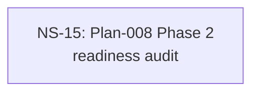

# Cross-Plan Dependencies (Test Fixture)

## 6. NS Catalog

### NS-15: Plan-008 Phase 2 readiness audit

- Status: `todo`
- Type: audit
- Priority: `P2`
- Upstream: none
- References: [Plan-008](../plans/008-rust-pty-sidecar.md)
- Summary: Audit-skip fixture — Type:audit; verifier trio carves out file-overlap (audit gets SKIP per FILE_OVERLAP_SKIP_TYPES branch) but keeps plan-identity (audit not in PLAN_IDENTITY_SKIP_TYPES). Heading carries Plan-008 substring → plan-identity matches args.plan="008".
- Exit Criteria: Housekeeper exit 0; status flips todo→completed; mermaid :::ready→:::completed; plan-tick warns exit 3 unless plan file exists with Phase 2 Done Checklist.

