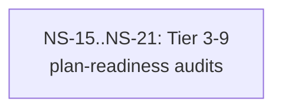

# Cross-Plan Dependencies (Test Fixture)

## 6. NS Catalog

### NS-15..NS-21: Tier 3-9 plan-readiness audits

- Status: `todo`
- Type: audit
- Priority: `P2`
- Upstream: none
- References: [Plan-010](../plans/010-tier-5-audit.md)
- Summary: Tier-range-audit fixture — heading is range-form NS-15..NS-21 with "Tier 3-9" substring. plan-identity range-arithmetic branch fires: args.tier="5" ∈ [3, 9] via rangeBoundaries={K1:3, K2:9}.
- Exit Criteria: Housekeeper exit 0; status flips todo→completed; mermaid :::ready→:::completed for the range-form node.

