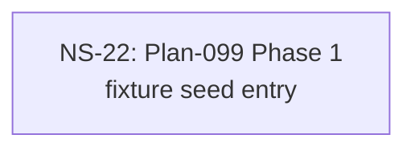

# Cross-Plan Dependencies (Test Fixture)

## 6. NS Catalog

### NS-22: Plan-099 Phase 1 — fixture seed entry

- Status: `completed` (resolved 2026-04-01 via PR #99 — fixture seed)
- Type: code
- Priority: `P3`
- Upstream: none
- References: [Plan-099](../plans/099-fixture-seed.md)
- Summary: Auto-create-fixture seed entry. Max NS integer in corpus is 22 so reserveNextFreeNs returns 23, then NS_RESERVED_INTEGERS guard for §3a.3 bumps to 24.
- Exit Criteria: Auto-create reservedNsNn=24; manifest emits exit 0 with semantic_work_pending=SEMANTIC_WORK_PENDING_AUTO_CREATE.

