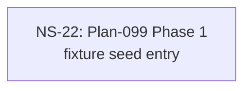

# Cross-Plan Dependencies (Test Fixture)

## 6. NS Catalog

### NS-22: Plan-099 Phase 1 — fixture seed entry

- Status: `completed` (resolved 2026-04-01 via PR #99 — fixture seed)
- Type: code
- Priority: `P3`
- Upstream: none
- References: [Plan-099](../plans/099-fixture-seed.md)
- Summary: Auto-create-fixture seed entry. Max NS integer in corpus is 22, so `reserveNextFreeNs` returns 23. A `NS_RESERVED_INTEGERS` guard used to bump that to 24 while §3a.3's reservation was still unlanded in the corpus; it has since landed and the guard was removed 2026-07-27.
- Exit Criteria: Auto-create `reservedNsNn`=23; manifest emits exit 0 with `semantic_work_pending`=`SEMANTIC_WORK_PENDING_AUTO_CREATE_BASE` and an empty `mechanical_edits`.

```mermaid
graph TB
  NS22[NS-22: Plan-099 Phase 1<br/>fixture seed entry]:::completed
```
