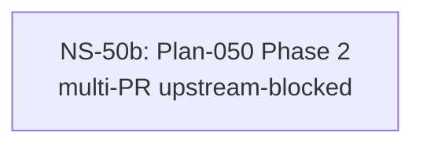

# Cross-Plan Dependencies (Test Fixture)

## 6. NS Catalog

### NS-50b: Plan-050 Phase 2 — multi-PR upstream-blocked recompute

- Status: `blocked` (blocked-on NS-50; last shipped: PR #100, 2026-04-15)
- Type: code (recommended split into 3 atomic PRs)
- Priority: `P1`
- Upstream: NS-50 (still blocked)
- References: [Plan-050](../plans/050-fixture.md)
- Summary: Multi-PR fixture entry whose upstream NS-50 is still blocked. Ticking a partial PR must preserve `blocked` status (§3a.2 row 5 override) while updating last-shipped.
- Exit Criteria: All `PRs:` ticks checked AND NS-50 unblocked.
- PRs:
  - [x] T-050-2-1 — first task (PR #100, merged 2026-04-15)
  - [ ] T-050-2-2 — second task
  - [ ] T-050-2-3 — third task

