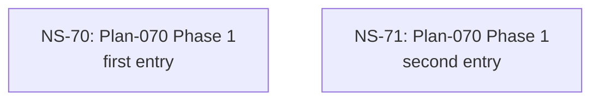

# Cross-Plan Dependencies (Test Fixture)

## 6. NS Catalog

### NS-70: Plan-070 Phase 1 — first single-PR entry

- Status: `completed` (resolved 2026-05-03 via PR #60 — <TODO subagent prose>)
- Type: code
- Priority: `P1`
- Upstream: none
- References: [Plan-070](../plans/070-fixture.md)
- Summary: First of two candidates dispatched in a single comma-list invocation. Spec §5.1 line 454 multi-entry manifest.
- Exit Criteria: PR merges with both NS-70 + NS-71 flipped.

### NS-71: Plan-070 Phase 1 — second single-PR entry

- Status: `completed` (resolved 2026-05-03 via PR #60 — <TODO subagent prose>)
- Type: code
- Priority: `P2`
- Upstream: none
- References: [Plan-070](../plans/070-fixture.md)
- Summary: Second of two candidates. Validate-all-then-apply-all transactional semantics per spec §5.1 line 521.
- Exit Criteria: PR merges with both NS-70 + NS-71 flipped.

