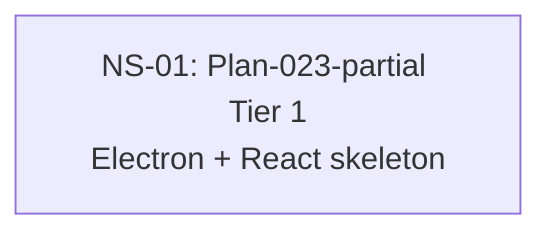

# Cross-Plan Dependencies (Test Fixture)

## 6. NS Catalog

### NS-01: Plan-023-partial Tier 1 — Electron + React skeleton

- Status: `todo`
- Type: code
- Priority: `P1`
- Upstream: none
- References: [Plan-023](../plans/023-desktop-shell-and-renderer.md)
- Summary: Partial-phase dispatch fixture — the NS heading carries the full `Plan-023-partial` identity token while the plan file on disk is named for the bare number.
- Exit Criteria: T-023-1-1..4 merged.

