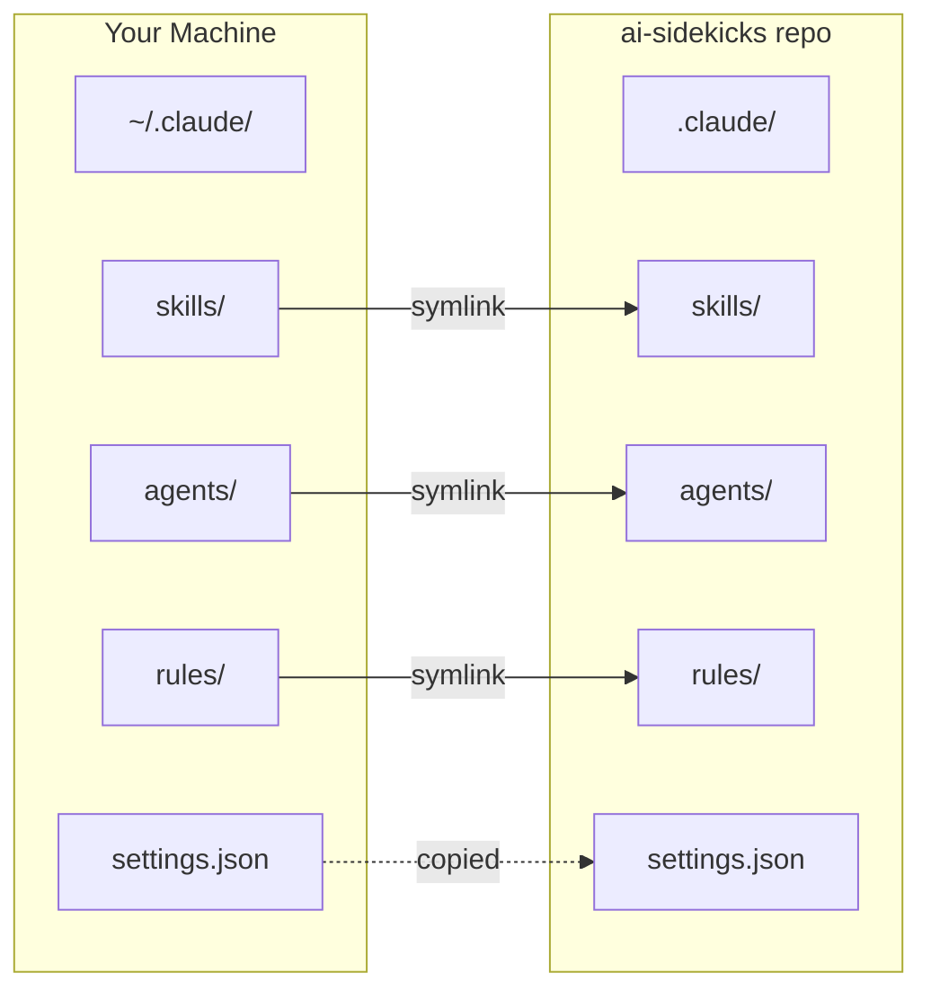
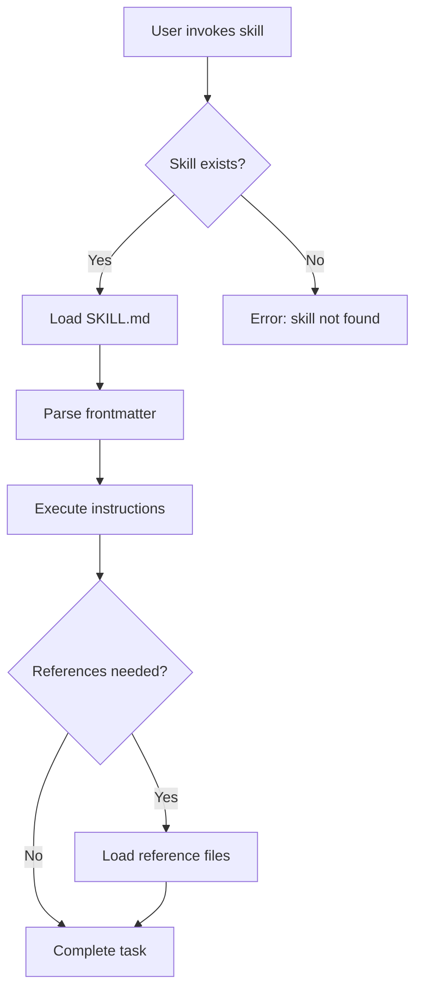
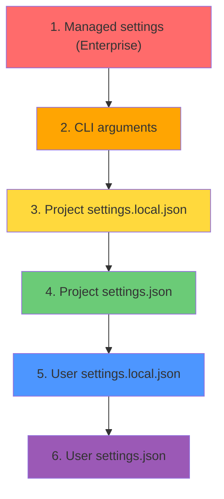

# AI-SIDEKICKS

```
        o
       .-.
    .--┴-┴--.
    | O   O |   AI-SIDEKICKS
    | ||||| |   >> portable ai configuration
    '--___--'
```

A portable, version-controlled configuration system for [Claude Code](https://claude.ai/code). Manage your skills, agents, and settings across machines with a single git repository.

---

## Table of Contents

- [Quick Start](#quick-start)
- [Architecture](#architecture)
- [Project Structure](#project-structure)
- [Skills](#skills)
- [Agents](#agents)
- [Configuration](#configuration)
- [Documentation](#documentation)

---

## Quick Start

```bash
# Clone the repository
git clone https://github.com/Sawmonabo/ai-sidekicks.git

# Install to your user config
cd ai-sidekicks
./install.sh

# Verify installation
./install.sh --status
```

For detailed installation options, see the [Portable Setup Guide](docs/claude/portable-setup.md#installation).

---

## Architecture



| Component | Method | Reason |
|-----------|--------|--------|
| `skills/` | Symlink | Always use latest version |
| `agents/` | Symlink | Always use latest version |
| `rules/` | Symlink | Always use latest version |
| `settings.json` | Copy | Allow local customization |

For details on how symlinks work and conflict resolution, see the [Portable Setup Guide](docs/claude/portable-setup.md#how-symlinks-work).

---

## Project Structure

```
ai-sidekicks/
├── .claude/
│   ├── skills/           # Claude Code skills (portable)
│   ├── agents/           # Custom subagents (portable)
│   ├── rules/            # Project rules (portable)
│   ├── settings.json     # Base settings (portable)
│   └── tmp/              # Runtime files (gitignored)
├── docs/claude/          # Claude Code documentation
├── install.sh            # Config installation script
├── CLAUDE.md             # Project instructions for Claude
└── README.md
```

For complete directory structure details, see the [Structure Guide](docs/claude/structure-guide.md).

---

## Skills

| Skill | Description |
|-------|-------------|
| [skill-creator](.claude/skills/skill-creator/SKILL.md) | Create effective Claude Code skills through guided interviews |
| [prompt-engineering](.claude/skills/prompt-engineering/SKILL.md) | Create production-grade prompts using hybrid markdown + XML |
| [context-engineering](.claude/skills/context-engineering/SKILL.md) | Understand context components and constraints in agent systems |
| [git](.claude/skills/git/SKILL.md) | Advanced git workflows for worktrees and commit metadata |
| [agent-evaluation](.claude/skills/agent-evaluation/SKILL.md) | Evaluate and improve Claude Code commands and agents |



---

## Agents

| Agent | Description |
|-------|-------------|
| [agent-creator](.claude/agents/agent-creator.md) | Create new agent definitions |
| [code-simplifier](.claude/agents/code-simplifier.md) | Simplify and refine code for clarity |
| [plugin-validator](.claude/agents/plugin-validator.md) | Validate plugin configurations |
| [prompt-reviewer](.claude/agents/prompt-reviewer.md) | Review and improve prompts |
| [skill-reviewer](.claude/agents/skill-reviewer.md) | Review skill implementations |

---

## Configuration



For configuration details and local overrides, see:
- [Portable Setup Guide - Configuration](docs/claude/portable-setup.md#configuration-files)
- [Portable Setup Guide - Precedence Order](docs/claude/portable-setup.md#precedence-order)

---

## Documentation

| Document | Description |
|----------|-------------|
| [Portable Setup Guide](docs/claude/portable-setup.md) | Complete portable configuration system guide |
| [Structure Guide](docs/claude/structure-guide.md) | Detailed `.claude` directory reference |
| [Logging Guide](docs/claude/logging.md) | Debug and monitor Claude Code |
| [Index](docs/claude/index.md) | Documentation index |
