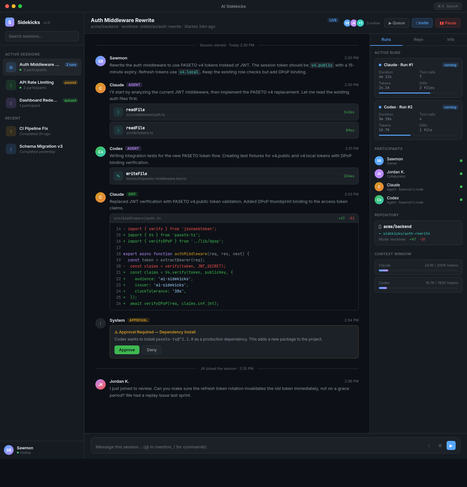
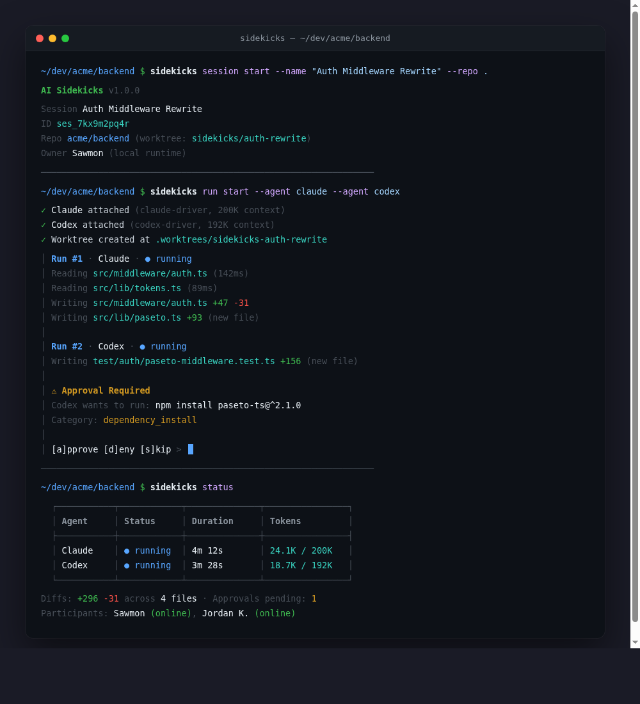

# AI Sidekicks

```text
      o
     .-.
  .--┴-┴--.
  | O   O |   >> A collaborative agent operating system for software work.
  | ||||| |   >> Humans + agents, one session.
  '--___--'
```

AI Sidekicks is a desktop runtime where humans and AI agents share live sessions, co-edit code through proper git flow, and collaborate in real time. Think of it as a shared workspace where you can invite teammates, attach multiple AI agents from different providers, and steer their work as it happens — all inside one unified session.

<p align="center">
  
</p>

---

## Table of Contents

- [Why AI Sidekicks](#why-ai-sidekicks)
- [Core Concept](#core-concept)
- [Key Features](#key-features)
- [Architecture](#architecture)
- [Technology Stack](#technology-stack)
- [V1 Scope](#v1-scope)
- [Build Order](#build-order)
- [Project Status](#project-status)
- [Documentation](#documentation)
- [License](#license)

---

## Why AI Sidekicks

Today's AI coding tools are single-user, single-agent, and disconnected. You run one agent at a time, on your machine, against your checkout. There's no way to:

- Invite a colleague into a live agent session so they can see what's happening and contribute
- Run Claude and Codex side-by-side on the same task with coordinated git flow
- Pause an agent mid-run, steer its direction, then resume — without losing state
- Get real approval gates before agents install packages, run migrations, or push code
- See a unified timeline of every message, tool call, diff, and decision across all agents

AI Sidekicks exists to solve these problems. It treats **the session** — not the agent — as the first-class primitive, and builds real collaboration into the runtime from day one.

---

## Core Concept

The first-class object is not `agent`. It is **`session`**.

A session contains participants, agents, runs, channels, repo mounts, approvals, artifacts, invites, and presence. "Two agents talking," "one user chatting with one agent," and "workflow orchestration" are all different views over the same session and event model.

```text
                    ┌──────────────────────────────────┐
                    │           SESSION                │
                    │                                  │
                    │   Participants  ←  Humans        │
                    │   Agents       ←  Claude, Codex  │
                    │   Channels     ←  Chat, Workflow │
                    │   Runs         ←  Active work    │
                    │   Repo Mounts  ←  Git repos      │
                    │   Approvals    ←  Safety gates   │
                    │   Artifacts    ←  Diffs, files   │
                    │   Events       ←  Full timeline  │
                    │                                  │
                    └──────────────────────────────────┘
```

A participant can join a live session, chat directly in it, and attach one or more agents from their own local machine. People and machines are both first-class participants.

---

## Key Features

### Multi-User, Multi-Agent Sessions

Start a session, invite a teammate via shareable link, and both bring your own agents. Everyone sees the same live timeline. Agents from different participants run on their respective machines while sharing session state.

### Queue, Steer, Pause, Resume

Real runtime control — not UI illusions. The queue is daemon-backed. Steer is modeled as an intervention against an active run. Pause is a runtime state with persisted context. Resume continues from where the agent left off.

### Approval Gates

8 categories of approval gates (tool execution, dependency install, file write, git push, and more) ensure agents never take unsupervised action on anything that matters. Approve, deny, or set remembered rules.

### Worktree-First Git Flow

Every coding run binds to a repo mount and execution mode: read-only, branch, worktree, or ephemeral clone. The default is **worktree** — agents work on isolated branches, produce attributed diffs, and prepare PRs without touching your main checkout.

### Live Timeline and Visibility

A unified event stream shows every message, tool call, approval, diff, state transition, and handoff across all agents and participants. Replay any session from its event log.

### Provider Drivers

AI agents run behind explicit driver adapters — `claude-driver` and `codex-driver` ship in V1. The product is not a wrapper around a single provider CLI; it's a runtime that normalizes agent behavior across providers.

### Local-First with Collaboration

Agent execution stays on your machine. The collaboration control plane handles auth, invites, presence, relay, and shared metadata — it never executes code. Single-user mode works fully offline.

---

## Architecture

```text
┌──────────────────┐     ┌──────────────────┐
│   Desktop Shell  │     │       CLI        │
│   (Electron)     │     │   (sidekicks)    │
└────────┬─────────┘     └────────┬─────────┘
         │         Typed SDK      │
         └────────────┬───────────┘
                      │ IPC (Unix socket / named pipe)
              ┌───────┴────────┐
              │  Local Runtime │
              │    Daemon      │
              │                │
              │  ┌──────────┐  │
              │  │ Session  │  │
              │  │ Engine   │  │
              │  ├──────────┤  │
              │  │ Provider │  │    ┌────────────────────┐
              │  │ Drivers  │──┼───►│ Claude / Codex API │
              │  ├──────────┤  │    └────────────────────┘
              │  │   Git    │  │
              │  │ Engine   │  │
              │  ├──────────┤  │
              │  │ SQLite   │  │
              │  └──────────┘  │
              └───────┬────────┘
                      │ tRPC + WebSocket
           ┌──────────┴──────────┐
           │  Collaboration      │
           │  Control Plane      │
           │  (Auth, Invites,    │
           │   Presence, Relay)  │
           │                     │
           │  ┌──────────────┐   │
           │  │  Postgres    │   │
           │  └──────────────┘   │
           └─────────────────────┘
```

**Desktop Shell** — Electron main process. Thin layer for windowing, native dialogs, notifications, and daemon supervision.

**CLI** — First client delivery track. Proves the typed SDK and IPC contract before the desktop UI ships.

**Local Runtime Daemon** — Machine-local execution authority. Owns provider processes, git worktrees, terminal sessions, tool execution, and local persistence (SQLite).

**Collaboration Control Plane** — Hosted or self-hosted service for auth (PASETO v4 + WebAuthn), invites, presence (Yjs Awareness CRDT), relay (E2E encrypted), and shared metadata (Postgres).

### CLI-First

The CLI (`sidekicks`) is the first client delivery track — it proves the typed SDK and IPC contract before the desktop UI ships.

<p align="center">
  
</p>

---

## Technology Stack

| Layer | Technology |
|-------|-----------|
| Language | TypeScript (daemon, CLI, desktop, contracts) |
| Desktop Shell | Electron |
| Desktop UI | React + Vite |
| Local Database | SQLite (WAL mode, 30 tables) |
| Shared Database | Postgres (11 tables) |
| Auth | PASETO v4 (access + refresh), WebAuthn, DPoP |
| Relay Encryption | X25519 + XChaCha20-Poly1305 (V1), MLS RFC 9420 (V2) |
| State Machines | XState v5 |
| API Framework | tRPC v11 |
| IPC | Unix socket (macOS/Linux), named pipe (Windows) |
| Validation | Zod |
| Authorization | CASL (RBAC) |
| Presence | Yjs Awareness protocol |
| Observability | OpenTelemetry |

---

## V1 Scope

V1 ships 14 core features through the CLI. The desktop GUI is V2.

| # | Feature | Description |
|---|---------|-------------|
| 1 | Session creation and join | Foundational session primitive |
| 2 | Mid-session invites | Shareable link with PASETO token |
| 3 | Membership roles | Owner, admin, collaborator, viewer |
| 4 | Runtime node attach | Participants contribute local compute |
| 5 | Single-agent runs | Claude and Codex via provider drivers |
| 6 | Queue, steer, pause, resume | Real runtime control and interventions |
| 7 | Approval gates | 8 categories of human-in-the-loop safety |
| 8 | Repo attach | Bind sessions to git repositories |
| 9 | Worktree execution | Isolated branches per agent run |
| 10 | Session timeline | Unified event stream with replay |
| 11 | Local daemon + CLI | First client over the typed SDK |
| 12 | Presence | Online / idle / offline awareness |
| 13 | Event audit log | Event-sourced persistence backbone |
| 14 | Local artifacts | Diffs, files, and attachments |

**V2 additions:** Multi-agent orchestration, workflow engine, shared artifacts, email invites, MLS E2EE, desktop GUI.

---

## Build Order

Implementation follows a 9-tier dependency graph:

```
Tier 1  ► Plan-001  Shared Session Core
Tier 2  ► Plan-002  Invite, Membership, Presence
Tier 3  ► Plan-003  Runtime Node Attach
Tier 4  ► Plan-005  Provider Driver Contract
         Plan-006  Event Taxonomy and Audit Log
         Plan-007  Local IPC and Daemon Control
Tier 5  ► Plan-004  Queue, Steer, Pause, Resume
         Plan-008  Control Plane Relay
         Plan-018  Identity and Participant State
Tier 6  ► Plan-009  Repo Attachment and Workspace Binding
         Plan-010  Worktree Lifecycle
         Plan-012  Approvals and Permissions
Tier 7  ► Plan-011  Git Flow, PR, Diff Attribution
         Plan-014  Artifacts, Files, Attachments
         Plan-015  Persistence, Recovery, Replay
Tier 8  ► Plan-013  Live Timeline and Visibility
         Plan-019  Notifications and Attention
         Plan-020  Observability and Failure Recovery
Tier 9  ► Plan-016  Multi-Agent Channels (V2)
         Plan-017  Workflow Authoring (V2)
```

Each tier's prerequisites are the prior tier's completion. See [`docs/architecture/cross-plan-dependencies.md`](docs/architecture/cross-plan-dependencies.md) for the full dependency graph and table ownership map.

---

## Project Status

**Phase: Implementation readiness complete. Code implementation not yet started.**

The entire design corpus is written, cross-verified, and internally consistent:

- **20 implementation plans** with step-by-step build instructions
- **22 specifications** covering every feature and cross-cutting concern
- **8 domain models** (run state machine, intervention model, participant model, workflow model, etc.)
- **9 architecture documents** (schemas, contracts, security, deployment, dependencies)
- **8 operations runbooks** (CLI commands, SLOs, on-call routing)
- **12 ADRs** recording key design decisions
- **259 crosscheck verifications** across 4 review phases, converged to 0 issues

---

## Documentation

| Area | Path | Description |
|------|------|-------------|
| Vision | [`docs/vision.md`](docs/vision.md) | Product thesis and architectural position |
| Specs | [`docs/specs/`](docs/specs/) | Feature specifications (001-022) |
| Plans | [`docs/plans/`](docs/plans/) | Implementation plans (001-020) |
| Architecture | [`docs/architecture/`](docs/architecture/) | Schemas, contracts, security, deployment |
| Domain Models | [`docs/domain/`](docs/domain/) | State machines, glossary, entity models |
| ADRs | [`docs/decisions/`](docs/decisions/) | Architectural decision records |
| Operations | [`docs/operations/`](docs/operations/) | Runbooks, SLOs, on-call routing |
| V1 Scope | [`docs/architecture/v1-feature-scope.md`](docs/architecture/v1-feature-scope.md) | What ships in V1 vs V2 |
| Build Order | [`docs/architecture/cross-plan-dependencies.md`](docs/architecture/cross-plan-dependencies.md) | 9-tier implementation sequence |

---

## License

TBD
