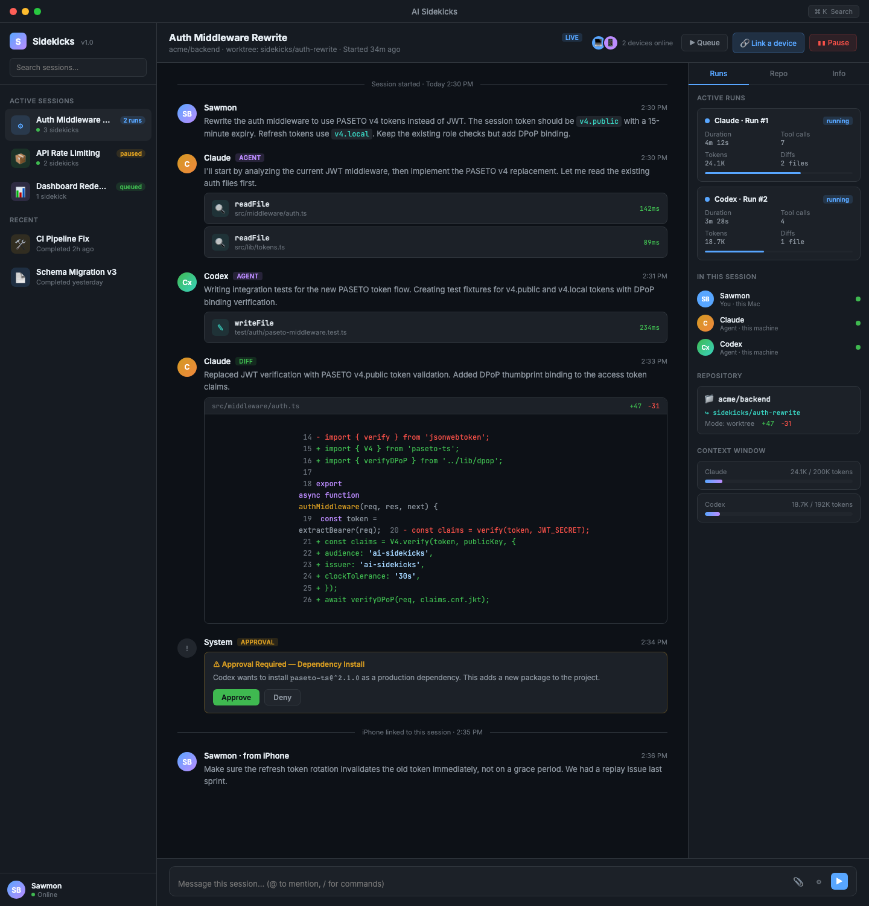
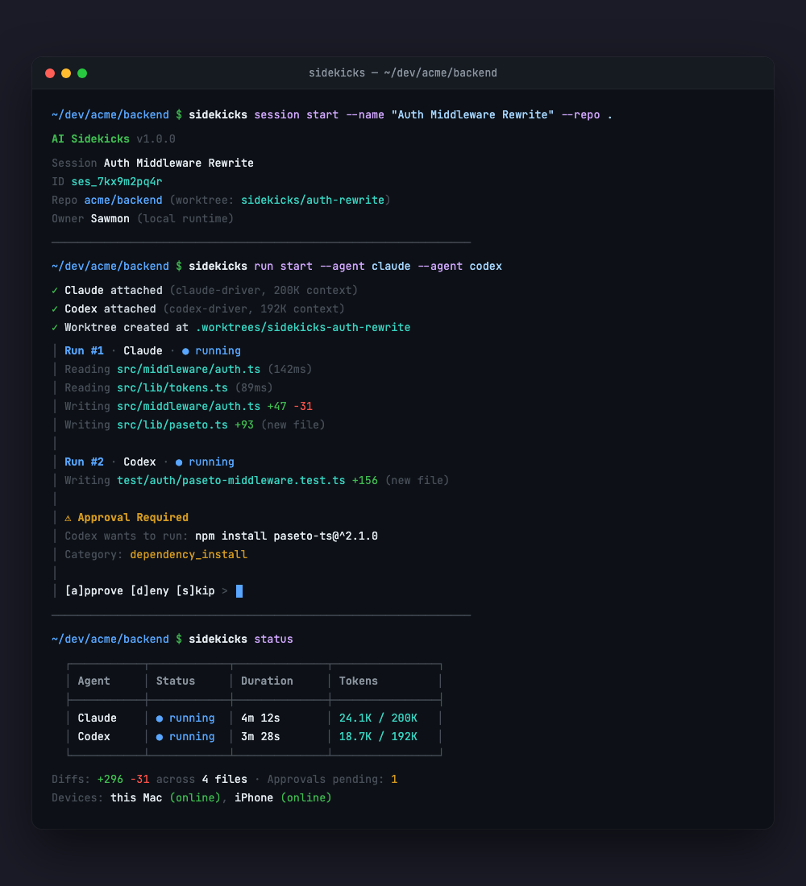

# AI Sidekicks

```text
      o
     .-.
  .--┴-┴--.
  | O   O |   >> A collaborative agent operating system for software work.
  | ||||| |   >> Humans + agents, one session.
  '--___--'
```

AI Sidekicks is a desktop runtime where humans and AI agents share live sessions, co-edit code through proper git flow, and collaborate in real time. Think of it as a group chat for agentic coding — a Discord-like shared session where you invite teammates mid-flight, everyone brings their own agents on their own subscription, and you steer agents as they work — within the session's roles and approvals. The shared object is the conversation, the activity, and the work product — never a mirrored screen or a forwarded keyboard.

<p align="center">
  
</p>

---

## Table of Contents

- [Why AI Sidekicks](#why-ai-sidekicks)
- [Core Concept](#core-concept)
- [Key Features](#key-features)
- [Architecture](#architecture)
- [Technology Stack](#technology-stack)
- [V1 Scope](#v1-scope)
- [Build Order](#build-order)
- [Project Status](#project-status)
- [Documentation](#documentation)
- [License](#license)

---

## Why AI Sidekicks

Today's AI coding tools are single-user, single-agent, and disconnected. You run one agent at a time, on your machine, against your checkout. There's no way to:

- Invite a colleague into a live agent session so they can see what's happening and contribute
- Run Claude and Codex side-by-side on the same task with coordinated git flow
- Pause an agent mid-run, steer its direction, then resume — without losing state
- Get real approval gates before agents install packages, run migrations, or push code
- See a unified timeline of every message, tool call, diff, and decision across all agents

AI Sidekicks exists to solve these problems. It treats **the session** — not the agent — as the first-class primitive, and builds real collaboration into the runtime from day one.

---

## Core Concept

The first-class object is not `agent`. It is **`session`**.

A session contains participants, agents, runs, channels, repo mounts, approvals, artifacts, invites, and presence. "Two agents talking," "one user chatting with one agent," and "workflow orchestration" are all different views over the same session and event model.

```text
                    ┌──────────────────────────────────┐
                    │           SESSION                │
                    │                                  │
                    │   Participants  ←  Humans        │
                    │   Agents       ←  Claude, Codex  │
                    │   Channels     ←  Chat, Workflow │
                    │   Runs         ←  Active work    │
                    │   Repo Mounts  ←  Git repos      │
                    │   Approvals    ←  Safety gates   │
                    │   Artifacts    ←  Diffs, files   │
                    │   Events       ←  Full timeline  │
                    │                                  │
                    └──────────────────────────────────┘
```

A participant can join a live session, chat directly in it, and attach one or more agents from their own local machine. People and machines are both first-class participants.

---

## Key Features

### Multi-User, Multi-Agent Sessions

Start a session, invite a teammate via shareable link, and both bring your own agents — each running on its owner's machine, billed to its owner's subscription, with credentials that never travel. Everyone follows the same live session timeline, and late joiners catch up on history backfilled by their peers. Steering, queueing, and orchestration are governed by the session's membership roles and approval policies — steering another owner's agent is a policy grant from that owner, never a default. Humans keep side channels and direct messages whose content agents are never given as context, and session content — messages, events, artifacts — is end-to-end encrypted per recipient in transit: the relay never sees plaintext. (Presence signals — who is online, focused, or typing — ride the control-plane presence channel as non-content metadata, not the relay.)

### Queue, Steer, Pause, Resume

Real runtime control — not UI illusions. The queue is daemon-backed. Steer is modeled as an intervention against an active run. Pause is a runtime state with persisted context. Resume continues from where the agent left off.

### Approval Gates

9 categories of approval gates (tool execution, file write, network access, destructive git, user input, plan approval, MCP elicitation, workflow gate, and human phase contribution) ensure agents never take unsupervised action on anything that matters. Approve, deny, or set remembered rules.

### Worktree-First Git Flow

Every coding run binds to a repo mount and execution mode: read-only, branch, worktree, or ephemeral clone. The default is **worktree** — agents work on isolated branches, produce attributed diffs, and prepare PRs without touching your main checkout.

### Live Timeline and Visibility

A unified event stream shows every message, tool call, approval, diff, state transition, and handoff across all agents and participants. Replay any session from its event log.

### Provider Drivers

AI agents run behind explicit driver adapters — `claude-driver` and `codex-driver` ship in V1. The product is not a wrapper around a single provider CLI; it's a runtime that normalizes agent behavior across providers.

### Local-First with Collaboration

Agent execution stays on your machine. The collaboration control plane handles auth, invites, presence, relay, and shared metadata — it never executes code. Single-user mode works fully offline.

---

## Architecture

```text
┌──────────────────┐     ┌──────────────────┐
│   Desktop Shell  │     │       CLI        │
│   (Electron)     │     │   (sidekicks)    │
└────────┬─────────┘     └────────┬─────────┘
         │         Typed SDK      │
         └────────────┬───────────┘
                      │ IPC (Unix socket / named pipe)
              ┌───────┴────────┐
              │  Local Runtime │
              │    Daemon      │
              │                │
              │  ┌──────────┐  │
              │  │ Session  │  │
              │  │ Engine   │  │
              │  ├──────────┤  │
              │  │ Provider │  │    ┌────────────────────┐
              │  │ Drivers  │──┼───►│ Claude / Codex API │
              │  ├──────────┤  │    └────────────────────┘
              │  │   Git    │  │
              │  │ Engine   │  │
              │  ├──────────┤  │
              │  │ SQLite   │  │
              │  └──────────┘  │
              └───────┬────────┘
                      │ tRPC + WebSocket
           ┌──────────┴──────────┐
           │  Collaboration      │
           │  Control Plane      │
           │  (Auth, Invites,    │
           │   Presence, Relay)  │
           │                     │
           │  ┌──────────────┐   │
           │  │  Postgres    │   │
           │  └──────────────┘   │
           └─────────────────────┘
```

**Desktop Shell** — Electron main process. Thin layer for windowing, native dialogs, notifications, and daemon supervision.

**CLI** — First client delivery track. Proves the typed SDK and IPC contract before the desktop UI ships.

**Local Runtime Daemon** — Machine-local execution authority. Owns provider processes, git worktrees, terminal sessions, tool execution, and local persistence (SQLite).

**Collaboration Control Plane** — Hosted or self-hosted service for auth (PASETO v4 + WebAuthn), invites, presence (Yjs Awareness CRDT), relay (E2E encrypted), and shared metadata (Postgres).

### CLI-First

The CLI (`sidekicks`) is the first client delivery track — it proves the typed SDK and IPC contract before the desktop UI ships.

<p align="center">
  
</p>

---

## Technology Stack

| Layer | Technology |
| --- | --- |
| Language | TypeScript (daemon, CLI, desktop, contracts) |
| Desktop Shell | Electron |
| Desktop UI | React + Vite |
| Local Database | SQLite (WAL mode, 56 tables) |
| Shared Database | Postgres (23 tables) |
| Auth | PASETO v4 (access + refresh), WebAuthn, DPoP |
| Relay Encryption | X25519 + XChaCha20-Poly1305 (V1), MLS RFC 9420 (V2) |
| State Machines | XState v5 |
| API Framework | tRPC v11 |
| IPC | Unix socket (macOS/Linux), named pipe (Windows) |
| Validation | Zod |
| Authorization | Cedar (policy-based) per [ADR-012](docs/decisions/012-cedar-approval-policy-engine.md) |
| Presence | Yjs Awareness protocol |
| Observability | OpenTelemetry |

---

## V1 Scope

V1 ships 23 core features across CLI and Desktop GUI per [ADR-015: V1 Feature Scope Definition](docs/decisions/015-v1-feature-scope-definition.md) (amended 2026-07-02 per the capability-enhancement campaign — was 17).

| # | Feature | Description |
| --- | --- | --- |
| 1 | Session creation and join | Foundational session primitive |
| 2 | Mid-session invites | Shareable link with PASETO token |
| 3 | Membership roles | Owner, admin, collaborator, viewer |
| 4 | Runtime node attach | Participants contribute local compute |
| 5 | Single-agent runs | Claude and Codex via provider drivers |
| 6 | Queue, steer, pause, resume | Real runtime control and interventions |
| 7 | Approval gates | 9 categories of human-in-the-loop safety |
| 8 | Repo attach | Bind sessions to git repositories |
| 9 | Worktree execution | Isolated branches per agent run |
| 10 | Session timeline | Unified event stream with replay |
| 11 | Local daemon + CLI | First client over the typed SDK |
| 12 | Presence | Online / idle / offline awareness |
| 13 | Event audit log | Event-sourced persistence backbone |
| 14 | Artifacts (local + cross-node) | Diffs, files, and attachments; shared artifacts stay fetchable while the publishing node is offline via an eager relay pin of E2EE ciphertext (ADR-015 amendment 2026-07-08; threat-model-scoped 2026-08-08 — see that ADR's §Decision Log for the two accepted V1 residuals and their named closure) |
| 15 | Desktop GUI | Electron shell + React/Vite renderer over the same typed SDK |
| 16 | Multi-agent channels | Cross-agent coordination primitives per [Spec-016](docs/specs/016-multi-agent-channels-and-orchestration.md) |
| 17 | Workflow authoring and execution | Full workflow engine per [Spec-017](docs/specs/017-workflow-authoring-and-execution.md) |
| 18 | MCP server configuration and governance | Server-config CRUD, operator-managed trusted-server store, status/health probing, server OAuth per [Spec-028](docs/specs/028-mcp-server-configuration-and-governance.md) + [Plan-028](docs/plans/028-mcp-server-configuration-and-governance.md) (landed 2026-07-22 via campaign B18; code gates on Plan-028's targeted readiness audit + status promotion) |
| 19 | Session time-travel | Run rollback as a version-guarded intervention + forward `run.rolled_back` event (log never truncates) — governing amendments in-tree (B2 merged via #205, B1 merged via #173; Spec-004 + Spec-006 re-promoted `approved` 2026-07-18 via the W1.5 gate), and durable file restoration needed the B21→B23 turn-snapshot leg gated before Plan-004 Phase 3 (Codex rollback reverts conversation only) — the B23 leg shipped 2026-08-09 via PR #303, so that gate is met and Plan-004 Phase 3 rides tier order plus its remaining precondition legs — and the user-visible superseded-turn timeline rendering rides the Spec-013/Plan-013 CP-004-13 consumer leg (`review` since 2026-07-20; restored at the Tier-8 audit or an earlier batch gate, built at Plan-013's Tier-8 dispatch) |
| 20 | Session goals | Per-session structured goal with set/clear RPC and goal events — governing amendments in-tree (B6 landed 2026-07-06; B1 merged via #173) — specs re-promoted `approved` 2026-07-18 (W1.5 gate cleared) |
| 21 | Session callback tools | Daemon-registered tools exposed into every run, Cedar-governed — governing amendments in-tree (B3 merged 2026-07-05; B20 merged via #175) — specs re-promoted `approved` 2026-07-18 (W1.5 gate cleared) |
| 22 | Execution postures and sandbox profiles | Per-run sandbox posture as an authorization input, provider-uniform presets — governing amendments in-tree (B20 merged via #175; B3 merged 2026-07-05) — specs re-promoted `approved` 2026-07-18 (W1.5 gate cleared) |
| 23 | Realtime voice channels | Reserved and capability-gated on upstream Codex realtime-flag stabilization — governing amendments in-tree (B6 landed 2026-07-06; B1 merged via #173) — specs re-promoted `approved` 2026-07-18 (W1.5 gate cleared) |

**V1.1 additions:** MLS relay E2EE and email invite delivery (cross-node shared artifacts moved into V1 per the ADR-015 amendment 2026-07-08), plus the criterion-gated sub-feature commitments named in ADR-015 (workflow BIND channel reuse; `human`-phase default timeout; automated GDPR erasure endpoint; direct-first artifact fetch).

---

## Build Order

Implementation follows the tiered dependency graph defined in [`docs/architecture/cross-plan-dependencies.md`](docs/architecture/cross-plan-dependencies.md). V1 spans 28 implementation plans (the 28th — [Plan-028](docs/plans/028-mcp-server-configuration-and-governance.md) for feature #18's MCP governance — landed 2026-07-22 via the campaign's B18 bundle at `draft`; MCP-governance code gates on its targeted readiness audit + status promotion); Plan-001 Shared Session Core is `completed`, Plan-028 MCP Governance is `draft`, eleven plans are in `review` (Plan-013 Live Timeline — flipped 2026-07-20 by the campaign B9 CP-004-13 superseded-turn consumer amendment, restored by the Tier-8 audit or an earlier batch gate, Plan-014 Artifacts — re-opened 2026-07-08 for the cross-node relay scope growth, Plan-017 Workflow Authoring, Plan-018, Plan-025 Self-Hostable Node Relay, Plan-010 Worktree Lifecycle — flipped 2026-07-19 for the campaign B22 turn-snapshot Phase, restored 2026-07-20 by its W2.5 targeted re-audit (#220), and re-flipped 2026-08-09 by the sparse-root capture-closure amendment (new Phase 6 / T6.1 / invariant I-010-24; PR #307), its restoring targeted readiness-audit delta queued — and Plans 002 / 003 / 008 / 012 / 016 — flipped 2026-08-03 with their paired specs by the V1 product-vision reconciliation amendment bundle alongside the since-restored Plan-004, each restoring `approved` via its queued targeted readiness-audit delta), and the rest are `approved` — Plan-027 Cross-Node Dispatch among them — flipped 2026-07-19 for the campaign B17 pending-dispatch table and restored 2026-07-20 by its W2.5 targeted re-audit (#227). Plan-004 Queue Steer Pause Resume joined them 2026-07-20 — a standing `review` (never campaign-flipped) promoted by its W2.5 targeted re-audit (#228) after the campaign B9 rollback/park bundle, re-flipped `review` 2026-08-03 with Spec-004 by the V1 product-vision reconciliation, and restored `approved` 2026-08-08 by the cross-user run-control authorization targeted readiness-audit delta (#299 / NS-49) — the reconciliation batch's first restoration. Plan-005 Provider Driver Contract followed on the same 2026-07-20 — flipped that day for the campaign B10 driver-tasks bundle and restored by its W2.5 targeted re-audit (#229). Plan-016 Multi-Agent Channels joined them 2026-07-21 — flipped the same day by the campaign B15 orchestration bundle (mandatory T2.7 blocking-state sweep behavior + the I-016-14 two-exemption rewrite) and restored by its W2.5 targeted re-audit (#238), a joint spec+plan promotion with Spec-016. Plan-008 Control-Plane Relay joined them 2026-07-21 — a standing `review` (never campaign-flipped) promoted by its W2.5 targeted re-audit (#239) after the campaign B12 resume-and-subscribe consumer task. Plan-012 Approvals joined them 2026-07-21 — flipped 2026-07-20 by the campaign B13 spawn-env/normalizer/posture amendment (new invariants I-012-20..22), edited again by B15's mint-rule leg, and restored by its W2.5 targeted re-audit (#240). Plan-024 Rust PTY Sidecar joined them 2026-07-21 — flipped the same day by the campaign B16 Phase-3B PTY-substrate-hardening authoring (new phase, invariants I-024-7..12), restored by its W2.5 targeted re-audit (#241), re-flipped `review` 2026-08-02 by the CP-024-5 credential-seam registration (PR #279), and restored `approved` 2026-08-03 by the CP-024-5 targeted readiness-audit delta (#283 / NS-44). Plan-006 Session Event Taxonomy rejoined the `approved` set 2026-08-02 — re-flipped that day by the T3.1 ingest-halt seam amendment (#281), after its 2026-07-29 flip and 2026-08-01 #278 restore, and restored by the T3.1-seam targeted readiness-audit delta (#282 / NS-43). The 2026-08-03 V1 product-vision reconciliation (the [`docs/vision.md`](docs/vision.md) lock-in, PR #284) flipped Plans 002 / 003 / 004 / 008 / 012 / 016 and their paired specs back to `review` for its amendment bundle — cross-user intervention authority, typing presence plus the `ChannelList` non-disclosure filter, peer history backfill with per-channel relay recipient scoping, and channel audience plus `direct` channels among its legs — each restoring `approved` via its own queued targeted readiness-audit delta. Plan-004/Spec-004's delta — the cross-user intervention authority leg — landed 2026-08-08 (#299 / NS-49), restoring both; the other five pairs still await theirs.

```
Tier 1  ► Plan-001  Shared Session Core
         Plan-024  Rust PTY Sidecar
Tier 2  ► Plan-002  Invite, Membership, Presence
Tier 3  ► Plan-003  Runtime Node Attach
Tier 4  ► Plan-005  Provider Driver Contract
         Plan-006  Event Taxonomy and Audit Log
         Plan-007  Local IPC and Daemon Control
Tier 5  ► Plan-004  Queue, Steer, Pause, Resume
         Plan-008  Control Plane Relay
         Plan-018  Identity and Participant State
         Plan-022  Data Retention and GDPR
         Plan-025  Self-Hostable Node Relay (crypto package only)
Tier 6  ► Plan-009  Repo Attachment and Workspace Binding
         Plan-010  Worktree Lifecycle
         Plan-012  Approvals and Permissions
         Plan-016  Multi-Agent Channels
         Plan-021  Rate Limiting Policy
Tier 7  ► Plan-011  Git Flow, PR, Diff Attribution
         Plan-014  Artifacts, Files, Attachments
         Plan-015  Persistence, Recovery, Replay
         Plan-025  Self-Hostable Node Relay (remaining steps)
         Plan-028  MCP Server Configuration and Governance
Tier 8  ► Plan-013  Live Timeline and Visibility
         Plan-017  Workflow Authoring and Execution
         Plan-019  Notifications and Attention
         Plan-020  Observability and Failure Recovery
         Plan-023  Desktop Shell and Renderer
Tier 9  ► Plan-026  First-Run Three-Way-Choice Onboarding
         Plan-027  Cross-Node Dispatch and Approval
```

Each tier's prerequisites are the prior tier's completion. See [`docs/architecture/cross-plan-dependencies.md`](docs/architecture/cross-plan-dependencies.md) for the full dependency graph and table ownership map.

---

## Project Status

**Phase: Tier 2-4 code execution underway; plan-readiness audits complete through Tier 7 — except the re-opened Preconditions deltas: Plan-014's relay scope growth (the 2026-07-08 growth re-opened its checkbox: Tasks 7–10 await the readiness-audit delta; Tasks 1–6 stay covered), the 2026-08-03 V1 product-vision reconciliation flips on Plans 002 / 003 / 004 / 008 / 012 / 016 — Plan-004 (with Spec-004) restored `approved` 2026-08-08 by its cross-user run-control authorization targeted readiness-audit delta (#299 / NS-49); the other five each await theirs — and the 2026-08-09 sparse-root capture-closure flip on Plan-010 (with Spec-010): the new Phase 6 / T6.1 awaits its restoring targeted readiness-audit delta (PR #307).**

Current documentation corpus:

- **28 V1 implementation plans** with step-by-step build instructions; 15 are `approved` (Plan-006 among them — re-flipped 2026-08-02 by its T3.1 ingest-halt seam amendment, #281, and restored the same day by the T3.1-seam targeted readiness-audit delta, #282; Plan-024 likewise — re-flipped 2026-08-02 by the CP-024-5 credential-seam registration, #279, and restored 2026-08-03 by the CP-024-5 targeted readiness-audit delta, #283 / NS-44; and Plan-004 rejoined them 2026-08-08 — re-flipped 2026-08-03 with Spec-004 by the V1 product-vision reconciliation and restored by the cross-user run-control authorization targeted readiness-audit delta, #299 / NS-49), Plan-001 is `completed`, 11 are in `review` (Plan-013 — flipped 2026-07-20 by the campaign B9 CP-004-13 superseded-turn consumer amendment, restored by the Tier-8 audit or an earlier batch gate — Plan-014, Plan-017, Plan-018, Plan-025, Plan-010 — re-flipped 2026-08-09 by the sparse-root capture-closure amendment (new Phase 6 / T6.1 / invariant I-010-24; PR #307), its restoring targeted readiness-audit delta queued — and Plans 002 / 003 / 008 / 012 / 016 — flipped 2026-08-03 with their paired specs by the V1 product-vision reconciliation amendment bundle alongside the since-restored Plan-004, each restoring `approved` via its queued targeted readiness-audit delta), and Plan-028 is `draft` (feature #18's MCP governance, landed 2026-07-22 via campaign B18; its targeted readiness audit is the `draft → review` gate)
- **28 specifications** covering every feature and cross-cutting concern (20 `approved` — including four of the nine W1-amended specs still holding their 2026-07-18 re-promotion via the campaign's W1.5 batch gate (Task 28): Spec-005/006/015/024, with Spec-010 the fifth W1.5 re-promotion (re-flipped `review` 2026-08-09 by the sparse-root capture-closure amendment, PR #307, and now counted in the `review` set below pending its restoring targeted readiness-audit delta) — Spec-006 re-flipped `review` 2026-07-22 by the campaign B18 census amendment and restored `approved` the same day by its named follow-on re-promotion, Spec-028 landed at `review` 2026-07-22 and promoted `approved` the same day via the campaign's W3 gate, and Spec-004 rejoined 2026-08-08 — flipped 2026-08-03 by the V1 product-vision reconciliation and restored by its cross-user run-control authorization targeted readiness-audit delta, #299 / NS-49; 8 in `review` — Spec-014, re-opened 2026-07-08 for the cross-node artifact relay design; Spec-013, flipped 2026-07-20 by the campaign B9 CP-004-13 superseded-turn consumer amendment, restored by the Tier-8 audit or an earlier batch gate; Spec-010, re-flipped 2026-08-09 by the sparse-root capture-closure amendment (PR #307), its restoring targeted readiness-audit delta queued; and Specs 002 / 003 / 008 / 012 / 016 — flipped 2026-08-03 with their paired plans by the V1 product-vision reconciliation amendment bundle alongside the since-restored Spec-004, the six carrying the other four W1-amended re-promotions among them, each remaining pair restoring `approved` via its queued targeted readiness-audit delta; Spec-016's earlier 2026-07-21 B15 flip was restored the same day by Plan-016's W2.5 targeted re-audit, a joint spec+plan promotion) — the six campaign features are doc-gated: feature #18's Spec-028 + Plan-028 landed 2026-07-22 via the B18 bundle, and features #19–#23's governing spec amendments are in-tree (B1 merged via #173, B3 merged 2026-07-05, B20 merged via #175, B6 landed 2026-07-06, B2 merged via #205; re-promoted via the W1.5 batch gate 2026-07-18; Spec-016 — the #20/#23 orchestration surface — was re-flipped `review` 2026-07-21 by B15's §Stop Conditions amendment, restored `approved` the same day by Plan-016's W2.5 targeted re-audit, then re-flipped `review` again 2026-08-03 alongside Spec-004 (#19) and Spec-012 (#21/#22) by the V1 product-vision reconciliation bundle per the `review` clause earlier in this bullet, re-opening the spec-layer gate on those three pending their targeted readiness-audit deltas — Spec-004's landed 2026-08-08 (#299 / NS-49), closing #19's spec layer again, so the gate now pends on Spec-012 and Spec-016 alone), so implementation of #18 waits on Plan-028's targeted readiness audit + status promotion and #19–#23 wait on the campaign's W2 plan-task bundles rather than the pre-campaign plans — plus one corpus-side gate: #19's superseded-turn timeline rendering also rides the Spec-013/Plan-013 CP-004-13 consumer leg (both `review` since 2026-07-20; restored at the Tier-8 audit or an earlier batch gate)
- **12 domain models** (run state machine, intervention model, participant model, workflow model, etc.)
- **16 architecture documents** (schemas, contracts, security, deployment, dependencies)
- **11 operations runbooks** (CLI commands, SLOs, on-call routing, self-host secure defaults)
- **21 accepted ADRs** recording key design decisions (ADR-013 reserved-skipped)

---

## Documentation

| Area | Path | Description |
| --- | --- | --- |
| Vision | [`docs/vision.md`](docs/vision.md) | Product thesis and architectural position |
| Specs | [`docs/specs/`](docs/specs/) | Feature specifications (001-027) |
| Plans | [`docs/plans/`](docs/plans/) | Implementation plans (001-027) |
| Architecture | [`docs/architecture/`](docs/architecture/) | Schemas, contracts, security, deployment |
| Domain Models | [`docs/domain/`](docs/domain/) | State machines, glossary, entity models |
| ADRs | [`docs/decisions/`](docs/decisions/) | Architectural decision records |
| Operations | [`docs/operations/`](docs/operations/) | Runbooks, SLOs, on-call routing |
| V1 Scope | [`docs/architecture/v1-feature-scope.md`](docs/architecture/v1-feature-scope.md) | What ships in V1 vs V2 |
| Build Order | [`docs/architecture/cross-plan-dependencies.md`](docs/architecture/cross-plan-dependencies.md) | 9-tier implementation sequence |
| Contributing | [`CONTRIBUTING.md`](CONTRIBUTING.md) | Branch naming, commit format, PR workflow |

---

## License

AI Sidekicks is licensed under the [Apache License, Version 2.0](./LICENSE) — see [ADR-020](docs/decisions/020-v1-deployment-model-and-oss-license.md) for the deployment-model and license commitment.
