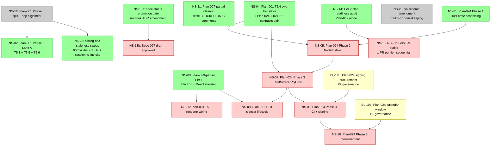

# Cross-Plan Dependency Graph and Ownership Map

## Purpose

Define the canonical build order, shared-resource ownership, and inter-plan dependencies so that implementation agents can execute plans in the correct sequence without discovering conflicts at build time.

## How to Use This Document

1. **Before starting any plan**: check its Dependencies row in the plan header. All listed plans must be complete.
2. **Before creating a table or directory**: check the Ownership Maps below. Only the owning plan issues `CREATE`. Dependent plans `EXTEND` with an explicit dependency declaration.
3. **Build order**: follow the Canonical Build Order (Section 5). Each tier's prerequisites are the prior tier's completion.

---

## 1. Table Ownership Map

These tables are claimed by multiple plans. The table below resolves each conflict.

| Table | Owning Plan (CREATE) | Extending Plan(s) (ALTER/USE) | Rationale |
| --- | --- | --- | --- |
| `session_memberships` | Plan-001 (Shared Session Core) | Plan-002 (Invite Membership And Presence) | Plan-001 is the session foundation; Spec-002 depends on Spec-001. Plan-001 creates the table with core columns (id, session_id, participant_id, role, state, joined_at, updated_at). Plan-002 adds invite-driven membership flows but does not own the schema. |
| `branch_contexts` | Plan-010 (Worktree Lifecycle And Execution Modes) | Plan-011 (Gitflow PR And Diff Attribution) | Plan-011 already declares Plan-010 as a dependency. Plan-010 creates the table as part of worktree infrastructure (id, worktree_id FK, base_branch, head_branch, upstream_ref, created_at, updated_at). Plan-011 extends it for PR and diff attribution. |
| `participant_keys` (SQLite) | Plan-001 (initial migration `0001-initial.ts`) | Plan-022 (schema origin and CRUD code paths) | **Forward-declared split per Plan-022 header.** Plan-022 authors the `participant_keys` schema but forward-declares the `CREATE TABLE` into Plan-001's Tier 1 migration so V1 session-core cannot ship without the GDPR crypto-envelope schema (per ADR-015 V1 scope). Plan-022's implementation code paths (store, rotation, wrap-codec) land at Tier 5. |
| `session_events.pii_payload` (SQLite column) | Plan-001 (initial migration `0001-initial.ts`) | Plan-022 (column origin; reader/writer code paths at Tier 5) | **Forward-declared split per Plan-022 header.** Plan-022 adds this BLOB column to Plan-001's `session_events` schema in the Tier 1 migration so the crypto envelope does not require a breaking schema migration after V1 ships. |
| `session_events.{monotonic_ns,prev_hash,row_hash,daemon_signature,participant_signature}` (SQLite columns) | Plan-001 (initial migration `0001-initial.ts`) | Plan-006 (column origin; integrity-protocol semantics + writer/verifier code paths at Tier 4) | **Forward-declared split per Spec-006 §Integrity Protocol.** Plan-001 ships the physical CREATE of these columns in the Tier 1 initial migration so the integrity protocol does not require a breaking schema migration after V1 ships. Plan-006 owns the column semantics (monotonic-clock allocation, hash-chain construction, dual-signature mechanics) and the writer/verifier code paths at Tier 4. Plan-003 emits `runtime_node.*` events into this surface at Tier 3, but the events conform to the column shape Plan-001 ships — Plan-003 does not author the integrity-protocol semantics. |
| `participants` (Postgres) | Plan-001 (initial migration `0001-initial.ts` — minimal `id UUID PK`, `created_at TIMESTAMPTZ`) | Plan-018 (Identity And Participant State — additive ALTER migrations for `display_name`, `identity_ref`, `metadata` + the `identity_mappings` side table) | **Forward-declared split per Plan-001 body line 50.** Plan-001 owns the physical CREATE of the minimal identity-anchor shape at Tier 1 because `session_memberships.participant_id`, `session_invites.inviter_id`, and `runtime_node_attachments.participant_id` all `REFERENCES participants(id)` (Plans 001/002/003 execute before Plan-018 per §5 Canonical Build Order). Plan-018 extends with identity/profile columns and the `identity_mappings` side table via additive ALTER migrations at Tier 5. |

### Uncontested Tables

All other tables have a single owning plan. See `docs/plans/NNN-*.md` Data And Storage Changes sections for canonical column definitions. The table below lists the plan responsible for each table group:

| Plan | Tables Owned |
| --- | --- |
| Plan-001 | `sessions`, `session_memberships` (Postgres); `session_events`, `session_snapshots` (SQLite) |
| Plan-002 | `session_invites` (Postgres) |
| Plan-003 | `node_capabilities`, `node_trust_state` (SQLite); `runtime_node_attachments`, `runtime_node_presence` (Postgres) |
| Plan-004 | `queue_items`, `interventions`, `command_receipts` (SQLite) |
| Plan-005 | `runtime_bindings`, `driver_capabilities` (SQLite) |
| Plan-006 | No owned tables; extends `session_events` (Plan-001) |
| Plan-008 | `session_directory`, `relay_connections` (Postgres) |
| Plan-009 | `repo_mounts`, `workspaces` (SQLite) |
| Plan-010 | `worktrees`, `ephemeral_clones`, `branch_contexts` (SQLite) |
| Plan-011 | `diff_artifacts`, `pr_preparations` (SQLite) |
| Plan-012 | `approval_requests`, `approval_resolutions`, `remembered_approval_rules` (SQLite) |
| Plan-014 | `artifact_manifests`, `artifact_payload_refs` (SQLite) |
| Plan-015 | `replay_cursors`, `recovery_checkpoints` (SQLite) |
| Plan-016 | `channels`, `run_links` (SQLite) |
| Plan-017 | `workflow_definitions`, `workflow_versions`, `workflow_runs`, `workflow_phase_states`, `phase_outputs`, `workflow_gate_resolutions`, `parallel_join_state`, `workflow_channels`, `human_phase_form_state` (SQLite; full 9-table Pass G §2 schema per Spec-017 amendment SA-24 / BL-097) |
| Plan-018 | `identity_mappings` (Postgres) |
| Plan-019 | `notification_preferences` (Postgres) |
| Plan-020 | `health_snapshots` (Postgres); `driver_raw_events`, `command_output`, `tool_traces`, `reasoning_detail` (SQLite diagnostic buckets) |
| Plan-021 | `admin_bans`, `rate_limit_escalations` (Postgres). Does **not** own `ratelimit_*` — those are auto-created by `rate-limiter-flexible` v11.0.0 on first use per Plan-025 §Data And Storage Changes. |
| Plan-022 | No owned tables beyond the forward-declared rows in the Contested table above (participant_keys + session_events.pii_payload). |
| Plan-023 | No owned tables (desktop shell + renderer is UI only). |
| Plan-024 | No owned tables (Rust PTY sidecar is binary + contract only). |
| Plan-025 | No owned tables (self-host relay deploys Plan-008's schema; Plan-018's identity tables; Plan-021's admin_bans tables). |
| Plan-026 | No owned tables (onboarding choice state is ephemeral/IPC-only per Spec-026). |
| Plan-027 | `cross_node_dispatch_approvals` (SQLite); `cross_node_dispatch_coordination` (Postgres) |

### Lock Ordering Across Shared Tables

Plans that touch more than one of the §1 contested or co-extended tables in a single transaction MUST acquire row locks in the order documented below to avoid cross-plan deadlocks. Adding a new caller is not sufficient grounds to deviate; reordering requires a coordinated change to all callers under the affected order.

| Tables Locked Together | Order | Authority | Affected Callers |
| --- | --- | --- | --- |
| `sessions`, `session_memberships` | `sessions` → `session_memberships` | Plan-001 docstring at [`packages/control-plane/src/sessions/session-directory-service.ts`](../../packages/control-plane/src/sessions/session-directory-service.ts) (`createSession` "Lock-acquisition order" paragraph) | Plan-002 ownership-transfer, co-owner promotion, and invite-accept paths (any flow that mutates `session_memberships` while validating `sessions`) |

---

## 2. Package Path Ownership Map

These directories or files are targeted by multiple plans. The owning plan creates the directory; dependent plans add files within it.

| Path | Owning Plan (CREATE) | Extending Plan(s) | Files Added by Extending Plans |
| --- | --- | --- | --- |
| `packages/control-plane/src/sessions/` | Plan-001 (Tier 1 — `session-directory-service.ts` shipped at Phase 4) | Plan-008 (Tier 1 bootstrap-deliverable + Tier 5 remainder) | Plan-008-bootstrap (Tier 1): `session-router.ts` (tRPC `sessionRouter` HTTP handlers wrapping the existing `session-directory-service.ts`), `session-subscribe-sse.ts` (SSE substrate for `SessionSubscribe` per `packages/contracts/src/session.ts:408`), `session-join-service.ts` (initial Tier 1 stub if needed by Phase 5; otherwise extends at Tier 5). Plan-008-remainder (Tier 5): full join-service + reconnect-association integration with relay-broker-service. Plan-001 owns the directory and the directory-service file; Plan-008 extends with HTTP/SSE transport and join orchestration without modifying `session-directory-service.ts` semantics. |
| `packages/control-plane/src/presence/` | Plan-002 | Plan-008, Plan-018 | Plan-008: `presence-register-service.ts`; Plan-018: `presence-aggregation-service.ts` |
| `packages/control-plane/src/server/` | Plan-008-bootstrap (Tier 1 — `host.ts` Cloudflare-Workers `fetch` adapter wiring per ADR-014 + BL-104; `dev-environment-gate.ts` + `feature-flag-gate.ts` substrate gates; `sse-retry-prefix.ts` SSE-stream substrate) | Plan-008-remainder (Tier 5 — relay-broker wiring), Plan-021 (Tier 6 — rate-limiter middleware mount per Plan-021 §Dependencies), Plan-026 (Tier 9 — Option-3 hosted-SaaS redirect handler) | Plan-008-bootstrap owns the directory and the host substrate. Extending plans add files within without modifying `host.ts` semantics. Substrate carve-out per §5 Plan-008 Bootstrap-vs-Remainder Carve-Out. |
| `packages/runtime-daemon/src/provider/runtime-binding-store.ts` | Plan-005 | Plan-015 | Plan-015 extends the store with recovery-aware persistence methods |
| `packages/runtime-daemon/src/artifacts/` | Plan-014 | Plan-011 | Plan-011: `diff-artifact-service.ts` |
| `packages/runtime-daemon/src/bootstrap/` | Plan-007 (Tier 1 partial — see Plan-007 carve-out in §5) | Plan-007 (Tier 4 remainder) | Tier 1 (Plan-007-partial): `secure-defaults.ts`, `secure-defaults-events.ts` — bind-time `SecureDefaults` validation surface scoped to the loopback OS-local socket bind path. Tier 4 (Plan-007-remainder): `tls-surface.ts`, `first-run-keys.ts`, `update-notify.ts` — widen the validation surface as additional bind paths (HTTP, non-loopback, TLS) and Spec-027 row coverage are introduced. Single-owner directory; the Tier 1 / Tier 4 split is a within-plan execution carve-out, not a cross-plan ownership conflict. |
| `packages/runtime-daemon/src/ipc/` | Plan-007-partial (Tier 1 — `local-ipc-gateway.ts` Spec-007 §Wire Format substrate, `protocol-negotiation.ts` handshake, `jsonrpc-error-mapping.ts` Spec-007 §Error Model, `registry.ts` namespace registry, `streaming-primitive.ts` subscriptionId-keyed notification primitive, `handlers/` subdir for the Tier 1 `session.*` namespace) | Plan-002 (`presence.*` namespace handlers under `handlers/`), Plan-003 (`runtime_node.*` namespace handlers), Plan-007-remainder (Tier 4 — `run.*` / `repo.*` / `artifact.*` / `settings.*` / `daemon.*` namespace handlers), Plan-022 (Tier 5 — GDPR 501-stub handlers), Plan-026 (Tier 9 — `onboarding.*` namespace handlers) | Plan-007-partial owns the directory + substrate files; namespace-handler files land at each consuming plan's tier. Substrate-vs-namespace carve-out per §5 Plan-007 Substrate-vs-Namespace Carve-Out. Extenders add files under `handlers/` without modifying substrate file semantics. |
| `packages/runtime-daemon/src/workspace/` | Plan-009 | Plan-010 | Plan-010: `execution-root-service.ts`, `execution-mode-service.ts` |
| `packages/runtime-daemon/src/workflows/` | Plan-017 (creates the subdirectory at Tier 8 per §5) | (no extenders yet) | Subdirectory follows the standard runtime-daemon ownership pattern (matches `artifacts/`, `workspace/`). Plan-017's workflow execution code paths land here; cross-plan reuse will surface extenders as adjacent plans integrate the workflow runtime. |
| `packages/runtime-daemon/src/cross-node-dispatch/` | Plan-027 | (no extenders yet) | Plan-027's caller/target dispatch services, replay guard, ApprovalRecord store, and result-buffering code land here. Adjacent plans consume through contracts rather than editing this module directly. |
| `packages/control-plane/src/cross-node-dispatch/` | Plan-027 | (no extenders yet) | Plan-027's shared coordination-row service and relay-routing adapter land here; dispatch payloads and ApprovalRecord content remain daemon-local. |
| `apps/desktop/src/main/` + `apps/desktop/src/preload/` (Electron main process + preload bridge — trusted Node-side surface) | Plan-023 (creates `apps/desktop/src/{main,preload}/` directory tree at Tier 1 Partial — see Plan-023 carve-out in §5; remainder of main-process surface — daemon supervisor, keystore, WebAuthn, auto-updater, deep-link, crash reporter, etc. — lands at Tier 8) | Plan-001 (`apps/desktop/src/main/sidecar-lifecycle.ts` at Tier 1 Phase 5 per CP-001-1 content-ownership) | Plan-001 Phase 5 authors `sidecar-lifecycle.ts` against the Plan-023 Tier 1 Partial substrate per BL-101 (a) resolution. The directory tree is owned by Plan-023; per-file content ownership crosses plan boundaries (CP-001-1: Plan-001 owns drain orchestration content; Plan-023 Tier 8 owns supervisor / keystore / etc.). The architecture-tier canonical naming (`apps/desktop/src/{main,preload,renderer}/`) follows the electron-vite zero-config convention per [container-architecture.md §Canonical Implementation Topology](./container-architecture.md#canonical-implementation-topology) + [component-architecture-desktop-app.md §Implementation Home](./component-architecture-desktop-app.md#implementation-home), grounded in the [BL-101 orchestrated 5-axis research synthesis (60+ sources)](../archive/backlog-archive.md#bl-101-c-3--plan-023-tier-1-partial-substrate-carve-out-mirrors-plan-007-partial--plan-008-bootstrap). |
| `apps/desktop/src/renderer/` | Plan-023 (creates the React + Vite renderer app at Tier 1 Partial — see Plan-023 carve-out in §5; renderer feature-views remainder lands at Tier 8) | Plan-001 (`apps/desktop/src/renderer/src/session-bootstrap/` at Tier 1 Phase 5), Plan-002 (`apps/desktop/src/renderer/src/session-members/`), Plan-003 (`apps/desktop/src/renderer/src/runtime-node-attach/`), Plan-004 (`apps/desktop/src/renderer/src/run-controls/`), Plan-006 (`apps/desktop/src/renderer/src/timeline/` audit-stub), Plan-007 (`apps/desktop/src/renderer/src/daemon-status/`), Plan-008 (`apps/desktop/src/renderer/src/session-join/`), Plan-009 (workspace/repo renderer views), Plan-010 (`apps/desktop/src/renderer/src/execution-mode-picker/`), Plan-011 (`apps/desktop/src/renderer/src/diff-review/`), Plan-012 (approvals renderer views), Plan-013 (`apps/desktop/src/renderer/src/timeline/` live), Plan-014 (artifacts renderer views), Plan-015 (`apps/desktop/src/renderer/src/recovery-status/`), Plan-016 (channels renderer views), Plan-017 (`apps/desktop/src/renderer/src/workflows/`), Plan-018 (`apps/desktop/src/renderer/src/participants/`), Plan-019 (notifications renderer views), Plan-020 (`apps/desktop/src/renderer/src/health-and-recovery/`), Plan-026 (`apps/desktop/src/renderer/src/onboarding/`), Plan-027 (`apps/desktop/src/renderer/src/cross-node-dispatch/`) | Each extending plan adds renderer views as thin projections over the Spec-023 preload-bridge surface (`window.sidekicks`). Extending plans must not bypass the bridge to reach daemon or control-plane state directly. Tier-ordering detail: extensions land at each plan's canonical tier; renderer-tree construction now begins at Plan-023's Tier 1 Partial (per BL-101 (a) resolution), so Plan-001 Phase 5's `session-bootstrap/` extension lands at Tier 1 alongside the substrate. Tier 2+ extender plans ship their renderer subtrees at their own canonical tier (the substrate is already present from Tier 1). Plan-013's live timeline components land under `apps/desktop/src/renderer/src/timeline/` at Plan-013's Tier 8 placement; Plan-006's audit-stub rendering folds into the same subtree at Tier 4. The renderer's nested `src/` reflects the electron-vite renderer-as-Vite-subproject convention. |
| `packages/contracts/src/` | No single owner — single-file-per-contract convention | Plan-024 (`pty-host.ts` precedent), Plan-021 (`rate-limiter.ts`), Plan-027 (`cross-node-dispatch.ts`) | The directory is a shared home for cross-plan contract files. No two plans edit the same file, so no shared-resource conflict exists. |
| `packages/contracts/src/workflows/` | Plan-017 (creates the subdirectory at Tier 8 per §5) | (no extenders yet) | First subdirectory member of `packages/contracts/src/`, diverging from the parent row's "single-file-per-contract" convention. Convention-extension call (single-file-only vs single-file-or-single-subdirectory) deferred per [BL-097 Resolution §7(d)](../archive/backlog-archive.md#bl-097-reconcile-workflow-v1-scope-drift-spec-017-vs-v1-feature-scopemd) — resolution blocked on a second subdirectory candidate surfacing in another plan. |
| `packages/crypto-paseto/` | Plan-025 (steps 1–4 first-deliverable — see Tier 5 co-dep carve-out in §5) | Plan-018 (PASETO v4.public issuer; imports this package to compile) | **Symmetric co-dep per Plan-025 §Risks And Blockers line 209.** Plan-025 formally depends on Plan-018's issuer key-publication surface, but the shared crypto primitive package must land first (from Plan-025) or Plan-018 cannot compile. Plan-025's first-four steps ship at Tier 5 alongside Plan-018; the rest of Plan-025 lands at Tier 7. |
| `packages/sidecar-rust-pty/` (workspace path / Rust crate) + npm umbrella `@ai-sidekicks/pty-sidecar` + 5 platform packages (`@ai-sidekicks/pty-sidecar-{win32-x64,darwin-arm64,darwin-x64,linux-x64,linux-arm64}`) | Plan-024 | Plan-005 (consumes the `PtyHost` contract from `packages/contracts/src/pty-host.ts`) | **Naming reconciliation.** The repo workspace path for Plan-024's Rust crate is `packages/sidecar-rust-pty/` (matches Plan-024 §Scope line 25 and §Target Areas lines 78–82). The published npm umbrella package is `@ai-sidekicks/pty-sidecar`, which is an unscoped shorthand sometimes referenced as `packages/pty-sidecar/` in earlier drafts. Both refer to the same artifact — the workspace path is canonical for source-tree references; the umbrella name is canonical for npm-consumer references. Plan-024 publishes the umbrella + platform packages via the esbuild-precedent `optionalDependencies` + `os`/`cpu` filter pattern. Plan-005 runtime bindings import the `PtyHost` contract, not the binary directly. |

### Ownership Rule

The owning plan creates the directory structure and any shared types or base services. Extending plans add new files but must not modify files owned by the creating plan without an explicit contract (interface, type export, or extension point).

---

## 3. Inter-Plan Dependency Graph

Each dependency is annotated with its type:

- **spec-declared**: the corresponding spec explicitly lists the other spec in its Depends On field
- **implementation-derived**: the plans share tables, package paths, or cross-cutting concerns that create a build-order dependency not captured in spec Depends On
- **declared in plan header**: the dependency is declared in the target plan's header Dependencies row — not in the spec's Depends On field, and not an implementation-derived table-sharing relationship

| Plan | Dependencies | Type |
| --- | --- | --- |
| Plan-001 | Plan-001 Phase 1–Phase 4: None. Plan-001 Phase 5 (`packages/client-sdk/src/sessionClient.ts` + `apps/desktop/src/{main/sidecar-lifecycle.ts,renderer/src/session-bootstrap/}`): Plan-007 partial-deliverable (Tier 1 IPC wire substrate + `session.*` namespace + SDK Zod layer per Spec-007 §Wire Format), Plan-008 bootstrap-deliverable (Tier 1 tRPC v11 server skeleton + `sessionRouter` HTTP handlers + SSE substrate for `SessionSubscribe`), and Plan-023 Tier 1 Partial substrate (Tier 1 `apps/desktop/src/{main,preload,renderer}/` workspace package + electron-vite v5 toolchain + minimal entrypoints — supplies the directory tree on which T5.2 + T5.3 author content per BL-101 (a) resolution). See Tier 1 carve-out rows in §5. | implementation-derived |
| Plan-002 | Plan-001 (session tables, membership schema) | spec-declared |
| Plan-002 | Plan-007-partial (Tier 1 — `presence.*` JSON-RPC method namespace registers under the Spec-007 §Wire Format substrate; Plan-002 owns the namespace registration and Zod handlers, but the substrate must exist), Plan-008-bootstrap (Tier 1 — tRPC router skeleton hosts Plan-002's invite/membership tRPC routes once Plan-002 ships at Tier 2) | implementation-derived |
| Plan-003 | Plan-001 (session model, node attachment to sessions) | spec-declared |
| Plan-003 | Plan-006 (`runtime_node.*` event taxonomy — Plan-003 emits 7 events but does not author the `EventEnvelope` schema or the integrity-protocol semantics; per Spec-006 the taxonomy is registered at Tier 4. Tier 3 ships event-shape stubs only; full taxonomy registration lands in Plan-006 at Tier 4 as an additive follow-up), Plan-008-bootstrap (Tier 1 — control-plane attach contracts surfaced via tRPC sessionRouter substrate; Plan-003's runtime-node attach calls cross the same transport) | implementation-derived |
| Plan-004 | Plan-001 (session core), Plan-005 (driver capability checks for steer/pause routing) | spec-declared, implementation-derived |
| Plan-005 | Plan-024 (consumes `PtyHost` contract from `packages/contracts/src/pty-host.ts` for runtime-binding provider surface) | implementation-derived |
| Plan-006 | Plan-001 (extends session_events, session_snapshots) | implementation-derived |
| Plan-007 | None upstream-as-blocker. Partial/remainder split: Plan-007-partial (Tier 1 — Spec-007 §Wire Format substrate + `session.*` namespace + SDK Zod layer) is a build-order prerequisite for Plan-001 Phase 5; Plan-007-remainder (Tier 4 — `run.*` / `repo.*` / `artifact.*` / `settings.*` / `daemon.*` namespaces + Spec-027 SecureDefaults) ships at its original tier. **Tier 1 phase-level imports** (per Plan-007 header): Phase 3 imports Plan-001 Phase 2 (`packages/contracts/src/session.ts` + `packages/contracts/src/event.ts` Zod schemas) — Plan-007 Phase 3 PR cannot open until Plan-001 Phase 2 has merged (already shipped at Tier 1). See §5 Tier 1 carve-out and Plan-007 §Execution Windows. | declared in plan header |
| Plan-008 | Plan-008 bootstrap-deliverable (Tier 1 — tRPC v11 server skeleton + `sessionRouter` HTTP handlers exposing `packages/control-plane/src/sessions/session-directory-service.ts` + SSE substrate for `SessionSubscribe` per `packages/contracts/src/session.ts:408`): Plan-001 Phase 4 (`session-directory-service.ts` already shipped at Tier 1) **AND** Plan-001 Phase 2 schemas (`packages/contracts/src/session.ts` + `packages/contracts/src/event.ts`) as upstream prerequisites. **Tier 1 forward-declared contract dep:** the `EventEnvelope` type at `packages/contracts/src/event.ts` is forward-declared by Plan-001 Phase 2 with semantic ownership at Plan-006 Tier 4 — the SSE substrate consumes the placeholder shape and rebinds at Tier 4 (CP-008-3). Plan-008 remainder (Tier 5 — relay, presence, invites, `session_directory` + `relay_connections` tables): Plan-001 (session core), Plan-002 (invite acceptance, presence register), Spec-024 (implicit cross-node dispatch surface per §Spec-024 Implementation Plan below — consumed by Plan-008-remainder). See §5 Tier 1 carve-out and Plan-008 §Execution Windows. | spec-declared, implementation-derived |
| Plan-009 | None | — |
| Plan-010 | Plan-009 (workspace infrastructure) | spec-declared |
| Plan-011 | Plan-010 (worktree infrastructure), Plan-014 (artifact manifests) | declared in plan header |
| Plan-012 | Spec-024 (implicit cross-node dispatch surface per [§Spec-024 Implementation Plan](#spec-024-implementation-plan) below — Plan-027 owns the V1 implementation; Plan-012 surfaces approval categories Plan-027 consumes) | declared in plan header |
| Plan-013 | Plan-006 (event taxonomy for timeline replay) | spec-declared |
| Plan-014 | None | — |
| Plan-015 | Plan-006 (event log replay) | spec-declared |
| Plan-015 | Plan-001 (session events), Plan-004 (queue state recovery), Plan-005 (runtime binding restoration), Plan-012 (approval record recovery) | implementation-derived |
| Plan-016 | Plan-001 (session core), Plan-004 (queue/steer orchestration) | spec-declared |
| Plan-017 | Plan-006 (event taxonomy, integrity protocol), Plan-012 (approval records, Cedar policy), Plan-014 (artifact manifests, OWASP upload), Plan-015 (recovery, writer worker, replay), Plan-016 (channel lifecycle), Plan-004 (queue/steer) | spec-declared |
| Plan-018 | Plan-002 (presence infrastructure) | spec-declared |
| Plan-018 | Plan-025 (symmetric co-dep on `packages/crypto-paseto/` — Plan-025's first-deliverable must land before Plan-018 can compile; see §2 row and Tier 5 co-dep carve-out) | implementation-derived |
| Plan-019 | Plan-013 (timeline visibility) | spec-declared |
| Plan-020 | Plan-015 (persistence layer) | spec-declared |
| Plan-021 | Plan-008 (relay + control-plane tRPC surface — middleware wired here), Plan-018 (PASETO v4.public tokens for admin endpoints), Plan-007 (scope **exclusion** — daemon IPC is not rate-limited; confirmed non-dep) | declared in plan header |
| Plan-022 | Plan-001 (forward-declares `participant_keys` + `session_events.pii_payload` into Plan-001's `0001-initial.ts` per §1 Contested rows), Plan-007 (local daemon IPC host for 501 GDPR stub routes) | declared in plan header |
| Plan-023 | Plan-007 (daemon supervised via `utilityProcess.fork`), Plan-018 (PASETO access/refresh tokens forwarded by main process), Plan-008 (control-plane tRPC/WebSocket transport), Plan-024 (PTY sidecar supervised by daemon — not by this shell; non-dep documented) | declared in plan header |
| Plan-024 | None upstream-as-blocker. **Bidirectional Tier 1 cross-plan obligations with Plan-001** (per Plan-024 header): CP-001-1 will-quit drain orchestration + CP-001-2 cwd-translator — both ship under Plan-001 Phase 5; Plan-024 Phase 3 imports both. Forward: Plan-005 (Tier 4) consumes the `PtyHost` contract in `packages/contracts/src/pty-host.ts` (see CP-024-1). | declared in plan header |
| Plan-025 | Plan-008 (v2 relay wire protocol — deployed, not re-implemented), Plan-018 (PASETO key publication — see symmetric co-dep note in §2), Plan-021 (`RateLimiter` contract + `PostgresRateLimiter` + `AdminBansStore` — instantiated, not re-implemented) | declared in plan header |
| Plan-026 | Plan-023 (preload-bridge `onboarding.*` namespace), Plan-007 (five new `Onboarding*` IPC methods), Plan-025 (Option 2 TOFU probe target), Plan-008 (Option 3 hosted-SaaS redirect), Plan-006 (`onboarding.choice_made`/`choice_reset` event registration via BL-086) | declared in plan header |
| Plan-027 | Plan-003 (runtime-node roster and capability declarations), Plan-006 (`dispatch.*` event taxonomy and integrity primitives), Plan-008 (pairwise encrypted relay payload channel), Plan-012 (Cedar approvals), Plan-015 (local replay/recovery substrate), Plan-018 (participant identity keys), Plan-023 (target-owner approval UI), Plan-025 (`packages/crypto-paseto/` and relay deploy surface) | declared in plan header, implementation-derived |

### Dependency Diagram

```
Plan-001 ──────┬──────────────────────────────────────────┐
               │                                          │
          Plan-002 ──── Plan-008                     Plan-003
               │              │
          Plan-018        (relay)
               │
          (presence)

Plan-005 ──────┬──────────────────────────────────────────┐
               │                                          │
          Plan-004 ──── Plan-016 ──── Plan-017       Plan-015
               │                                     ▲    ▲
               └─────────────────────────────────────┘    │
                                                          │
Plan-006 ──── Plan-013 ──── Plan-019                      │
   │                                                      │
   └──────────────────────────────────────────────────────┘

Plan-009 ──── Plan-010 ──── Plan-011
Plan-014 ──── Plan-011

Plan-012 ──── Plan-015

Plan-007 (standalone upstream; Tier-1 partial/Tier-4 remainder split — see Plan-007 §Execution Windows)
Plan-007-partial (Tier 1: wire substrate + session.*) ──┐
Plan-008-bootstrap (Tier 1: tRPC + sessionRouter + SSE) ─┼─▶ Plan-001 Phase 5 (sessionClient + desktop bootstrap)
Plan-023-partial (Tier 1: apps/desktop/src/{main,preload,renderer}) ┘

Plan-015 ──── Plan-020

Plan-024 (standalone) ──── Plan-005 (via PtyHost contract)

Plan-001 ──── Plan-022 (forward-declared schema)
Plan-007 ──── Plan-022

Plan-008 ──┬─── Plan-021 ───┐
           │                │
Plan-018 ──┘                ▼
Plan-025 ◀═══ symmetric co-dep on packages/crypto-paseto/ ═══▶ Plan-018
Plan-025 ──── Plan-026

Plan-007 ──┐
Plan-018 ──┤
Plan-008 ──┼──── Plan-023 ──── Plan-026
Plan-024 ──┘                   ▲
                               │
Plan-006, Plan-008, Plan-025 ──┘

Plan-003, Plan-006, Plan-008, Plan-012, Plan-015, Plan-018, Plan-023, Plan-025 ──── Plan-027
```

> **Caption.** Plan-008's bootstrap-vs-remainder split mirrors Plan-007's partial-vs-remainder split — see [§5 Plan-008 Bootstrap-vs-Remainder Carve-Out](#plan-008-bootstrap-vs-remainder-carve-out-tier-1--tier-5) for tier-level edges. The graph annotates only Plan-007 above to keep the diagram readable; both splits are functionally identical (Tier 1 substrate slice unblocks Plan-001 Phase 5; remainder ships at the original tier).

---

## 4. Plans With No Inter-Plan Dependencies

These plans depend only on domain models and architecture docs, not on other plans. They can begin as early as their tier in the build order allows.

| Plan | Why Standalone |
| --- | --- |
| Plan-001 | Session foundation — everything depends on this. _PR-level exception:_ Plan-001 Phase 5 (`sessionClient`) consumes Plan-007-partial + Plan-008-bootstrap + Plan-023-partial as Tier 1 substrate prerequisites — see §3 row and §5 Tier 1 carve-out. Phase 1–Phase 4 remain dependency-free. |
| Plan-007 | Local IPC — daemon control surface, no shared tables, no upstream-as-blocker plan dependencies. _Phase-level import:_ Plan-007 Phase 3 imports Plan-001 Phase 2 (`packages/contracts/src/session.ts` + `packages/contracts/src/event.ts`) — already shipped at Tier 1, so no actual blocking. _Carve-out:_ Plan-007-partial (Spec-007 §Wire Format substrate + `session.*` namespace + SDK Zod layer) is a Tier 1 prerequisite for Plan-001 Phase 5 — see §5 Tier 1 carve-out and Plan-007 §Execution Windows. |
| Plan-009 | Workspace binding — repo/workspace model, no shared tables with earlier plans |
| Plan-012 | Approvals/permissions — approval model is self-contained at the plan level. _Spec-level integration:_ Spec-024 cross-node dispatch surface consumes Plan-012's approval categories; Plan-027 owns the Spec-024 V1 implementation per §Spec-024 Implementation Plan in §5. |
| Plan-014 | Artifacts — artifact model is self-contained |
| Plan-024 | Rust PTY sidecar — binary + `PtyHost` contract only; upstream of Plan-005 via the contract file, no upstream-as-blocker plan dependency. _Bidirectional Tier 1 cross-plan obligations with Plan-001:_ CP-001-1 (will-quit drain orchestration) + CP-001-2 (cwd-translator) — both authored under Plan-001 Phase 5; Plan-024 Phase 3 imports both. |

---

## 5. Canonical Build Order

Implementation must follow this tier sequence. Plans in a tier can generally run in parallel, but some tiers contain intra-tier ordering noted in the Prerequisites column. All plans in a tier must complete before the next tier begins.

V1 scope is 17 features per [ADR-015: V1 Feature Scope Definition](../decisions/015-v1-feature-scope-definition.md) (amended 2026-04-22 per BL-097 — workflow V1.1→V1). All tiers below are the V1 tier set. Plans outside the V1 set are listed in the V1.1+ subsection after this table.

| Tier | Plans | Prerequisites | Shared Resources to Coordinate |
| --- | --- | --- | --- |
| **1** | Plan-001, Plan-024, Plan-007 (partial-deliverable only — see substrate-vs-namespace carve-out below), Plan-008 (bootstrap-deliverable only — see substrate-vs-namespace carve-out below), Plan-023 (partial-deliverable only — see substrate-vs-namespace carve-out below) | Plan-001 Phase 1–Phase 4 are dependency-free; Plan-001 Phase 5 needs Plan-007-partial + Plan-008-bootstrap + Plan-023-partial merged first (see §3 row). Plan-024 is standalone (with bidirectional Tier 1 cross-plan obligations to Plan-001 Phase 5 — CP-001-1 will-quit drain orchestration and CP-001-2 cwd-translator — both authored under Plan-001 and imported by Plan-024 Phase 3). Plan-007-partial has no upstream plan-level dependencies (Plan-007 Phase 3 imports Plan-001 Phase 2 schemas — `packages/contracts/src/session.ts` + `packages/contracts/src/event.ts` — as a phase-level file-level prerequisite, already shipped at Tier 1). Plan-008-bootstrap requires Plan-001 Phase 4 as a file-level prerequisite (`packages/control-plane/src/sessions/session-directory-service.ts` — already shipped at Tier 1; Phase 4 must be merged before bootstrap can start) AND Plan-001 Phase 2 schemas (`session.ts` + `event.ts`) as upstream prerequisites for the wire substrate. Plan-023-partial is standalone (no upstream plan deps; the `apps/desktop/` placeholder scaffold from Plan-001 Phase 1 is repositioned as part of the partial). All three substrate carve-outs are slices carved out of later-tier plans to unblock Plan-001 Phase 5. | Plan-001 creates `sessions`, `session_memberships`, `session_events` (with forward-declared `pii_payload` column per §1 Contested), `session_snapshots`, and the `participant_keys` table (forward-declared per §1 Contested). Plan-024 publishes the `@ai-sidekicks/pty-sidecar` umbrella + 5 platform packages and the `packages/contracts/src/pty-host.ts` contract; upstream of Plan-005. Plan-007-partial creates `packages/runtime-daemon/src/ipc/local-ipc-gateway.ts` (Spec-007 §Wire Format substrate: JSON-RPC 2.0 + LSP-style Content-Length framing, 1MB max-message-size, protocol-version negotiation, error model, supervision hooks), `packages/runtime-daemon/src/bootstrap/` (the bind-time Spec-027 substrate: `secure-defaults.ts` + `secure-defaults-events.ts` with validation scope limited to the loopback OS-local socket bind path Tier 1 exposes — see §2 for the bootstrap-directory ownership map), the `session.*` JSON-RPC method namespace only, and the SDK Zod layer (~500–1000 LOC per Spec-007:56). Plan-008-bootstrap creates the tRPC v11 server skeleton (Cloudflare Workers via `@trpc/server/adapters/fetch` per ADR-014 and BL-104 resolution 2026-04-30; local dev uses workerd via `wrangler dev`) + `sessionRouter` HTTP handlers exposing Plan-001 Phase 4's `packages/control-plane/src/sessions/session-directory-service.ts`, plus the SSE substrate for `SessionSubscribe` (per `packages/contracts/src/session.ts:408`; SSE handled natively by tRPC v11's shared `resolveResponse.ts` resolver). Plan-023-partial creates `apps/desktop/src/{main,preload,renderer}/` directory tree + electron-vite v5 toolchain + minimal entrypoints + `SidekicksBridge` interface stub (`packages/contracts/src/desktop-bridge.ts`) — see §2 ownership rows for `apps/desktop/src/{main,preload}/` and `apps/desktop/src/renderer/`. |
| **2** | Plan-002 | Plan-001 complete (Tier 1 substrate carve-outs — Plan-007-partial wire substrate + Plan-008-bootstrap tRPC skeleton — already shipped at Tier 1 and satisfy Plan-002's implementation-derived deps on `presence.*` namespace registration and tRPC router hosting per §3 row) | Extends `session_memberships`; creates `presence/` directory; registers `presence.*` JSON-RPC namespace under the Plan-007-partial substrate |
| **3** | Plan-003 | Plan-001 complete (Tier 1 substrate carve-outs — Plan-008-bootstrap tRPC skeleton — already shipped at Tier 1 and satisfy Plan-003's implementation-derived dep on control-plane attach contract surfaces per §3 row). **Plan-006 taxonomy dep:** Plan-003's `runtime_node.*` event emission targets the Plan-006 taxonomy that does not register until Tier 4. Plan-003 at Tier 3 ships event-shape stubs only (column-shape conformance to the Plan-001 forward-declared integrity columns); full taxonomy registration lands in Plan-006 at Tier 4 as an additive follow-up. See Plan-003 §Cross-Plan Obligations. | Creates `runtime_node_attachments`, `runtime_node_presence` (Postgres) per `docs/architecture/schemas/shared-postgres-schema.md`; emits 7 `runtime_node.*` events into `session_events` (column shape per §1 Contested integrity row; semantics per Plan-006 at Tier 4) |
| **4** | Plan-005, Plan-006, Plan-007 (remainder — `run.*` / `repo.*` / `artifact.*` / `settings.*` / `daemon.*` namespaces + Spec-027 SecureDefaults rows; Tier 1 partial already shipped) | Tier 1 complete (Plan-005 consumes `PtyHost` contract from Plan-024; Plan-006 needs Plan-001 tables; Plan-007-remainder builds atop the Tier 1 wire substrate already in place) | Plan-005 creates `runtime-binding-store.ts`; Plan-006 creates `timeline/` directory and extends `session_events`; Plan-007-remainder adds the four other JSON-RPC namespaces, the Spec-027 surfaces that widen alongside additional bind paths (`tls-surface.ts`, `first-run-keys.ts`, `update-notify.ts`) plus the CLI `self-update` dual-verification command, and the CLI + desktop-shell supervision surfaces. Plan-007-remainder extends `packages/runtime-daemon/src/bootstrap/` (see §2) with the additional files; the Tier 1 partial already owns the directory and the bind-time validation surface. |
| **5** | Plan-004, Plan-008 (remainder — relay, presence, invites, `session_directory` + `relay_connections` tables; Tier 1 bootstrap already shipped), Plan-018, Plan-022, Plan-025 (steps 1–4 only — see co-dep carve-out below) | Plan-004 needs Plan-001 + Plan-005; Plan-008-remainder needs Plan-001 + Plan-002 (the Tier 1 bootstrap-deliverable already covers Plan-008's `sessionRouter` + SSE substrate); Plan-018 needs Plan-002 and `packages/crypto-paseto/` (from Plan-025 first-deliverable); Plan-022 needs Plan-001 + Plan-007 (implementation code paths; schema already forward-declared in Tier 1) | Plan-004 creates `queue_items`, `interventions`; Plan-008-remainder creates `session_directory` + `relay_connections` (Postgres) and adds `relay-broker-service.ts` + `presence-register-service.ts`; Plan-018 extends `presence/`; Plan-025's first-deliverable publishes `packages/crypto-paseto/` that Plan-018 imports (see §2 co-dep row) |
| **6** | Plan-009, Plan-010, Plan-012, Plan-016, Plan-021 | Plan-009 is standalone; Plan-010 needs Plan-009; Plan-012 is standalone; Plan-016 needs Plan-001 + Plan-004 (**V1 feature #16 Multi-Agent Channels per ADR-015**); Plan-021 needs Plan-008 + Plan-018 + Plan-007 (scope exclusion) | Plan-009 creates `workspace/` directory; Plan-010 extends `workspace/` and creates `branch_contexts`; Plan-021 creates `admin_bans`, `rate_limit_escalations` + `packages/contracts/src/rate-limiter.ts` |
| **7** | Plan-011, Plan-014, Plan-015, Plan-025 (remaining steps) | Plan-011 needs Plan-010 + Plan-014; Plan-014 is standalone; Plan-015 needs Plans 001, 004, 005, 006, 012; Plan-025 remainder needs Plan-008 + Plan-018 + Plan-021 all complete | Plan-014 creates `artifacts/` directory; Plan-011 extends `artifacts/` and `branch_contexts`; Plan-025 publishes `packages/node-relay/` and the `docker-compose.yml` + operator runbook |
| **8** | Plan-013, Plan-017, Plan-019, Plan-020, Plan-023 (remainder — full main-process surface: daemon supervisor, keystore, WebAuthn, auto-updater, deep-link, crash reporter, build pipeline, signing, full E2E suite, CI gate, runbook; Tier 1 partial substrate already shipped) | Plan-013 needs Plan-006; Plan-017 needs Plan-006 + Plan-012 + Plan-014 + Plan-015 + Plan-016 + Plan-004 (all Tier 4–7 deps resolved by Tier 7 end); Plan-019 needs Plan-013; Plan-020 needs Plan-015; Plan-023-remainder needs Plan-007 + Plan-018 + Plan-008 + Plan-024 (the Tier 1 partial-deliverable already covers the workspace package + electron-vite toolchain + minimal entrypoints + `SidekicksBridge` stub) | Plan-013 extends `timeline/`; Plan-017 creates 9-table workflow schema (see §1) + `packages/contracts/src/workflows/` and `packages/runtime-daemon/src/workflows/`; Plan-017 also extends `apps/desktop/src/renderer/` per §2 (workflow renderer subtree at `src/workflows/`); Plan-023-remainder extends `apps/desktop/src/{main,preload,renderer}/` (substrate already in place from Tier 1) with the full main-process behavior surface — see §2 for the `apps/desktop/src/{main,preload}/` and `apps/desktop/src/renderer/` ownership maps. |
| **9** | Plan-026, Plan-027 | Plan-026 needs Plan-023 + Plan-007 + Plan-025 + Plan-008 + Plan-006. Plan-027 needs Plan-003 + Plan-006 + Plan-008 + Plan-012 + Plan-015 + Plan-018 + Plan-023 + Plan-025. | Plan-026 adds the `onboarding.*` namespace to the Spec-023 preload bridge, five `Onboarding*` IPC methods to Plan-007's JSON-RPC surface, and registers `onboarding.choice_made`/`choice_reset` in Plan-006's taxonomy (via BL-086). Plan-027 creates `cross_node_dispatch_approvals` (SQLite), `cross_node_dispatch_coordination` (Postgres), `packages/contracts/src/cross-node-dispatch.ts`, `packages/runtime-daemon/src/cross-node-dispatch/`, `packages/control-plane/src/cross-node-dispatch/`, and `renderer/src/cross-node-dispatch/`. |

### Plan-007 Substrate-vs-Namespace Carve-Out (Tier 1 / Tier 4)

Plan-001 Phase 5 (`packages/client-sdk/src/sessionClient.ts` `create` / `read` / `join` / `subscribe` over the daemon transport) consumes the Spec-007 wire substrate (JSON-RPC 2.0 + LSP-style Content-Length framing, 1MB max-message-size, protocol-version negotiation, error model, supervision hooks per Spec-007 §Wire Format) plus the `session.*` JSON-RPC method namespace. Spec-007 conflates two concerns — the cross-cutting _transport substrate_ (correctly single-owned by Plan-007) and the domain-specific _method namespaces_ (`session.*`, `run.*`, `repo.*`, `artifact.*`, `settings.*`, `daemon.*`) which cohere with their owning plans. **Resolution: Plan-007-partial** — the Spec-007 §Wire Format substrate (`packages/runtime-daemon/src/ipc/local-ipc-gateway.ts`, `protocol-negotiation.ts`), the bind-time Spec-027 substrate (`packages/runtime-daemon/src/bootstrap/secure-defaults.ts`, `packages/runtime-daemon/src/bootstrap/secure-defaults-events.ts` — validation scope limited to the loopback OS-local socket bind path Tier 1 exposes), the `session.*` method namespace only, and the SDK Zod layer (~500–1000 LOC per Spec-007:56) — lands at Tier 1 alongside Plan-001 to unblock Phase 5. **Plan-007-remainder** (the four other JSON-RPC namespaces, the Spec-027 surfaces that widen alongside additional bind paths — `tls-surface.ts`, `first-run-keys.ts`, `update-notify.ts`, and the CLI `self-update` dual-verification command — and the CLI + desktop-shell supervision surfaces) ships at the original Tier 4 slot. The `session.*` namespace is not duplicated at Tier 4; Plan-007-remainder extends the registry with the additional namespaces.

This establishes the **substrate-vs-namespace decomposition pattern** as a reusable methodology rule — see Plan-007 §Execution Windows (V1 Carve-Out). The rule: cross-cutting infrastructure plans MAY be split into a Tier-N substrate-deliverable + a Tier-M namespace-deliverable when (a) the substrate is single-owned and load-bearing for an earlier-tier consumer, AND (b) the namespaces have natural cohesion with their owning plans. Substrate ships first; namespaces ship with their owning plans.

### Plan-008 Bootstrap-vs-Remainder Carve-Out (Tier 1 / Tier 5)

Plan-001 Phase 5's `sessionClient.subscribe` over the control-plane transport requires the tRPC v11 server skeleton plus an SSE transport for `SessionSubscribe` (the contract is request-only on the wire — the response is an `AsyncIterable<EventEnvelope>` SSE stream per `packages/contracts/src/session.ts:408`). Plan-001 Phase 4 already shipped the underlying `packages/control-plane/src/sessions/session-directory-service.ts` at Tier 1; what's missing is the HTTP transport that exposes it. **Resolution: Plan-008-bootstrap** — the tRPC v11 server skeleton (Cloudflare Workers via `@trpc/server/adapters/fetch` per [ADR-014](../decisions/014-trpc-control-plane-api.md) and BL-104 resolution 2026-04-30; local dev uses workerd via `wrangler dev`), the `sessionRouter` HTTP handlers wrapping the existing `session-directory-service.ts`, and the SSE substrate for `SessionSubscribe` (produced natively by tRPC's shared `resolveResponse.ts` substrate when invoked through `fetchRequestHandler`) — lands at Tier 1 alongside Plan-001 to unblock Phase 5. **Plan-008-remainder** (relay broker, presence register, invite-acceptance handoff, reconnect association, `session_directory` + `relay_connections` Postgres tables) ships at the original Tier 5 slot once Plan-002 (invite/presence) is complete. Tier 5 placement of Plan-008-remainder is unchanged because relay coordination depends on Plan-002.

This carve-out follows the same substrate-vs-namespace decomposition rule as Plan-007 above (cross-reference Plan-007 §Execution Windows): the _transport substrate_ (tRPC server + sessionRouter + SSE plumbing) is what Plan-001 Phase 5 consumes; the _relay/presence behavior_ is what Plan-008 owns canonically. Substrate ships first.

### Plan-023 Substrate-vs-Namespace Carve-Out (Tier 1 / Tier 8)

Plan-001 Phase 5 (`apps/desktop/src/main/sidecar-lifecycle.ts` per CP-001-1 + `apps/desktop/src/renderer/src/session-bootstrap/` per T5.2) and Plan-024 Phase 3 (I-024-4 satisfaction integration test at `apps/desktop/src/main/__tests__/sidecar-lifecycle.integration.test.ts`) both extend file content into the `apps/desktop/` directory tree. Plan-023 (Tier 8 canonical) owns that tree — but the tree's bare existence (workspace package + electron-vite toolchain + minimal main/preload/renderer entrypoints) is what Plan-001 Phase 5 + Plan-024 Phase 3 actually consume; the heavy main-process behavior (daemon supervisor, keystore, WebAuthn, auto-updater, deep-link, crash reporter) is what Plan-023 owns canonically and depends on Plan-007 / Plan-018 / Plan-008 / Plan-024 — none of which are at Tier 1. Spec-023 conflates two concerns the same way Spec-007 / Spec-008 did: the cross-cutting _package skeleton substrate_ (correctly single-owned by Plan-023 but standalone — no upstream plan deps) and the domain-specific _shell behavior surface_ which depends on Tier 4–7 plans. **Resolution: Plan-023-partial** — the Tier 1 Partial PR Sequence per [Plan-023 §Tier 1 Partial PR Sequence](../plans/023-desktop-shell-and-renderer.md#tier-1-partial-pr-sequence): `apps/desktop/package.json` + `electron.vite.config.ts` + `apps/desktop/src/main/{index,window}.ts` (minimal entrypoint + `webPreferences`-locked window factory) + `apps/desktop/src/preload/index.ts` (single `contextBridge.exposeInMainWorld('sidekicks', bridge)` with stub method bodies) + `apps/desktop/src/renderer/src/{main,App}.tsx` (placeholder React mount) + `packages/contracts/src/desktop-bridge.ts` (`SidekicksBridge` interface stub re-exporting Plan-007 daemon types) + `apps/desktop/eslint.config.mjs` (renderer-untrusted import bans) + the `apps/desktop/test/launch.smoke.test.ts` Vitest smoke — lands at Tier 1 alongside Plan-001 to unblock Phase 5 + Plan-024 Phase 3. Resolves [BL-101](../archive/backlog-archive.md#bl-101-c-3--plan-023-tier-1-partial-substrate-carve-out-mirrors-plan-007-partial--plan-008-bootstrap) (option (a); BL-101 closed 2026-04-30 and archived). **Plan-023-remainder** (full main-process behavior — daemon supervisor, keystore, WebAuthn, auto-updater, DAG fallback, deep-link, crash reporter, build pipeline + fuses + signing + notarization + ASAR digest, full Playwright `_electron` E2E suite, CI gate, release runbook) ships at the original Tier 8 slot. Tier 8 placement of Plan-023-remainder is unchanged because the heavy main-process behavior depends on Plan-007 (daemon contract) + Plan-018 (PASETO tokens) + Plan-008 (control-plane tRPC client) + Plan-024 (PtyHost contract for the supervised daemon). The Plan-001 Phase 1 placeholder `apps/desktop/src/index.ts` (shipped 2026-04-26 in PR #6) is repositioned to the substrate split during Plan-023-partial per its forward-declaration comment ("split into `apps/desktop/src/{main,preload,renderer}/` per the electron-vite zero-config convention" — comment amended in this PR for path-convention consistency with the new architecture-canonical authority).

This carve-out follows the same substrate-vs-namespace decomposition rule as Plan-007 + Plan-008 above: the _package skeleton substrate_ (workspace package + toolchain + minimal entrypoints + bridge stub) is what Plan-001 Phase 5 + Plan-024 Phase 3 consume; the _shell behavior surface_ is what Plan-023 owns canonically. Substrate ships first; behavior ships at the owning plan's tier when its upstream dependencies (Plan-007 / Plan-018 / Plan-008 / Plan-024) are in place. **Architecture-canonical paths — orchestrated 5-axis research synthesis.** The carve-out adopts the electron-vite zero-config convention `apps/desktop/src/{main,preload,renderer}/` per [container-architecture.md §Canonical Implementation Topology](./container-architecture.md#canonical-implementation-topology) and [component-architecture-desktop-app.md §Implementation Home](./component-architecture-desktop-app.md#implementation-home). This canonicalization is grounded in an orchestrated 5-axis primary-source research synthesis (60+ sources surveyed by parallel Opus 4.7 subagents, 2026-04-30): **(A)** electron-vite official Development guide ([electron-vite.org/guide/dev](https://electron-vite.org/guide/dev)) explicitly prescribes `src/{main,preload,renderer}/` as the zero-config-detection layout; **(B)** production OSS app survey (17 apps including Cherry Studio, Chatbox, DeepChat, Feishin, PicGo, Deskreen, LobeChat, Marktext-rewrite) finds 9–10 of 14 verified apps using this layout; **(C)** 22 articles + talks 2024–2026 unanimously back this layout from maintainer-grade sources (alex8088, Spatie Ray, daltonmenezes, Tuui, Forge docs); **(D)** none of the seven major monorepo tools (Turborepo, Nx, pnpm, Yarn, Lerna, Bun, Rush) publish official Electron templates that would override this; **(E)** layout is orthogonal to security posture (Electron security docs, Electronegativity SAST, and security-conscious app layouts impose no constraint). The pivot supersedes (a) Plan-023's earlier `apps/desktop/electron/{main,preload}/` naming, (b) the BL-101 description's `apps/desktop/main/src/...` self-reference, and (c) an interim `apps/desktop/{shell,renderer}/` architecture-canonical that this PR amends in lockstep. The full research artifact set lives transiently under `.agents/tmp/research/electron-app-layout/{A-toolchain-docs,B-production-apps,C-articles-talks,D-monorepo-tooling,E-security-hardening}.md` (gitignored, surface-forward to the [BL-101 archive entry](../archive/backlog-archive.md#bl-101-c-3--plan-023-tier-1-partial-substrate-carve-out-mirrors-plan-007-partial--plan-008-bootstrap) per AGENTS.md transient-research convention).

### Plan-025 / Plan-018 Symmetric Co-Dep Carve-Out (Tier 5)

Plan-025's `Dependencies` header declares Plan-018 as a dependency (PASETO issuer key publication), but Plan-018 cannot compile without `packages/crypto-paseto/` which Plan-025 owns (Plan-025 §Risks And Blockers line 209). Resolution: Plan-025 steps 1–4 — create `packages/crypto-paseto/` exporting the PASETO v4.public `sign`, `verify`, and key-management primitives (built on `@noble/curves` Ed25519 + `@noble/ciphers`, plus the PASETO RFC conformance vector test suite per Plan-025 line 23) — land at Tier 5 alongside Plan-018. The rest of Plan-025 (Fastify surface, `docker-compose.yml`, operator runbook) waits for Tier 7 after Plan-021 is ready to instantiate. This is the only tier-straddling plan in V1 driven by symmetric co-dependency; Plan-007 / Plan-008 / Plan-023 also straddle, but via the substrate-vs-namespace decomposition pattern documented above. Plan-018's header must cite "Plan-025 steps 1–4 at Tier 5" as a dependency for `packages/crypto-paseto/`; header-alignment propagation is BL-055 scope.

### V1.1+ Plans (Out Of V1 Tier Set)

Plans below are not part of V1 per ADR-015 and are **not** placed in the numbered tier sequence above. Their tier placement will be decided at V1.1 plan-authoring time, against the then-current V1 build state.

No plans currently deferred to V1.1+ tier set. (Plan-017 was promoted to V1 per [ADR-015 Amendment 2026-04-22](../decisions/015-v1-feature-scope-definition.md#amendment-history) / BL-097; placed at Tier 8 above.)

### Spec-024 Implementation Plan

[Plan-027: Cross-Node Dispatch And Approval](../plans/027-cross-node-dispatch-and-approval.md) owns the V1 implementation of [Spec-024](../specs/024-cross-node-dispatch-and-approval.md). Earlier Session H-interim dependency headers on Plans 002/003/008/012 remain historical context for surfaces governed by Spec-024, but those plans do not absorb cross-node dispatch implementation work.

Plan-027 owns the `cross_node_dispatch_approvals` Local SQLite table, the `cross_node_dispatch_coordination` Shared Postgres table, the daemon/control-plane dispatch modules, and the typed dispatch contract. Its Tier 9 placement keeps it after the relay, identity, approval, replay, crypto, and desktop approval surfaces it composes.

### Optimization Notes

- Plan-003 (Tier 3) has Plan-001 as its only hard plan-level upstream — Plan-008-bootstrap is already at Tier 1 (already in place at Tier 1) and the Plan-006 taxonomy edge is a Tier 4 additive follow-up (Plan-003 Tier 3 ships event-shape stubs only; full taxonomy registration lands in Plan-006 at Tier 4). Plan-003 could move to Tier 2 alongside Plan-002 if parallelism is desired.
- Plan-012 (Tier 6) and Plan-014 (Tier 7) have no inter-plan dependencies. They could move to earlier tiers. Their current placement is conservative.
- Within Tier 6, Plan-010 depends on Plan-009. If Plan-009 finishes before Plan-012, Plan-010 can start immediately without waiting for Plan-012.
- Plan-024 (Tier 1) has no inter-plan deps and could land at any point before Plan-005 begins; placed at Tier 1 to document the standalone status explicitly.

---

## 6. Active Next Steps DAG

This section tracks the actionable next steps the [plan-readiness-audit Tier 1](../operations/plan-implementation-readiness-audit-runbook.md) PR #15 left for the Tier 1 code track and the Tiers 2-9 audit track. Each `NS-NN` node is one actionable step — code, governance, audit, or cleanup. Edges are hard preconditions; a node moves from `blocked` to `todo` when all incoming edges are satisfied. Existing [`BL-NNN`](../backlog.md) entries are cross-referenced where they gate downstream `NS-NN` nodes. Static plan-level dependencies live in §3; static tier ordering lives in §5; this section is the dynamic "we are here" pointer that complements both. Status values follow [`backlog.md`](../backlog.md) conventions (`todo` / `in_progress` / `blocked` / `completed`).

### Graph



### Recommended first wave

With NS-12 resolved 2026-05-03 (this commit — Plan-001 §Phase 5 Precondition rewritten to four-lane structure + Lane A unblocked), the ready set is now NS-01, NS-02, NS-03, NS-04, NS-11, NS-13a, NS-14, NS-22 (8 items). The set shares no code paths or governance files — re-derived from each entry's `Files:` / target_paths after NS-12's removal and NS-02 + NS-22's promotion. Suggested parallel dispatch: **NS-01 + NS-02 + NS-03 + NS-04** as four independent code lanes (NS-02 = Plan-001 Phase 5 Lane A, recommended split into 3 atomic PRs per the entry below); **NS-13a + NS-14 + NS-11 + NS-22** as concurrent governance / audit / cleanup lanes. The previous serialization of NS-22 behind NS-12 is dissolved — NS-22 targets distinct content (`0001-initial.sql` filename + `session.ts:388` cite occurrences in Plan-001 / Plan-022 / ADR-022 / Plan-008) from NS-12's edit scope (Plan-001 §Preconditions + §Phase 5 Precondition); NS-22 dispatches cleanly against the post-NS-12 HEAD without rebase churn.

### NS-01: Plan-024 Phase 1 — Rust crate scaffolding

- Status: `todo`
- Type: code
- Priority: `P1`
- Upstream: none (Plan-024:267 — Phase 1 starts as soon as Plan-001 Phase 1 repo bootstrap is merged, which it is)
- References: [Plan-024](../plans/024-rust-pty-sidecar.md):267-281, [ADR-019](../decisions/019-windows-v1-tier-and-pty-sidecar.md), this document §4 (Plan-024 standalone)
- Summary: Scaffold the Rust PTY sidecar crate (T-024-1-1..5): workspace-root `Cargo.toml`, `packages/sidecar-rust-pty/{Cargo.toml,Cargo.lock,src/{main,framing,protocol,pty_session}.rs,tests/{framing_roundtrip,protocol_roundtrip,spawn_smoke}.rs}` + TS protocol mirror at `packages/contracts/src/pty-host-protocol.ts`. ~10 new files; no edits to existing TS source. Pins: `portable-pty 0.9`, `tokio 1.40`, `serde_with 3.7`, MSRV `1.85`, `cargo-zigbuild 0.22.2`. F-024-2-04 binds Phase 2/3 to Plan-001 T5.4 — Phase 1 itself is fully independent.
- Exit Criteria: T-024-1-1..5 merged; Linux `cargo build --release` + `cargo test --release` green; Plan-024 Phase 1 Done Checklist flipped.

### NS-02: Plan-001 Phase 5 Lane A — sessionClient + pg.Pool + I7 (T5.1, T5.5, T5.6)

- Status: `in_progress` (last shipped: PR #30, 2026-05-05)
- Type: code (recommended split into 3 atomic PRs)
- Priority: `P1`
- Upstream: none (NS-12 resolved 2026-05-03 — Plan-001 §Phase 5 Precondition four-lane split is at HEAD; Lane A is now actionable directly against the per-task `Files:` rows)
- References: [Plan-001](../plans/001-shared-session-core.md):358-399, integration tests I1-I4 at Plan-001:200-203
- Summary: Three independent code tasks comprising Plan-001 Phase 5 Lane A per the post-NS-12 four-lane split. **T5.1** (load-bearing for Plan-002+ consumers): `packages/client-sdk/src/sessionClient.ts` + integration tests verifying I1-I4 at `packages/client-sdk/test/sessionClient.integration.test.ts`. **T5.5**: `pg.Pool`-backed `Querier` composition for `SessionDirectoryService`. **T5.6**: strengthen `createSession` lock-ordering test, discharge the `TODO(Plan-001 Phase 5)` annotation. Recommended sequencing: T5.1 first, then T5.5/T5.6 in either order.
- Exit Criteria: T5.1 lands `sessionClient.ts` with I1-I4 green; T5.5 ships pg.Pool driver; T5.6 strengthens the lock-ordering regression test.
- PRs:
  - [x] T5.1 — sessionClient + I1-I4 integration tests (PR #30, merged 2026-05-05)
  - [ ] T5.5 — pg.Pool-backed Querier composition
  - [ ] T5.6 — strengthen createSession lock-ordering test

### NS-03: Plan-023-partial Tier 1 — Electron + React skeleton

- Status: `todo`
- Type: code (single cohesive PR, 7 tasks)
- Priority: `P1`
- Upstream: none. Plan-023 has no audit-gate row in its Preconditions (lines 52-65), same shape as Plan-002 — both `approved` pre-audit, both treated as Tier 1 carve-outs in their respective tracks.
- References: [Plan-023](../plans/023-desktop-shell-and-renderer.md):234-266, [Spec-023](../specs/023-desktop-shell-and-renderer.md):152, [ADR-016](../decisions/016-electron-desktop-shell.md), [BL-101 archive entry](../archive/backlog-archive.md)
- Summary: Replace the `apps/desktop/` placeholder (PR #6) with the full electron-vite v5 toolchain (v6 beta rejected per Plan-023:314), minimal main/preload/renderer entrypoints, `SidekicksBridge` interface stub at `packages/contracts/src/desktop-bridge.ts`, and Vitest launch smoke test. T-023p-1-1..7. The `DaemonMethod` / `DaemonParams` / `DaemonResult` / `DaemonEvent` / `DaemonEventPayload` typed unions don't yet exist (only `DaemonHello` / `DaemonHelloAck` in `jsonrpc-negotiation.ts`); ship them as forward-declared placeholder discriminated unions in `desktop-bridge.ts` referencing `session.*` shapes — Tier 8 narrows them. Document the narrow point in the PR description.
- Exit Criteria: Vitest launch smoke green; webPreferences build-time grep assertion green; conditional-type test green; ESLint flat-config rejects renderer importing `electron` / `node:*` / main / preload.

### NS-04: Plan-001 T5.4 cwd-translator + Plan-024 T-024-2-1 contracts pair

- Status: `todo`
- Type: code (cross-plan PR pair, internally a 3-step sequence)
- Priority: `P1`
- Upstream: none (the 3-step sequence is internal: (a) `packages/contracts/src/pty-host.ts` interface-only PR for T-024-2-1 → (b) `packages/runtime-daemon/src/session/spawn-cwd-translator.ts` for T5.4 → (c) NodePtyHost impl T-024-2-2 lands as part of NS-05)
- References: [Plan-001](../plans/001-shared-session-core.md):387-389, [Plan-024](../plans/024-rust-pty-sidecar.md):75, 285, 301
- Summary: T5.4 wraps both `RustSidecarPtyHost` and `NodePtyHost` for OS-level cwd translation per I-024-5 to mitigate the Windows `ERROR_SHARING_VIOLATION` risk. F-024-2-04 binds T5.4 as a Precondition for **both** Plan-024 Phase 2 (NodePtyHost) **and** Phase 3 (RustSidecarPtyHost) — without it, Windows CI surfaces the sharing-violation regression. Clean sequence: ship the `PtyHost` contract interface alone, then T5.4 consumes it, then NS-05 consumes T5.4.
- Exit Criteria: `spawn-cwd-translator.ts` + Linux/macOS unit tests + Windows-CI integration tests (I6 / W2 / W3) green; `PtyHost` interface live in contracts.
- PRs:
  - [ ] T-024-2-1 — packages/contracts/src/pty-host.ts contract interface
  - [ ] T5.4 — packages/runtime-daemon/src/session/spawn-cwd-translator.ts wiring + Windows-CI integration tests (I6/W2/W3)

### NS-05: Plan-024 Phase 2 — NodePtyHost

- Status: `blocked`
- Type: code
- Priority: `P1`
- Upstream: NS-01 (Phase 1 scaffolding) + NS-04 (T5.4 cwd-translator)
- References: [Plan-024](../plans/024-rust-pty-sidecar.md):285-297
- Summary: Implement `NodePtyHost` in `packages/runtime-daemon/src/pty/` consuming the Plan-001 cwd-translator. All platforms default to `NodePtyHost` in Phase 2; Windows default flips to `RustSidecarPtyHost` at Phase 5 per F-024-2-02 + BL-106.
- Exit Criteria: K1/K3 kill-semantics tests green; `AIS_PTY_BACKEND` env-grammar parsed; `node-pty@^1.2.0-beta.12` pinned.

### NS-06: Plan-001 T5.2 — renderer session-bootstrap

- Status: `blocked`
- Type: code
- Priority: `P1`
- Upstream: NS-03 (Plan-023-partial substrate — directory tree + electron-vite v5)
- References: [Plan-001](../plans/001-shared-session-core.md):379-381
- Summary: Author content for `apps/desktop/src/renderer/src/session-bootstrap/` — component invokes `sessionClient.create` on mount; uses the Plan-023-partial substrate.
- Exit Criteria: Renderer session-bootstrap component renders + invokes `sessionClient.create`; Spec-001 AC coverage row updated.

### NS-07: Plan-024 Phase 3 — RustSidecarPtyHost

- Status: `blocked`
- Type: code
- Priority: `P1`
- Upstream: NS-05 (Phase 2 PtyHost contract) + NS-04 (T5.4 cwd-translator)
- References: [Plan-024](../plans/024-rust-pty-sidecar.md):301-315
- Summary: Implement `RustSidecarPtyHost` in `packages/runtime-daemon/src/pty/` consuming the Phase 2 contract + Phase 1 sidecar binary. Supplies `PtyHost.close(sessionId)` + sidecar `KillRequest` primitives that Plan-001 T5.3 orchestrates per F-024-3-01.
- Exit Criteria: K2/K4/W1/W2/W3 tests green; sidecar respawn 5/60s window honored; dev-mode binary resolution order works.

### NS-08: Plan-001 T5.3 — sidecar-lifecycle handler

- Status: `blocked`
- Type: code
- Priority: `P1`
- Upstream: NS-03 (Plan-023-partial Electron substrate) + NS-07 (Plan-024 Phase 3 primitives)
- References: [Plan-001](../plans/001-shared-session-core.md):383-385, [Plan-024](../plans/024-rust-pty-sidecar.md):306
- Summary: Author content for `apps/desktop/src/main/sidecar-lifecycle.ts` — registers BEFORE Electron `will-quit` (CP-001-1); orchestrates `PtyHost.close` + `KillRequest` primitives that Plan-024 Phase 3 supplies. Verifies I5 = CP-001-1 + I-024-4.
- Exit Criteria: I5 integration test (`apps/desktop/src/main/__tests__/sidecar-lifecycle.integration.test.ts`) green against real `RustSidecarPtyHost`.

### NS-09: Plan-024 Phase 4 — CI cross-compile + signing

- Status: `blocked`
- Type: code + governance
- Priority: `P1`
- Upstream: NS-07 (Phase 3 working sidecar) + BL-108 (procurement evidence)
- References: [Plan-024](../plans/024-rust-pty-sidecar.md):319-330, [BL-108](../backlog.md#bl-108-plan-024-windows--macos-signing-procurement-evidence)
- Summary: 5-target `cargo-zigbuild` matrix (Windows MSVC, macOS x86_64/aarch64, Linux x86_64/aarch64) + Authenticode + Apple notarization. Phase 4 publishes signed pre-release binaries.
- Exit Criteria: All 5 targets build green; signed artifacts attached to release draft; Plan-024 §Decision Log records signing-track choice + date; BL-108 closes.

### NS-10: Plan-024 Phase 5 — measurement substrate

- Status: `blocked`
- Type: code + governance
- Priority: `P1`
- Upstream: NS-09 (Phase 4 signed binaries) + BL-106 (calendar-window decoupling)
- References: [Plan-024](../plans/024-rust-pty-sidecar.md):338-410, [BL-106](../backlog.md#bl-106-c-5--c-16--plan-024-calendar-window-decoupling-from-completed-status)
- Summary: Codex `/resume` ≥ 99% green criterion + ≤ 0.01/1,000 sidecar crash-rate telemetry + SmartScreen reputation observation. The 6 `BLOCKED-ON-C5` markers in Plan-024 lines 257, 338, 346, 352, 353, 410 resolve via BL-106 path (a).
- Exit Criteria: All Phase 5 `BLOCKED-ON-C5` markers resolved with ADR-019 citation; F-024-5-01 closed; Windows default-flip activated at the Plan-024 substrate-promotion gate per BL-106 path (a).

### NS-11: Plan-007-partial completion cleanup

- Status: `todo`
- Type: cleanup
- Priority: `P2`
- Upstream: none
- References: `packages/runtime-daemon/src/bootstrap/secure-defaults-events.ts:24,35,59`, [Plan-007](../plans/007-local-ipc-and-daemon-control.md):444 (BL-105 closed), [BL-105 archive entry](../archive/backlog-archive.md)
- Summary: 3 stale `BLOCKED-ON-C9` comments in `secure-defaults-events.ts` describe a Tier-1 deferral state, but the BL-105 ratification (2026-05-01) closed C9. Rewrite to drop the `BLOCKED-ON-C9` token + cite BL-105 closure. Single-file PR, no test changes, ~30 min.
- Exit Criteria: All 3 stale comments rewritten; this PR gates the Plan-007-partial `approved → completed` flip per verify-not-recall hygiene (the partial plan should not flip while stale `BLOCKED-ON-CN` markers remain in committed code).

### NS-12: Plan-001 Phase 5 split amendment + Phase 5 dep alignment

- Status: `completed` (resolved 2026-05-03 via this commit — Plan-001:357 rewritten to four-lane structure with per-task gating; downstream NS-02 + NS-22 unblocked)
- Type: governance (doc-only)
- Priority: `P1` (was critical-path for NS-02)
- Upstream: none
- References: [Plan-001](../plans/001-shared-session-core.md):358-399 (post-amendment; pre-amendment was :357-397)
- Summary: Amended Plan-001 §Phase 5 Precondition (was :357 pre-amendment; now :358) to (a) canonicalize the four-lane Phase 5 split: **Lane A** (T5.1 / T5.5 / T5.6 unblocked once amendment lands) + **Lane B** (T5.4 paired with Plan-024 T-024-2-1, see NS-04) + **Lane C** (T5.2 after Plan-023-partial, see NS-06) + **Lane D** (T5.3 after Plan-023-partial + Plan-024 Phase 3, see NS-08); and (b) align Phase 5 Dependencies to include Plan-023 Tier 1 Partial substrate (per [BL-101](../archive/backlog-archive.md#bl-101-c-3--plan-023-tier-1-partial-substrate-carve-out-mirrors-plan-007-partial--plan-008-bootstrap) (a) resolution 2026-04-30). Pre-amendment, Plan-001 §Phase 5 Precondition read as a monolithic gate ("Phase 5 cannot start until all three upstream Tier 1 substrates are merged") that conflicted with the per-task `Files:` lines at T5.1-T5.6; the amendment makes per-task gating canonical and resolves the conflict.
- Exit Criteria: Plan-001 §Phase 5 Precondition rewritten to enumerate the four-lane split with per-task gating; downstream NS-02 PRs cite Plan-001:358 directly. **Met.**

### NS-13a: Spec-status promotion gate clarification

- Status: `todo`
- Type: governance
- Priority: `P1` (blocks NS-13b)
- Upstream: none
- References: [audit runbook](../operations/plan-implementation-readiness-audit-runbook.md), [spec template](../specs/000-spec-template.md), [Spec-027](../specs/027-self-host-secure-defaults.md):5
- Summary: The plan-readiness-audit runbook only names plans as audit subjects; the spec template's Status section has no audit-gate row. With Spec-027 currently `draft` while Plan-007 PRs #16/#17/#19 have already shipped citing Spec-027 rows extensively, the corpus has discovered a missing governance lifecycle step. Land either (a) a runbook amendment that extends audit coverage to specs, or (b) a new ADR formalizing spec-status promotion. Without this, NS-13b has no governance path.
- Exit Criteria: Either runbook §Status Promotion Gate amended to cover specs, or new ADR `accepted` defining spec-status promotion path; spec-template Status section lists the gate.

### NS-13b: Spec-027 `draft` → `approved` promotion

- Status: `blocked`
- Type: governance (load-bearing)
- Priority: `P1`
- Upstream: NS-13a (gate must exist before Spec-027 can clear it)
- References: [Spec-027](../specs/027-self-host-secure-defaults.md):5, [Plan-007](../plans/007-local-ipc-and-daemon-control.md):14, 25, 87, 172, 174, 182, 184-187, 208, 210, 212, 224, 232, 245, 256-257, 372, 403, 454, 458, Plan-007 PR #16 / #17 / #19 squash commits
- Summary: Spec-027 is the only `draft` spec in the corpus while Plan-007 PRs (merged 2026-04-28..30) shipped daemon-bootstrap code citing it heavily — a doc-first-before-coding violation surfaced by the next-steps investigation. Promote per the gate established in NS-13a, with a Plan-007 PR-row attestation that the spec body is still authoritative for the rows shipped.
- Exit Criteria: Spec-027 status flipped to `approved`; Plan-007 cross-references re-validated against the post-promotion spec body; doc-first-before-coding invariant restored.

### NS-14: Tier 2 plan-readiness audit — Plan-002

- Status: `todo`
- Type: audit (doc-only)
- Priority: `P1`
- Upstream: Tier 1 audit committed (✓ PR #15 / commit `05125dc`)
- References: [audit runbook](../operations/plan-implementation-readiness-audit-runbook.md):37-87, [Plan-002](../plans/002-invite-membership-and-presence.md), this document §5 Tier 2 row
- Summary: Audit Plan-002 (Tier 2's only plan) per the runbook's 10 completeness dimensions. Walks D1-D8 dep-trace + 6 parallel Phase subagents (one per Plan-002 Phase 1-6) + G1-G6 mechanical gates + diff bundle + REVIEW.md + USER-REVIEW PAUSE + single commit `docs(repo): resolve Tier-2 plan-readiness audit findings` + `git tag plan-readiness-audit-tier-2-complete`. Doc-only and parallel-safe with the Tier 1 code track (NS-01..NS-04) — the audit working-copy + skeleton-extract + 6-Phase parallel subagents + REVIEW.md + swap workflow is mechanical and shares no source files with the code lanes.
- Exit Criteria: Tier 2 audit PR merged into `develop`; `plan-readiness-audit-tier-2-complete` git tag pushed; Plan-002 Preconditions checklist gains the audit-gate row.

### NS-15..NS-21: Tier 3-9 plan-readiness audits

- Status: `blocked`
- Type: audit (doc-only chain)
- Priority: `P2` (each tier is `P1` when its turn comes)
- Upstream: NS-14 → NS-15 (Tier 3) → NS-16 (Tier 4) → ... → NS-21 (Tier 9)
- References: [audit runbook](../operations/plan-implementation-readiness-audit-runbook.md):85-87 ("Tiers: strictly serialized"), this document §5 (Tier 3-9 rows)
- Summary: Tiers 3-9 audits run one PR per tier (per CLAUDE.md "8 tier-PRs of audit work owed before broad Tier 2+ code execution can resume"). Each tier-K audit PR commits the tier's plan amendments + tags `plan-readiness-audit-tier-K-complete`. Tier 8 includes Plan-017 — the only `review`-status plan, which must promote `review → approved` at its tier audit.
- Exit Criteria: All 8 tier-PRs merged; all 27 plans cleared the audit; broad Tier 2+ code execution unblocked.
- PRs:
  - [ ] tier-3 — Tier 3 plan-readiness audit
  - [ ] tier-4 — Tier 4 plan-readiness audit
  - [ ] tier-5 — Tier 5 plan-readiness audit
  - [ ] tier-6 — Tier 6 plan-readiness audit
  - [ ] tier-7 — Tier 7 plan-readiness audit
  - [ ] tier-8 — Tier 8 plan-readiness audit
  - [ ] tier-9 — Tier 9 plan-readiness audit

### NS-22: Sibling-doc staleness sweep (cross-plan-deps audit propagation)

- Status: `todo`
- Type: cleanup (doc-only)
- Priority: `P2`
- Upstream: none (NS-12 resolved 2026-05-03 — the Plan-001 file co-ownership concern dissolves; NS-22's sweep targets at lines 12, 55, 121, 183, 297, 306, 308, 328, 337, 339 do not overlap with NS-12's edit ranges at lines 77-83 + 357-363)
- References: [Plan-001](../plans/001-shared-session-core.md):12, 55, 122, 184, 298, 307, 309, 329, 338, 340 (line numbers post-NS-12 — `0001-initial.sql` cites); [Plan-022](../plans/022-data-retention-and-gdpr.md):22, 51, 107, 159; [ADR-022](../decisions/022-v1-toolchain-selection.md):14, 299; [Plan-001](../plans/001-shared-session-core.md):369 `session.ts:388` cite (post-NS-12 line); [Plan-008](../plans/008-control-plane-relay-and-session-join.md):28, 188 `session.ts:388` cite
- Summary: The cross-plan-deps audit (this PR) corrected two repo-truth drifts already present in §1 + §2 + §3 + §5: (a) migration filename `0001-initial.sql` → `0001-initial.ts` (live files are TypeScript per `packages/{runtime-daemon,control-plane}/src/migrations/`), and (b) `packages/contracts/src/session.ts:388` → `:408` (the `SessionSubscribe` comment block moved to line 408 after Plan-001 Phase 2 contract evolution). Both drifts also appear in sibling docs that this audit's scope did not modify. Sweep Plan-001 (10 occurrences of `.sql` + 1 of `:388`), Plan-022 (4 occurrences of `.sql`), ADR-022 (2 occurrences of `.sql`), and Plan-008 (2 occurrences of `:388`). Single PR, doc-only, ~30 min. Archive (`backlog-archive.md`) is frozen and excluded from sweep.
- Exit Criteria: All listed sibling-doc occurrences updated to current values; grep for `0001-initial\.sql` and `session\.ts:388` outside `docs/archive/` returns zero matches.

### NS-23: §6 schema amendment for multi-PR housekeeping

- Status: `completed` (resolved 2026-05-05 via this commit — schema amendment landed; housekeeper design §3a in-scope)
- Type: governance (doc-only)
- Priority: `P1`
- Upstream: none
- References: [housekeeper design](../superpowers/specs/2026-05-03-plan-execution-housekeeper-design.md) §3a
- Summary: Add structured `PRs:` sub-field to NS-02, NS-04, NS-15..NS-21 per the housekeeper design's §3a.1 grammar. Single-PR entries (NS-01, NS-03, NS-05..NS-10, NS-11, NS-13a, NS-13b, NS-14, NS-22) are unchanged. The amendment is the first dogfood for the housekeeper itself: NS-23's Status flips to `completed` MANUALLY when this PR merges (the housekeeper does not exist yet to auto-flip it). The next plan-execution PR after the housekeeper ships (PR 4 in §10.1) is the housekeeper's first auto-run.
- Exit Criteria: §6 entries NS-02, NS-04, NS-15..NS-21 carry `PRs:` blocks per §3a.1 grammar; `- Status: \`completed\` (resolved YYYY-MM-DD via this commit — schema amendment landed; housekeeper design §3a in-scope)` recorded inline on this entry.

---

## 7. Maintenance

When adding a new plan:

1. Check the Dependency Graph (Section 3) for any shared tables or package paths with existing plans.
2. Add the plan to the Table Ownership Map (Section 1) if it creates or extends a shared table.
3. Add the plan to the Package Path Ownership Map (Section 2) if it creates or extends a shared directory.
4. Add the plan to the Build Order (Section 5) in the earliest tier where all its dependencies are satisfied.
5. Update the plan's header with a `Dependencies` row listing all inter-plan dependencies.

### Forward-Declared Table Migration Ownership

Schema-first plans (e.g., Plan-022 forward-declaring `participant_keys` and `session_events.pii_payload` onto Plan-001's `0001-initial.sql`) retain authoring ownership of post-V1 migrations against the forward-declared surface. The §1 Contested rows encode this split: Plan-001 appears as "Owning Plan (CREATE)" because it ships the Tier 1 initial DDL, and Plan-022 appears as "Extending Plan(s) (ALTER/USE)" because it originated the schema and therefore owns all subsequent `ALTER TABLE` work. Plan-001 must not author post-V1 migrations against `participant_keys` or `session_events.pii_payload`; that responsibility stays with Plan-022.
