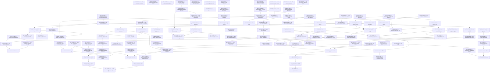

# Cross-Plan Dependency Graph

This is the forward build order for the plan phases that have not shipped yet: every node is a phase with no merged PR, every edge is a dependency one phase has on another, and the PR that merges a phase deletes its node from this graph.

## Graph

```mermaid
flowchart TD
 %% Plan-004
 n004_2["Plan-004 Phase 2 — queue admission and serialized interventions"]
 n004_3["Plan-004 Phase 3 — run-engine orchestration"]
 n004_3B["Plan-004 Phase 3B — rollback time-travel cluster"]
 n004_4["Plan-004 Phase 4 — desktop run controls"]
 %% Plan-005
 n005_3B["Plan-005 Phase 3B — provider-account seam and usage-limit signal"]
 n005_5["Plan-005 Phase 5 — MCP task-handle durability"]
 %% Plan-006
 n006_3B["Plan-006 Phase 3B — machine-authored content column"]
 n006_4["Plan-006 Phase 4 — read side, SDK, desktop stub"]
 %% Plan-007
 n007_R1["Plan-007 Phase R1 — daemon and settings namespace handlers"]
 n007_R2["Plan-007 Phase R2 — secure defaults, TLS, first-run keys"]
 n007_R3["Plan-007 Phase R3 — CLI package and daemon-status delivery"]
 n007_2B["Plan-007 Phase 2B — authenticated principal on dispatch context"]
 %% Plan-009
 n009_2B["Plan-009 Phase 2B — repo identity keying and resolution"]
 n009_3["Plan-009 Phase 3 — repo IPC namespace and SDK"]
 n009_4["Plan-009 Phase 4 — desktop repo attach UI"]
 %% Plan-010
 n010_3["Plan-010 Phase 3 — mode selection, run-setup gate, IPC"]
 n010_4["Plan-010 Phase 4 — desktop execution-mode picker"]
 %% Plan-011
 n011_1["Plan-011 Phase 1 — branch-context persistence"]
 n011_2["Plan-011 Phase 2 — diff artifact generation"]
 n011_3["Plan-011 Phase 3 — PR preparation and remote handoff"]
 n011_4["Plan-011 Phase 4 — desktop review surfaces"]
 %% Plan-012
 n012_1["Plan-012 Phase 1 — approval contracts and persistence"]
 n012_2["Plan-012 Phase 2 — daemon policy and approval services"]
 n012_3["Plan-012 Phase 3 — approval IPC, SDK, projection"]
 n012_4["Plan-012 Phase 4 — desktop approval surfaces"]
 %% Plan-013
 n013_2["Plan-013 Phase 2 — projection and replay-aware subscription"]
 n013_3["Plan-013 Phase 3 — child-run expansion and reasoning"]
 n013_4["Plan-013 Phase 4 — desktop timeline rendering"]
 %% Plan-014
 n014_1["Plan-014 Phase 1 — artifact contracts"]
 n014_2["Plan-014 Phase 2 — ingest and publication producers"]
 n014_3["Plan-014 Phase 3 — replication status, events, surfaces"]
 n014_4["Plan-014 Phase 4 — relay eager-pin upload"]
 n014_5["Plan-014 Phase 5 — authenticated relay fetch"]
 n014_6["Plan-014 Phase 6 — relay GC, quotas, backpressure"]
 n014_7["Plan-014 Phase 7 — erasure fan-out and degraded status"]
 %% Plan-015
 n015_1["Plan-015 Phase 1 — persistence schema and receipt store"]
 n015_2["Plan-015 Phase 2 — replay rebuild and recovery status"]
 n015_3["Plan-015 Phase 3 — runtime-binding recovery and resume"]
 %% Plan-016
 n016_1["Plan-016 Phase 1 — orchestration contracts and persistence"]
 n016_2["Plan-016 Phase 2 — daemon orchestration services"]
 n016_3["Plan-016 Phase 3 — orchestration wire namespace and SDK"]
 n016_3B["Plan-016 Phase 3B — sidekick definition reference"]
 n016_4["Plan-016 Phase 4 — desktop channel and child-run surfaces"]
 n016_4B["Plan-016 Phase 4B — session cost receipt"]
 %% Plan-017
 n017_1["Plan-017 Phase 1 — workflow contracts, schema, writer"]
 n017_2["Plan-017 Phase 2 — sequential execution and gate chain"]
 n017_2B["Plan-017 Phase 2B — usage-limit park and durable pacing"]
 n017_3["Plan-017 Phase 3 — multi-agent OWN channel and human phase"]
 n017_4["Plan-017 Phase 4 — parallel execution and pool admission"]
 n017_5["Plan-017 Phase 5 — resumption, CLI, authoring surfaces"]
 n017_5B["Plan-017 Phase 5B — park cancellability and operator recovery"]
 n017_5C["Plan-017 Phase 5C — always-on engine event record"]
 %% Plan-018
 n018_1["Plan-018 Phase 1 — user and presence contracts"]
 n018_2["Plan-018 Phase 2 — identity to user mapping"]
 n018_3["Plan-018 Phase 3 — presence aggregation and projection"]
 n018_4["Plan-018 Phase 4 — client surfaces and authorization"]
 n018_5["Plan-018 Phase 5 — credential seam and identity-key roster"]
 n018_6["Plan-018 Phase 6 — WebAuthn ceremony server side"]
 %% Plan-019
 n019_1["Plan-019 Phase 1 — attention contracts and trigger taxonomy"]
 n019_2["Plan-019 Phase 2 — preference storage and projections"]
 n019_3["Plan-019 Phase 3 — notification emission and delivery"]
 %% Plan-020
 n020_1["Plan-020 Phase 1 — health and recovery contracts"]
 n020_2["Plan-020 Phase 2 — daemon health projections and recovery"]
 n020_3["Plan-020 Phase 3 — Prometheus metrics exposition"]
 n020_4["Plan-020 Phase 4 — SDK and desktop recovery surfaces"]
 %% Plan-021
 n021_1["Plan-021 Phase 1 — rate-limit contracts and schema"]
 n021_2["Plan-021 Phase 2 — rate-limit backends"]
 n021_3["Plan-021 Phase 3 — enforcement wiring"]
 n021_4["Plan-021 Phase 4 — rate-limit observability and rollout"]
 %% Plan-022
 n022_1["Plan-022 Phase 1 — daemon master-key custody"]
 n022_2["Plan-022 Phase 2 — per-user crypto primitives"]
 n022_3["Plan-022 Phase 3 — write-path integration"]
 n022_4["Plan-022 Phase 4 — GDPR stub surface"]
 n022_6["Plan-022 Phase 6 — shred fan-out alignment checkpoint"]
 %% Plan-023
 n023_2["Plan-023 Phase 2 — IPC bridge registry and handlers"]
 n023_3["Plan-023 Phase 3 — daemon supervisor and crash reporter"]
 n023_4["Plan-023 Phase 4 — keystore, WebAuthn dispatcher, fallback"]
 n023_5["Plan-023 Phase 5 — auto-updater and deep-link handler"]
 n023_6["Plan-023 Phase 6 — renderer shell, router, composer"]
 n023_7["Plan-023 Phase 7 — build pipeline and release signing"]
 n023_8["Plan-023 Phase 8 — E2E suite, harness, CI gate"]
 %% Plan-024
 n024_3B["Plan-024 Phase 3B — PTY substrate hardening"]
 n024_4["Plan-024 Phase 4 — CI cross-compile matrix and signing"]
 n024_5["Plan-024 Phase 5 — publish and Windows default-flip"]
 %% Plan-026
 n026_1["Plan-026 Phase 1 — onboarding contracts and state substrate"]
 n026_2["Plan-026 Phase 2 — trust and credential primitives"]
 n026_3["Plan-026 Phase 3 — onboarding daemon service, IPC, events"]
 n026_4["Plan-026 Phase 4 — onboarding CLI surface"]
 n026_5["Plan-026 Phase 5 — onboarding desktop surface"]
 n026_6["Plan-026 Phase 6 — end-to-end option wiring"]
 n026_7["Plan-026 Phase 7 — provider authentication"]
 %% Plan-027
 n027_1["Plan-027 Phase 1 — dispatch contracts and migrations"]
 n027_2["Plan-027 Phase 2 — target-side intake and Cedar evaluation"]
 n027_3["Plan-027 Phase 3 — caller-side dispatch and outbox"]
 n027_4["Plan-027 Phase 4 — approval integration and dual-signed record"]
 n027_5["Plan-027 Phase 5 — caller-side result observation"]
 n027_6["Plan-027 Phase 6 — result buffering and desktop approval UI"]
 %% Plan-028
 n028_1["Plan-028 Phase 1 — MCP contracts and storage"]
 n028_2["Plan-028 Phase 2 — MCP inventory and status observation"]
 n028_3["Plan-028 Phase 3 — MCP configuration mutation engines"]
 n028_4["Plan-028 Phase 4 — MCP trust, overrides, Cedar gating"]
 n028_5["Plan-028 Phase 5 — MCP OAuth and client delivery"]
 %% Plan-029
 n029_2["Plan-029 Phase 2 — account registry service and authorization"]
 n029_3["Plan-029 Phase 3 — credential homes and spawn binding"]
 n029_4["Plan-029 Phase 4 — cost attribution and operator surfaces"]
 n029_4B["Plan-029 Phase 4B — per-user billing attribution"]
 %% Plan-030
 n030_1["Plan-030 Phase 1 — sidekick definition contracts and migration"]
 n030_2["Plan-030 Phase 2 — definition registry, CLI, SDK"]
 n030_3["Plan-030 Phase 3 — resolution and attach-by-reference"]
 n030_4["Plan-030 Phase 4 — peer invocation"]
 n030_5["Plan-030 Phase 5 — desktop editor and enablement control"]
 %% Plan-031
 n031_1["Plan-031 Phase 1 — the daemon as a running process"]
 n031_2["Plan-031 Phase 2 — device identity keys"]
 n031_3["Plan-031 Phase 3 — the relay"]
 n031_4["Plan-031 Phase 4 — method proxy and terminal streaming"]
 n031_5["Plan-031 Phase 5 — device registration and revocation"]
 n031_6["Plan-031 Phase 6 — per-device event attestation"]
 n031_7["Plan-031 Phase 7 — Remote Control frontend"]
 n004_2 --> n004_3
 n004_3 --> n004_4
 n004_3 --> n010_3
 n004_3 --> n028_4
 n004_3B --> n013_2
 n004_4 --> n004_3B
 n005_3B --> n029_3
 n007_R1 --> n007_R2
 n007_R2 --> n007_R3
 n007_R2 --> n022_1
 n007_R3 --> n004_3B
 n007_R3 --> n023_2
 n007_R3 --> n030_2
 n009_3 --> n009_4
 n010_3 --> n004_3B
 n010_3 --> n009_2B
 n010_3 --> n010_4
 n011_1 --> n011_2
 n011_1 --> n011_3
 n011_2 --> n011_4
 n011_3 --> n011_4
 n012_1 --> n012_2
 n012_2 --> n012_3
 n012_2 --> n028_4
 n012_2 --> n029_2
 n012_2 --> n030_2
 n012_3 --> n012_4
 n012_4 --> n027_1
 n013_2 --> n013_4
 n013_2 --> n019_2
 n013_3 --> n013_4
 n013_4 --> n019_3
 n014_1 --> n014_2
 n014_2 --> n011_2
 n014_2 --> n014_3
 n014_3 --> n014_4
 n014_4 --> n014_5
 n014_5 --> n014_6
 n014_6 --> n014_7
 n015_1 --> n015_2
 n015_2 --> n015_3
 n015_3 --> n027_3
 n016_1 --> n016_2
 n016_1 --> n030_1
 n016_2 --> n016_3
 n016_3 --> n016_4
 n016_3 --> n030_3
 n016_4 --> n016_4B
 n016_4B --> n027_2
 n016_4B --> n030_4
 n017_1 --> n017_2
 n017_2 --> n017_2B
 n017_2 --> n017_3
 n017_2B --> n017_5B
 n017_2B --> n017_5C
 n017_3 --> n017_4
 n017_4 --> n017_5
 n017_5 --> n017_5B
 n018_1 --> n018_2
 n018_2 --> n018_3
 n018_2 --> n018_6
 n018_3 --> n018_4
 n018_4 --> n018_5
 n018_5 --> n014_4
 n018_6 --> n023_4
 n018_6 --> n027_2
 n019_1 --> n019_2
 n019_2 --> n019_3
 n020_1 --> n020_2
 n020_2 --> n020_3
 n020_3 --> n020_4
 n021_1 --> n021_2
 n021_2 --> n021_3
 n021_3 --> n021_4
 n022_1 --> n022_2
 n022_2 --> n022_3
 n022_3 --> n022_4
 n022_4 --> n022_6
 n023_2 --> n023_3
 n023_3 --> n023_4
 n023_4 --> n023_5
 n023_5 --> n023_6
 n023_6 --> n023_7
 n023_6 --> n030_5
 n023_7 --> n023_8
 n023_8 --> n027_6
 n024_3B --> n024_5
 n024_4 --> n024_5
 n026_1 --> n026_2
 n026_2 --> n026_3
 n026_3 --> n026_4
 n026_3 --> n026_5
 n026_4 --> n026_6
 n026_4 --> n026_7
 n026_5 --> n026_6
 n026_5 --> n026_7
 n027_1 --> n027_2
 n027_2 --> n027_3
 n027_2 --> n027_4
 n027_3 --> n027_5
 n027_4 --> n027_5
 n027_5 --> n027_6
 n028_1 --> n028_2
 n028_1 --> n028_3
 n028_2 --> n028_4
 n028_3 --> n028_4
 n028_4 --> n028_5
 n029_2 --> n029_3
 n029_2 --> n030_3
 n029_3 --> n026_7
 n029_3 --> n029_4
 n029_3 --> n029_4B
 n030_1 --> n030_2
 n030_2 --> n030_3
 n030_3 --> n016_3B
 n030_3 --> n030_4
 n030_4 --> n030_5
 n031_1 --> n031_2
 n031_2 --> n031_3
 n031_2 --> n031_5
 n031_3 --> n014_4
 n031_3 --> n027_2
 n031_3 --> n031_4
 n031_4 --> n031_7
 n031_5 --> n031_6
 n031_6 --> n031_7
```

## Dispatch groups

Every phase in a group can be built in parallel; a group opens once the phases it waits on have merged.

| Group | Phase | Builds | Waits on |
| --- | --- | --- | --- |
| 1 | [Plan-004 Phase 2](../plans/004-queue-steer-pause-resume.md) | queue admission and serialized interventions. | — |
|  | [Plan-005 Phase 3B](../plans/005-provider-driver-contract-and-capabilities.md) | provider-account seam and usage-limit signal. | — |
|  | [Plan-005 Phase 5](../plans/005-provider-driver-contract-and-capabilities.md) | MCP task-handle durability. | — |
|  | [Plan-006 Phase 3B](../plans/006-session-event-taxonomy-and-audit-log.md) | machine-authored content column. | — |
|  | [Plan-006 Phase 4](../plans/006-session-event-taxonomy-and-audit-log.md) | read side, SDK, desktop stub. | — |
|  | [Plan-007 Phase R1](../plans/007-local-ipc-and-daemon-control.md) | daemon and settings namespace handlers. | — |
|  | [Plan-007 Phase 2B](../plans/007-local-ipc-and-daemon-control.md) | authenticated principal on dispatch context. | — |
|  | [Plan-009 Phase 3](../plans/009-repo-attachment-and-workspace-binding.md) | repo IPC namespace and SDK. | — |
|  | [Plan-011 Phase 1](../plans/011-gitflow-pr-and-diff-attribution.md) | branch-context persistence. | — |
|  | [Plan-012 Phase 1](../plans/012-approvals-permissions-and-trust-boundaries.md) | approval contracts and persistence. | — |
|  | [Plan-013 Phase 3](../plans/013-live-timeline-visibility-and-reasoning-surfaces.md) | child-run expansion and reasoning. | — |
|  | [Plan-014 Phase 1](../plans/014-artifacts-files-and-attachments.md) | artifact contracts. | — |
|  | [Plan-015 Phase 1](../plans/015-persistence-recovery-and-replay.md) | persistence schema and receipt store. | — |
|  | [Plan-016 Phase 1](../plans/016-multi-agent-channels-and-orchestration.md) | orchestration contracts and persistence. | — |
|  | [Plan-017 Phase 1](../plans/017-workflow-authoring-and-execution.md) | workflow contracts, schema, writer. | — |
|  | [Plan-018 Phase 1](../plans/018-identity-and-user-state.md) | user and presence contracts. | — |
|  | [Plan-019 Phase 1](../plans/019-notifications-and-attention-model.md) | attention contracts and trigger taxonomy. | — |
|  | [Plan-020 Phase 1](../plans/020-observability-and-failure-recovery.md) | health and recovery contracts. | — |
|  | [Plan-021 Phase 1](../plans/021-rate-limiting-policy.md) | rate-limit contracts and schema. | — |
|  | [Plan-024 Phase 3B](../plans/024-rust-pty-sidecar.md) | PTY substrate hardening. | — |
|  | [Plan-024 Phase 4](../plans/024-rust-pty-sidecar.md) | CI cross-compile matrix and signing. Waits on the code-signing credentials tracked as BL-108. | — |
|  | [Plan-026 Phase 1](../plans/026-first-run-onboarding.md) | onboarding contracts and state substrate. | — |
|  | [Plan-028 Phase 1](../plans/028-mcp-server-configuration-and-governance.md) | MCP contracts and storage. | — |
|  | [Plan-031 Phase 1](../plans/031-remote-control.md) | the daemon as a running process. | — |
| 2 | [Plan-004 Phase 3](../plans/004-queue-steer-pause-resume.md) | run-engine orchestration. | Plan-004 Phase 2 |
|  | [Plan-007 Phase R2](../plans/007-local-ipc-and-daemon-control.md) | secure defaults, TLS, first-run keys. | Plan-007 Phase R1 |
|  | [Plan-009 Phase 4](../plans/009-repo-attachment-and-workspace-binding.md) | desktop repo attach UI. | Plan-009 Phase 3 |
|  | [Plan-011 Phase 3](../plans/011-gitflow-pr-and-diff-attribution.md) | PR preparation and remote handoff. | Plan-011 Phase 1 |
|  | [Plan-012 Phase 2](../plans/012-approvals-permissions-and-trust-boundaries.md) | daemon policy and approval services. | Plan-012 Phase 1 |
|  | [Plan-014 Phase 2](../plans/014-artifacts-files-and-attachments.md) | ingest and publication producers. | Plan-014 Phase 1 |
|  | [Plan-015 Phase 2](../plans/015-persistence-recovery-and-replay.md) | replay rebuild and recovery status. | Plan-015 Phase 1 |
|  | [Plan-016 Phase 2](../plans/016-multi-agent-channels-and-orchestration.md) | daemon orchestration services. | Plan-016 Phase 1 |
|  | [Plan-017 Phase 2](../plans/017-workflow-authoring-and-execution.md) | sequential execution and gate chain. | Plan-017 Phase 1 |
|  | [Plan-018 Phase 2](../plans/018-identity-and-user-state.md) | identity to user mapping. | Plan-018 Phase 1 |
|  | [Plan-020 Phase 2](../plans/020-observability-and-failure-recovery.md) | daemon health projections and recovery. | Plan-020 Phase 1 |
|  | [Plan-021 Phase 2](../plans/021-rate-limiting-policy.md) | rate-limit backends. | Plan-021 Phase 1 |
|  | [Plan-024 Phase 5](../plans/024-rust-pty-sidecar.md) | publish and Windows default-flip. | Plan-024 Phase 3B, Plan-024 Phase 4 |
|  | [Plan-026 Phase 2](../plans/026-first-run-onboarding.md) | trust and credential primitives. | Plan-026 Phase 1 |
|  | [Plan-028 Phase 2](../plans/028-mcp-server-configuration-and-governance.md) | MCP inventory and status observation. | Plan-028 Phase 1 |
|  | [Plan-028 Phase 3](../plans/028-mcp-server-configuration-and-governance.md) | MCP configuration mutation engines. | Plan-028 Phase 1 |
|  | [Plan-030 Phase 1](../plans/030-sidekick-definitions-and-peer-invocation.md) | sidekick definition contracts and migration. | Plan-016 Phase 1 |
|  | [Plan-031 Phase 2](../plans/031-remote-control.md) | device identity keys. | Plan-031 Phase 1 |
| 3 | [Plan-004 Phase 4](../plans/004-queue-steer-pause-resume.md) | desktop run controls. | Plan-004 Phase 3 |
|  | [Plan-007 Phase R3](../plans/007-local-ipc-and-daemon-control.md) | CLI package and daemon-status delivery. | Plan-007 Phase R2 |
|  | [Plan-010 Phase 3](../plans/010-worktree-lifecycle-and-execution-modes.md) | mode selection, run-setup gate, IPC. | Plan-004 Phase 3 |
|  | [Plan-011 Phase 2](../plans/011-gitflow-pr-and-diff-attribution.md) | diff artifact generation. | Plan-011 Phase 1, Plan-014 Phase 2 |
|  | [Plan-012 Phase 3](../plans/012-approvals-permissions-and-trust-boundaries.md) | approval IPC, SDK, projection. | Plan-012 Phase 2 |
|  | [Plan-014 Phase 3](../plans/014-artifacts-files-and-attachments.md) | replication status, events, surfaces. | Plan-014 Phase 2 |
|  | [Plan-015 Phase 3](../plans/015-persistence-recovery-and-replay.md) | runtime-binding recovery and resume. | Plan-015 Phase 2 |
|  | [Plan-016 Phase 3](../plans/016-multi-agent-channels-and-orchestration.md) | orchestration wire namespace and SDK. | Plan-016 Phase 2 |
|  | [Plan-017 Phase 2B](../plans/017-workflow-authoring-and-execution.md) | usage-limit park and durable pacing. | Plan-017 Phase 2 |
|  | [Plan-017 Phase 3](../plans/017-workflow-authoring-and-execution.md) | multi-agent OWN channel and human phase. | Plan-017 Phase 2 |
|  | [Plan-018 Phase 3](../plans/018-identity-and-user-state.md) | presence aggregation and projection. | Plan-018 Phase 2 |
|  | [Plan-018 Phase 6](../plans/018-identity-and-user-state.md) | WebAuthn ceremony server side. | Plan-018 Phase 2 |
|  | [Plan-020 Phase 3](../plans/020-observability-and-failure-recovery.md) | Prometheus metrics exposition. | Plan-020 Phase 2 |
|  | [Plan-021 Phase 3](../plans/021-rate-limiting-policy.md) | enforcement wiring. | Plan-021 Phase 2 |
|  | [Plan-022 Phase 1](../plans/022-data-retention-and-gdpr.md) | daemon master-key custody. | Plan-007 Phase R2 |
|  | [Plan-026 Phase 3](../plans/026-first-run-onboarding.md) | onboarding daemon service, IPC, events. | Plan-026 Phase 2 |
|  | [Plan-028 Phase 4](../plans/028-mcp-server-configuration-and-governance.md) | MCP trust, overrides, Cedar gating. | Plan-004 Phase 3, Plan-012 Phase 2, Plan-028 Phase 2, Plan-028 Phase 3 |
|  | [Plan-029 Phase 2](../plans/029-provider-accounts-and-credential-homes.md) | account registry service and authorization. | Plan-012 Phase 2 |
|  | [Plan-031 Phase 3](../plans/031-remote-control.md) | the relay. | Plan-031 Phase 2 |
|  | [Plan-031 Phase 5](../plans/031-remote-control.md) | device registration and revocation. | Plan-031 Phase 2 |
| 4 | [Plan-004 Phase 3B](../plans/004-queue-steer-pause-resume.md) | rollback time-travel cluster. | Plan-004 Phase 4, Plan-007 Phase R3, Plan-010 Phase 3 |
|  | [Plan-009 Phase 2B](../plans/009-repo-attachment-and-workspace-binding.md) | repo identity keying and resolution. | Plan-010 Phase 3 |
|  | [Plan-010 Phase 4](../plans/010-worktree-lifecycle-and-execution-modes.md) | desktop execution-mode picker. | Plan-010 Phase 3 |
|  | [Plan-011 Phase 4](../plans/011-gitflow-pr-and-diff-attribution.md) | desktop review surfaces. | Plan-011 Phase 2, Plan-011 Phase 3 |
|  | [Plan-012 Phase 4](../plans/012-approvals-permissions-and-trust-boundaries.md) | desktop approval surfaces. | Plan-012 Phase 3 |
|  | [Plan-016 Phase 4](../plans/016-multi-agent-channels-and-orchestration.md) | desktop channel and child-run surfaces. | Plan-016 Phase 3 |
|  | [Plan-017 Phase 4](../plans/017-workflow-authoring-and-execution.md) | parallel execution and pool admission. | Plan-017 Phase 3 |
|  | [Plan-017 Phase 5C](../plans/017-workflow-authoring-and-execution.md) | always-on engine event record. | Plan-017 Phase 2B |
|  | [Plan-018 Phase 4](../plans/018-identity-and-user-state.md) | client surfaces and authorization. | Plan-018 Phase 3 |
|  | [Plan-020 Phase 4](../plans/020-observability-and-failure-recovery.md) | SDK and desktop recovery surfaces. | Plan-020 Phase 3 |
|  | [Plan-021 Phase 4](../plans/021-rate-limiting-policy.md) | rate-limit observability and rollout. | Plan-021 Phase 3 |
|  | [Plan-022 Phase 2](../plans/022-data-retention-and-gdpr.md) | per-user crypto primitives. | Plan-022 Phase 1 |
|  | [Plan-023 Phase 2](../plans/023-desktop-shell-and-renderer.md) | IPC bridge registry and handlers. | Plan-007 Phase R3 |
|  | [Plan-026 Phase 4](../plans/026-first-run-onboarding.md) | onboarding CLI surface. | Plan-026 Phase 3 |
|  | [Plan-026 Phase 5](../plans/026-first-run-onboarding.md) | onboarding desktop surface. | Plan-026 Phase 3 |
|  | [Plan-028 Phase 5](../plans/028-mcp-server-configuration-and-governance.md) | MCP OAuth and client delivery. | Plan-028 Phase 4 |
|  | [Plan-029 Phase 3](../plans/029-provider-accounts-and-credential-homes.md) | credential homes and spawn binding. | Plan-005 Phase 3B, Plan-029 Phase 2 |
|  | [Plan-030 Phase 2](../plans/030-sidekick-definitions-and-peer-invocation.md) | definition registry, CLI, SDK. | Plan-007 Phase R3, Plan-012 Phase 2, Plan-030 Phase 1 |
|  | [Plan-031 Phase 4](../plans/031-remote-control.md) | method proxy and terminal streaming. | Plan-031 Phase 3 |
|  | [Plan-031 Phase 6](../plans/031-remote-control.md) | per-device event attestation. | Plan-031 Phase 5 |
| 5 | [Plan-013 Phase 2](../plans/013-live-timeline-visibility-and-reasoning-surfaces.md) | projection and replay-aware subscription. | Plan-004 Phase 3B |
|  | [Plan-016 Phase 4B](../plans/016-multi-agent-channels-and-orchestration.md) | session cost receipt. | Plan-016 Phase 4 |
|  | [Plan-017 Phase 5](../plans/017-workflow-authoring-and-execution.md) | resumption, CLI, authoring surfaces. | Plan-017 Phase 4 |
|  | [Plan-018 Phase 5](../plans/018-identity-and-user-state.md) | credential seam and identity-key roster. | Plan-018 Phase 4 |
|  | [Plan-022 Phase 3](../plans/022-data-retention-and-gdpr.md) | write-path integration. | Plan-022 Phase 2 |
|  | [Plan-023 Phase 3](../plans/023-desktop-shell-and-renderer.md) | daemon supervisor and crash reporter. | Plan-023 Phase 2 |
|  | [Plan-026 Phase 6](../plans/026-first-run-onboarding.md) | end-to-end option wiring. | Plan-026 Phase 4, Plan-026 Phase 5 |
|  | [Plan-026 Phase 7](../plans/026-first-run-onboarding.md) | provider authentication. | Plan-026 Phase 4, Plan-026 Phase 5, Plan-029 Phase 3 |
|  | [Plan-027 Phase 1](../plans/027-cross-node-dispatch-and-approval.md) | dispatch contracts and migrations. | Plan-012 Phase 4 |
|  | [Plan-029 Phase 4](../plans/029-provider-accounts-and-credential-homes.md) | cost attribution and operator surfaces. | Plan-029 Phase 3 |
|  | [Plan-029 Phase 4B](../plans/029-provider-accounts-and-credential-homes.md) | per-user billing attribution. | Plan-029 Phase 3 |
|  | [Plan-030 Phase 3](../plans/030-sidekick-definitions-and-peer-invocation.md) | resolution and attach-by-reference. | Plan-016 Phase 3, Plan-029 Phase 2, Plan-030 Phase 2 |
|  | [Plan-031 Phase 7](../plans/031-remote-control.md) | Remote Control frontend. | Plan-031 Phase 4, Plan-031 Phase 6 |
| 6 | [Plan-013 Phase 4](../plans/013-live-timeline-visibility-and-reasoning-surfaces.md) | desktop timeline rendering. | Plan-013 Phase 2, Plan-013 Phase 3 |
|  | [Plan-014 Phase 4](../plans/014-artifacts-files-and-attachments.md) | relay eager-pin upload. | Plan-014 Phase 3, Plan-018 Phase 5, Plan-031 Phase 3 |
|  | [Plan-016 Phase 3B](../plans/016-multi-agent-channels-and-orchestration.md) | sidekick definition reference. | Plan-030 Phase 3 |
|  | [Plan-017 Phase 5B](../plans/017-workflow-authoring-and-execution.md) | park cancellability and operator recovery. | Plan-017 Phase 2B, Plan-017 Phase 5 |
|  | [Plan-019 Phase 2](../plans/019-notifications-and-attention-model.md) | preference storage and projections. | Plan-013 Phase 2, Plan-019 Phase 1 |
|  | [Plan-022 Phase 4](../plans/022-data-retention-and-gdpr.md) | GDPR stub surface. | Plan-022 Phase 3 |
|  | [Plan-023 Phase 4](../plans/023-desktop-shell-and-renderer.md) | keystore, WebAuthn dispatcher, fallback. | Plan-018 Phase 6, Plan-023 Phase 3 |
|  | [Plan-027 Phase 2](../plans/027-cross-node-dispatch-and-approval.md) | target-side intake and Cedar evaluation. | Plan-016 Phase 4B, Plan-018 Phase 6, Plan-027 Phase 1, Plan-031 Phase 3 |
|  | [Plan-030 Phase 4](../plans/030-sidekick-definitions-and-peer-invocation.md) | peer invocation. | Plan-016 Phase 4B, Plan-030 Phase 3 |
| 7 | [Plan-014 Phase 5](../plans/014-artifacts-files-and-attachments.md) | authenticated relay fetch. | Plan-014 Phase 4 |
|  | [Plan-019 Phase 3](../plans/019-notifications-and-attention-model.md) | notification emission and delivery. | Plan-013 Phase 4, Plan-019 Phase 2 |
|  | [Plan-022 Phase 6](../plans/022-data-retention-and-gdpr.md) | shred fan-out alignment checkpoint. | Plan-022 Phase 4 |
|  | [Plan-023 Phase 5](../plans/023-desktop-shell-and-renderer.md) | auto-updater and deep-link handler. | Plan-023 Phase 4 |
|  | [Plan-027 Phase 3](../plans/027-cross-node-dispatch-and-approval.md) | caller-side dispatch and outbox. | Plan-015 Phase 3, Plan-027 Phase 2 |
|  | [Plan-027 Phase 4](../plans/027-cross-node-dispatch-and-approval.md) | approval integration and dual-signed record. | Plan-027 Phase 2 |
| 8 | [Plan-014 Phase 6](../plans/014-artifacts-files-and-attachments.md) | relay GC, quotas, backpressure. | Plan-014 Phase 5 |
|  | [Plan-023 Phase 6](../plans/023-desktop-shell-and-renderer.md) | renderer shell, router, composer. | Plan-023 Phase 5 |
|  | [Plan-027 Phase 5](../plans/027-cross-node-dispatch-and-approval.md) | caller-side result observation. | Plan-027 Phase 3, Plan-027 Phase 4 |
| 9 | [Plan-014 Phase 7](../plans/014-artifacts-files-and-attachments.md) | erasure fan-out and degraded status. | Plan-014 Phase 6 |
|  | [Plan-023 Phase 7](../plans/023-desktop-shell-and-renderer.md) | build pipeline and release signing. | Plan-023 Phase 6 |
|  | [Plan-030 Phase 5](../plans/030-sidekick-definitions-and-peer-invocation.md) | desktop editor and enablement control. | Plan-023 Phase 6, Plan-030 Phase 4 |
| 10 | [Plan-023 Phase 8](../plans/023-desktop-shell-and-renderer.md) | E2E suite, harness, CI gate. | Plan-023 Phase 7 |
| 11 | [Plan-027 Phase 6](../plans/027-cross-node-dispatch-and-approval.md) | result buffering and desktop approval UI. | Plan-023 Phase 8, Plan-027 Phase 5 |
