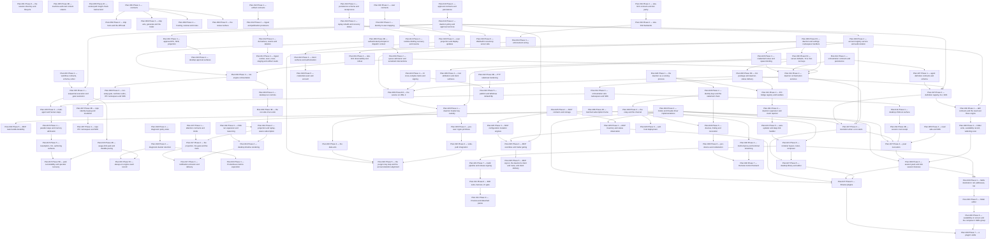

# Cross-Plan Dependency Graph

This is the forward build order for the plan phases that have not shipped yet: every node is a phase with tasks still to build, every edge is a dependency one phase has on another, and the PR that finishes a phase deletes its node from this graph.

## Graph

```mermaid
flowchart TD
 %% Plan-001
 n002_6["Plan-001 Phase 6 — the session directory and lifecycle"]
 %% Plan-003
 n004_2["Plan-003 Phase 2 — queue admission and serialized interventions"]
 n004_3["Plan-003 Phase 3 — run-engine orchestration"]
 n004_3B["Plan-003 Phase 3B — the run side of an undo"]
 n004_4["Plan-003 Phase 4 — desktop run controls"]
 %% Plan-004
 n005_3["Plan-004 Phase 3 — Codex and Claude driver implementations"]
 n005_5["Plan-004 Phase 5 — MCP task-handle durability"]
 %% Plan-005
 n006_3B["Plan-005 Phase 3B — machine-authored content column"]
 n006_4["Plan-005 Phase 4 — read side and SDK"]
 %% Plan-006
 n007_R1["Plan-006 Phase R1 — daemon and settings namespace handlers"]
 n007_R2["Plan-006 Phase R2 — secure defaults, TLS, first-run keys"]
 n007_R3["Plan-006 Phase R3 — CLI package and daemon-status delivery"]
 n007_2B["Plan-006 Phase 2B — authenticated principal on dispatch context"]
 n007_2C["Plan-006 Phase 2C — socket path length check before bind"]
 n007_2D["Plan-006 Phase 2D — batched subscription frame"]
 n007_R4["Plan-006 Phase R4 — the service on WSL 2"]
 %% Plan-007
 n009_2B["Plan-007 Phase 2B — repo identity keying and resolution"]
 n009_3["Plan-007 Phase 3 — repo IPC namespace and SDK"]
 %% Plan-008
 n010_3["Plan-008 Phase 3 — run-setup gate, worktree verbs, IPC namespace and SDK"]
 %% Plan-009
 n011_1["Plan-009 Phase 1 — contracts"]
 n011_2["Plan-009 Phase 2 — ship facts and the diff read"]
 n011_3["Plan-009 Phase 3 — ship acts, generate and the trailer"]
 n011_4["Plan-009 Phase 4 — hosting, reviews and notes"]
 n011_5["Plan-009 Phase 5 — the review surface"]
 %% Plan-010
 n012_1["Plan-010 Phase 1 — approval contracts and persistence"]
 n012_2["Plan-010 Phase 2 — daemon policy and approval services"]
 n012_3["Plan-010 Phase 3 — approval IPC, SDK, projection"]
 n012_4["Plan-010 Phase 4 — desktop approval surfaces"]
 %% Plan-011
 n013_2["Plan-011 Phase 2 — projection and replay-aware subscription"]
 n013_3["Plan-011 Phase 3 — child-run expansion and reasoning"]
 n013_4["Plan-011 Phase 4 — desktop timeline rendering"]
 %% Plan-012
 n014_1["Plan-012 Phase 1 — artifact contracts"]
 n014_2["Plan-012 Phase 2 — ingest and publication producers"]
 n014_3["Plan-012 Phase 3 — derivatives, events and deletion"]
 n014_4["Plan-012 Phase 4 — ingest worker, scan, cover, staging and artifact reads"]
 %% Plan-013
 n015_1["Plan-013 Phase 1 — persistence schema and receipt store"]
 n015_2["Plan-013 Phase 2 — replay rebuild and recovery status"]
 n015_3["Plan-013 Phase 3 — runtime-binding recovery and resume"]
 %% Plan-014
 n016_1["Plan-014 Phase 1 — orchestration contracts and persistence"]
 n016_2["Plan-014 Phase 2 — daemon orchestration services"]
 n016_3["Plan-014 Phase 3 — orchestration wire namespace and SDK"]
 n016_4["Plan-014 Phase 4 — desktop child-run surface"]
 n016_4B["Plan-014 Phase 4B — session cost receipt"]
 %% Plan-015
 n017_1["Plan-015 Phase 1 — workflow contracts, schema, writer"]
 n017_2["Plan-015 Phase 2 — sequential execution and gate resolution"]
 n017_2B["Plan-015 Phase 2B — usage-limit park and durable pacing"]
 n017_3["Plan-015 Phase 3 — multi-agent and human steps"]
 n017_4["Plan-015 Phase 4 — parallel steps and memory admission"]
 n017_5["Plan-015 Phase 5 — resumption, CLI, authoring surfaces"]
 n017_5B["Plan-015 Phase 5B — park cancelability and operator recovery"]
 n017_5C["Plan-015 Phase 5C — always-on engine event record"]
 %% Plan-016
 n018_1["Plan-016 Phase 1 — user contracts"]
 n018_2["Plan-016 Phase 2 — identity to user mapping"]
 n018_3["Plan-016 Phase 3 — user projection and display updates"]
 n018_4["Plan-016 Phase 4 — client surfaces and authorization"]
 n018_5["Plan-016 Phase 5 — credential seam and account"]
 n018_6["Plan-016 Phase 6 — WebAuthn ceremony server side"]
 %% Plan-017
 n019_1["Plan-017 Phase 1 — attention contracts and kinds"]
 n019_2["Plan-017 Phase 2 — the projection, the gate and the mute"]
 n019_3["Plan-017 Phase 3 — notification emission and delivery"]
 %% Plan-018
 n020_1["Plan-018 Phase 1 — diagnostic policy state"]
 n020_2["Plan-018 Phase 2 — diagnostic-bucket retention"]
 n020_3["Plan-018 Phase 3 — Prometheus metrics exposition"]
 %% Plan-019
 n021_1["Plan-019 Phase 1 — rate-limit contracts and doc parity"]
 n021_2["Plan-019 Phase 2 — rate-limit backends"]
 n021_3["Plan-019 Phase 3 — enforcement wiring"]
 n021_4["Plan-019 Phase 4 — rate-limit observability and rollout"]
 %% Plan-020
 n022_1["Plan-020 Phase 1 — daemon master-key custody"]
 n022_2["Plan-020 Phase 2 — per-user crypto primitives"]
 n022_3["Plan-020 Phase 3 — write-path integration"]
 n022_4["Plan-020 Phase 4 — the data acts"]
 n022_5["Plan-020 Phase 5 — the purge's key step and the account-deletion alignment"]
 %% Plan-021
 n023_2["Plan-021 Phase 2 — IPC bridge registry and handlers"]
 n023_3["Plan-021 Phase 3 — daemon supervisor and crash reporter"]
 n023_5["Plan-021 Phase 5 — auto-updater and deep-link handler"]
 n023_6["Plan-021 Phase 6 — renderer layout, router, composer"]
 n023_7["Plan-021 Phase 7 — build pipeline and release signing"]
 n023_8["Plan-021 Phase 8 — E2E suite, harness, CI gate"]
 n023_9["Plan-021 Phase 9 — Preview and detached panes"]
 %% Plan-022
 n024_3B["Plan-022 Phase 3B — PTY substrate hardening"]
 n024_4["Plan-022 Phase 4 — CI cross-compile matrix and signing"]
 n024_5["Plan-022 Phase 5 — publish and Windows default-flip"]
 %% Plan-025
 n028_1["Plan-025 Phase 1 — MCP contracts and storage"]
 n028_2["Plan-025 Phase 2 — MCP inventory and status observation"]
 n028_3["Plan-025 Phase 3 — MCP configuration mutation engines"]
 n028_4["Plan-025 Phase 4 — MCP overrides and Cedar gating"]
 n028_5["Plan-025 Phase 5 — MCP sign-in, the daemon's client and route, and client delivery"]
 %% Plan-026
 n029_2["Plan-026 Phase 2 — account registry service and authorization"]
 n029_3["Plan-026 Phase 3 — credential homes and spawn binding"]
 n029_4["Plan-026 Phase 4 — cost attribution and client surfaces"]
 %% Plan-027
 n030_1["Plan-027 Phase 1 — agent definition contracts and schema"]
 n030_2["Plan-027 Phase 2 — definition registry, CLI, SDK"]
 n030_3["Plan-027 Phase 3 — resolution when a run starts"]
 n030_4["Plan-027 Phase 4 — peer invocation"]
 n030_5["Plan-027 Phase 5 — desktop library and editor"]
 n030_6["Plan-027 Phase 6 — Browse plugins"]
 %% Plan-028
 n031_1["Plan-028 Phase 1 — the daemon as a running process"]
 n031_2["Plan-028 Phase 2 — identity keys and the statement chain"]
 n031_3["Plan-028 Phase 3 — the relay and the channel"]
 n031_4["Plan-028 Phase 4 — method proxy and terminal streaming"]
 n031_5["Plan-028 Phase 5 — devices, linking and revocation"]
 n031_6["Plan-028 Phase 6 — per-device event attestation"]
 n031_7["Plan-028 Phase 7 — Remote Control frontend"]
 n031_8["Plan-028 Phase 8 — self-host deployment"]
 %% Plan-030
 n033_1["Plan-030 Phase 1 — skill contracts and the read over three origins"]
 n033_2["Plan-030 Phase 2 — folder write, availability record, widening scan"]
 n033_3["Plan-030 Phase 3 — session pack and mid-session liveness"]
 n033_4["Plan-030 Phase 4 — Skills destination: rail, addresses, list"]
 n033_5["Plan-030 Phase 5 — folder editor"]
 n033_6["Plan-030 Phase 6 — availability on screen and the composer's Skills group"]
 n033_7["Plan-030 Phase 7 — a plugin's skills"]
 n004_2 --> n004_3
 n004_2 --> n016_2
 n004_3 --> n004_4
 n004_3 --> n010_3
 n004_3B --> n013_2
 n004_4 --> n004_3B
 n006_4 --> n030_4
 n007_R1 --> n007_R2
 n007_2D --> n013_2
 n007_R1 --> n016_2
 n007_2D --> n023_6
 n007_R2 --> n007_R3
 n007_R2 --> n022_1
 n007_R3 --> n023_2
 n007_R3 --> n030_2
 n007_R3 --> n007_R4
 n010_3 --> n009_2B
 n011_1 --> n011_2
 n011_1 --> n011_3
 n011_1 --> n011_4
 n011_1 --> n011_5
 n012_1 --> n012_2
 n012_2 --> n012_3
 n012_2 --> n028_4
 n012_2 --> n029_2
 n012_2 --> n030_2
 n012_2 --> n017_2
 n012_3 --> n012_4
 n013_2 --> n013_4
 n013_2 --> n019_2
 n013_3 --> n013_4
 n013_4 --> n019_3
 n014_1 --> n014_2
 n014_2 --> n014_3
 n014_3 --> n014_4
 n015_1 --> n015_2
 n015_2 --> n015_3
 n016_1 --> n016_2
 n016_1 --> n030_1
 n016_2 --> n016_3
 n016_2 --> n030_3
 n016_3 --> n016_4
 n016_3 --> n017_3
 n016_4 --> n016_4B
 n016_4B --> n030_4
 n017_1 --> n017_2
 n017_2 --> n017_2B
 n017_2 --> n017_3
 n017_2B --> n017_5B
 n017_2B --> n017_5C
 n017_3 --> n017_4
 n017_4 --> n017_5
 n017_5 --> n017_5B
 n018_1 --> n018_2
 n018_2 --> n018_3
 n018_2 --> n018_6
 n018_3 --> n018_4
 n018_4 --> n018_5
 n019_1 --> n019_2
 n019_2 --> n019_3
 n020_1 --> n020_2
 n020_2 --> n020_3
 n020_2 --> n017_5C
 n021_1 --> n021_2
 n021_2 --> n021_3
 n021_3 --> n021_4
 n022_1 --> n022_2
 n022_2 --> n022_3
 n022_1 --> n022_4
 n022_3 --> n022_5
 n022_4 --> n022_5
 n007_R1 --> n022_5
 n023_2 --> n023_3
 n023_3 --> n023_5
 n023_5 --> n023_6
 n023_6 --> n023_7
 n023_6 --> n030_5
 n023_7 --> n023_8
 n023_8 --> n023_9
 n024_3B --> n024_5
 n024_4 --> n024_5
 n024_4 --> n007_R4
 n028_1 --> n028_2
 n028_1 --> n028_3
 n028_2 --> n028_4
 n028_3 --> n028_4
 n028_4 --> n028_5
 n029_2 --> n029_3
 n029_2 --> n030_3
 n029_3 --> n029_4
 n029_3 --> n016_2
 n030_1 --> n030_2
 n030_2 --> n030_3
 n030_3 --> n030_4
 n030_3 --> n030_5
 n031_1 --> n031_2
 n031_1 --> n023_2
 n031_2 --> n031_3
 n031_2 --> n031_5
 n031_3 --> n031_4
 n031_3 --> n031_5
 n031_3 --> n031_8
 n031_4 --> n031_7
 n031_5 --> n031_6
 n031_6 --> n031_7
 n007_R1 --> n033_1
 n007_R1 --> n007_R4
 n033_1 --> n033_2
 n033_2 --> n033_3
 n033_3 --> n033_4
 n023_6 --> n033_4
 n033_4 --> n033_5
 n033_5 --> n033_6
 n030_2 --> n033_1
 n030_4 --> n033_3
 n030_5 --> n030_6
 n033_3 --> n030_6
 n028_2 --> n030_6
 n033_6 --> n033_7
 n030_6 --> n033_7
 n009_2B --> n009_3
 n007_2B --> n004_2
 n007_2B --> n004_3
 n007_R4 --> n022_1
 n005_3 --> n005_5
 n005_3 --> n028_2
 n005_3 --> n030_3
 n005_3 --> n030_4
 n005_3 --> n030_6
 n005_3 --> n033_3
```

## Dispatch groups

Every phase in a group can be built in parallel; a group opens once the phases it waits on have merged.

| Group | Phase | Builds | Waits on |
| --- | --- | --- | --- |
| 1 | [Plan-004 Phase 3](../plans/004-provider-driver-contract-and-capabilities.md) | Codex and Claude driver implementations. | — |
|  | [Plan-005 Phase 3B](../plans/005-session-event-taxonomy-and-audit-log.md) | machine-authored content column. | — |
|  | [Plan-005 Phase 4](../plans/005-session-event-taxonomy-and-audit-log.md) | read side and SDK. | — |
|  | [Plan-006 Phase R1](../plans/006-local-ipc-and-daemon-control.md) | daemon and settings namespace handlers. | — |
|  | [Plan-006 Phase 2B](../plans/006-local-ipc-and-daemon-control.md) | authenticated principal on dispatch context. | — |
|  | [Plan-009 Phase 1](../plans/009-gitflow-pr-and-diff-attribution.md) | contracts. | — |
|  | [Plan-010 Phase 1](../plans/010-approvals-permissions-and-trust-boundaries.md) | approval contracts and persistence. | — |
|  | [Plan-011 Phase 3](../plans/011-live-timeline-visibility-and-reasoning-surfaces.md) | child-run expansion and reasoning. | — |
|  | [Plan-012 Phase 1](../plans/012-artifacts-files-and-attachments.md) | artifact contracts. | — |
|  | [Plan-013 Phase 1](../plans/013-persistence-recovery-and-replay.md) | persistence schema and receipt store. | — |
|  | [Plan-014 Phase 1](../plans/014-multi-agent-orchestration.md) | orchestration contracts and persistence. | — |
|  | [Plan-016 Phase 1](../plans/016-identity-and-user-state.md) | user contracts. | — |
|  | [Plan-017 Phase 1](../plans/017-notifications-and-attention-model.md) | attention contracts and kinds. | — |
|  | [Plan-018 Phase 1](../plans/018-observability-and-failure-recovery.md) | diagnostic policy state. | — |
|  | [Plan-019 Phase 1](../plans/019-rate-limiting-policy.md) | rate-limit contracts and doc parity. | — |
|  | [Plan-022 Phase 3B](../plans/022-rust-pty-sidecar.md) | PTY substrate hardening. | — |
|  | [Plan-022 Phase 4](../plans/022-rust-pty-sidecar.md) | CI cross-compile matrix and signing. Runs on the self-signed macOS identity, and publishes unsigned Windows builds until BL-108 lands. | — |
|  | [Plan-025 Phase 1](../plans/025-mcp-server-configuration-and-governance.md) | MCP contracts and storage. | — |
|  | [Plan-028 Phase 1](../plans/028-remote-control.md) | the daemon as a running process. | — |
|  | [Plan-006 Phase 2C](../plans/006-local-ipc-and-daemon-control.md) | socket path length check before bind. | — |
|  | [Plan-006 Phase 2D](../plans/006-local-ipc-and-daemon-control.md) | batched subscription frame. | — |
|  | [Plan-001 Phase 6](../plans/001-session-core.md) | the session directory and lifecycle. | — |
|  | [Plan-015 Phase 1](../plans/015-workflow-authoring-and-execution.md) | workflow contracts, schema, writer. | — |
| 2 | [Plan-004 Phase 5](../plans/004-provider-driver-contract-and-capabilities.md) | MCP task-handle durability. | Plan-004 Phase 3 |
|  | [Plan-003 Phase 2](../plans/003-queue-steer-pause-resume.md) | queue admission and serialized interventions. | Plan-006 Phase 2B |
|  | [Plan-006 Phase R2](../plans/006-local-ipc-and-daemon-control.md) | secure defaults, TLS, first-run keys. | Plan-006 Phase R1 |
|  | [Plan-009 Phase 3](../plans/009-gitflow-pr-and-diff-attribution.md) | ship acts, generate and the trailer. | Plan-009 Phase 1 |
|  | [Plan-010 Phase 2](../plans/010-approvals-permissions-and-trust-boundaries.md) | daemon policy and approval services. | Plan-010 Phase 1 |
|  | [Plan-012 Phase 2](../plans/012-artifacts-files-and-attachments.md) | ingest and publication producers. | Plan-012 Phase 1 |
|  | [Plan-013 Phase 2](../plans/013-persistence-recovery-and-replay.md) | replay rebuild and recovery status. | Plan-013 Phase 1 |
|  | [Plan-016 Phase 2](../plans/016-identity-and-user-state.md) | identity to user mapping. | Plan-016 Phase 1 |
|  | [Plan-018 Phase 2](../plans/018-observability-and-failure-recovery.md) | diagnostic-bucket retention. | Plan-018 Phase 1 |
|  | [Plan-019 Phase 2](../plans/019-rate-limiting-policy.md) | rate-limit backends. | Plan-019 Phase 1 |
|  | [Plan-022 Phase 5](../plans/022-rust-pty-sidecar.md) | publish and Windows default-flip. | Plan-022 Phase 3B, Plan-022 Phase 4 |
|  | [Plan-025 Phase 2](../plans/025-mcp-server-configuration-and-governance.md) | MCP inventory and status observation. | Plan-004 Phase 3, Plan-025 Phase 1 |
|  | [Plan-025 Phase 3](../plans/025-mcp-server-configuration-and-governance.md) | MCP configuration mutation engines. | Plan-025 Phase 1 |
|  | [Plan-027 Phase 1](../plans/027-agent-definitions-and-peer-invocation.md) | agent definition contracts and schema. | Plan-014 Phase 1 |
|  | [Plan-028 Phase 2](../plans/028-remote-control.md) | identity keys and the statement chain. | Plan-028 Phase 1 |
|  | [Plan-009 Phase 4](../plans/009-gitflow-pr-and-diff-attribution.md) | hosting, reviews and notes. | Plan-009 Phase 1 |
|  | [Plan-009 Phase 5](../plans/009-gitflow-pr-and-diff-attribution.md) | the review surface. | Plan-009 Phase 1 |
|  | [Plan-009 Phase 2](../plans/009-gitflow-pr-and-diff-attribution.md) | ship facts and the diff read. | Plan-009 Phase 1 |
| 3 | [Plan-003 Phase 3](../plans/003-queue-steer-pause-resume.md) | run-engine orchestration. | Plan-003 Phase 2, Plan-006 Phase 2B |
|  | [Plan-006 Phase R3](../plans/006-local-ipc-and-daemon-control.md) | CLI package and daemon-status delivery. | Plan-006 Phase R2 |
|  | [Plan-010 Phase 3](../plans/010-approvals-permissions-and-trust-boundaries.md) | approval IPC, SDK, projection. | Plan-010 Phase 2 |
|  | [Plan-012 Phase 3](../plans/012-artifacts-files-and-attachments.md) | derivatives, events and deletion. | Plan-012 Phase 2 |
|  | [Plan-013 Phase 3](../plans/013-persistence-recovery-and-replay.md) | runtime-binding recovery and resume. | Plan-013 Phase 2 |
|  | [Plan-016 Phase 3](../plans/016-identity-and-user-state.md) | user projection and display updates. | Plan-016 Phase 2 |
|  | [Plan-016 Phase 6](../plans/016-identity-and-user-state.md) | WebAuthn ceremony server side. | Plan-016 Phase 2 |
|  | [Plan-018 Phase 3](../plans/018-observability-and-failure-recovery.md) | Prometheus metrics exposition. | Plan-018 Phase 2 |
|  | [Plan-019 Phase 3](../plans/019-rate-limiting-policy.md) | enforcement wiring. | Plan-019 Phase 2 |
|  | [Plan-026 Phase 2](../plans/026-provider-accounts-and-credential-homes.md) | account registry service and authorization. | Plan-010 Phase 2 |
|  | [Plan-028 Phase 3](../plans/028-remote-control.md) | the relay and the channel. | Plan-028 Phase 2 |
|  | [Plan-015 Phase 2](../plans/015-workflow-authoring-and-execution.md) | sequential execution and gate resolution. | Plan-010 Phase 2, Plan-015 Phase 1 |
|  | [Plan-025 Phase 4](../plans/025-mcp-server-configuration-and-governance.md) | MCP overrides and Cedar gating. | Plan-010 Phase 2, Plan-025 Phase 2, Plan-025 Phase 3 |
| 4 | [Plan-028 Phase 5](../plans/028-remote-control.md) | devices, linking and revocation. | Plan-028 Phase 2, Plan-028 Phase 3 |
|  | [Plan-003 Phase 4](../plans/003-queue-steer-pause-resume.md) | desktop run controls. | Plan-003 Phase 3 |
|  | [Plan-008 Phase 3](../plans/008-worktree-lifecycle-and-execution-modes.md) | run-setup gate, worktree verbs, IPC namespace and SDK. | Plan-003 Phase 3 |
|  | [Plan-010 Phase 4](../plans/010-approvals-permissions-and-trust-boundaries.md) | desktop approval surfaces. | Plan-010 Phase 3 |
|  | [Plan-016 Phase 4](../plans/016-identity-and-user-state.md) | client surfaces and authorization. | Plan-016 Phase 3 |
|  | [Plan-019 Phase 4](../plans/019-rate-limiting-policy.md) | rate-limit observability and rollout. | Plan-019 Phase 3 |
|  | [Plan-021 Phase 2](../plans/021-desktop-app-and-renderer.md) | IPC bridge registry and handlers. | Plan-006 Phase R3, Plan-028 Phase 1 |
|  | [Plan-026 Phase 3](../plans/026-provider-accounts-and-credential-homes.md) | credential homes and spawn binding. | Plan-026 Phase 2 |
|  | [Plan-027 Phase 2](../plans/027-agent-definitions-and-peer-invocation.md) | definition registry, CLI, SDK. | Plan-006 Phase R3, Plan-010 Phase 2, Plan-027 Phase 1 |
|  | [Plan-028 Phase 4](../plans/028-remote-control.md) | method proxy and terminal streaming. | Plan-028 Phase 3 |
|  | [Plan-012 Phase 4](../plans/012-artifacts-files-and-attachments.md) | ingest worker, scan, cover, staging and artifact reads. | Plan-012 Phase 3 |
|  | [Plan-006 Phase R4](../plans/006-local-ipc-and-daemon-control.md) | the service on WSL 2. | Plan-006 Phase R1, Plan-006 Phase R3, Plan-022 Phase 4 |
|  | [Plan-015 Phase 2B](../plans/015-workflow-authoring-and-execution.md) | usage-limit park and durable pacing. | Plan-015 Phase 2 |
|  | [Plan-028 Phase 8](../plans/028-remote-control.md) | self-host deployment. | Plan-028 Phase 3 |
|  | [Plan-025 Phase 5](../plans/025-mcp-server-configuration-and-governance.md) | MCP sign-in, the daemon's client and route, and client delivery. | Plan-025 Phase 4 |
| 5 | [Plan-020 Phase 1](../plans/020-data-retention-and-gdpr.md) | daemon master-key custody. | Plan-006 Phase R2, Plan-006 Phase R4 |
|  | [Plan-028 Phase 6](../plans/028-remote-control.md) | per-device event attestation. | Plan-028 Phase 5 |
|  | [Plan-007 Phase 2B](../plans/007-repo-attachment-and-workspace-binding.md) | repo identity keying and resolution. | Plan-008 Phase 3 |
|  | [Plan-030 Phase 1](../plans/030-skills.md) | skill contracts and the read over three origins. | Plan-006 Phase R1, Plan-027 Phase 2 |
|  | [Plan-014 Phase 2](../plans/014-multi-agent-orchestration.md) | daemon orchestration services. | Plan-003 Phase 2, Plan-006 Phase R1, Plan-014 Phase 1, Plan-026 Phase 3 |
|  | [Plan-016 Phase 5](../plans/016-identity-and-user-state.md) | credential seam and account. | Plan-016 Phase 4 |
|  | [Plan-021 Phase 3](../plans/021-desktop-app-and-renderer.md) | daemon supervisor and crash reporter. | Plan-021 Phase 2 |
|  | [Plan-026 Phase 4](../plans/026-provider-accounts-and-credential-homes.md) | cost attribution and client surfaces. | Plan-026 Phase 3 |
|  | [Plan-015 Phase 5C](../plans/015-workflow-authoring-and-execution.md) | always-on engine event record. | Plan-015 Phase 2B, Plan-018 Phase 2 |
|  | [Plan-003 Phase 3B](../plans/003-queue-steer-pause-resume.md) | the run side of an undo. | Plan-003 Phase 4 |
| 6 | [Plan-020 Phase 2](../plans/020-data-retention-and-gdpr.md) | per-user crypto primitives. | Plan-020 Phase 1 |
|  | [Plan-020 Phase 4](../plans/020-data-retention-and-gdpr.md) | the data acts. | Plan-020 Phase 1 |
|  | [Plan-028 Phase 7](../plans/028-remote-control.md) | Remote Control frontend. | Plan-028 Phase 4, Plan-028 Phase 6 |
|  | [Plan-007 Phase 3](../plans/007-repo-attachment-and-workspace-binding.md) | repo IPC namespace and SDK. | Plan-007 Phase 2B |
|  | [Plan-030 Phase 2](../plans/030-skills.md) | folder write, availability record, widening scan. | Plan-030 Phase 1 |
|  | [Plan-021 Phase 5](../plans/021-desktop-app-and-renderer.md) | auto-updater and deep-link handler. | Plan-021 Phase 3 |
|  | [Plan-011 Phase 2](../plans/011-live-timeline-visibility-and-reasoning-surfaces.md) | projection and replay-aware subscription. | Plan-003 Phase 3B, Plan-006 Phase 2D |
|  | [Plan-027 Phase 3](../plans/027-agent-definitions-and-peer-invocation.md) | resolution when a run starts. | Plan-004 Phase 3, Plan-014 Phase 2, Plan-026 Phase 2, Plan-027 Phase 2 |
|  | [Plan-014 Phase 3](../plans/014-multi-agent-orchestration.md) | orchestration wire namespace and SDK. | Plan-014 Phase 2 |
| 7 | [Plan-020 Phase 3](../plans/020-data-retention-and-gdpr.md) | write-path integration. | Plan-020 Phase 2 |
|  | [Plan-021 Phase 6](../plans/021-desktop-app-and-renderer.md) | renderer layout, router, composer. | Plan-006 Phase 2D, Plan-021 Phase 5 |
|  | [Plan-011 Phase 4](../plans/011-live-timeline-visibility-and-reasoning-surfaces.md) | desktop timeline rendering. | Plan-011 Phase 2, Plan-011 Phase 3 |
|  | [Plan-017 Phase 2](../plans/017-notifications-and-attention-model.md) | the projection, the gate and the mute. | Plan-011 Phase 2, Plan-017 Phase 1 |
|  | [Plan-015 Phase 3](../plans/015-workflow-authoring-and-execution.md) | multi-agent and human steps. | Plan-014 Phase 3, Plan-015 Phase 2 |
|  | [Plan-014 Phase 4](../plans/014-multi-agent-orchestration.md) | desktop child-run surface. | Plan-014 Phase 3 |
| 8 | [Plan-020 Phase 5](../plans/020-data-retention-and-gdpr.md) | the purge's key step and the account-deletion alignment. | Plan-006 Phase R1, Plan-020 Phase 3, Plan-020 Phase 4 |
|  | [Plan-021 Phase 7](../plans/021-desktop-app-and-renderer.md) | build pipeline and release signing. | Plan-021 Phase 6 |
|  | [Plan-027 Phase 5](../plans/027-agent-definitions-and-peer-invocation.md) | desktop library and editor. | Plan-021 Phase 6, Plan-027 Phase 3 |
|  | [Plan-017 Phase 3](../plans/017-notifications-and-attention-model.md) | notification emission and delivery. | Plan-011 Phase 4, Plan-017 Phase 2 |
|  | [Plan-015 Phase 4](../plans/015-workflow-authoring-and-execution.md) | parallel steps and memory admission. | Plan-015 Phase 3 |
|  | [Plan-014 Phase 4B](../plans/014-multi-agent-orchestration.md) | session cost receipt. | Plan-014 Phase 4 |
| 9 | [Plan-021 Phase 8](../plans/021-desktop-app-and-renderer.md) | E2E suite, harness, CI gate. | Plan-021 Phase 7 |
|  | [Plan-015 Phase 5](../plans/015-workflow-authoring-and-execution.md) | resumption, CLI, authoring surfaces. | Plan-015 Phase 4 |
|  | [Plan-027 Phase 4](../plans/027-agent-definitions-and-peer-invocation.md) | peer invocation. | Plan-004 Phase 3, Plan-005 Phase 4, Plan-014 Phase 4B, Plan-027 Phase 3 |
| 10 | [Plan-021 Phase 9](../plans/021-desktop-app-and-renderer.md) | Preview and detached panes. | Plan-021 Phase 8 |
|  | [Plan-015 Phase 5B](../plans/015-workflow-authoring-and-execution.md) | park cancelability and operator recovery. | Plan-015 Phase 2B, Plan-015 Phase 5 |
|  | [Plan-030 Phase 3](../plans/030-skills.md) | session pack and mid-session liveness. | Plan-004 Phase 3, Plan-027 Phase 4, Plan-030 Phase 2 |
| 11 | [Plan-030 Phase 4](../plans/030-skills.md) | Skills destination: rail, addresses, list. | Plan-021 Phase 6, Plan-030 Phase 3 |
|  | [Plan-027 Phase 6](../plans/027-agent-definitions-and-peer-invocation.md) | Browse plugins. | Plan-004 Phase 3, Plan-025 Phase 2, Plan-027 Phase 5, Plan-030 Phase 3 |
| 12 | [Plan-030 Phase 5](../plans/030-skills.md) | folder editor. | Plan-030 Phase 4 |
| 13 | [Plan-030 Phase 6](../plans/030-skills.md) | availability on screen and the composer's Skills group. | Plan-030 Phase 5 |
| 14 | [Plan-030 Phase 7](../plans/030-skills.md) | a plugin's skills. | Plan-027 Phase 6, Plan-030 Phase 6 |

## Console build order

The console has five rail destinations, in a fixed order ([ADR-031](../decisions/031-five-rail-destinations.md)): Sessions, Sidekicks, Skills, Workflows, Settings. Its frame, routes, pane chrome and fixtures are already in the tree from Plan-021's console phase, so what remains is each destination's live body, and every body is built by the plan that owns it, in its own feature, and registered through that feature's contributions. This table reads the dispatch groups above by destination: the phase that puts each screen on the glass, and the earliest group in which it can open.

| Destination | Phase that builds the screen | Opens in group |
| --- | --- | --- |
| Every destination | [Plan-021 Phase 6](../plans/021-desktop-app-and-renderer.md) adopts the console as the desktop app's frame and wires the composer live. A body that lands before it renders inside the console from its fixture data; a body that lands after it renders live. | 7 |
| Sessions | [Plan-009 Phase 5](../plans/009-gitflow-pr-and-diff-attribution.md) (the review surface) | 2 |
|  | [Plan-003 Phase 4](../plans/003-queue-steer-pause-resume.md) (run controls), [Plan-008 Phase 3](../plans/008-worktree-lifecycle-and-execution-modes.md) (the worktree methods the console's worktree switcher and its setup card call), [Plan-010 Phase 4](../plans/010-approvals-permissions-and-trust-boundaries.md) (approvals) | 4 |
|  | [Plan-007 Phase 3](../plans/007-repo-attachment-and-workspace-binding.md) (the repo methods the console's new-session picker, clone card and projects page call) | 6 |
|  | [Plan-014 Phase 4](../plans/014-multi-agent-orchestration.md) (child runs), [Plan-011 Phase 4](../plans/011-live-timeline-visibility-and-reasoning-surfaces.md) (the transcript's rows) | 7 |
|  | [Plan-017 Phase 3](../plans/017-notifications-and-attention-model.md) (the bell and notification delivery) | 8 |
|  | [Plan-021 Phase 9](../plans/021-desktop-app-and-renderer.md#phase-9--preview-and-detached-panes) (the Preview pane, [ADR-036](../decisions/036-embedded-browser-for-preview.md), and a side pane in a window of its own) | 10 |
|  | The terminal bridge, an optional Claude Code plugin that gives the user's own terminal Claude Code sessions `SendToSession` and `ListSessions` against the daemon and hands a peer delivery to the daemon first ([ADR-037](../decisions/037-claude-code-mods-are-an-optional-terminal-bridge.md)), after [Plan-014 Phase 2](../plans/014-multi-agent-orchestration.md) lands the daemon's own messaging. Nothing in the daemon depends on it, so it has no node in the graph. | — |
| Sidekicks | [Plan-027 Phase 5](../plans/027-agent-definitions-and-peer-invocation.md) (the library and the editor), then Phase 6 (Browse plugins) | 8, 11 |
| Skills | [Plan-030 Phase 4](../plans/030-skills.md) (rail, addresses, list), then Phase 5 (the folder editor), then Phase 6 (availability and the composer's Skills group), then Phase 7 (a plugin's skills) | 11, 12, 13, 14 |
| Workflows | [Plan-015 Phase 5](../plans/015-workflow-authoring-and-execution.md) (the builder, run detail, human forms and chat start), then Phase 5B (the operator recovery surface) | 9, 10 |
| Settings | [Plan-025 Phase 5](../plans/025-mcp-server-configuration-and-governance.md) (the MCP servers page) | 4 |
|  | [Plan-026 Phase 4](../plans/026-provider-accounts-and-credential-homes.md) (the Providers page) | 5 |
|  | [Plan-021 Phase 9](../plans/021-desktop-app-and-renderer.md#phase-9--preview-and-detached-panes) (the Browser page) | 10 |
|  | The other pages' chrome is in the tree from the console phase. Each page goes live when the daemon methods it reads are built; [api-payload-contracts.md §Operations Not Yet Built](./contracts/api-payload-contracts.md#operations-not-yet-built) names each with its owning plan. | — |

Sidekicks and Skills open late: both screens wait on Plan-021 Phase 6, which sits behind that plan's Phases 2, 3 and 5, and the Skills screen also waits on Plan-030 Phase 3, which follows Plan-027 Phase 4.

Remote Control's own screens — the Devices page with its machine, device and passkey cards, the linking flow, and the ports this machine shares with the person's other devices — are [Plan-028 Phase 7](../plans/028-remote-control.md)'s. Remote Control adds no rail destination ([ADR-031](../decisions/031-five-rail-destinations.md)): Devices is the last Settings page, after Runtime.
