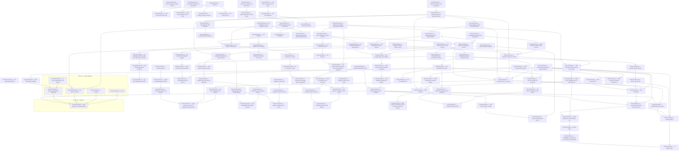

# Cross-Plan Dependency Graph

This is the forward build order for the plan phases that have not shipped yet: every node is a phase with tasks still to build, every edge is a dependency one phase has on another, and the PR that finishes a phase deletes its node from this graph.

## Platform order

Every numbered group below builds and checks on macOS. The code stays portable: each piece that differs by operating system sits behind one interface in the phase that owns it, which builds the macOS form, and nothing is hard-coded to macOS. Two phases follow every group. **Phase 10, Other platforms**, adds the Windows, WSL 2 and Linux side of every such interface, with the plan phases that build only for those systems. **Phase 11, Release**, holds packaging and signing on every platform, the release manifest, the app's update path, `sidekicks self-update` and the background service's update, and a one-time vulnerability scan before the first release; there is no license scan. A feature is built in its own group, and only its run on a signed, packaged build waits for Phase 11. The email digest comes last of all.

## Graph

```mermaid
flowchart TD
 %% Plan-001
 n001_6["Plan-001 Phase 6 — the session directory and lifecycle"]
 %% Plan-002
 n002_2["Plan-002 Phase 2 — queue admission and serialized interventions"]
 n002_3["Plan-002 Phase 3 — run-engine orchestration"]
 n002_3B["Plan-002 Phase 3B — the run side of an undo"]
 n002_4["Plan-002 Phase 4 — desktop run controls"]
 %% Plan-003
 n003_3["Plan-003 Phase 3 — Codex and Claude driver implementations"]
 n003_5["Plan-003 Phase 5 — MCP task-handle durability"]
 %% Plan-004
 n004_3B["Plan-004 Phase 3B — machine-authored content column"]
 n004_4["Plan-004 Phase 4 — read side and SDK"]
 %% Plan-005
 n005_R1["Plan-005 Phase R1 — daemon and settings namespace handlers"]
 n005_R2["Plan-005 Phase R2 — secure defaults, TLS, first-run keys"]
 n005_R3["Plan-005 Phase R3 — CLI package and daemon-status delivery"]
 n005_2B["Plan-005 Phase 2B — the calling device on the dispatch context"]
 n005_2C["Plan-005 Phase 2C — socket path length check before bind"]
 n005_2D["Plan-005 Phase 2D — batched subscription frame"]
 n005_R4["Plan-005 Phase R4 — the service on WSL 2"]
 %% Plan-006
 n006_2B["Plan-006 Phase 2B — repo identity keying and resolution"]
 n006_3["Plan-006 Phase 3 — repo IPC namespace and SDK"]
 %% Plan-007
 n007_3["Plan-007 Phase 3 — run-setup gate, worktree verbs, IPC namespace and SDK"]
 %% Plan-008
 n008_1["Plan-008 Phase 1 — contracts"]
 n008_2["Plan-008 Phase 2 — ship facts and the diff read"]
 n008_3["Plan-008 Phase 3 — ship acts, generate and the trailer"]
 n008_4["Plan-008 Phase 4 — hosting, reviews and notes"]
 n008_5["Plan-008 Phase 5 — the review surface"]
 %% Plan-009
 n009_1["Plan-009 Phase 1 — approval contracts and persistence"]
 n009_2["Plan-009 Phase 2 — daemon policy and approval services"]
 n009_3["Plan-009 Phase 3 — approval IPC, SDK, projection"]
 n009_4["Plan-009 Phase 4 — desktop approval surfaces"]
 %% Plan-010
 n010_2["Plan-010 Phase 2 — projection and replay-aware subscription"]
 n010_3["Plan-010 Phase 3 — child-run expansion and reasoning"]
 n010_4["Plan-010 Phase 4 — desktop timeline rendering"]
 %% Plan-011
 n011_1["Plan-011 Phase 1 — artifact contracts"]
 n011_2["Plan-011 Phase 2 — ingest and publication producers"]
 n011_3["Plan-011 Phase 3 — derivatives, events and deletion"]
 n011_4["Plan-011 Phase 4 — ingest worker, scan, cover, staging and artifact reads"]
 %% Plan-012
 n012_1["Plan-012 Phase 1 — persistence schema and receipt store"]
 n012_2["Plan-012 Phase 2 — replay rebuild and recovery status"]
 n012_3["Plan-012 Phase 3 — runtime-binding recovery and resume"]
 %% Plan-013
 n013_1["Plan-013 Phase 1 — orchestration contracts and persistence"]
 n013_2["Plan-013 Phase 2 — daemon orchestration services"]
 n013_3["Plan-013 Phase 3 — orchestration wire namespace and SDK"]
 n013_4["Plan-013 Phase 4 — desktop child-run surface"]
 n013_4B["Plan-013 Phase 4B — session cost receipt"]
 %% Plan-014
 n014_1["Plan-014 Phase 1 — workflow contracts, schema, writer"]
 n014_2["Plan-014 Phase 2 — sequential execution and gate resolution"]
 n014_2B["Plan-014 Phase 2B — usage-limit park and durable pacing"]
 n014_3["Plan-014 Phase 3 — multi-agent and human steps"]
 n014_4["Plan-014 Phase 4 — parallel steps and memory admission"]
 n014_5["Plan-014 Phase 5 — resumption, CLI, authoring surfaces"]
 n014_5B["Plan-014 Phase 5B — park cancelability and operator recovery"]
 n014_5C["Plan-014 Phase 5C — always-on engine event record"]
 %% Plan-015
 n015_1["Plan-015 Phase 1 — user contracts"]
 n015_2["Plan-015 Phase 2 — identity to user mapping"]
 n015_3["Plan-015 Phase 3 — user projection and display updates"]
 n015_4["Plan-015 Phase 4 — client surfaces and authorization"]
 n015_5["Plan-015 Phase 5 — credential seam and account"]
 n015_6["Plan-015 Phase 6 — WebAuthn ceremony server side"]
 %% Plan-016
 n016_1["Plan-016 Phase 1 — attention contracts and kinds"]
 n016_2["Plan-016 Phase 2 — the projection, the gate and the mute"]
 n016_3["Plan-016 Phase 3 — notification emission and delivery"]
 %% Plan-017
 n017_1["Plan-017 Phase 1 — diagnostic policy state"]
 n017_2["Plan-017 Phase 2 — diagnostic-bucket retention"]
 %% Plan-018
 n018_1["Plan-018 Phase 1 — rate-limit contracts and doc parity"]
 n018_2["Plan-018 Phase 2 — rate-limit backends"]
 n018_3["Plan-018 Phase 3 — enforcement wiring"]
 n018_4["Plan-018 Phase 4 — verification"]
 %% Plan-019
 n019_1["Plan-019 Phase 1 — the daemon's secrets"]
 n019_2["Plan-019 Phase 2 — the data acts"]
 n019_3["Plan-019 Phase 3 — the purge's erasure step and the account-deletion alignment"]
 %% Plan-020
 n020_1B["Plan-020 Phase 1B — main's registry of windows"]
 n020_2["Plan-020 Phase 2 — IPC bridge registry and handlers"]
 n020_3["Plan-020 Phase 3 — crash reporter and main startup composition"]
 n020_4["Plan-020 Phase 4 — auto-updater and deep-link handler"]
 n020_5["Plan-020 Phase 5 — renderer layout, router, composer"]
 n020_6["Plan-020 Phase 6 — build pipeline and release signing"]
 n020_7["Plan-020 Phase 7 — E2E suite, harness, CI gate"]
 n020_8["Plan-020 Phase 8 — Preview and detached panes"]
 %% Plan-021
 n021_3B["Plan-021 Phase 3B — PTY substrate hardening"]
 n021_4["Plan-021 Phase 4 — CI cross-compile matrix and signing"]
 n021_5["Plan-021 Phase 5 — publish and Windows default-flip"]
 %% Plan-022
 n022_1["Plan-022 Phase 1 — MCP contracts and storage"]
 n022_2["Plan-022 Phase 2 — MCP inventory and status observation"]
 n022_3["Plan-022 Phase 3 — MCP configuration mutation engines"]
 n022_4["Plan-022 Phase 4 — MCP overrides"]
 n022_5["Plan-022 Phase 5 — MCP sign-in, the daemon's client and route, and client delivery"]
 %% Plan-023
 n023_2["Plan-023 Phase 2 — account registry service and authorization"]
 n023_3["Plan-023 Phase 3 — credential homes and spawn binding"]
 n023_4["Plan-023 Phase 4 — cost attribution and client surfaces"]
 %% Plan-024
 n024_1["Plan-024 Phase 1 — agent definition contracts and schema"]
 n024_2["Plan-024 Phase 2 — definition registry, CLI, SDK"]
 n024_3["Plan-024 Phase 3 — resolution when a run starts"]
 n024_4["Plan-024 Phase 4 — peer invocation"]
 n024_5["Plan-024 Phase 5 — desktop library and editor"]
 n024_6["Plan-024 Phase 6 — Browse plugins"]
 %% Plan-025
 n025_1["Plan-025 Phase 1 — the daemon as a running process"]
 n025_2["Plan-025 Phase 2 — identity keys and the statement chain"]
 n025_3["Plan-025 Phase 3 — the relay and the channel"]
 n025_4["Plan-025 Phase 4 — method proxy and terminal streaming"]
 n025_5["Plan-025 Phase 5 — devices, linking and revocation"]
 n025_6["Plan-025 Phase 6 — the device recorded on each event"]
 n025_7["Plan-025 Phase 7 — Remote Control frontend"]
 n025_8["Plan-025 Phase 8 — self-host deployment"]
 %% Plan-026
 n026_1["Plan-026 Phase 1 — skill contracts and the read over three origins"]
 n026_2["Plan-026 Phase 2 — folder write, availability record, widening scan"]
 n026_3["Plan-026 Phase 3 — session pack and mid-session liveness"]
 n026_4["Plan-026 Phase 4 — Skills destination: rail, addresses, list"]
 n026_5["Plan-026 Phase 5 — folder editor"]
 n026_6["Plan-026 Phase 6 — availability on screen and the composer's Skills group"]
 n026_7["Plan-026 Phase 7 — a plugin's skills"]
 %% Plan-027
 n027_1["Plan-027 Phase 1 — Windows"]
 n027_2["Plan-027 Phase 2 — Linux"]
 subgraph phase10["Phase 10 — Other platforms"]
  n021_4
  n021_5
  n005_R4
  n027_1
  n027_2
 end
 subgraph phase11["Phase 11 — Release"]
  n020_6
 end
 n002_2 --> n002_3
 n002_2 --> n013_2
 n002_3 --> n002_4
 n002_3 --> n007_3
 n002_3B --> n010_2
 n002_4 --> n002_3B
 n004_4 --> n024_4
 n005_R1 --> n005_R2
 n005_2D --> n010_2
 n005_R1 --> n013_2
 n005_2D --> n020_5
 n005_R2 --> n005_R3
 n005_R2 --> n019_1
 n005_R3 --> n020_2
 n005_R3 --> n024_2
 n005_R3 --> n005_R4
 n007_3 --> n006_2B
 n008_1 --> n008_2
 n008_1 --> n008_3
 n008_1 --> n008_4
 n008_1 --> n008_5
 n009_1 --> n009_2
 n009_2 --> n009_3
 n009_2 --> n022_4
 n009_2 --> n023_2
 n009_2 --> n024_2
 n009_2 --> n014_2
 n009_3 --> n009_4
 n010_2 --> n010_4
 n010_2 --> n016_2
 n010_3 --> n010_4
 n010_4 --> n016_3
 n011_1 --> n011_2
 n011_2 --> n011_3
 n011_3 --> n011_4
 n012_1 --> n012_2
 n012_2 --> n012_3
 n013_1 --> n013_2
 n013_1 --> n024_1
 n013_2 --> n013_3
 n013_2 --> n024_3
 n013_3 --> n013_4
 n013_3 --> n014_3
 n013_4 --> n013_4B
 n013_4B --> n024_4
 n014_1 --> n014_2
 n014_1 --> n024_2
 n014_2 --> n014_2B
 n014_2 --> n014_3
 n014_2B --> n014_5B
 n014_2B --> n014_5C
 n014_3 --> n014_4
 n014_4 --> n014_5
 n014_5 --> n014_5B
 n015_1 --> n015_2
 n015_2 --> n015_3
 n015_2 --> n015_6
 n015_3 --> n015_4
 n015_4 --> n015_5
 n016_1 --> n016_2
 n016_2 --> n016_3
 n017_1 --> n017_2
 n017_2 --> n014_5C
 n018_1 --> n018_2
 n018_2 --> n018_3
 n018_3 --> n018_4
 n019_1 --> n019_2
 n019_2 --> n019_3
 n005_R1 --> n019_3
 n020_2 --> n020_3
 n020_3 --> n020_4
 n020_4 --> n020_5
 n020_5 --> n020_6
 n020_5 --> n024_5
 n020_5 --> n020_7
 n020_7 --> n020_8
 n021_3B --> n021_5
 n021_4 --> n021_5
 n021_4 --> n005_R4
 n022_1 --> n022_2
 n022_1 --> n022_3
 n022_2 --> n022_4
 n022_3 --> n022_4
 n022_4 --> n022_5
 n023_2 --> n023_3
 n023_2 --> n024_3
 n023_3 --> n023_4
 n023_3 --> n013_2
 n024_1 --> n024_2
 n024_2 --> n024_3
 n024_3 --> n024_4
 n024_3 --> n024_5
 n025_1 --> n025_2
 n025_1 --> n020_2
 n025_2 --> n025_3
 n025_2 --> n025_5
 n025_3 --> n025_4
 n025_3 --> n025_5
 n025_3 --> n025_8
 n025_4 --> n025_7
 n025_5 --> n025_6
 n025_6 --> n025_7
 n005_R1 --> n026_1
 n005_R1 --> n005_R4
 n026_1 --> n026_2
 n026_2 --> n026_3
 n026_3 --> n026_4
 n020_5 --> n026_4
 n026_4 --> n026_5
 n026_5 --> n026_6
 n024_2 --> n026_1
 n024_4 --> n026_3
 n024_5 --> n024_6
 n026_3 --> n024_6
 n022_2 --> n024_6
 n026_6 --> n026_7
 n024_6 --> n026_7
 n006_2B --> n006_3
 n005_2B --> n002_2
 n005_2B --> n002_3
 n003_3 --> n003_5
 n003_3 --> n022_2
 n003_3 --> n024_3
 n003_3 --> n024_4
 n003_3 --> n024_6
 n003_3 --> n026_3
 n020_1B --> n020_2
 n020_1B --> n020_8
 n024_3 --> n001_6
 n025_3 --> n015_5
 n014_4 --> n011_4
 n001_6 --> n011_4
 n021_5 --> n020_6
 n005_R4 --> n020_6
 n027_1 --> n020_6
 n027_2 --> n020_6
```

## Dispatch groups

Every phase in a group can be built in parallel; a group opens once the phases it waits on have merged.

| Group | Phase | Builds | Waits on |
| --- | --- | --- | --- |
| 1 | [Plan-003 Phase 3](../plans/003-provider-driver-contract-and-capabilities.md) | Codex and Claude driver implementations; its cloud bridge (T3.32) waits on Plan-001 Phase 6, Plan-007 Phase 3 and Plan-012 Phase 1. | — |
|  | [Plan-004 Phase 3B](../plans/004-session-event-taxonomy-and-audit-log.md) | machine-authored content column. | — |
|  | [Plan-004 Phase 4](../plans/004-session-event-taxonomy-and-audit-log.md) | read side and SDK. | — |
|  | [Plan-005 Phase R1](../plans/005-local-ipc-and-daemon-control.md) | daemon and settings namespace handlers. | — |
|  | [Plan-005 Phase 2B](../plans/005-local-ipc-and-daemon-control.md) | the calling device on the dispatch context. | — |
|  | [Plan-008 Phase 1](../plans/008-gitflow-pr-and-diff-attribution.md) | contracts. | — |
|  | [Plan-009 Phase 1](../plans/009-approvals-permissions-and-trust-boundaries.md) | approval contracts and persistence. | — |
|  | [Plan-010 Phase 3](../plans/010-live-timeline-visibility-and-reasoning-surfaces.md) | child-run expansion and reasoning. | — |
|  | [Plan-011 Phase 1](../plans/011-artifacts-files-and-attachments.md) | artifact contracts. | — |
|  | [Plan-012 Phase 1](../plans/012-persistence-recovery-and-replay.md) | persistence schema and receipt store. | — |
|  | [Plan-013 Phase 1](../plans/013-multi-agent-orchestration.md) | orchestration contracts and persistence. | — |
|  | [Plan-015 Phase 1](../plans/015-identity-and-user-state.md) | user contracts. | — |
|  | [Plan-016 Phase 1](../plans/016-notifications-and-attention-model.md) | attention contracts and kinds. | — |
|  | [Plan-017 Phase 1](../plans/017-observability-and-failure-recovery.md) | diagnostic policy state. | — |
|  | [Plan-018 Phase 1](../plans/018-rate-limiting-policy.md) | rate-limit contracts and doc parity. | — |
|  | [Plan-021 Phase 3B](../plans/021-rust-pty-sidecar.md) | PTY substrate hardening: the shells, their lease and flow control and the orphan defense on macOS; its sidecar-only tasks are Phase 10's. | — |
|  | [Plan-022 Phase 1](../plans/022-mcp-server-configuration-and-governance.md) | MCP contracts and storage. | — |
|  | [Plan-025 Phase 1](../plans/025-remote-control.md) | the daemon as a running process. | — |
|  | [Plan-005 Phase 2C](../plans/005-local-ipc-and-daemon-control.md) | socket path length check before bind. | — |
|  | [Plan-005 Phase 2D](../plans/005-local-ipc-and-daemon-control.md) | batched subscription frame. | — |
|  | [Plan-014 Phase 1](../plans/014-workflow-authoring-and-execution.md) | workflow contracts, schema, writer. | — |
|  | [Plan-020 Phase 1B](../plans/020-desktop-app-and-renderer.md#phase-1b--renderer-load-substrate) | main's registry of windows (T-020p-1B-5). | — |
| 2 | [Plan-003 Phase 5](../plans/003-provider-driver-contract-and-capabilities.md) | MCP task-handle durability. | Plan-003 Phase 3 |
|  | [Plan-002 Phase 2](../plans/002-queue-steer-pause-resume.md) | queue admission and serialized interventions. | Plan-005 Phase 2B |
|  | [Plan-005 Phase R2](../plans/005-local-ipc-and-daemon-control.md) | secure defaults, TLS, first-run keys. | Plan-005 Phase R1 |
|  | [Plan-008 Phase 3](../plans/008-gitflow-pr-and-diff-attribution.md) | ship acts, generate and the trailer. | Plan-008 Phase 1 |
|  | [Plan-009 Phase 2](../plans/009-approvals-permissions-and-trust-boundaries.md) | daemon policy and approval services. | Plan-009 Phase 1 |
|  | [Plan-011 Phase 2](../plans/011-artifacts-files-and-attachments.md) | ingest and publication producers. | Plan-011 Phase 1 |
|  | [Plan-012 Phase 2](../plans/012-persistence-recovery-and-replay.md) | replay rebuild and recovery status. | Plan-012 Phase 1 |
|  | [Plan-015 Phase 2](../plans/015-identity-and-user-state.md) | identity to user mapping. | Plan-015 Phase 1 |
|  | [Plan-017 Phase 2](../plans/017-observability-and-failure-recovery.md) | diagnostic-bucket retention. | Plan-017 Phase 1 |
|  | [Plan-018 Phase 2](../plans/018-rate-limiting-policy.md) | rate-limit backends. | Plan-018 Phase 1 |
|  | [Plan-022 Phase 2](../plans/022-mcp-server-configuration-and-governance.md) | MCP inventory and status observation. | Plan-003 Phase 3, Plan-022 Phase 1 |
|  | [Plan-022 Phase 3](../plans/022-mcp-server-configuration-and-governance.md) | MCP configuration mutation engines. | Plan-022 Phase 1 |
|  | [Plan-024 Phase 1](../plans/024-agent-definitions-and-peer-invocation.md) | agent definition contracts and schema. | Plan-013 Phase 1 |
|  | [Plan-025 Phase 2](../plans/025-remote-control.md) | identity keys and the statement chain. | Plan-025 Phase 1 |
|  | [Plan-008 Phase 4](../plans/008-gitflow-pr-and-diff-attribution.md) | hosting, reviews and notes. | Plan-008 Phase 1 |
|  | [Plan-008 Phase 5](../plans/008-gitflow-pr-and-diff-attribution.md) | the review surface. | Plan-008 Phase 1 |
|  | [Plan-008 Phase 2](../plans/008-gitflow-pr-and-diff-attribution.md) | ship facts and the diff read. | Plan-008 Phase 1 |
| 3 | [Plan-002 Phase 3](../plans/002-queue-steer-pause-resume.md) | run-engine orchestration. | Plan-002 Phase 2, Plan-005 Phase 2B |
|  | [Plan-005 Phase R3](../plans/005-local-ipc-and-daemon-control.md) | CLI package and daemon-status delivery; its self-update tasks are Phase 11's. | Plan-005 Phase R2 |
|  | [Plan-009 Phase 3](../plans/009-approvals-permissions-and-trust-boundaries.md) | approval IPC, SDK, projection. | Plan-009 Phase 2 |
|  | [Plan-011 Phase 3](../plans/011-artifacts-files-and-attachments.md) | derivatives, events and deletion. | Plan-011 Phase 2 |
|  | [Plan-012 Phase 3](../plans/012-persistence-recovery-and-replay.md) | runtime-binding recovery and resume. | Plan-012 Phase 2 |
|  | [Plan-015 Phase 3](../plans/015-identity-and-user-state.md) | user projection and display updates. | Plan-015 Phase 2 |
|  | [Plan-015 Phase 6](../plans/015-identity-and-user-state.md) | WebAuthn ceremony server side. | Plan-015 Phase 2 |
|  | [Plan-018 Phase 3](../plans/018-rate-limiting-policy.md) | enforcement wiring. | Plan-018 Phase 2 |
|  | [Plan-023 Phase 2](../plans/023-provider-accounts-and-credential-homes.md) | account registry service and authorization. | Plan-009 Phase 2 |
|  | [Plan-025 Phase 3](../plans/025-remote-control.md) | the relay and the channel. | Plan-025 Phase 2 |
|  | [Plan-014 Phase 2](../plans/014-workflow-authoring-and-execution.md) | sequential execution and gate resolution. | Plan-009 Phase 2, Plan-014 Phase 1 |
|  | [Plan-022 Phase 4](../plans/022-mcp-server-configuration-and-governance.md) | MCP overrides. | Plan-009 Phase 2, Plan-022 Phase 2, Plan-022 Phase 3 |
|  | [Plan-019 Phase 1](../plans/019-data-retention-and-gdpr.md) | the daemon's secrets; the credential store's Windows arm is Phase 10's, beside Plan-005 Phase R4. | Plan-005 Phase R2 |
| 4 | [Plan-025 Phase 5](../plans/025-remote-control.md) | devices, linking and revocation. | Plan-025 Phase 2, Plan-025 Phase 3 |
|  | [Plan-002 Phase 4](../plans/002-queue-steer-pause-resume.md) | desktop run controls. | Plan-002 Phase 3 |
|  | [Plan-007 Phase 3](../plans/007-worktree-lifecycle-and-execution-modes.md) | run-setup gate, worktree verbs, IPC namespace and SDK. | Plan-002 Phase 3 |
|  | [Plan-009 Phase 4](../plans/009-approvals-permissions-and-trust-boundaries.md) | desktop approval surfaces. | Plan-009 Phase 3 |
|  | [Plan-015 Phase 4](../plans/015-identity-and-user-state.md) | client surfaces and authorization. | Plan-015 Phase 3 |
|  | [Plan-018 Phase 4](../plans/018-rate-limiting-policy.md) | verification. | Plan-018 Phase 3 |
|  | [Plan-020 Phase 2](../plans/020-desktop-app-and-renderer.md) | IPC bridge registry and handlers. | Plan-005 Phase R3, Plan-020 Phase 1B, Plan-025 Phase 1 |
|  | [Plan-023 Phase 3](../plans/023-provider-accounts-and-credential-homes.md) | credential homes and spawn binding. | Plan-023 Phase 2 |
|  | [Plan-024 Phase 2](../plans/024-agent-definitions-and-peer-invocation.md) | definition registry, CLI, SDK. | Plan-005 Phase R3, Plan-009 Phase 2, Plan-014 Phase 1, Plan-024 Phase 1 |
|  | [Plan-025 Phase 4](../plans/025-remote-control.md) | method proxy and terminal streaming. | Plan-025 Phase 3 |
|  | [Plan-014 Phase 2B](../plans/014-workflow-authoring-and-execution.md) | usage-limit park and durable pacing. | Plan-014 Phase 2 |
|  | [Plan-025 Phase 8](../plans/025-remote-control.md) | self-host deployment. | Plan-025 Phase 3 |
|  | [Plan-022 Phase 5](../plans/022-mcp-server-configuration-and-governance.md) | MCP sign-in, the daemon's client and route, and client delivery. | Plan-022 Phase 4 |
|  | [Plan-019 Phase 2](../plans/019-data-retention-and-gdpr.md) | the data acts. | Plan-019 Phase 1 |
| 5 | [Plan-025 Phase 6](../plans/025-remote-control.md) | the device recorded on each event. | Plan-025 Phase 5 |
|  | [Plan-006 Phase 2B](../plans/006-repo-attachment-and-workspace-binding.md) | repo identity keying and resolution. | Plan-007 Phase 3 |
|  | [Plan-026 Phase 1](../plans/026-skills.md) | skill contracts and the read over three origins. | Plan-005 Phase R1, Plan-024 Phase 2 |
|  | [Plan-013 Phase 2](../plans/013-multi-agent-orchestration.md) | daemon orchestration services. | Plan-002 Phase 2, Plan-005 Phase R1, Plan-013 Phase 1, Plan-023 Phase 3 |
|  | [Plan-015 Phase 5](../plans/015-identity-and-user-state.md) | credential seam and account. | Plan-015 Phase 4, Plan-025 Phase 3 |
|  | [Plan-020 Phase 3](../plans/020-desktop-app-and-renderer.md) | crash reporter and main startup composition. | Plan-020 Phase 2 |
|  | [Plan-023 Phase 4](../plans/023-provider-accounts-and-credential-homes.md) | cost attribution and client surfaces. | Plan-023 Phase 3 |
|  | [Plan-014 Phase 5C](../plans/014-workflow-authoring-and-execution.md) | always-on engine event record. | Plan-014 Phase 2B, Plan-017 Phase 2 |
|  | [Plan-002 Phase 3B](../plans/002-queue-steer-pause-resume.md) | the run side of an undo. | Plan-002 Phase 4 |
|  | [Plan-019 Phase 3](../plans/019-data-retention-and-gdpr.md) | the purge's erasure step and the account-deletion alignment. | Plan-005 Phase R1, Plan-019 Phase 2 |
| 6 | [Plan-025 Phase 7](../plans/025-remote-control.md) | Remote Control frontend. | Plan-025 Phase 4, Plan-025 Phase 6 |
|  | [Plan-006 Phase 3](../plans/006-repo-attachment-and-workspace-binding.md) | repo IPC namespace and SDK. | Plan-006 Phase 2B |
|  | [Plan-026 Phase 2](../plans/026-skills.md) | folder write, availability record, widening scan. | Plan-026 Phase 1 |
|  | [Plan-020 Phase 4](../plans/020-desktop-app-and-renderer.md) | deep-link handler; its auto-updater tasks are Phase 11's. | Plan-020 Phase 3 |
|  | [Plan-010 Phase 2](../plans/010-live-timeline-visibility-and-reasoning-surfaces.md) | projection and replay-aware subscription. | Plan-002 Phase 3B, Plan-005 Phase 2D |
|  | [Plan-024 Phase 3](../plans/024-agent-definitions-and-peer-invocation.md) | resolution when a run starts. | Plan-003 Phase 3, Plan-013 Phase 2, Plan-023 Phase 2, Plan-024 Phase 2 |
|  | [Plan-013 Phase 3](../plans/013-multi-agent-orchestration.md) | orchestration wire namespace and SDK. | Plan-013 Phase 2 |
| 7 | [Plan-001 Phase 6](../plans/001-session-core.md) | the session directory and lifecycle. | Plan-024 Phase 3 |
|  | [Plan-020 Phase 5](../plans/020-desktop-app-and-renderer.md) | renderer layout, router, composer. | Plan-005 Phase 2D, Plan-020 Phase 4 |
|  | [Plan-010 Phase 4](../plans/010-live-timeline-visibility-and-reasoning-surfaces.md) | desktop timeline rendering. | Plan-010 Phase 2, Plan-010 Phase 3 |
|  | [Plan-016 Phase 2](../plans/016-notifications-and-attention-model.md) | the projection, the gate and the mute. | Plan-010 Phase 2, Plan-016 Phase 1 |
|  | [Plan-014 Phase 3](../plans/014-workflow-authoring-and-execution.md) | multi-agent and human steps. | Plan-013 Phase 3, Plan-014 Phase 2 |
|  | [Plan-013 Phase 4](../plans/013-multi-agent-orchestration.md) | desktop child-run surface. | Plan-013 Phase 3 |
| 8 | [Plan-024 Phase 5](../plans/024-agent-definitions-and-peer-invocation.md) | desktop library and editor. | Plan-020 Phase 5, Plan-024 Phase 3 |
|  | [Plan-016 Phase 3](../plans/016-notifications-and-attention-model.md) | notification emission and delivery; its email digest (T3.5) comes last of all. | Plan-010 Phase 4, Plan-016 Phase 2 |
|  | [Plan-014 Phase 4](../plans/014-workflow-authoring-and-execution.md) | parallel steps and memory admission. | Plan-014 Phase 3 |
|  | [Plan-013 Phase 4B](../plans/013-multi-agent-orchestration.md) | session cost receipt. | Plan-013 Phase 4 |
|  | [Plan-020 Phase 7](../plans/020-desktop-app-and-renderer.md) | E2E suite, harness, CI gate; the suite's run on a signed, packaged build, the release job and the release runbook are Phase 11's. | Plan-020 Phase 5 |
| 9 | [Plan-014 Phase 5](../plans/014-workflow-authoring-and-execution.md) | resumption, CLI, authoring surfaces. | Plan-014 Phase 4 |
|  | [Plan-024 Phase 4](../plans/024-agent-definitions-and-peer-invocation.md) | peer invocation. | Plan-003 Phase 3, Plan-004 Phase 4, Plan-013 Phase 4B, Plan-024 Phase 3 |
|  | [Plan-020 Phase 8](../plans/020-desktop-app-and-renderer.md) | Preview and detached panes. | Plan-020 Phase 1B, Plan-020 Phase 7 |
|  | [Plan-011 Phase 4](../plans/011-artifacts-files-and-attachments.md) | ingest worker, scan, cover, staging and artifact reads. | Plan-001 Phase 6, Plan-011 Phase 3, Plan-014 Phase 4 |
| 10 | [Plan-014 Phase 5B](../plans/014-workflow-authoring-and-execution.md) | park cancelability and operator recovery. | Plan-014 Phase 2B, Plan-014 Phase 5 |
|  | [Plan-026 Phase 3](../plans/026-skills.md) | session pack and mid-session liveness. | Plan-003 Phase 3, Plan-024 Phase 4, Plan-026 Phase 2 |
| 11 | [Plan-026 Phase 4](../plans/026-skills.md) | Skills destination: rail, addresses, list. | Plan-020 Phase 5, Plan-026 Phase 3 |
|  | [Plan-024 Phase 6](../plans/024-agent-definitions-and-peer-invocation.md) | Browse plugins. | Plan-003 Phase 3, Plan-022 Phase 2, Plan-024 Phase 5, Plan-026 Phase 3 |
| 12 | [Plan-026 Phase 5](../plans/026-skills.md) | folder editor. | Plan-026 Phase 4 |
| 13 | [Plan-026 Phase 6](../plans/026-skills.md) | availability on screen and the composer's Skills group. | Plan-026 Phase 5 |
| 14 | [Plan-026 Phase 7](../plans/026-skills.md) | a plugin's skills. | Plan-024 Phase 6, Plan-026 Phase 6 |
| Phase 10 | [Plan-021 Phase 4](../plans/021-rust-pty-sidecar.md) | CI cross-compile matrix of both Rust crates for x64 and arm64; its signing stages are Phase 11's. | — |
|  | [Plan-021 Phase 5](../plans/021-rust-pty-sidecar.md) | publish and Windows default-flip. | Plan-021 Phase 3B, Plan-021 Phase 4 |
|  | [Plan-005 Phase R4](../plans/005-local-ipc-and-daemon-control.md) | the service on WSL 2. | Plan-005 Phase R1, Plan-005 Phase R3, Plan-021 Phase 4 |
|  | [Plan-027 Phase 1](../plans/027-windows-and-linux.md) | Windows: every Windows implementation of an interface the numbered groups build on macOS that the Windows half does not hold. | — |
|  | [Plan-027 Phase 2](../plans/027-windows-and-linux.md) | Linux: every Linux implementation of an interface the numbered groups build on macOS. | — |
| Phase 11 | [Plan-020 Phase 6](../plans/020-desktop-app-and-renderer.md) | build pipeline and release signing. | Plan-005 Phase R4, Plan-020 Phase 5, Plan-021 Phase 5, Plan-027 Phase 1, Plan-027 Phase 2 |

## Console build order

The console has five rail destinations, in a fixed order ([ADR-029](../decisions/029-five-rail-destinations.md)): Sessions, Sidekicks, Skills, Workflows, Settings. Its frame, routes, pane chrome and fixtures are already in the tree from Plan-020's console phase, so what remains is each destination's live body, and every body is built by the plan that owns it, in its own feature, and registered through that feature's contributions. This table reads the dispatch groups above by destination: the phase that puts each screen on the glass, and the earliest group in which it can open.

| Destination | Phase that builds the screen | Opens in group |
| --- | --- | --- |
| Every destination | [Plan-020 Phase 5](../plans/020-desktop-app-and-renderer.md) adopts the console as the desktop app's frame and wires the composer live. A body that lands before it renders inside the console from its fixture data; a body that lands after it renders live. | 7 |
| Sessions | [Plan-008 Phase 5](../plans/008-gitflow-pr-and-diff-attribution.md) (the review surface) | 2 |
|  | [Plan-002 Phase 4](../plans/002-queue-steer-pause-resume.md) (run controls), [Plan-007 Phase 3](../plans/007-worktree-lifecycle-and-execution-modes.md) (the worktree methods the console's worktree switcher and its setup card call), [Plan-009 Phase 4](../plans/009-approvals-permissions-and-trust-boundaries.md) (approvals) | 4 |
|  | [Plan-006 Phase 3](../plans/006-repo-attachment-and-workspace-binding.md) (the repo methods the console's new-session picker, clone card and projects page call) | 6 |
|  | [Plan-013 Phase 4](../plans/013-multi-agent-orchestration.md) (child runs), [Plan-010 Phase 4](../plans/010-live-timeline-visibility-and-reasoning-surfaces.md) (the transcript's rows) | 7 |
|  | [Plan-016 Phase 3](../plans/016-notifications-and-attention-model.md) (the bell and notification delivery) | 8 |
|  | [Plan-020 Phase 8](../plans/020-desktop-app-and-renderer.md#phase-8--preview-and-detached-panes) (the Preview pane, [ADR-034](../decisions/034-embedded-browser-for-preview.md), and a side pane in a window of its own) | 9 |
|  | The terminal bridge, an optional Claude Code plugin that gives the user's own terminal Claude Code sessions `SendToSession` and `ListSessions` against the daemon and hands a peer delivery to the daemon first ([ADR-035](../decisions/035-claude-code-mods-are-an-optional-terminal-bridge.md)), after [Plan-013 Phase 2](../plans/013-multi-agent-orchestration.md) lands the daemon's own messaging. Nothing in the daemon depends on it, so it has no node in the graph. | — |
| Sidekicks | [Plan-024 Phase 5](../plans/024-agent-definitions-and-peer-invocation.md) (the library and the editor), then Phase 6 (Browse plugins) | 8, 11 |
| Skills | [Plan-026 Phase 4](../plans/026-skills.md) (rail, addresses, list), then Phase 5 (the folder editor), then Phase 6 (availability and the composer's Skills group), then Phase 7 (a plugin's skills) | 11, 12, 13, 14 |
| Workflows | [Plan-014 Phase 5](../plans/014-workflow-authoring-and-execution.md) (the builder, run detail, human forms and chat start), then Phase 5B (the operator recovery surface) | 9, 10 |
| Settings | [Plan-022 Phase 5](../plans/022-mcp-server-configuration-and-governance.md) (the MCP servers page) | 4 |
|  | [Plan-023 Phase 4](../plans/023-provider-accounts-and-credential-homes.md) (the Providers page) | 5 |
|  | [Plan-020 Phase 8](../plans/020-desktop-app-and-renderer.md#phase-8--preview-and-detached-panes) (the Browser page) | 9 |
|  | The other pages' chrome is in the tree from the console phase. Each page goes live when the daemon methods it reads are built; [api-payload-contracts.md §Operations Not Yet Built](./contracts/api-payload-contracts.md#operations-not-yet-built) names each with its owning plan. | — |

Sidekicks and Skills open late: both screens wait on Plan-020 Phase 5, which sits behind that plan's Phases 2, 3 and 5, and the Skills screen also waits on Plan-026 Phase 3, which follows Plan-024 Phase 4.

Remote Control's own screens — the Devices page with its machine, device and passkey cards, the linking flow, and the ports this machine shares with the person's other devices — are [Plan-025 Phase 7](../plans/025-remote-control.md)'s. Remote Control adds no rail destination ([ADR-029](../decisions/029-five-rail-destinations.md)): Devices is the last Settings page, after Runtime.
