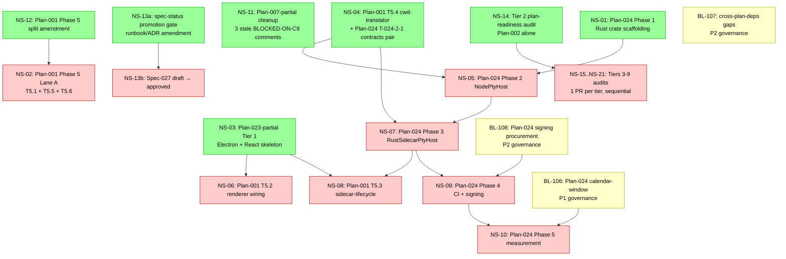

# Backlog

## Purpose

This file is the active development backlog for the product defined in [vision.md](./vision.md).

## How To Use This Backlog

- Add items only when they represent real remaining work.
- Link every item to the governing spec, plan, ADR, or operations doc where possible.
- Keep items outcome-oriented. A backlog item should describe a deliverable, not a vague area of concern.
- Remove or rewrite stale items instead of letting the file become a historical log.
- When work is complete, update the canonical docs it depends on first, then move the item to [Backlog Archive](./archive/backlog-archive.md).
- If information in a backlog item becomes durable product truth, move that information into the canonical docs and keep only the remaining work here.

## Status Values

- `todo`
- `in_progress`
- `blocked`
- `completed`

## Priority Values

- `P0` — blocks all implementation or blocks a critical feature
- `P1` — blocks a specific feature or must resolve before v1
- `P2` — should resolve before v1 ship

---

## Item Template

Use this shape for new backlog items:

```md
### BL-0XX: Short Title

- Status: `todo`
- Priority: `P1`
- Owner: `unassigned`
- References: [Relevant Spec](./specs/000-spec-template.md), [Relevant Plan](./plans/000-plan-template.md)
- Summary: One or two sentences describing the deliverable or change.
- Exit Criteria: Concrete condition that makes this item complete.
```

---

## Next Steps DAG

The graph below sequences the work the [plan-readiness-audit Tier 1](./operations/plan-implementation-readiness-audit-runbook.md) PR #15 left for the Tier 1 code track and the Tiers 2-9 audit track. Each `NS-NN` node is one actionable next step — code, governance, audit, or cleanup. Edges are hard preconditions; a node moves from `blocked` to `todo` when all incoming edges are satisfied. Existing `BL-NNN` entries are cross-referenced where they gate downstream `NS-NN` nodes.

### Graph



### Recommended first wave

The ready set (NS-01, NS-03, NS-04, NS-11, NS-12, NS-13a, NS-14) shares no code paths or governance files. Suggested parallel dispatch: **NS-01 + NS-03 + NS-04** as three independent code lanes; **NS-12 + NS-13a + NS-14 + NS-11** as concurrent governance / audit / cleanup lanes. NS-12 is critical-path for NS-02 — landing it first frees Plan-001 Phase 5 Lane A.

### NS-01: Plan-024 Phase 1 — Rust crate scaffolding

- Status: `todo`
- Type: code
- Priority: `P1`
- Upstream: none (Plan-024:267 — Phase 1 starts as soon as Plan-001 Phase 1 repo bootstrap is merged, which it is)
- References: [Plan-024](./plans/024-rust-pty-sidecar.md):267-281, [ADR-019](./decisions/019-windows-v1-tier-and-pty-sidecar.md), [cross-plan-dependencies.md](./architecture/cross-plan-dependencies.md):209
- Summary: Scaffold the Rust PTY sidecar crate (T-024-1-1..5): workspace-root `Cargo.toml`, `packages/sidecar-rust-pty/{Cargo.toml,Cargo.lock,src/{main,framing,protocol,pty_session}.rs,tests/{framing_roundtrip,protocol_roundtrip,spawn_smoke}.rs}` + TS protocol mirror at `packages/contracts/src/pty-host-protocol.ts`. ~10 new files; no edits to existing TS source. Pins: `portable-pty 0.9`, `tokio 1.40`, `serde_with 3.7`, MSRV `1.85`, `cargo-zigbuild 0.22.2`. F-024-2-04 binds Phase 2/3 to Plan-001 T5.4 — Phase 1 itself is fully independent.
- Exit Criteria: T-024-1-1..5 merged; Linux `cargo build --release` + `cargo test --release` green; Plan-024 Phase 1 Done Checklist flipped.

### NS-02: Plan-001 Phase 5 Lane A — sessionClient + pg.Pool + I7 (T5.1, T5.5, T5.6)

- Status: `blocked`
- Type: code (recommended split into 3 atomic PRs)
- Priority: `P1`
- Upstream: NS-12 (Plan-001:357 reads as a monolithic gate; per `feedback_honor_plan_preconditions.md`, amend the plan before shipping per-task PRs rather than relying on PR-description rationale)
- References: [Plan-001](./plans/001-shared-session-core.md):357-397, integration tests I1-I4 at Plan-001:199-202
- Summary: Three independent unblocked-when-NS-12-lands tasks. **T5.1** (load-bearing for Plan-002+ consumers): `packages/client-sdk/src/sessionClient.ts` + integration tests verifying I1-I4 at `packages/client-sdk/test/sessionClient.integration.test.ts`. **T5.5**: `pg.Pool`-backed `Querier` composition for `SessionDirectoryService`. **T5.6**: strengthen `createSession` lock-ordering test, discharge the `TODO(Plan-001 Phase 5)` annotation. Recommended sequencing: T5.1 first, then T5.5/T5.6 in either order.
- Exit Criteria: T5.1 lands `sessionClient.ts` with I1-I4 green; T5.5 ships pg.Pool driver; T5.6 strengthens the lock-ordering regression test.

### NS-03: Plan-023-partial Tier 1 — Electron + React skeleton

- Status: `todo`
- Type: code (single cohesive PR, 7 tasks)
- Priority: `P1`
- Upstream: none. Plan-023 has no audit-gate row in its Preconditions (lines 52-65), same shape as Plan-002 — both `approved` pre-audit, both treated as Tier 1 carve-outs in their respective tracks.
- References: [Plan-023](./plans/023-desktop-shell-and-renderer.md):234-266, [Spec-023](./specs/023-desktop-shell-and-renderer.md):152, [ADR-016](./decisions/016-electron-desktop-shell.md), [BL-101 archive entry](./archive/backlog-archive.md)
- Summary: Replace the `apps/desktop/` placeholder (PR #6) with the full electron-vite v5 toolchain (v6 beta rejected per Plan-023:314), minimal main/preload/renderer entrypoints, `SidekicksBridge` interface stub at `packages/contracts/src/desktop-bridge.ts`, and Vitest launch smoke test. T-023p-1-1..7. The `DaemonMethod` / `DaemonParams` / `DaemonResult` / `DaemonEvent` / `DaemonEventPayload` typed unions don't yet exist (only `DaemonHello` / `DaemonHelloAck` in `jsonrpc-negotiation.ts`); ship them as forward-declared placeholder discriminated unions in `desktop-bridge.ts` referencing `session.*` shapes — Tier 8 narrows them. Document the narrow point in the PR description.
- Exit Criteria: Vitest launch smoke green; webPreferences build-time grep assertion green; conditional-type test green; ESLint flat-config rejects renderer importing `electron` / `node:*` / main / preload.

### NS-04: Plan-001 T5.4 cwd-translator + Plan-024 T-024-2-1 contracts pair

- Status: `todo`
- Type: code (cross-plan PR pair, internally a 3-step sequence)
- Priority: `P1`
- Upstream: none (the 3-step sequence is internal: (a) `packages/contracts/src/pty-host.ts` interface-only PR for T-024-2-1 → (b) `packages/runtime-daemon/src/session/spawn-cwd-translator.ts` for T5.4 → (c) NodePtyHost impl T-024-2-2 lands as part of NS-05)
- References: [Plan-001](./plans/001-shared-session-core.md):387-389, [Plan-024](./plans/024-rust-pty-sidecar.md):75, 285, 301
- Summary: T5.4 wraps both `RustSidecarPtyHost` and `NodePtyHost` for OS-level cwd translation per I-024-5 to mitigate the Windows `ERROR_SHARING_VIOLATION` risk. F-024-2-04 binds T5.4 as a Precondition for **both** Plan-024 Phase 2 (NodePtyHost) **and** Phase 3 (RustSidecarPtyHost) — without it, Windows CI surfaces the sharing-violation regression. Clean sequence: ship the `PtyHost` contract interface alone, then T5.4 consumes it, then NS-05 consumes T5.4.
- Exit Criteria: `spawn-cwd-translator.ts` + Linux/macOS unit tests + Windows-CI integration tests (I6 / W2 / W3) green; `PtyHost` interface live in contracts.

### NS-05: Plan-024 Phase 2 — NodePtyHost

- Status: `blocked`
- Type: code
- Priority: `P1`
- Upstream: NS-01 (Phase 1 scaffolding) + NS-04 (T5.4 cwd-translator)
- References: [Plan-024](./plans/024-rust-pty-sidecar.md):285-298
- Summary: Implement `NodePtyHost` in `packages/runtime-daemon/src/pty/` consuming the Plan-001 cwd-translator. All platforms default to `NodePtyHost` in Phase 2; Windows default flips to `RustSidecarPtyHost` at Phase 5 per F-024-2-02 + BL-106.
- Exit Criteria: K1/K3 kill-semantics tests green; `AIS_PTY_BACKEND` env-grammar parsed; `node-pty@^1.2.0-beta.12` pinned.

### NS-06: Plan-001 T5.2 — renderer session-bootstrap

- Status: `blocked`
- Type: code
- Priority: `P1`
- Upstream: NS-03 (Plan-023-partial substrate — directory tree + electron-vite v5)
- References: [Plan-001](./plans/001-shared-session-core.md):379-381
- Summary: Author content for `apps/desktop/src/renderer/src/session-bootstrap/` — component invokes `sessionClient.create` on mount; uses the Plan-023-partial substrate.
- Exit Criteria: Renderer session-bootstrap component renders + invokes `sessionClient.create`; Spec-001 AC coverage row updated.

### NS-07: Plan-024 Phase 3 — RustSidecarPtyHost

- Status: `blocked`
- Type: code
- Priority: `P1`
- Upstream: NS-05 (Phase 2 PtyHost contract) + NS-04 (T5.4 cwd-translator)
- References: [Plan-024](./plans/024-rust-pty-sidecar.md):301-315
- Summary: Implement `RustSidecarPtyHost` in `packages/runtime-daemon/src/pty/` consuming the Phase 2 contract + Phase 1 sidecar binary. Supplies `PtyHost.close(sessionId)` + sidecar `KillRequest` primitives that Plan-001 T5.3 orchestrates per F-024-3-01.
- Exit Criteria: K2/K4/W1/W2/W3 tests green; sidecar respawn 5/60s window honored; dev-mode binary resolution order works.

### NS-08: Plan-001 T5.3 — sidecar-lifecycle handler

- Status: `blocked`
- Type: code
- Priority: `P1`
- Upstream: NS-03 (Plan-023-partial Electron substrate) + NS-07 (Plan-024 Phase 3 primitives)
- References: [Plan-001](./plans/001-shared-session-core.md):383-385, [Plan-024](./plans/024-rust-pty-sidecar.md):306
- Summary: Author content for `apps/desktop/src/main/sidecar-lifecycle.ts` — registers BEFORE Electron `will-quit` (CP-001-1); orchestrates `PtyHost.close` + `KillRequest` primitives that Plan-024 Phase 3 supplies. Verifies I5 = CP-001-1 + I-024-4.
- Exit Criteria: I5 integration test (`apps/desktop/src/main/__tests__/sidecar-lifecycle.integration.test.ts`) green against real `RustSidecarPtyHost`.

### NS-09: Plan-024 Phase 4 — CI cross-compile + signing

- Status: `blocked`
- Type: code + governance
- Priority: `P1`
- Upstream: NS-07 (Phase 3 working sidecar) + BL-108 (procurement evidence)
- References: [Plan-024](./plans/024-rust-pty-sidecar.md):319-330, BL-108
- Summary: 5-target `cargo-zigbuild` matrix (Windows MSVC, macOS x86_64/aarch64, Linux x86_64/aarch64) + Authenticode + Apple notarization. Phase 4 publishes signed pre-release binaries.
- Exit Criteria: All 5 targets build green; signed artifacts attached to release draft; Plan-024 §Decision Log records signing-track choice + date; BL-108 closes.

### NS-10: Plan-024 Phase 5 — measurement substrate

- Status: `blocked`
- Type: code + governance
- Priority: `P1`
- Upstream: NS-09 (Phase 4 signed binaries) + BL-106 (calendar-window decoupling)
- References: [Plan-024](./plans/024-rust-pty-sidecar.md):338-410, BL-106
- Summary: Codex `/resume` ≥ 99% green criterion + ≤ 0.01/1,000 sidecar crash-rate telemetry + SmartScreen reputation observation. The 6 `BLOCKED-ON-C5` markers in Plan-024 lines 257, 338, 346, 352, 353, 410 resolve via BL-106 path (a).
- Exit Criteria: All Phase 5 `BLOCKED-ON-C5` markers resolved with ADR-019 citation; F-024-5-01 closed; Windows default-flip activated at the Plan-024 substrate-promotion gate per BL-106 path (a).

### NS-11: Plan-007-partial completion cleanup

- Status: `todo`
- Type: cleanup
- Priority: `P2`
- Upstream: none
- References: `packages/runtime-daemon/src/bootstrap/secure-defaults-events.ts:24,35,59`, [Plan-007](./plans/007-local-ipc-and-daemon-control.md):444 (BL-105 closed), [BL-105 archive entry](./archive/backlog-archive.md)
- Summary: 3 stale `BLOCKED-ON-C9` comments in `secure-defaults-events.ts` describe a Tier-1 deferral state, but the BL-105 ratification (2026-05-01) closed C9. Rewrite to drop the `BLOCKED-ON-C9` token + cite BL-105 closure. Single-file PR, no test changes, ~30 min.
- Exit Criteria: All 3 stale comments rewritten; this PR gates the Plan-007-partial `approved → completed` flip per verify-not-recall hygiene (the partial plan should not flip while stale `BLOCKED-ON-CN` markers remain in committed code).

### NS-12: Plan-001 Phase 5 split amendment

- Status: `todo`
- Type: governance (doc-only)
- Priority: `P1` (critical-path for NS-02)
- Upstream: none
- References: [Plan-001](./plans/001-shared-session-core.md):357-397
- Summary: Amend Plan-001:357 to canonicalize the four-lane Phase 5 split: **Lane A** (T5.1 / T5.5 / T5.6 unblocked once amendment lands) + **Lane B** (T5.4 paired with Plan-024 T-024-2-1, see NS-04) + **Lane C** (T5.2 after Plan-023-partial, see NS-06) + **Lane D** (T5.3 after Plan-023-partial + Plan-024 Phase 3, see NS-08). Without this amendment, Plan-001:357 reads as a monolithic gate ("Phase 5 cannot start until all three upstream Tier 1 substrates are merged") that conflicts with the per-task `Files:` lines at 375-397. Hard precondition for NS-02 per `feedback_honor_plan_preconditions.md`.
- Exit Criteria: Plan-001:357 rewritten to enumerate the four-lane split; per-task gating canonical; NS-02 PRs cite Plan-001:357 directly.

### NS-13a: Spec-status promotion gate clarification

- Status: `todo`
- Type: governance
- Priority: `P1` (blocks NS-13b)
- Upstream: none
- References: [audit runbook](./operations/plan-implementation-readiness-audit-runbook.md), [spec template](./specs/000-spec-template.md), [Spec-027](./specs/027-self-host-secure-defaults.md):6
- Summary: The plan-readiness-audit runbook only names plans as audit subjects; the spec template's Status section has no audit-gate row. With Spec-027 currently `draft` while Plan-007 PRs #16/#17/#19 have already shipped citing Spec-027 rows extensively, the corpus has discovered a missing governance lifecycle step. Land either (a) a runbook amendment that extends audit coverage to specs, or (b) a new ADR formalizing spec-status promotion. Without this, NS-13b has no governance path.
- Exit Criteria: Either runbook §Status Promotion Gate amended to cover specs, or new ADR `accepted` defining spec-status promotion path; spec-template Status section lists the gate.

### NS-13b: Spec-027 `draft` → `approved` promotion

- Status: `blocked`
- Type: governance (load-bearing)
- Priority: `P1`
- Upstream: NS-13a (gate must exist before Spec-027 can clear it)
- References: [Spec-027](./specs/027-self-host-secure-defaults.md):6, [Plan-007](./plans/007-local-ipc-and-daemon-control.md):14, 25, 87, 172, 174, 182, 184-187, 208, 210, 212, 224, 232, 245, 256-257, 372, 403, 454, 458, Plan-007 PR #16 / #17 / #19 squash commits
- Summary: Spec-027 is the only `draft` spec in the corpus while Plan-007 PRs (merged 2026-04-28..30) shipped daemon-bootstrap code citing it heavily — a doc-first-before-coding violation surfaced by the next-steps investigation. Promote per the gate established in NS-13a, with a Plan-007 PR-row attestation that the spec body is still authoritative for the rows shipped.
- Exit Criteria: Spec-027 status flipped to `approved`; Plan-007 cross-references re-validated against the post-promotion spec body; doc-first-before-coding invariant restored.

### NS-14: Tier 2 plan-readiness audit — Plan-002

- Status: `todo`
- Type: audit (doc-only)
- Priority: `P1`
- Upstream: Tier 1 audit committed (✓ PR #15 / commit `05125dc`)
- References: [audit runbook](./operations/plan-implementation-readiness-audit-runbook.md):37-87, [Plan-002](./plans/002-invite-membership-and-presence.md), [cross-plan-dependencies.md](./architecture/cross-plan-dependencies.md):222
- Summary: Audit Plan-002 (Tier 2's only plan) per the runbook's 10 completeness dimensions. Walks D1-D8 dep-trace + 6 parallel Phase subagents (one per Plan-002 Phase 1-6) + G1-G6 mechanical gates + diff bundle + REVIEW.md + USER-REVIEW PAUSE + single commit `docs(repo): resolve Tier-2 plan-readiness audit findings` + `git tag plan-readiness-audit-tier-2-complete`. Doc-only and parallel-safe with the Tier 1 code track (NS-01..NS-04) — the audit working-copy + skeleton-extract + 6-Phase parallel subagents + REVIEW.md + swap workflow is mechanical and shares no source files with the code lanes.
- Exit Criteria: Tier 2 audit PR merged into `develop`; `plan-readiness-audit-tier-2-complete` git tag pushed; Plan-002 Preconditions checklist gains the audit-gate row.

### NS-15..NS-21: Tier 3-9 plan-readiness audits

- Status: `blocked`
- Type: audit (doc-only chain)
- Priority: `P2` (each tier is `P1` when its turn comes)
- Upstream: NS-14 → NS-15 (Tier 3) → NS-16 (Tier 4) → ... → NS-21 (Tier 9)
- References: [audit runbook](./operations/plan-implementation-readiness-audit-runbook.md):85-87 ("Tiers: strictly serialized"), [cross-plan-dependencies.md](./architecture/cross-plan-dependencies.md):228
- Summary: Tiers 3-9 audits run one PR per tier (per CLAUDE.md "8 tier-PRs of audit work owed before broad Tier 2+ code execution can resume"). Per cross-plan-deps:228, each tier-K audit PR commits the tier's plan amendments + tags `plan-readiness-audit-tier-K-complete`. Tier 8 includes Plan-017 — the only `review`-status plan, which must promote `review → approved` at its tier audit.
- Exit Criteria: All 8 tier-PRs merged; all 27 plans cleared the audit; broad Tier 2+ code execution unblocked.

---

## Active Items

The items below were surfaced by the [plan-readiness-audit Tier 1](./operations/plan-implementation-readiness-audit-runbook.md) audit (commit `05125dc`, 2026-04-28). Each tracks a cross-cutting governance amendment that the Tier 1 plan amendments deferred via `BLOCKED-ON-CN` tags. Resolution unblocks the corresponding Tier 1 plan content for first-code-execution PRs. BL-104 (C-4 — ADR-014 runtime authorization reconciliation) resolved 2026-04-30 and archived. BL-101 (C-3 — Plan-023 Tier-8 substrate carve-out from Tier 1) resolved 2026-04-30 via path (1) Plan-023 Tier 1 Partial carve-out and archived. BL-102 (C-6 — JSON-RPC handshake `protocolVersion` ISO 8601 date-string), BL-103 (C-7 — JSON-RPC two-layer error envelope per RFC 7807 + LSP 3.17), and BL-105 (C-8 + C-9 — Spec-006 `membership.created` + `security.*` registrations) resolved 2026-05-01 and archived.

### BL-106: C-5 + C-16 — Plan-024 calendar-window decoupling from `completed` status

- Status: `todo`
- Priority: `P1`
- Owner: `unassigned`
- References: [Plan-024](./plans/024-rust-pty-sidecar.md) Phase 5 (BLOCKED-ON-C5 ×6), [ADR-019](./decisions/019-windows-v1-tier-and-pty-sidecar.md)
- Summary: Plan-024 calendar-window completion gate (2-week monitoring) contradicts the Tier 1 promotion gate (per runbook §Status Promotion Gate). ADR-019 monitoring-window scope must clarify whether the 2-week window is a (a) substrate-promotion gate (delays `RustSidecarPtyHost` from default-on to default-on at Tier 5), or (b) plan-completion gate (delays Plan-024 status flip to `completed`). Recommended: (a). Plan-024 Phase 5 amendment + ADR-019 monitoring-window scope clarification land together.
- Exit Criteria: ADR-019 monitoring-window scope explicitly carved out from Plan-024 `completed` status; Plan-024 Phase 5 BLOCKED-ON-C5 tags resolved with ADR-019 citation; F-024-5-01 closed.

### BL-107: C-13 + C-2 — `cross-plan-dependencies.md` §3 missing edges + §2 ownership rows

- Status: `todo`
- Priority: `P2`
- Owner: `unassigned`
- References: [cross-plan-dependencies.md §3](./architecture/cross-plan-dependencies.md) (rows 115 + 116), [cross-plan-dependencies.md §2](./architecture/cross-plan-dependencies.md), Plan-007 + Plan-008 dep-trace
- Summary: cross-plan-dependencies.md §3 (dependency edges) is missing rows for Plan-007 (row 115) and Plan-008 (row 116) edges to upstream Plan-001 substrate types. §2 (path ownership) lacks ownership rows for substrate dirs introduced by Plan-007-partial / Plan-008-bootstrap (`packages/runtime-daemon/src/ipc/`, `packages/control-plane/src/server/`).
- Exit Criteria: §3 rows 115 + 116 authored with typed edges; §2 substrate-dir ownership rows added; partial-plan dep-trace (D3 / D4) verifiable mechanically.

### BL-108: Plan-024 Windows + macOS signing procurement evidence

- Status: `todo`
- Priority: `P2`
- Owner: `unassigned`
- References: [Plan-024](./plans/024-rust-pty-sidecar.md) §Preconditions + Phase 4 (T-024-4-3), [ADR-019](./decisions/019-windows-v1-tier-and-pty-sidecar.md) §Decision item 8, [ADR-023](./decisions/023-v1-ci-cd-and-release-automation.md) §Axis 5, [Spec-023](./specs/023-desktop-shell-and-renderer.md) §macOS
- Summary: Procurement evidence record for Plan-024 signing-identity gates (per F-024-4-06). Four artifacts: (a) Microsoft eligibility-determination response (Track A) OR vendor procurement contract + token-shipment confirmation (Track B); (b) signing-identity attestation matching Spec-023's Electron shell per ADR-019 §Decision item 8 + ADR-023 §Axis 5; (c) Plan-024 §Decision Log entry naming the chosen track + date; (d) macOS Developer ID Application certificate procurement evidence (cert thumbprint + team-ID + Apple Developer enrollment-confirmation email).
- Exit Criteria: All four artifacts attached; Plan-024 §Decision Log records the Windows signing-track choice + date; Plan-024 Phase 4 Preconditions row flips checked.

---

_Closed items live in [Backlog Archive](./archive/backlog-archive.md)._
