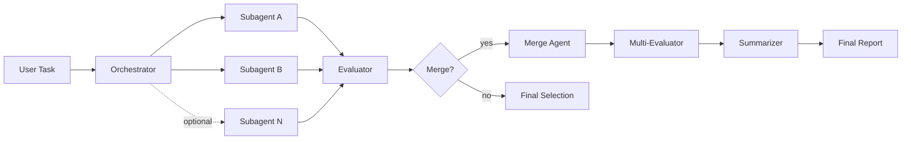
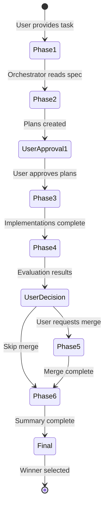

# Multi-Agent Orchestration Framework

A reusable framework for orchestrating parallel subagents to solve complex tasks. This guide abstracts the patterns and prompts from a proven orchestration workflow into templates that can be applied to any task.

---

## Table of Contents

- [Overview](#overview)
- [When to Use This Framework](#when-to-use-this-framework)
- [Core Concepts](#core-concepts)
- [Workflow Phases](#workflow-phases)
- [Quick Start](#quick-start)
- [Templates](#templates)
- [Best Practices](#best-practices)
- [Customization Guide](#customization-guide)
- [Example Workflows](#example-workflows)

---

## Overview

This framework enables **parallel-divergent development with convergent evaluation** - a pattern where:

1. Multiple independent agents work on the same problem simultaneously
2. Each agent produces a distinct solution
3. Evaluator agents objectively compare the solutions
4. The best solution (or a merge of best features) is selected



### Key Metrics from Reference Implementation

| Metric | Value |
|--------|-------|
| Workflow Phases | 6 |
| Parallel Subagents | 2-4 |
| Evaluator Confidence | 3 parallel evaluators |
| Winner Selection | Unanimous (3/3) |
| Final Score | 9.07/10 |

---

## When to Use This Framework

### Good Candidates

| Scenario | Why It Works |
|----------|--------------|
| Multiple valid approaches exist | Parallel exploration finds optimal solution |
| High-stakes changes | Independent evaluation reduces bias |
| Complex refactoring | Isolated worktrees prevent interference |
| Code quality matters | Weighted criteria ensure objectivity |
| Learning new patterns | Compare approaches to understand trade-offs |

### Poor Candidates

| Scenario | Why It's Overkill |
|----------|-------------------|
| Simple bug fixes | Single agent is sufficient |
| Well-defined implementations | No divergence needed |
| Time-critical changes | Parallel overhead adds latency |
| Trivial changes | Evaluation cost exceeds benefit |

---

## Core Concepts

### 1. The Orchestrator

The orchestrator is the central coordinator responsible for:

- **Task decomposition** - Breaking the problem into subagent assignments
- **Subagent management** - Launching, monitoring, and collecting results
- **Gatekeeper role** - All subagent questions flow through orchestrator to user
- **Phase transitions** - Controlling when to move between phases
- **User approval gates** - Ensuring explicit approval before critical decisions

### 2. Subagents

Subagents are specialized workers that:

- Work in **isolated environments** (git worktrees)
- Have **limited scope** (planning OR implementation, not both)
- Produce **structured outputs** (plans, code, reports)
- Document their work via **git notes**

### 3. Evaluators

Evaluators provide objective assessment:

- **Independent** - Fresh context, no knowledge of which solution is "expected" to win
- **Criteria-driven** - Score against weighted rubric
- **Evidence-based** - Cite specific code examples
- **Recommendation-focused** - Clear winner with rationale

### 4. Git Worktrees

Each subagent works in an isolated git worktree:

```bash
# Create isolated worktree
git worktree add -b "fix/task-subagent-a" ".claude/tmp/worktrees/task-a" main
```

Benefits:
- No cross-contamination between solutions
- Easy comparison via git diff
- Rollback is trivial (remove worktree)
- Parallel work without merge conflicts

---

## Workflow Phases



### Phase 1: Initialization

**Goal**: Orchestrator understands the task

**Actions**:
1. User provides orchestration prompt
2. Orchestrator reads base task specification
3. Orchestrator identifies deliverables and constraints

**Template**: [orchestrator-prompt.md](./templates/orchestrator-prompt.md)

### Phase 2: Planning (Parallel)

**Goal**: Multiple independent plans for comparison

**Actions**:
1. Launch N subagents in parallel
2. Each subagent reads task spec and creates detailed plan
3. Subagents research solutions (web search permitted)
4. Plans written to designated output paths

**Template**: [planning-prompt.md](./templates/planning-prompt.md)

**User Approval Gate**: Compare plans side-by-side, approve before implementation

### Phase 3: Implementation (Parallel)

**Goal**: Working solutions in isolated environments

**Actions**:
1. Each subagent creates git worktree
2. Implements their approved plan
3. Tests implementation
4. Commits with descriptive message
5. Adds git notes documenting work

**Template**: [implementation-prompt.md](./templates/implementation-prompt.md)

### Phase 4: Evaluation

**Goal**: Objective comparison of solutions

**Actions**:
1. Evaluator subagent(s) read all implementations
2. Score each against weighted criteria
3. Cite specific code examples
4. Make clear recommendation

**Template**: [evaluator-prompt.md](./templates/evaluator-prompt.md)

### Phase 5: Merge (Optional)

**Goal**: Combine best features from multiple solutions

**Actions**:
1. Identify specific features to adopt from each solution
2. Create merged implementation in new worktree
3. Test merged solution thoroughly
4. Document integration decisions

**Template**: [merge-prompt.md](./templates/merge-prompt.md)

**Warning**: Merging is harder than it appears. See [Best Practices](#merge-strategy).

### Phase 6: Final Evaluation (Parallel)

**Goal**: High-confidence recommendation via consensus

**Actions**:
1. Launch 3+ evaluators in parallel with fresh context
2. Each evaluator independently scores all solutions
3. Summarizer consolidates reports
4. Final recommendation based on average scores and vote count

**Templates**:
- [parallel-evaluator-prompt.md](./templates/parallel-evaluator-prompt.md)
- [summarizer-prompt.md](./templates/summarizer-prompt.md)

---

## Quick Start

### Step 1: Define Your Task

Create a task specification file:

```markdown
# Task: [Your Task Name]

## Context
[Background and project information]

## Problem Statement
[What needs to be solved]

## Requirements
1. [Requirement 1]
2. [Requirement 2]
...

## Constraints
- [Constraint 1]
- [Constraint 2]

## Success Criteria
- [ ] [Criterion 1]
- [ ] [Criterion 2]
```

### Step 2: Create Orchestration Prompt

Copy and customize [orchestrator-prompt.md](./templates/orchestrator-prompt.md):

1. Update `<context>` with your task specification path
2. Modify evaluation criteria for your domain
3. Adjust subagent count (2-4 recommended)
4. Set web access policy if needed

### Step 3: Launch Orchestration

```
[Paste your customized orchestration prompt to Claude]
```

### Step 4: Monitor and Approve

At each user approval gate:
1. Review subagent outputs
2. Approve, request modifications, or add subagents
3. Let orchestrator proceed to next phase

### Step 5: Review Final Report

The summarizer provides:
- Averaged scores across evaluators
- Consensus analysis
- Final recommendation with rationale

---

## Templates

All templates are located in the [templates/](./templates/) directory:

| Template | Purpose | Phase |
|----------|---------|-------|
| [orchestrator-prompt.md](./templates/orchestrator-prompt.md) | Main coordination prompt | All |
| [planning-prompt.md](./templates/planning-prompt.md) | Subagent planning task | 2 |
| [implementation-prompt.md](./templates/implementation-prompt.md) | Subagent implementation task | 3 |
| [evaluator-prompt.md](./templates/evaluator-prompt.md) | Solution comparison | 4 |
| [merge-prompt.md](./templates/merge-prompt.md) | Feature combination | 5 |
| [parallel-evaluator-prompt.md](./templates/parallel-evaluator-prompt.md) | Independent evaluation | 6 |
| [summarizer-prompt.md](./templates/summarizer-prompt.md) | Report consolidation | 6 |
| [git-notes-template.md](./templates/git-notes-template.md) | Documentation format | 3-5 |
| [evaluation-rubric.md](./templates/evaluation-rubric.md) | Scoring criteria | 4, 6 |

---

## Best Practices

### Requirements Management

**Lock requirements before implementation begins.**

```markdown
## Requirements Lock Protocol
1. All requirements documented before planning
2. All requirements reviewed by user
3. Requirements frozen during implementation
4. All subagents receive IDENTICAL specs
```

**Why**: The reference implementation showed that Subagent C won partly because it had enhanced requirements (--dry-run, --migrate, --verbose) that A and B didn't receive. This created an unfair comparison.

### Evaluation Criteria

**Provide specific rubrics, not vague criteria.**

Bad:
```markdown
### Safety (20%)
- Does it protect user data?
```

Good:
```markdown
### Safety (20%)
- 10/10: Has --dry-run, validates input, checks permissions, preserves existing files
- 8/10: Missing one of the above
- 6/10: Missing two of the above
- 4/10: Only basic safety (preserves existing files)
- 2/10: No explicit safety measures
```

### Merge Strategy

**Prefer incremental enhancement over full merge.**

Instead of:
```
A + B + C → D (merge all features)
```

Do:
```
C (winner) → C' (add B's feature X) → C'' (add A's feature Y)
```

**Why**: The reference implementation showed Solution D scored lower (8.53) than C (9.07) despite having more features. Merging introduced integration bugs that didn't exist in any original.

### Parallel Evaluators

**Use 3+ evaluators for high-stakes decisions.**

| Single Evaluator | Multiple Evaluators |
|------------------|---------------------|
| One perspective | Consensus validation |
| Potential bias | Bias detection |
| No variance data | Confidence intervals |

In the reference implementation:
- Solution D scores: 8.95, 8.10, 8.55 (variance: 0.85)
- Solution C scores: 8.95, 9.10, 9.15 (variance: 0.20)

High variance signals problems (D had integration bugs).

### Git Workflow

**Every subagent works in isolated worktree.**

```bash
# Template for worktree creation
git worktree add -b "task/subagent-${ID}-$(date +%Y%m%d-%H%M%S)" \
  ".claude/tmp/worktrees/task-${ID}" main
```

Benefits:
- Zero cross-contamination
- Easy `git diff branch-a branch-b`
- Atomic rollback (remove worktree)
- No merge conflicts during parallel work

### Documentation

**Require git notes for all implementations.**

Git notes provide:
- Audit trail of decisions
- Root cause documentation
- Trade-off rationale
- Testing results

See [git-notes-template.md](./templates/git-notes-template.md).

---

## Customization Guide

### Adjusting Subagent Count

| Count | Use Case |
|-------|----------|
| 2 | Simple comparisons, binary choices |
| 3 | Moderate complexity, want tie-breaker |
| 4+ | High complexity, many valid approaches |

### Adjusting Evaluation Weights

Default weights from reference implementation:

| Criterion | Weight | Adjust For |
|-----------|--------|------------|
| Correctness | 25% | Higher if bugs are costly |
| Safety | 20% | Higher for production systems |
| Code Quality | 20% | Higher for long-lived code |
| Feature Completeness | 15% | Lower if scope is fixed |
| Robustness | 10% | Higher for unreliable environments |
| Backwards Compatibility | 10% | Higher for public APIs |

### Adding Domain-Specific Criteria

```markdown
## Evaluation Criteria

### Standard Criteria
[Copy from template]

### Domain-Specific Criteria

#### Performance (15%)
- 10/10: Sub-100ms response time, O(n) complexity
- 8/10: Sub-500ms response time, O(n log n) complexity
- 6/10: Sub-1s response time
- 4/10: Exceeds 1s
- 2/10: No performance consideration
```

---

## Example Workflows

### Example 1: API Refactoring

```markdown
## Task: Refactor REST API to GraphQL

## Subagent Approaches
- A: Schema-first with code generation
- B: Code-first with decorators
- C: Hybrid with gradual migration

## Evaluation Focus
- Schema design quality
- Migration complexity
- Performance impact
- Client compatibility
```

### Example 2: Testing Strategy

```markdown
## Task: Implement Testing Framework

## Subagent Approaches
- A: Unit tests with Jest
- B: Integration tests with Playwright
- C: Property-based testing with fast-check

## Evaluation Focus
- Coverage metrics
- Execution speed
- Maintenance burden
- CI integration
```

### Example 3: Performance Optimization

```markdown
## Task: Optimize Database Queries

## Subagent Approaches
- A: Index optimization
- B: Query rewriting
- C: Caching layer

## Evaluation Focus
- Query time reduction
- Memory usage
- Implementation complexity
- Production risk
```

---

## Related Documentation

- [Original Workflow Reconstruction](../index.md) - Full case study
- [Orchestrator Reflection](../reports/orchestrator-end-reflection.md) - Lessons learned
- [Session Extraction Guide](../../session-extraction-guide.md) - How to analyze sessions

---

## Appendix: Workflow Checklist

```markdown
## Pre-Workflow Checklist
- [ ] Task specification complete
- [ ] Requirements locked
- [ ] Evaluation criteria defined with rubrics
- [ ] Subagent count determined (2-4)
- [ ] Git worktree paths planned
- [ ] Output paths defined for each phase

## Phase Completion Checklist
- [ ] Phase 1: Orchestrator understands task
- [ ] Phase 2: All plans created and compared
- [ ] User Approval: Plans approved
- [ ] Phase 3: All implementations complete with tests passing
- [ ] Phase 4: Initial evaluation complete
- [ ] (Optional) Phase 5: Merge complete
- [ ] Phase 6: Multiple evaluators scored all solutions
- [ ] Final: Summarizer produced recommendation
- [ ] Winner selected with consensus
```

---

*Generated from orchestration session analysis - 2026-02-05*
