# Multi-Agent Orchestration Workflow Reconstruction

A complete reconstruction of session `88707686-686d-43c1-a3fa-b8c33ac86e2a` - a complex multi-agent orchestration for fixing the `install.sh` script.

---

## Table of Contents

- [Executive Summary](#executive-summary)
- [Session Metadata](#session-metadata)
- [Complete Workflow Tree](#complete-workflow-tree)
- [Phase 1: Initialization](#phase-1-initialization)
  - [User Input (Orchestration Prompt)](#user-input-orchestration-prompt)
  - [Orchestrator Understanding](#orchestrator-understanding)
- [Phase 2: Planning (Parallel Subagents)](#phase-2-planning-parallel-subagents)
  - [Subagent A: Planning](#subagent-a-planning)
  - [Subagent B: Planning](#subagent-b-planning)
  - [Plan Comparison and User Approval](#plan-comparison-and-user-approval)
- [User Decision Point: Adding Subagent C](#user-decision-point-adding-subagent-c)
- [Phase 3: Implementation (Parallel Subagents)](#phase-3-implementation-parallel-subagents)
  - [Subagent A: Implementation](#subagent-a-implementation)
  - [Subagent B: Implementation](#subagent-b-implementation)
  - [Subagent C: Implementation (Added)](#subagent-c-implementation-added)
- [Phase 4: First Evaluation](#phase-4-first-evaluation)
  - [Evaluator: 3-Way Comparison](#evaluator-3-way-comparison)
- [Phase 5: Merge Solution](#phase-5-merge-solution)
  - [Subagent D: Merge Best Features](#subagent-d-merge-best-features)
- [Phase 6: Final Evaluation (Parallel Evaluators)](#phase-6-final-evaluation-parallel-evaluators)
  - [Evaluator 1](#evaluator-1)
  - [Evaluator 2](#evaluator-2)
  - [Evaluator 3](#evaluator-3)
  - [Summarizer: Consolidation](#summarizer-consolidation)
- [Git Notes: Subagent Reflections](#git-notes-subagent-reflections)
- [Git Operations](#git-operations)
- [Artifacts and Prompts](#artifacts-and-prompts)
- [Detailed Mermaid Diagrams](#detailed-mermaid-diagrams)
- [Orchestrator Reflection](#orchestrator-reflection)

---

## Executive Summary

This session demonstrates a sophisticated multi-agent orchestration pattern for software development:

| Metric | Value |
|--------|-------|
| **Session Duration** | ~3.5 hours (6:45pm - 10:15pm ET) |
| **Total Subagents Spawned** | 16 |
| **Unique Subagent Roles** | 6 (A, B, C, D, Evaluator, Summarizer) |
| **Workflow Phases** | 6 |
| **Git Worktrees Created** | 4 |
| **Final Recommendation** | Solution C (unanimous) |

**Workflow Pattern**: Parallel-divergent development with convergent evaluation


```text
User Prompt → Orchestrator → [A, B] parallel → [A, B, C] parallel → Evaluator → D (merge) → [E1, E2, E3] parallel → Summarizer → Final Report
```


---

## Session Metadata

```json
{
  "session_id": "88707686-686d-43c1-a3fa-b8c33ac86e2a",
  "project": "/home/sabossedgh/repos/ai-sidekicks",
  "git_branch": "develop",
  "start_time": "2026-02-04T23:45:11.471Z",
  "end_time": "2026-02-05T03:12:59.089Z",
  "message_counts": {
    "user": 68,
    "assistant": 130,
    "progress": 362,
    "system": 7
  },
  "tool_usage": {
    "Task": 16,
    "Bash": 15,
    "Read": 13,
    "Write": 3,
    "Edit": 1,
    "Skill": 1,
    "TaskOutput": 1
  }
}
```

---

## Complete Workflow Tree


---

## Phase 1: Initialization

### User Input (Orchestration Prompt)

**Timestamp**: `2026-02-04T23:45:11.471Z`

The user provided a comprehensive orchestration prompt defining:

```xml
<role>
You are a principal orchestration engineer with deep expertise in multi-agent
coordination, task decomposition, and quality assurance workflows.
</role>

<context>
## Mission
Orchestrate two parallel subagents working on the same task specification.
Act as a strict gatekeeper for all questions, permissions, and access requests.
Coordinate a three-phase workflow: planning, implementation, and evaluation.

## Task Specification
Both subagents will work from the same base prompt located at:
`/home/sabossedgh/repos/ai-sidekicks/.claude/tmp/sessions/2026-02-04/artifacts/fix-install-script-prompt.md`
</context>
```

**Key Requirements from Prompt**:

| Requirement | Description |
|-------------|-------------|
| Parallel Planning | Launch 2 subagents simultaneously for Phase 1 |
| Strict Gatekeeper | All questions must pass through orchestrator to user |
| Side-by-side Comparison | Present both plans simultaneously |
| Git Worktrees | Each subagent works in isolated worktree |
| Evaluator Subagent | Third agent for final recommendation |
| Git Notes | Comprehensive documentation of changes |

### Orchestrator Understanding

The orchestrator's first action was to read the base task specification:

```json
{
  "tool": "Read",
  "timestamp": "2026-02-04T23:45:18.148Z",
  "file_path": "/home/sabossedgh/repos/ai-sidekicks/.claude/tmp/sessions/2026-02-04/artifacts/fix-install-script-prompt.md"
}
```

**Five Issues to Fix** (from base spec):
1. Uninstall doesn't restore original files
2. `--unlink --project` flag ignored
3. Orphaned `.bak` files accumulate
4. `settings.json` not backed up when content differs
5. No way to identify ai-sidekicks backups vs user backups

---

## Phase 2: Planning (Parallel Subagents)

### Subagent A: Planning

**Spawn Details**:
```json
{
  "timestamp": "2026-02-04T23:45:35.921Z",
  "tool_id": "toolu_01MUCrLftdDLbCKXTWT97zqj",
  "subagent_type": "general-purpose",
  "description": "Subagent A: Create install.sh fix plan",
  "prompt_length": 1913,
  "run_in_background": false
}
```

**Prompt Given to Subagent A**:
```markdown
## Your Role
You are **Subagent A** working on a planning task for fixing the `install.sh` script.

## Base Task Specification
Read and analyze the task specification at:
`/home/sabossedgh/repos/ai-sidekicks/.claude/tmp/sessions/2026-02-04/artifacts/fix-install-script-prompt.md`

Also read the current implementation:
`/home/sabossedgh/repos/ai-sidekicks/install.sh`

## Deliverable
A comprehensive plan including:
- Issue analysis with root cause identification
- Proposed solution for each issue
- Manifest file design (if applicable)
- Testing approach
- Potential risks and mitigations

## Constraints
- Do NOT implement anything yet
- Do NOT modify any files
- Research existing solutions (GNU Stow, dpkg, chezmoi) for inspiration

## Output Format
Write your plan to:
`/home/sabossedgh/repos/ai-sidekicks/.claude/tmp/sessions/2026-02-04/subagents/subagent-a/install-fix-plan.md`
```

**Output Produced**:
- File: [plans/subagent-a-plan.md](./plans/subagent-a-plan.md) (original: `.claude/tmp/sessions/2026-02-04/subagents/subagent-a/install-fix-plan.md`)
- Approach: **JSON manifest file** (`.ai-sidekicks-manifest.json`)
- Proposed 12 new functions

---

### Subagent B: Planning

**Spawn Details**:
```json
{
  "timestamp": "2026-02-04T23:45:39.796Z",
  "tool_id": "toolu_01HVNfd5SDbXkz86eGK3Xi2D",
  "subagent_type": "general-purpose",
  "description": "Subagent B: Create install.sh fix plan",
  "prompt_length": 1913,
  "run_in_background": false
}
```

**Prompt Given to Subagent B**: (Same structure as A, different output path)

**Output Produced**:
- File: [plans/subagent-b-plan.md](./plans/subagent-b-plan.md) (original: `.claude/tmp/sessions/2026-02-04/subagents/subagent-b/install-fix-plan.md`)
- Approach: **Key-value text manifest** (`.ai-sidekicks-manifest`)
- Proposed 10 new functions

---

### Plan Comparison and User Approval

The orchestrator read both plans and presented a side-by-side comparison:

| Aspect | Subagent A | Subagent B |
|--------|------------|------------|
| Manifest Format | JSON | Key-Value Text |
| Parsing Complexity | Requires bash JSON parsing | Simple grep/sed |
| Functions Proposed | 12 | 10 |
| Test Scenarios | 5 + edge cases | 7 + edge cases |
| Risks Identified | 5 | 6 |

**User Decision**: Approved BOTH plans + requested adding **Subagent C** with enhanced features (--dry-run, --migrate, --verbose)

---

## User Decision Point: Adding Subagent C

This section documents the critical user intervention that expanded the workflow from 2 to 3 parallel implementations.

### Context

After the orchestrator presented the side-by-side plan comparison, the user saw that:
- **Subagent A** proposed a JSON manifest approach (more structured, but requires bash JSON parsing)
- **Subagent B** proposed a key-value manifest approach (simpler parsing, but less structured)

Neither plan included advanced user-facing features like dry-run mode or migration support.

### User's Enhancement Request

The user decided to:
1. **Approve both existing plans** to proceed with parallel implementation
2. **Add a third subagent (C)** with enhanced requirements

The user specified that Subagent C should include:

| Feature | Purpose |
|---------|---------|
| `--dry-run` | Preview changes without modifying files |
| `--verbose` | Detailed output for debugging |
| `--migrate` | Upgrade legacy installations to new manifest system |
| Atomic writes | Prevent partial writes using temp file + rename |

### How Subagent C Was Created

Unlike Subagents A and B (which were defined in the original orchestration prompt), Subagent C emerged from user feedback during the workflow.

**Sequence of Events**:


### Orchestrator's Response

The orchestrator created a custom task file for Subagent C that:
1. Referenced an enhanced plan combining the best of A and B with user-requested features
2. Included explicit instructions for implementing `--dry-run`, `--verbose`, and `--migrate`
3. Required atomic writes using temp file + rename pattern
4. Maintained the same git notes and testing requirements as A and B

**Task file created**: [tasks/subagent-c-task.md](./tasks/subagent-c-task.md)

### Key Insight

This decision point demonstrates the **human-in-the-loop** pattern in multi-agent orchestration:
- Subagents executed initial planning in parallel
- User reviewed outputs and identified gaps
- User injected new requirements mid-workflow
- Orchestrator adapted by creating a third parallel track

This flexibility allowed the workflow to evolve based on emerging insights rather than being rigidly fixed from the start.

---

## Phase 3: Implementation (Parallel Subagents)

### First Attempt (Background)

The orchestrator first attempted to run all three in background:

```json
[
  {"timestamp": "2026-02-05T01:08:43.580Z", "description": "Subagent A: Implement", "run_in_background": true},
  {"timestamp": "2026-02-05T01:08:50.939Z", "description": "Subagent B: Implement", "run_in_background": true},
  {"timestamp": "2026-02-05T01:09:01.604Z", "description": "Subagent C: Implement", "run_in_background": true}
]
```

### Retry (Foreground)

After monitoring progress, re-launched in foreground:

```json
[
  {"timestamp": "2026-02-05T01:17:28.910Z", "description": "Subagent A: Implement", "run_in_background": false},
  {"timestamp": "2026-02-05T01:17:33.124Z", "description": "Subagent B: Implement", "run_in_background": false},
  {"timestamp": "2026-02-05T01:17:38.460Z", "description": "Subagent C: Implement", "run_in_background": false}
]
```

### Subagent A: Implementation

**Worktree Setup**:
```bash
git worktree add -b fix/install-script-a-20260204-201740 \
  .claude/tmp/worktrees/fix-install-a develop
```

**Implementation Details**:
- File: `.claude/tmp/worktrees/fix-install-a/install.sh`
- Lines: ~555
- Manifest: JSON format
- Git commit: `d87c076`

---

### Subagent B: Implementation

**Worktree Setup**:
```bash
git worktree add -b fix/install-script-b-20260204-201742 \
  .claude/tmp/worktrees/fix-install-b develop
```

**Implementation Details**:
- File: `.claude/tmp/worktrees/fix-install-b/install.sh`
- Lines: ~416
- Manifest: Key-value format
- Git commit: `d7dddef`

---

### Subagent C: Implementation (Added)

**Task File Created** (via Bash):
```bash
cat > .claude/tmp/sessions/2026-02-04/tasks/fix-install-script-task.md << 'TASKEOF'
# Task: Implement install.sh Fixes (Subagent C)

## Your Role
You are **Subagent C** implementing fixes for the `install.sh` script.

## Additional Features to Implement
- `--dry-run` mode for previewing changes
- `--verbose` mode for debugging
- `--migrate` command for legacy installations
- Atomic writes using temp file + rename

## Phase 4: Git Notes
After committing your implementation, add comprehensive git notes:
git notes add -m "$(cat <<'EOF'
## Issues Found and Fixed (Subagent C Implementation)
...
EOF
)" HEAD
TASKEOF
```

**Implementation Details**:
- File: `.claude/tmp/worktrees/fix-install-c/install.sh`
- Lines: ~771
- Manifest: Enhanced key-value with additional features
- Git commit: `76168bc`

---

## Phase 4: First Evaluation

### Evaluator: 3-Way Comparison

**Spawn Details**:
```json
{
  "timestamp": "2026-02-05T01:27:21.061Z",
  "tool_id": "toolu_01KkDeX2t2uegPzVdAMNrcpa",
  "subagent_type": "general-purpose",
  "description": "Evaluator: Compare three install.sh implementations",
  "prompt_length": 4493
}
```

**Evaluation Criteria** (from prompt):
1. Correctness (25%) - Solves all 5 issues?
2. Safety (20%) - Protects user data?
3. Code Quality (20%) - Readable? Shellcheck-compliant?
4. Feature Completeness (15%) - Has --dry-run, --migrate, --verbose?
5. Robustness (10%) - Handles errors gracefully?
6. Backwards Compatibility (10%) - Works with legacy installations?

**Initial Finding**: Solution C recommended (best feature set)

---

## Phase 5: Merge Solution

### Prompt Engineering Skill Invocation

**Timestamp**: `2026-02-05T02:40:21.462Z`

The orchestrator used the `/prompt-engineering` skill to generate a merge prompt:

```json
{
  "tool": "Skill",
  "skill": "prompt-engineering"
}
```

**Output**: [prompts/merge-subagent-prompt.md](./prompts/merge-subagent-prompt.md) (original: `.claude/tmp/sessions/2026-02-04/prompts/merge-subagent-prompt.md`)

Validated with: `python3 prompt-engineering/scripts/validate-prompt.py`

---

### Subagent D: Merge Best Features

**First Invocation**:
```json
{
  "timestamp": "2026-02-05T02:42:35.882Z",
  "description": "Subagent D: Merge best features from all solutions",
  "prompt_length": 9015
}
```

**Features to Merge** (from prompt):
| Source | Feature |
|--------|---------|
| Solution C | `--dry-run`, `--migrate`, `--verbose`, `parse_args()`, `manifest_validate()` |
| Solution B | Portable checksum with explicit Linux/macOS stat detection |
| Solution A | Per-item timestamps in manifest entries |

**Second Invocation** (retry):
```json
{
  "timestamp": "2026-02-05T02:46:58.733Z",
  "description": "Subagent D: Merge best features from all solutions",
  "prompt_length": 1429
}
```

**Implementation Details**:
- File: `.claude/tmp/worktrees/fix-install-d/install.sh`
- Lines: ~816
- Git commit: `551ccae`

---

## Phase 6: Final Evaluation (Parallel Evaluators)

The user requested 3 independent evaluators running in parallel for unbiased assessment.

### Evaluator 1

```json
{
  "timestamp": "2026-02-05T03:08:24.624Z",
  "description": "Evaluator 1: Compare all four solutions",
  "prompt_length": 2814
}
```

**Output**: [reports/evaluator-1-report.md](./reports/evaluator-1-report.md) (original: `.claude/tmp/sessions/2026-02-04/subagents/evaluator-1/report.md`)

---

### Evaluator 2

```json
{
  "timestamp": "2026-02-05T03:08:32.082Z",
  "description": "Evaluator 2: Compare all four solutions",
  "prompt_length": 2814
}
```

**Output**: [reports/evaluator-2-report.md](./reports/evaluator-2-report.md) (original: `.claude/tmp/sessions/2026-02-04/subagents/evaluator-2/report.md`)

---

### Evaluator 3

```json
{
  "timestamp": "2026-02-05T03:08:39.600Z",
  "description": "Evaluator 3: Compare all four solutions",
  "prompt_length": 2814
}
```

**Output**: [reports/evaluator-3-report.md](./reports/evaluator-3-report.md) (original: `.claude/tmp/sessions/2026-02-04/subagents/evaluator-3/report.md`)

---

### Summarizer: Consolidation

```json
{
  "timestamp": "2026-02-05T03:11:00.414Z",
  "description": "Summarizer: Consolidate 3 evaluator reports",
  "prompt_length": 3386
}
```

**Task**: Calculate arithmetic mean of all three evaluators' scores

**Output**: [artifacts/final-evaluation-summary.md](./artifacts/final-evaluation-summary.md) (original: `.claude/tmp/sessions/2026-02-04/artifacts/final-evaluation-summary.md`)

---

## Git Notes: Subagent Reflections

A critical but often overlooked part of the workflow was requiring subagents to document their work using **git notes**. This section details what each subagent was instructed to capture in their reflection notes.

### Purpose of Git Notes in This Workflow

Git notes serve as:
1. **Audit trail** - Document what was done and why
2. **Knowledge transfer** - Allow evaluators to understand implementation decisions
3. **Self-reflection** - Force subagents to articulate trade-offs
4. **Future reference** - Enable learning from past implementations

### Git Notes Template

Each implementation subagent (A, B, C, D) was required to add git notes after committing their implementation. The template specified in [tasks/subagent-c-task.md](./tasks/subagent-c-task.md):

```bash
git notes add -m "$(cat <<'EOF'
## Subagent [A/B/C] Implementation Notes

### Issues Found

1. **Uninstall doesn't restore original files**
   - Root cause: Lines 126-144 in unlink_config()
   - The function copies from source instead of restoring .bak
   - Fix: Added restore_backup() function

2. **Project flag ignored in unlink**
   - Root cause: Lines 171-173 in main case statement
   - $2 (--project) never passed to get_target_dir
   - Fix: [Your fix description]

3. **Orphaned backup files**
   - Root cause: No cleanup mechanism
   - Fix: [Your fix description]

4. **Settings not backed up**
   - Root cause: Lines 97-120 only warn, don't backup
   - Fix: [Your fix description]

5. **No ownership identification**
   - Root cause: Generic .bak suffix
   - Fix: .ai-sidekicks.bak suffix + manifest tracking

### Solutions Applied

1. **Manifest-based tracking**: [Describe your manifest approach]
2. **Backup suffix**: Using .ai-sidekicks.bak for clear ownership
3. **Restore logic**: [Describe your restore implementation]
4. **Argument parsing**: [Describe your fix]

### Trade-offs Considered

- [List design decisions and alternatives considered]

### Testing Results

- Basic restore: PASS/FAIL
- Project unlink: PASS/FAIL
- Orphan cleanup: PASS/FAIL
- Settings backup: PASS/FAIL
- User backups preserved: PASS/FAIL
- Shellcheck: PASS/FAIL
EOF
)" HEAD
```

### What Subagents Were Required to Document

| Section | Purpose | Content |
|---------|---------|---------|
| **Issues Found** | Root cause analysis | Line numbers, why current code fails, impact |
| **Solutions Applied** | Implementation summary | Key functions added, approach taken |
| **Trade-offs Considered** | Decision rationale | Alternatives rejected, why this approach was chosen |
| **Testing Results** | Verification | Pass/fail status for each test scenario |

### Why Git Notes Were Chosen

| Alternative | Limitation |
|-------------|------------|
| Commit message | Too short for detailed documentation |
| Separate markdown file | Not linked to specific commit |
| Code comments | Clutters implementation |
| External documentation | Can become stale |

**Git notes advantages**:
- Attached to specific commit (but don't change commit hash)
- Viewable with `git notes show` or `git log --notes`
- Can be updated without changing history
- Survive rebases when properly configured

### Viewing Git Notes

To view the notes from this session's implementations:

```bash
# In the worktree directory
cd .claude/tmp/worktrees/fix-install-c
git log --notes -1

# Or directly
git notes show HEAD
```

### Full Git Notes Template File

See: [git-notes/git-notes-template.md](./git-notes/git-notes-template.md)

---

## Git Operations

### Worktree Commands

```bash
# Setup worktrees
git checkout develop && mkdir -p .claude/tmp/worktrees

# Create worktree for Solution A
git worktree add -b fix/install-script-a-20260204-201740 \
  .claude/tmp/worktrees/fix-install-a develop

# Create worktree for Solution B
git worktree add -b fix/install-script-b-20260204-201742 \
  .claude/tmp/worktrees/fix-install-b develop

# Create worktree for Solution C
git worktree add -b fix/install-script-c-20260204-201749 \
  .claude/tmp/worktrees/fix-install-c develop

# Create worktree for Solution D
git worktree add -b fix/install-script-d-20260204-214845 \
  .claude/tmp/worktrees/fix-install-d develop
```

### Git Commits

Each subagent committed their implementation:

| Solution | Branch | Commit Hash | Lines |
|----------|--------|-------------|-------|
| A | `fix/install-script-a-*` | `d87c076` | 555 |
| B | `fix/install-script-b-*` | `d7dddef` | 416 |
| C | `fix/install-script-c-*` | `76168bc` | 771 |
| D | `fix/install-script-d-*` | `551ccae` | 816 |

### Git Notes Command Example

Each subagent was instructed to add git notes:

```bash
git notes add -m "$(cat <<'EOF'
## Issues Found and Fixed (Subagent X Implementation)

### Issue 1: Uninstall doesn't restore original files
- **Root Cause**: Lines 126-144 - `unlink_config()` copies from source instead of .bak
- **Fix**: Rewrote `unlink_config()` to check manifest and call `restore_backup()`

### Issue 2: Project flag ignored in unlink
- **Root Cause**: Lines 171-173 - `$2` (--project) never passed to `get_target_dir`
- **Fix**: Added `parse_args()` function with proper flag handling

### Issue 3: Orphaned backup files
- **Root Cause**: No cleanup mechanism for .bak files
- **Fix**: `restore_backup()` removes backup after restoring, manifest tracks ownership

### Issue 4: Settings not backed up
- **Root Cause**: Lines 97-120 - only warns, doesn't backup
- **Fix**: Modified `install_config()` to call `create_backup()` before copying

### Issue 5: No ownership tracking
- **Root Cause**: Generic `.bak` suffix
- **Fix**: `.ai-sidekicks.bak` suffix + manifest file for explicit tracking

## Design Decisions
- [Manifest format choice and reasoning]
- [Function decomposition approach]

## Trade-offs
- [What was gained vs what was sacrificed]
EOF
)" HEAD
```

---

## Artifacts and Prompts

All prompts and artifacts from this session are preserved in this directory for reference and reuse.

### Subagent Prompts (Local Copies)

| Prompt | Local Copy | Description |
|--------|------------|-------------|
| Subagent A Planning | [prompts/01-subagent-a-planning.md](./prompts/01-subagent-a-planning.md) | JSON manifest planning task |
| Subagent B Planning | [prompts/02-subagent-b-planning.md](./prompts/02-subagent-b-planning.md) | Key-value manifest planning task |
| Subagent A Implementation | [prompts/06-subagent-a-implementation-v2.md](./prompts/06-subagent-a-implementation-v2.md) | JSON implementation task |
| Subagent B Implementation | [prompts/07-subagent-b-implementation-v2.md](./prompts/07-subagent-b-implementation-v2.md) | Key-value implementation task |
| Subagent C Implementation | [prompts/08-subagent-c-implementation-v2.md](./prompts/08-subagent-c-implementation-v2.md) | Enhanced implementation task |
| Evaluator (3-way) | [prompts/09-evaluator-3way.md](./prompts/09-evaluator-3way.md) | Compare A, B, C |
| Subagent D Merge | [prompts/10-subagent-d-merge-v1.md](./prompts/10-subagent-d-merge-v1.md) | Merge best features |
| Evaluator (4-way) | [prompts/12-evaluator-4way.md](./prompts/12-evaluator-4way.md) | Compare A, B, C, D |
| Evaluators 1-3 | [prompts/13-evaluator-1.md](./prompts/13-evaluator-1.md) | Parallel independent evaluation |
| Summarizer | [prompts/16-summarizer.md](./prompts/16-summarizer.md) | Consolidate evaluator reports |

### Subagent Plans (Local Copies)

| Plan | Local Copy | Description |
|------|------------|-------------|
| Subagent A Plan | [plans/subagent-a-plan.md](./plans/subagent-a-plan.md) | JSON manifest approach (22KB) |
| Subagent B Plan | [plans/subagent-b-plan.md](./plans/subagent-b-plan.md) | Key-value manifest approach (25KB) |
| Subagent C Plan | [plans/subagent-c-plan.md](./plans/subagent-c-plan.md) | Enhanced implementation with --dry-run, --migrate, --verbose (42KB) |

### Evaluator Reports (Local Copies)

| Report | Local Copy | Description |
|--------|------------|-------------|
| Evaluator 1 Report | [reports/evaluator-1-report.md](./reports/evaluator-1-report.md) | Independent 4-way evaluation |
| Evaluator 2 Report | [reports/evaluator-2-report.md](./reports/evaluator-2-report.md) | Independent 4-way evaluation |
| Evaluator 3 Report | [reports/evaluator-3-report.md](./reports/evaluator-3-report.md) | Independent 4-way evaluation |

### Task Files

| Task | Local Copy | Description |
|------|------------|-------------|
| Subagent C Task | [tasks/subagent-c-task.md](./tasks/subagent-c-task.md) | Full implementation task with git notes template |

### Git Notes

| File | Description |
|------|-------------|
| [git-notes/git-notes-template.md](./git-notes/git-notes-template.md) | Template subagents used for documentation |

### Core Prompts (Local Copies)

| Prompt | Local Copy | Description |
|--------|------------|-------------|
| Orchestration Prompt | [prompts/orchestration-agent-prompt.md](./prompts/orchestration-agent-prompt.md) | Initial user prompt that started the workflow |
| Base Task Spec | [prompts/fix-install-script-prompt.md](./prompts/fix-install-script-prompt.md) | Requirements for fixing install.sh |
| Merge Prompt | [prompts/merge-subagent-prompt.md](./prompts/merge-subagent-prompt.md) | Prompt for Subagent D to merge solutions |

### Other Artifacts

| Artifact | Local Copy | Description |
|----------|------------|-------------|
| Subagent C Origin | [artifacts/subagent-c-origin.md](./artifacts/subagent-c-origin.md) | Documents how Subagent C was added mid-workflow |
| Final Evaluation Summary | [artifacts/final-evaluation-summary.md](./artifacts/final-evaluation-summary.md) | Consolidated report with final scores |

### Original Session Artifacts (Runtime Paths)

These are the original paths where artifacts were created during the session:

#### Planning Phase
| Artifact | Original Path |
|----------|---------------|
| Subagent A Plan | `.claude/tmp/sessions/2026-02-04/subagents/subagent-a/install-fix-plan.md` |
| Subagent B Plan | `.claude/tmp/sessions/2026-02-04/subagents/subagent-b/install-fix-plan.md` |
| Subagent C Plan | `.claude/tmp/sessions/2026-02-04/subagents/subagent-c/install-fix-plan.md` |

#### Implementation Phase
| Artifact | Original Path |
|----------|---------------|
| Solution A | `.claude/tmp/worktrees/fix-install-a/install.sh` |
| Solution B | `.claude/tmp/worktrees/fix-install-b/install.sh` |
| Solution C | `.claude/tmp/worktrees/fix-install-c/install.sh` |
| Solution D | `.claude/tmp/worktrees/fix-install-d/install.sh` |
| Task File (C) | `.claude/tmp/sessions/2026-02-04/tasks/fix-install-script-task.md` |
| Merge Prompt | `.claude/tmp/sessions/2026-02-04/prompts/merge-subagent-prompt.md` |

#### Evaluation Phase
| Artifact | Original Path |
|----------|---------------|
| Evaluator 1 Report | `.claude/tmp/sessions/2026-02-04/subagents/evaluator-1/report.md` |
| Evaluator 2 Report | `.claude/tmp/sessions/2026-02-04/subagents/evaluator-2/report.md` |
| Evaluator 3 Report | `.claude/tmp/sessions/2026-02-04/subagents/evaluator-3/report.md` |
| Final Summary | `.claude/tmp/sessions/2026-02-04/artifacts/final-evaluation-summary.md` |

---

## Detailed Mermaid Diagrams

### Subagent Spawn Timeline

```mermaid
gantt
    title Subagent Spawn Timeline
    dateFormat HH:mm
    axisFormat %H:%M

    section Planning
    Subagent A (Plan)     :PA, 23:45, 20m
    Subagent B (Plan)     :PB, 23:45, 20m

    section Implementation
    Subagent A (Impl)     :IA, 01:17, 10m
    Subagent B (Impl)     :IB, 01:17, 10m
    Subagent C (Impl)     :IC, 01:17, 10m

    section Evaluation 1
    Evaluator (3-way)     :E1, 01:27, 15m

    section Merge
    Subagent D            :D, 02:42, 20m

    section Final Eval
    Evaluator 1           :EV1, 03:08, 3m
    Evaluator 2           :EV2, 03:08, 3m
    Evaluator 3           :EV3, 03:08, 3m
    Summarizer            :S, 03:11, 2m
```



### Solution Comparison Tree


### Orchestrator Decision Flow


### Data Flow Diagram


---

## Final Results

### Evaluation Scores (Averaged from 3 Evaluators)

| Solution | Eval 1 | Eval 2 | Eval 3 | **Average** |
|----------|--------|--------|--------|-------------|
| A | 7.00 | 6.65 | 6.75 | **6.80** |
| B | 7.20 | 7.15 | 7.15 | **7.17** |
| C | 8.95 | 9.10 | 9.15 | **9.07** |
| D | 8.95 | 8.10 | 8.55 | **8.53** |

### Recommendation

**Winner**: Solution C (Unanimous 3/3 votes)

**Key Reasons**:
1. Complete feature set (--dry-run, --migrate, --verbose) - 10/10 from all evaluators
2. Best code quality and organization - 8.67/10 average
3. Robust error handling and manifest validation
4. All five issues properly fixed without introducing new bugs
5. Clean argument parsing accepting flags in any order

---

## Orchestrator Reflection

A comprehensive post-mortem analysis of this orchestration session is available in the reflection document.

**[Orchestrator End Reflection](./reports/orchestrator-end-reflection.md)**

The reflection covers:

| Section | Description |
|---------|-------------|
| **Session Overview** | Goals, metrics, and outcomes summary |
| **Workflow Analysis** | Phase-by-phase examination of the orchestration process |
| **What Worked Well** | Successful patterns: parallel execution, isolated worktrees, structured evaluation |
| **What Could Be Improved** | Instruction clarity, dependency management, merge approach |
| **Why Solution D Failed** | Analysis of the "merge paradox" - why combining best features produced inferior results |
| **Key Takeaways** | Lessons for future multi-agent orchestrations |

The reflection includes detailed analysis of evaluator scoring variance, the integration tax of merging solutions, and recommendations for better merge-agent prompts.

---

## Abstract Workflow Framework

This orchestration workflow has been abstracted into a reusable framework that can be applied to any task.

**[Multi-Agent Orchestration Framework](./abstract-workflow/index.md)**

The framework includes:

| Resource | Description |
|----------|-------------|
| [Framework Overview](./abstract-workflow/index.md) | Complete guide to using the orchestration pattern |
| [Orchestrator Template](./abstract-workflow/templates/orchestrator-prompt.md) | Main coordination prompt |
| [Planning Template](./abstract-workflow/templates/planning-prompt.md) | Subagent planning task |
| [Implementation Template](./abstract-workflow/templates/implementation-prompt.md) | Subagent implementation task |
| [Evaluator Template](./abstract-workflow/templates/evaluator-prompt.md) | Solution comparison |
| [Merge Template](./abstract-workflow/templates/merge-prompt.md) | Feature combination |
| [Summarizer Template](./abstract-workflow/templates/summarizer-prompt.md) | Report consolidation |
| [Evaluation Rubric](./abstract-workflow/templates/evaluation-rubric.md) | Scoring criteria definitions |
| [Git Notes Template](./abstract-workflow/templates/git-notes-template.md) | Documentation format |

### Skills

| Skill | Purpose |
|-------|---------|
| [/orchestrate-task](./abstract-workflow/skills/orchestrate-task.md) | Run full orchestration workflow |
| [/create-task-spec](./abstract-workflow/skills/create-task-spec.md) | Create task specification file |
| [/evaluate-solutions](./abstract-workflow/skills/evaluate-solutions.md) | Compare existing solutions |

### Examples

| Example | Description |
|---------|-------------|
| [API Refactoring](./abstract-workflow/examples/api-refactor-example.md) | Complete worked example |
| [Quick Start](./abstract-workflow/examples/quick-start-template.md) | Copy-paste template |

---

## Appendix: Raw Session Data

For programmatic access to this workflow, use the extraction commands from [session-extraction-guide.md](../session-extraction-guide.md):

```bash
SESSION_FILE="$HOME/.claude/projects/-home-sabossedgh-repos-ai-sidekicks/88707686-686d-43c1-a3fa-b8c33ac86e2a.jsonl"

# Extract all Task invocations
grep '"tool_name":"Task"' <(cat $SESSION_FILE | jq -c 'select(.type == "assistant") | .timestamp as $ts | .message.content[] | select(.type == "tool_use") | {timestamp: $ts, tool_name: .name, input: .input}')

# Extract all bash commands
grep '"tool_name":"Bash"' <(cat $SESSION_FILE | jq -c 'select(.type == "assistant") | .timestamp as $ts | .message.content[] | select(.type == "tool_use") | {timestamp: $ts, tool_name: .name, input: .input}')
```
