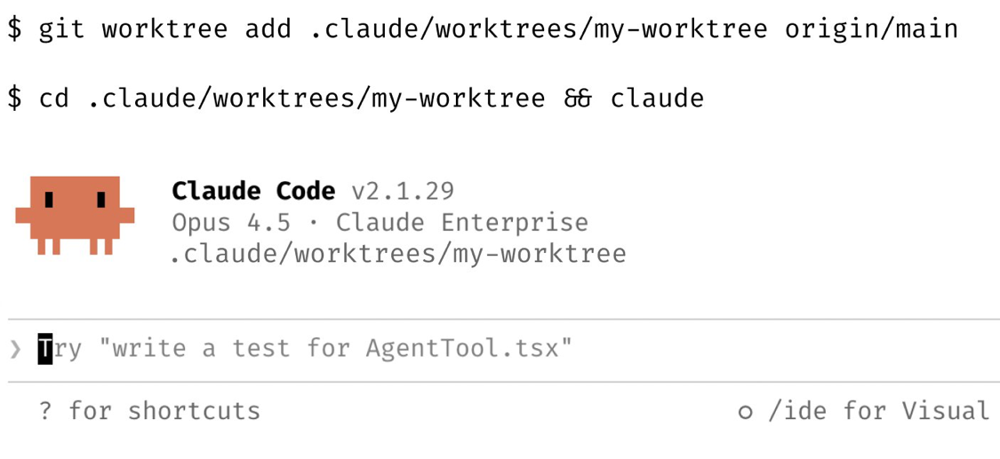
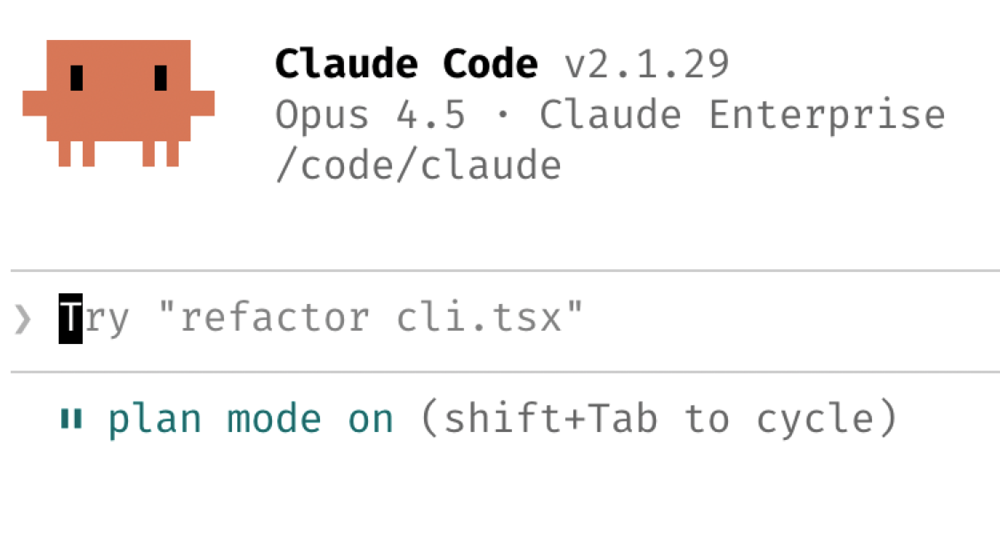
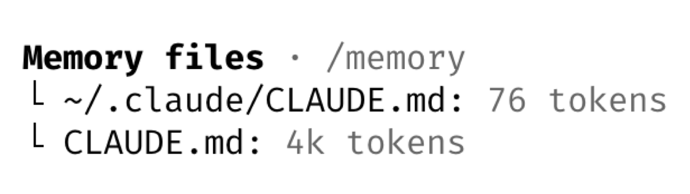
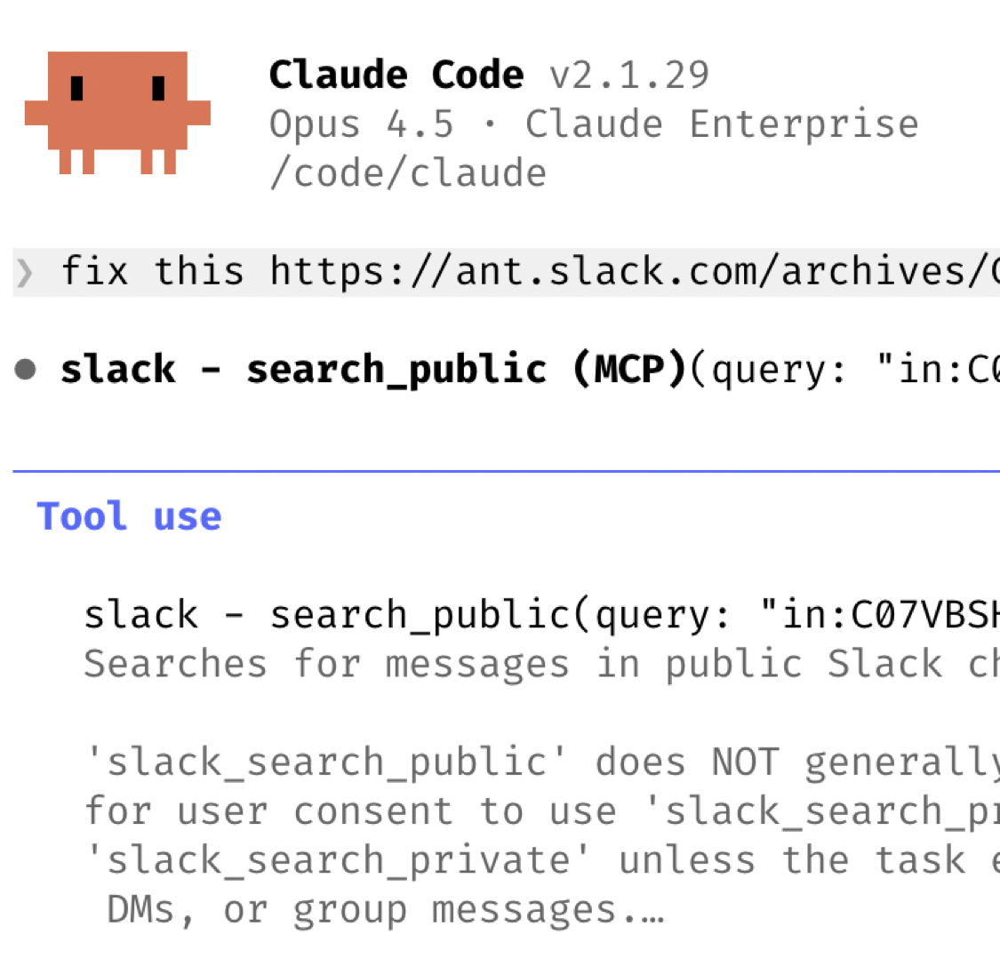
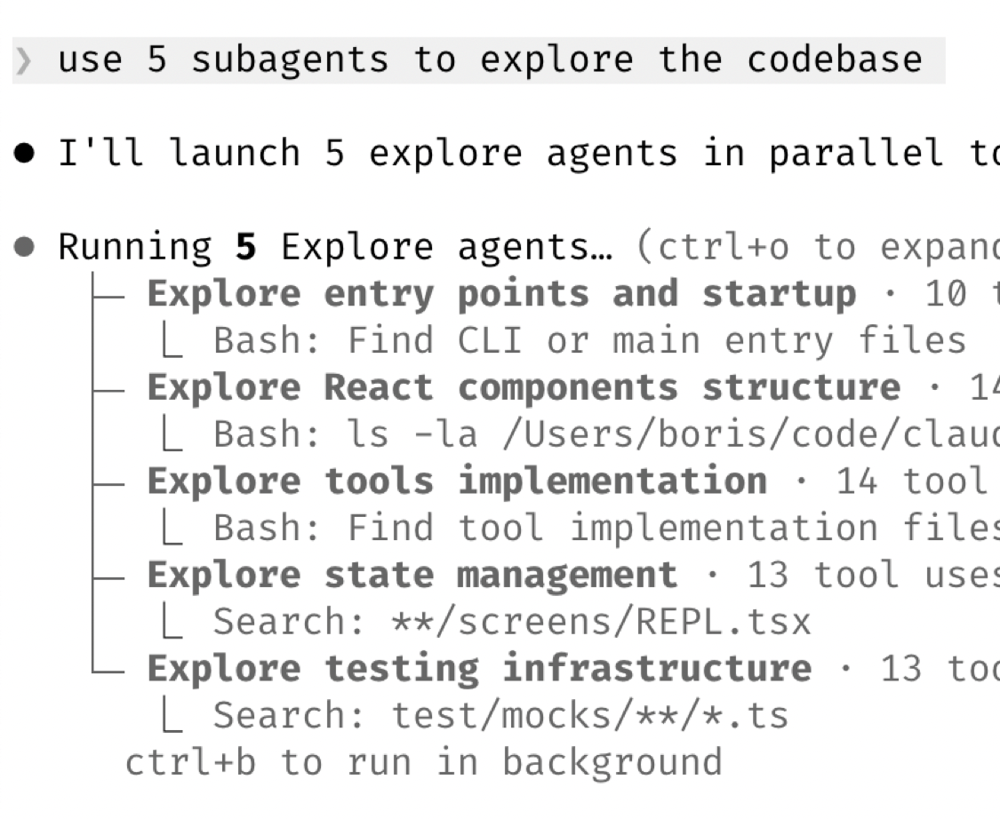

# Claude Code – Power User Playbook

***Best practices of Claude Code***

This document captures high-leverage workflows used internally by the Claude Code team.
There is no single “correct” way to use Claude Code — these are patterns that consistently
deliver large productivity gains in real engineering environments.

The core philosophy is simple:

> **Maximize parallelism, minimize friction, and always give Claude a way to verify its own work.**

---

## Table of Contents

1. [Parallelism Is the Biggest Multiplier](#parallelism-is-the-biggest-multiplier)
2. [Start Every Complex Task in Plan Mode](#start-every-complex-task-in-plan-mode)
3. [Treat CLAUDE.md as a Living Control System](#treat-claudemd-as-a-living-control-system)
4. [Build Your Own Skills and Commands](#build-your-own-skills-and-commands)
5. [Let Claude Fix Bugs End-to-End](#let-claude-fix-bugs-end-to-end)
6. [Level Up Your Prompting](#level-up-your-prompting)
7. [Terminal and Environment Setup](#terminal-and-environment-setup)
8. [Subagents](#subagents)
9. [Data & Analytics with Claude](#data--analytics-with-claude)
10. [Learning with Claude](#learning-with-claude)
11. [Core Principle](#core-principle)

---

## Parallelism Is the Biggest Multiplier



The single highest productivity unlock is running multiple Claude sessions in parallel.

### Recommended pattern

Run **3–5 git worktrees**, each with its own Claude session.

```bash
git worktree add .claude/worktrees/feature-a origin/main
cd .claude/worktrees/feature-a && claude
```

Each worktree becomes a dedicated problem space.

Common setups:

- One worktree per task or ticket
- A dedicated "analysis" worktree for logs and metrics
- Shell aliases (`za`, `zb`, `zc`) for instant switching
- Named terminal tabs, one per worktree

Why worktrees beat multiple clones:

- Shared `.git` object store
- Fast context switching
- Native support in Claude Desktop

<div style="clear: both;"></div>

---

## Start Every Complex Task in Plan Mode



For anything non-trivial, begin in **plan mode**.

The goal is to:

1. Get Claude to fully understand the problem
2. Force explicit design before any code is written
3. Enable one-shot execution

High-performing patterns:

- One Claude writes the plan
- A second Claude reviews it like a staff engineer
- If anything feels wrong, **stop and re-plan immediately**

Never push forward once a plan feels off.

<div style="clear: both;"></div>

---

## Treat CLAUDE.md as a Living Control System



Your `CLAUDE.md` file is your long-term leverage.

After every correction, end with:

> *"Update your CLAUDE.md so you don't make that mistake again."*

Claude is extremely good at writing rules for itself.

Over time:

- Ruthlessly edit it
- Remove vague rules
- Keep only things that reduce error rate

Advanced pattern:

- Maintain a `notes/` directory per project
- Update it after every PR
- Point `CLAUDE.md` at it

This turns Claude into a continuously improving teammate.

<div style="clear: both;"></div>

---

## Build Your Own Skills and Commands

If you do something more than once a day, turn it into a skill.

Store skills in git so they are reusable across projects.

Examples used internally:

- `/techdebt` – scans for duplication and cleanup opportunities
- `/sync-context` – pulls 7 days of Slack, GDrive, Asana, GitHub
- Analytics agents that write dbt models, run tests, and review PRs

Skills are cumulative productivity. They compound.

---

## Let Claude Fix Bugs End-to-End



Claude fixes most bugs without micromanagement.

Effective patterns:

- Paste a Slack bug thread and say: **"fix"**
- Say: **"Go fix the failing CI tests"**
- Point Claude at Docker logs or Sentry errors

Claude is especially strong at:

- Root cause analysis
- Log correlation
- Test-driven fixes

The key is not to over-specify how.

<div style="clear: both;"></div>

---

## Level Up Your Prompting

### A. Make Claude your reviewer

Examples:

- “Grill me on these changes and don’t make a PR until I pass.”
- “Prove this works.”

### B. Force elegance

After a mediocre result:

> “Knowing everything you know now, scrap this and implement the elegant solution.”

### C. Reduce ambiguity

The more precise the spec, the better the output.

Claude is only as good as the problem statement.

---

## Terminal and Environment Setup

The team strongly prefers **Ghostty**:

- Synchronized rendering
- 24-bit controversies? no: 24-bit color
- Proper Unicode support

Other high-leverage tools:

- `/statusline` to show context usage and git branch
- tmux or tabbed terminals
- One tab per worktree

### Voice dictation

Use system dictation for prompts.
You speak ~3x faster than you type, and prompts become dramatically more detailed.

---

## Subagents

Subagents allow you to throw more compute at a problem without polluting your main context.



Patterns:

- Append **"use subagents"** to heavy tasks
- Offload exploration, scanning, testing, documentation

Advanced:

- Route permission checks to Opus via hooks
- Let it auto-approve safe commands

Subagents are the difference between:

- Single-threaded thinking
- Distributed cognition

<div style="clear: both;"></div>

---

## Data & Analytics with Claude

Claude Code works extremely well with CLI-based data systems.

Example:

- BigQuery via `bq` CLI
- PostgreSQL via `psql`
- Any DB with MCP or API

Internal pattern:

- Analytics skill checked into repo
- All metrics queries done through Claude
- No manual SQL for months

Claude becomes your:

- Data analyst
- BI tool
- Query generator

---

## Learning with Claude

Claude is an excellent learning accelerator if used intentionally.

High-impact techniques:

### A. Explanatory output style

Enable in `/config` so Claude explains *why* changes are made.

### B. Visual explanations

Ask for:

- HTML slide decks
- ASCII diagrams
- Flow charts

### C. Protocol mapping

Claude draws extremely good system diagrams for unfamiliar code.

### D. Spaced repetition skill

Workflow:

1. You explain your understanding
2. Claude probes gaps
3. Stores refined explanation
4. Re-tests later

This turns Claude into a personalized tutor.

---

## Core Principle

Everything in this document reduces to one rule:

> **Always give Claude a way to verify its own work.**

Verification loops multiply quality:

- Tests
- Logs
- Metrics
- Visual output
- Subagents

When Claude can check itself, quality often **doubles or triples**.

That is the real power of Claude Code.
