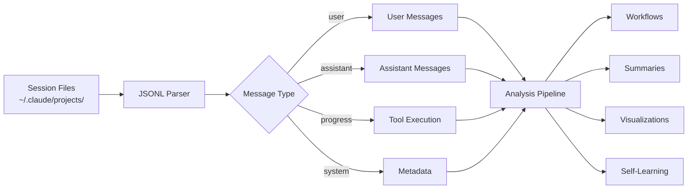
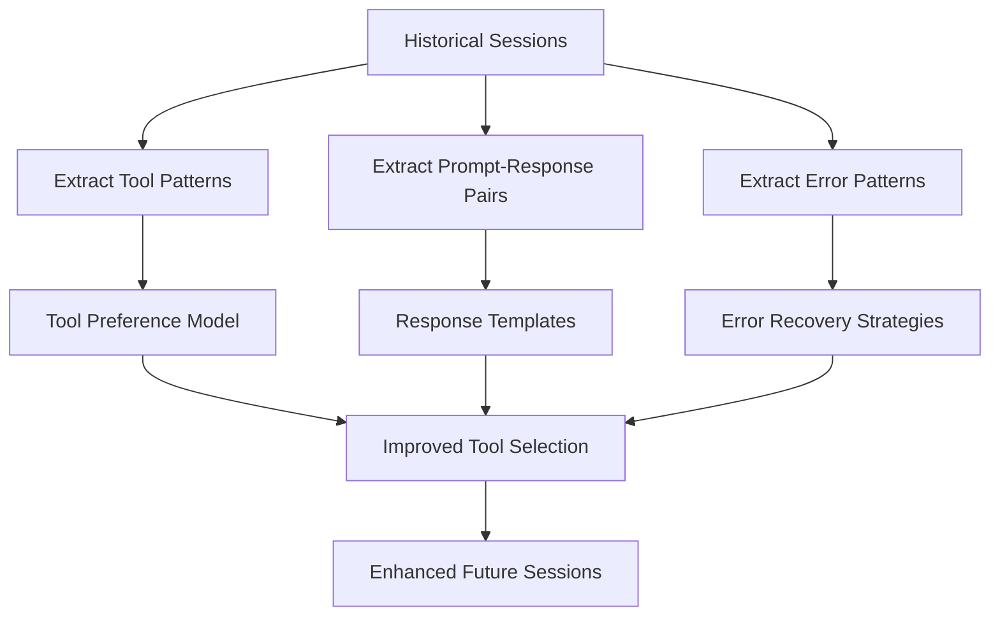
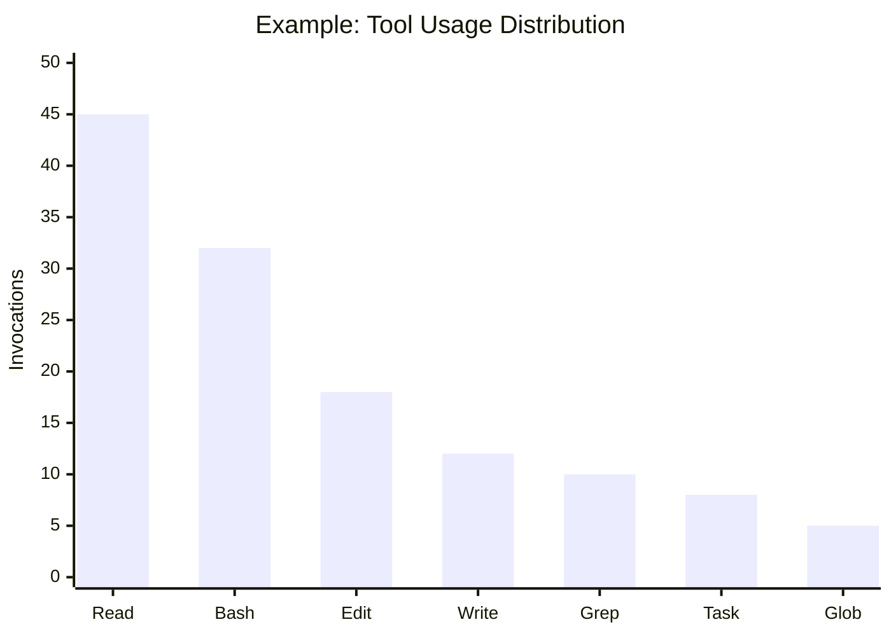
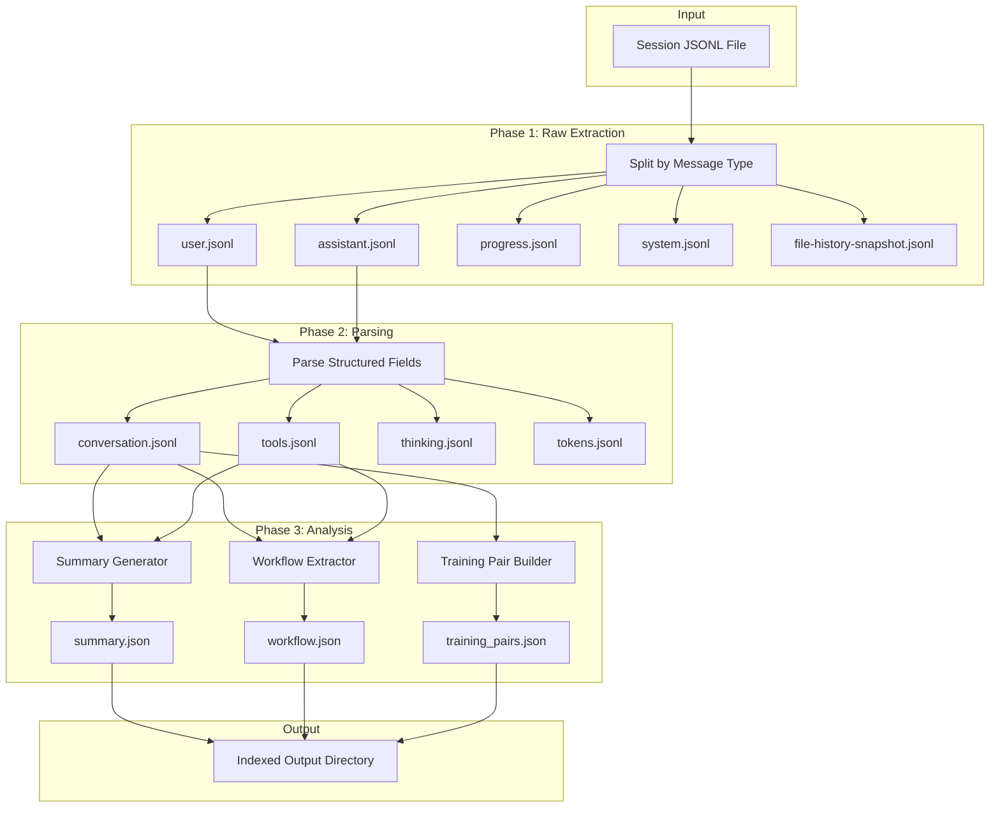
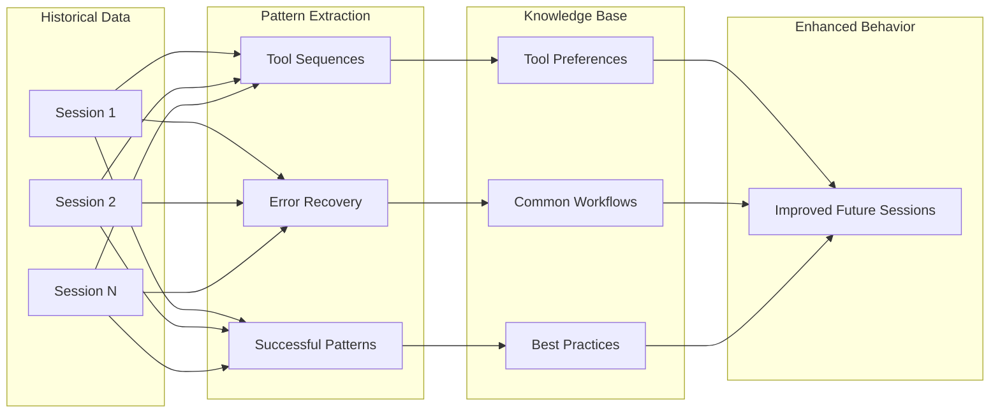
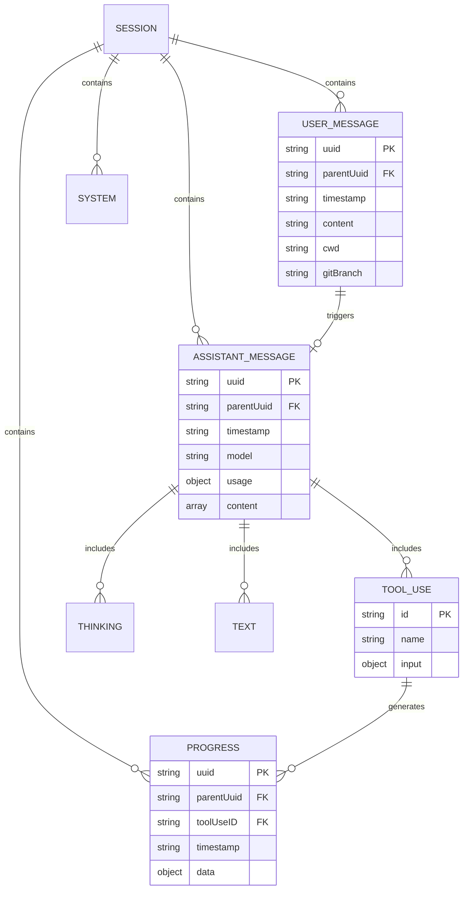

# Claude Code Session Extraction and Analysis Guide

A comprehensive guide to programmatically extracting, analyzing, and leveraging Claude Code session data for advanced workflows including self-learning, workflow generation, and visualization.

---

## Table of Contents

- [Overview](#overview)
- [Session Storage Architecture](#session-storage-architecture)
  - [Directory Structure](#directory-structure)
  - [Session File Format](#session-file-format)
  - [Message Types](#message-types)
- [Extraction Methods](#extraction-methods)
  - [Step 1: Locate Session Files](#step-1-locate-session-files)
  - [Step 2: Identify Target Session](#step-2-identify-target-session)
  - [Step 3: Extract Message Types](#step-3-extract-message-types)
  - [Step 4: Parse User Messages](#step-4-parse-user-messages)
  - [Step 5: Parse Assistant Messages](#step-5-parse-assistant-messages)
  - [Step 6: Extract Tool Usage](#step-6-extract-tool-usage)
- [Complete Extraction Pipeline](#complete-extraction-pipeline)
- [Raw Data Schemas](#raw-data-schemas)
  - [User Message Schema](#user-message-schema)
  - [Assistant Message Schema](#assistant-message-schema)
  - [Progress Message Schema](#progress-message-schema)
  - [System Message Schema](#system-message-schema)
- [Advanced Use Cases](#advanced-use-cases)
  - [Self-Learning from Previous Runs](#self-learning-from-previous-runs)
  - [Generating Reusable Workflows](#generating-reusable-workflows)
  - [Session Summaries](#session-summaries)
  - [Visualization and Analytics](#visualization-and-analytics)
- [Complete Extraction Script](#complete-extraction-script)
- [Workflow Diagrams](#workflow-diagrams)

---

## Overview

Claude Code stores all session data locally as JSONL (JSON Lines) files. Each line represents a discrete event in the conversation: user messages, assistant responses, tool executions, progress updates, and file snapshots.

This guide documents how to:
1. Locate and identify session files
2. Extract raw data without manipulation
3. Parse different message types
4. Build pipelines for advanced analysis



---

## Session Storage Architecture

### Directory Structure

Claude Code organizes sessions by project path:

```text
~/.claude/
├── projects/
│   ├── <project-path-hash>/
│   │   ├── <session-uuid>.jsonl          # Main session file
│   │   ├── <session-uuid>/               # Session artifacts
│   │   │   └── subagents/                # Subagent transcripts
│   │   │       └── agent-<id>.jsonl
│   │   └── memory/                       # Project memory
│   └── <another-project-hash>/
│       └── ...
├── history.jsonl                         # Command history (prompts only)
├── todos/                                # Task lists per session
└── file-history/                         # File change backups
```

**Project path hash format:** The directory name is the absolute project path with `/` replaced by `-`.

Example:
- Project: `/home/user/repos/my-app`
- Hash: `-home-user-repos-my-app`

### Session File Format

Sessions are stored as **JSONL** (JSON Lines) - one JSON object per line. This format:
- Supports streaming reads (no need to load entire file)
- Allows append-only writes during active sessions
- Preserves chronological order

**File naming:** `<uuid>.jsonl` where UUID is the session identifier.

### Message Types

Each line in a session file has a `type` field indicating its category:

| Type | Description | Frequency |
|------|-------------|-----------|
| `user` | User prompts and inputs | Per user message |
| `assistant` | Claude's responses (text, thinking, tool_use) | Per response |
| `progress` | Tool execution progress, hooks | Many per tool use |
| `system` | Metadata (turn duration, slugs) | Per turn |
| `file-history-snapshot` | File state checkpoints | Per file change |
| `queue-operation` | Background task management | Occasional |

---

## Extraction Methods

### Step 1: Locate Session Files

Find all session files across projects:

```bash
# List all session files sorted by modification time
ls -lt ~/.claude/projects/*/*.jsonl 2>/dev/null | head -20
```

Output example:
```text
-rw------- 1 user user  4034285 Feb  4 22:13 /home/user/.claude/projects/-home-user-repos-ai-sidekicks/88707686-686d-43c1-a3fa-b8c33ac86e2a.jsonl
-rw------- 1 user user   337569 Feb  4 20:00 /home/user/.claude/projects/-home-user-repos-ai-sidekicks/1df9cb2f-fc47-46cb-b1ee-e3f462746950.jsonl
```

### Step 2: Identify Target Session

Get metadata about a specific session:

```bash
SESSION_FILE="$HOME/.claude/projects/-home-user-repos-project/SESSION_UUID.jsonl"

# Get first and last user message timestamps
echo "=== Session Time Range ==="
cat "$SESSION_FILE" | jq -c 'select(.type == "user")' | head -1 | jq -r '.timestamp'
cat "$SESSION_FILE" | jq -c 'select(.type == "user")' | tail -1 | jq -r '.timestamp'

# Count message types
echo "=== Message Counts ==="
cat "$SESSION_FILE" | jq -r '.type' | sort | uniq -c
```

### Step 3: Extract Message Types

Extract all messages of a specific type without modification:

```bash
# Extract all user messages (raw, unmodified)
cat "$SESSION_FILE" | jq -c 'select(.type == "user")' > user_messages.jsonl

# Extract all assistant messages (raw, unmodified)
cat "$SESSION_FILE" | jq -c 'select(.type == "assistant")' > assistant_messages.jsonl

# Extract all progress events (raw, unmodified)
cat "$SESSION_FILE" | jq -c 'select(.type == "progress")' > progress_events.jsonl

# Extract all system metadata (raw, unmodified)
cat "$SESSION_FILE" | jq -c 'select(.type == "system")' > system_metadata.jsonl
```

### Step 4: Parse User Messages

Extract user prompts while preserving full context:

```bash
# Get raw user message content (preserves all fields)
cat "$SESSION_FILE" | jq -c 'select(.type == "user")' | while read -r line; do
    echo "$line" | jq '{
        uuid: .uuid,
        parentUuid: .parentUuid,
        timestamp: .timestamp,
        cwd: .cwd,
        gitBranch: .gitBranch,
        content: .message.content,
        version: .version,
        permissionMode: .permissionMode
    }'
done
```

### Step 5: Parse Assistant Messages

Extract Claude's responses including thinking and tool usage:

```bash
# Extract assistant messages with content breakdown
cat "$SESSION_FILE" | jq -c 'select(.type == "assistant")' | while read -r line; do
    echo "$line" | jq '{
        uuid: .uuid,
        parentUuid: .parentUuid,
        timestamp: .timestamp,
        model: .message.model,
        stop_reason: .message.stop_reason,
        usage: .message.usage,
        content_types: [.message.content[].type],
        thinking: [.message.content[] | select(.type == "thinking") | .thinking],
        text: [.message.content[] | select(.type == "text") | .text],
        tool_use: [.message.content[] | select(.type == "tool_use") | {name: .name, id: .id, input: .input}]
    }'
done
```

### Step 6: Extract Tool Usage

Build a complete tool usage log:

```bash
# Extract all tool invocations with inputs and timing
cat "$SESSION_FILE" | jq -c 'select(.type == "assistant")' | jq -s '
    [.[] |
        .timestamp as $ts |
        .uuid as $uuid |
        .message.content[] |
        select(.type == "tool_use") |
        {
            timestamp: $ts,
            message_uuid: $uuid,
            tool_name: .name,
            tool_id: .id,
            input: .input
        }
    ]
'
```

---

## Complete Extraction Pipeline

A full pipeline that extracts all data without shortening or manipulation:

```bash
#!/bin/bash
# session-extract.sh - Complete session extraction pipeline

SESSION_FILE="$1"
OUTPUT_DIR="$2"

if [[ -z "$SESSION_FILE" || -z "$OUTPUT_DIR" ]]; then
    echo "Usage: $0 <session-file.jsonl> <output-directory>"
    exit 1
fi

mkdir -p "$OUTPUT_DIR"

echo "=== Extracting session: $SESSION_FILE ==="

# 1. Extract raw messages by type (NO MODIFICATION)
echo "Extracting raw message types..."
cat "$SESSION_FILE" | jq -c 'select(.type == "user")' > "$OUTPUT_DIR/raw_user.jsonl"
cat "$SESSION_FILE" | jq -c 'select(.type == "assistant")' > "$OUTPUT_DIR/raw_assistant.jsonl"
cat "$SESSION_FILE" | jq -c 'select(.type == "progress")' > "$OUTPUT_DIR/raw_progress.jsonl"
cat "$SESSION_FILE" | jq -c 'select(.type == "system")' > "$OUTPUT_DIR/raw_system.jsonl"
cat "$SESSION_FILE" | jq -c 'select(.type == "file-history-snapshot")' > "$OUTPUT_DIR/raw_file_snapshots.jsonl"

# 2. Generate metadata summary
echo "Generating metadata..."
cat > "$OUTPUT_DIR/metadata.json" << EOF
{
    "source_file": "$SESSION_FILE",
    "extracted_at": "$(date -Iseconds)",
    "counts": {
        "user": $(wc -l < "$OUTPUT_DIR/raw_user.jsonl"),
        "assistant": $(wc -l < "$OUTPUT_DIR/raw_assistant.jsonl"),
        "progress": $(wc -l < "$OUTPUT_DIR/raw_progress.jsonl"),
        "system": $(wc -l < "$OUTPUT_DIR/raw_system.jsonl"),
        "file_snapshots": $(wc -l < "$OUTPUT_DIR/raw_file_snapshots.jsonl")
    },
    "time_range": {
        "first_message": "$(head -1 "$OUTPUT_DIR/raw_user.jsonl" | jq -r '.timestamp')",
        "last_message": "$(tail -1 "$OUTPUT_DIR/raw_user.jsonl" | jq -r '.timestamp')"
    }
}
EOF

# 3. Extract conversation thread (user prompts + assistant text only)
echo "Building conversation thread..."
cat "$SESSION_FILE" | jq -c '
    select(.type == "user" or .type == "assistant") |
    if .type == "user" then
        {type: "user", timestamp: .timestamp, content: .message.content}
    else
        {type: "assistant", timestamp: .timestamp, text: [.message.content[] | select(.type == "text") | .text] | join("\n")}
    end
' > "$OUTPUT_DIR/conversation_thread.jsonl"

# 4. Extract tool usage timeline
echo "Building tool usage timeline..."
cat "$SESSION_FILE" | jq -c '
    select(.type == "assistant") |
    .timestamp as $ts |
    .message.content[] |
    select(.type == "tool_use") |
    {timestamp: $ts, tool: .name, id: .id, input: .input}
' > "$OUTPUT_DIR/tool_timeline.jsonl"

# 5. Extract thinking/reasoning
echo "Extracting reasoning traces..."
cat "$SESSION_FILE" | jq -c '
    select(.type == "assistant") |
    .timestamp as $ts |
    .message.content[] |
    select(.type == "thinking") |
    {timestamp: $ts, thinking: .thinking}
' > "$OUTPUT_DIR/thinking_traces.jsonl"

# 6. Extract token usage
echo "Extracting token usage..."
cat "$SESSION_FILE" | jq -c '
    select(.type == "assistant") |
    {
        timestamp: .timestamp,
        model: .message.model,
        input_tokens: .message.usage.input_tokens,
        output_tokens: .message.usage.output_tokens,
        cache_read: .message.usage.cache_read_input_tokens,
        cache_creation: .message.usage.cache_creation_input_tokens
    }
' > "$OUTPUT_DIR/token_usage.jsonl"

echo "=== Extraction complete ==="
echo "Output directory: $OUTPUT_DIR"
ls -la "$OUTPUT_DIR"
```

---

## Raw Data Schemas

### User Message Schema

```json
{
  "type": "user",
  "uuid": "51675668-cd75-44e9-a6c8-3e5941017957",
  "parentUuid": null,
  "timestamp": "2026-02-04T22:39:02.650Z",
  "sessionId": "471cdb30-f11d-4120-9857-2c97d9933831",
  "cwd": "/home/user/repos/project",
  "gitBranch": "develop",
  "version": "2.1.31",
  "permissionMode": "default",
  "isSidechain": false,
  "userType": "external",
  "thinkingMetadata": {
    "maxThinkingTokens": 31999
  },
  "todos": [],
  "message": {
    "role": "user",
    "content": "User's prompt text here..."
  }
}
```

### Assistant Message Schema

```json
{
  "type": "assistant",
  "uuid": "f442ab2a-13ca-4f4b-9241-71b48b99ccd1",
  "parentUuid": "51675668-cd75-44e9-a6c8-3e5941017957",
  "timestamp": "2026-02-04T22:39:05.769Z",
  "sessionId": "471cdb30-f11d-4120-9857-2c97d9933831",
  "cwd": "/home/user/repos/project",
  "gitBranch": "develop",
  "version": "2.1.31",
  "requestId": "req_011CXoqC9zfgMNP1p4jUd46x",
  "isSidechain": false,
  "userType": "external",
  "message": {
    "model": "claude-opus-4-5-20251101",
    "id": "msg_017pkyihKCeMxo5jufeMgPJy",
    "type": "message",
    "role": "assistant",
    "stop_reason": "end_turn",
    "stop_sequence": null,
    "usage": {
      "input_tokens": 10,
      "output_tokens": 500,
      "cache_creation_input_tokens": 6964,
      "cache_read_input_tokens": 16152,
      "cache_creation": {
        "ephemeral_5m_input_tokens": 0,
        "ephemeral_1h_input_tokens": 6964
      },
      "service_tier": "standard"
    },
    "content": [
      {
        "type": "thinking",
        "thinking": "Claude's internal reasoning...",
        "signature": "base64-signature..."
      },
      {
        "type": "text",
        "text": "Claude's visible response..."
      },
      {
        "type": "tool_use",
        "id": "toolu_01ABC123",
        "name": "Read",
        "input": {
          "file_path": "/path/to/file"
        }
      }
    ]
  }
}
```

### Progress Message Schema

```json
{
  "type": "progress",
  "uuid": "17530ea5-ce9e-4da2-af4b-12c0f12ab519",
  "parentUuid": "7d12209e-9632-447e-a3a2-e2119562a3dc",
  "timestamp": "2026-02-04T22:39:06.363Z",
  "sessionId": "471cdb30-f11d-4120-9857-2c97d9933831",
  "cwd": "/home/user/repos/project",
  "gitBranch": "develop",
  "version": "2.1.31",
  "slug": "partitioned-wobbling-metcalfe",
  "parentToolUseID": "toolu_01GZFK3K1ugqA2JipaXGbbpZ",
  "toolUseID": "toolu_01GZFK3K1ugqA2JipaXGbbpZ",
  "isSidechain": false,
  "userType": "external",
  "data": {
    "type": "hook_progress",
    "hookEvent": "PostToolUse",
    "hookName": "PostToolUse:Read",
    "command": "callback"
  }
}
```

### System Message Schema

```json
{
  "type": "system",
  "subtype": "turn_duration",
  "uuid": "0e3c85f1-2762-48e7-a232-000e25eca892",
  "parentUuid": "0ca4e5c8-d0bb-4c7a-a141-c149d6a8417f",
  "timestamp": "2026-02-04T22:40:26.107Z",
  "sessionId": "471cdb30-f11d-4120-9857-2c97d9933831",
  "cwd": "/home/user/repos/project",
  "gitBranch": "develop",
  "version": "2.1.31",
  "slug": "partitioned-wobbling-metcalfe",
  "durationMs": 83451,
  "isMeta": false,
  "isSidechain": false,
  "userType": "external"
}
```

---

## Advanced Use Cases

### Self-Learning from Previous Runs

Extract patterns from successful sessions to inform future behavior:

```bash
# Extract successful tool sequences (tools that didn't error)
cat "$SESSION_FILE" | jq -s '
    [.[] | select(.type == "assistant")] |
    [.[].message.content[] | select(.type == "tool_use")] |
    group_by(.name) |
    map({tool: .[0].name, count: length, inputs: [.[].input]})
' > tool_patterns.json

# Extract prompt-response pairs for fine-tuning data
cat "$SESSION_FILE" | jq -s '
    [
        [.[] | select(.type == "user" or .type == "assistant")] |
        to_entries |
        .[] |
        select(.value.type == "user") |
        {
            prompt: .value.message.content,
            response: (.[.key + 1].value.message.content // [] | map(select(.type == "text")) | .[0].text // "")
        }
    ]
' > training_pairs.json
```



### Generating Reusable Workflows

Convert session sequences into reproducible workflow definitions:

```bash
# Extract workflow skeleton from a session
cat "$SESSION_FILE" | jq -s '
{
    name: "Extracted Workflow",
    description: "Auto-generated from session",
    steps: [
        [.[] | select(.type == "user")] |
        to_entries |
        .[] |
        {
            step: (.key + 1),
            prompt: .value.message.content,
            timestamp: .value.timestamp
        }
    ],
    tools_used: (
        [.[] | select(.type == "assistant") | .message.content[] | select(.type == "tool_use") | .name] |
        unique
    ),
    files_touched: (
        [.[] | select(.type == "assistant") | .message.content[] | select(.type == "tool_use") |
         select(.name == "Read" or .name == "Write" or .name == "Edit") |
         .input.file_path // .input.path] |
        unique |
        map(select(. != null))
    )
}
' > workflow.json
```

### Session Summaries

Generate comprehensive session summaries:

```bash
# Generate executive summary
cat "$SESSION_FILE" | jq -s '
{
    session_id: (.[0].sessionId // "unknown"),
    project: (.[0].cwd // "unknown"),
    git_branch: (.[0].gitBranch // "unknown"),
    time_range: {
        start: ([.[] | select(.type == "user") | .timestamp] | min),
        end: ([.[] | select(.type == "user") | .timestamp] | max)
    },
    message_counts: (
        group_by(.type) |
        map({key: .[0].type, value: length}) |
        from_entries
    ),
    tools_summary: (
        [.[] | select(.type == "assistant") | .message.content[] | select(.type == "tool_use") | .name] |
        group_by(.) |
        map({tool: .[0], count: length}) |
        sort_by(-.count)
    ),
    token_usage: {
        total_input: ([.[] | select(.type == "assistant") | .message.usage.input_tokens // 0] | add),
        total_output: ([.[] | select(.type == "assistant") | .message.usage.output_tokens // 0] | add),
        cache_hits: ([.[] | select(.type == "assistant") | .message.usage.cache_read_input_tokens // 0] | add)
    },
    user_prompts: [.[] | select(.type == "user") | .message.content | .[0:200]]
}
' > session_summary.json
```

### Visualization and Analytics

Generate data for visualization tools:

```bash
# Token usage over time (for charts)
cat "$SESSION_FILE" | jq -c '
    select(.type == "assistant") |
    {
        timestamp: .timestamp,
        input: .message.usage.input_tokens,
        output: .message.usage.output_tokens
    }
' > token_timeseries.jsonl

# Tool usage frequency (for bar charts)
cat "$SESSION_FILE" | jq -s '
    [.[] | select(.type == "assistant") | .message.content[] | select(.type == "tool_use") | .name] |
    group_by(.) |
    map({name: .[0], count: length}) |
    sort_by(-.count)
' > tool_frequency.json

# Conversation flow (for Sankey diagrams)
cat "$SESSION_FILE" | jq -s '
    [
        [.[] | select(.type == "user" or .type == "assistant")] |
        to_entries |
        .[] |
        select(.key > 0) |
        {
            source: (if .[(.key - 1)].value.type == "user" then "user_\(.key)" else "assistant_\(.key)" end),
            target: (if .value.type == "user" then "user_\(.key + 1)" else "assistant_\(.key + 1)" end),
            value: 1
        }
    ]
' > conversation_flow.json
```



---

## Complete Extraction Script

A production-ready script for full session extraction:

```bash
#!/bin/bash
# session-analyzer.sh - Complete session analysis toolkit
# Usage: ./session-analyzer.sh <session-file> <output-dir> [--summary] [--workflow] [--training]

set -euo pipefail

SESSION_FILE="${1:-}"
OUTPUT_DIR="${2:-}"
shift 2 || true

# Parse flags
GENERATE_SUMMARY=false
GENERATE_WORKFLOW=false
GENERATE_TRAINING=false

for arg in "$@"; do
    case "$arg" in
        --summary) GENERATE_SUMMARY=true ;;
        --workflow) GENERATE_WORKFLOW=true ;;
        --training) GENERATE_TRAINING=true ;;
        --all) GENERATE_SUMMARY=true; GENERATE_WORKFLOW=true; GENERATE_TRAINING=true ;;
    esac
done

if [[ -z "$SESSION_FILE" || -z "$OUTPUT_DIR" ]]; then
    echo "Usage: $0 <session-file.jsonl> <output-directory> [--summary] [--workflow] [--training] [--all]"
    exit 1
fi

if [[ ! -f "$SESSION_FILE" ]]; then
    echo "Error: Session file not found: $SESSION_FILE"
    exit 1
fi

mkdir -p "$OUTPUT_DIR"/{raw,parsed,analysis}

echo "========================================"
echo "Session Analyzer"
echo "========================================"
echo "Input:  $SESSION_FILE"
echo "Output: $OUTPUT_DIR"
echo "========================================"

# ============================================
# PHASE 1: Raw Extraction (No Modification)
# ============================================
echo ""
echo "[Phase 1] Extracting raw data..."

# Extract each message type to separate files
for msg_type in user assistant progress system file-history-snapshot queue-operation; do
    output_file="$OUTPUT_DIR/raw/${msg_type}.jsonl"
    cat "$SESSION_FILE" | jq -c "select(.type == \"$msg_type\")" > "$output_file" 2>/dev/null || touch "$output_file"
    count=$(wc -l < "$output_file")
    echo "  - $msg_type: $count messages"
done

# ============================================
# PHASE 2: Parsed Data
# ============================================
echo ""
echo "[Phase 2] Parsing structured data..."

# Conversation thread
echo "  - Building conversation thread..."
cat "$SESSION_FILE" | jq -c '
    select(.type == "user" or .type == "assistant") |
    {
        type: .type,
        uuid: .uuid,
        parent: .parentUuid,
        timestamp: .timestamp,
        content: (
            if .type == "user" then
                .message.content
            else
                [.message.content[] | select(.type == "text") | .text] | join("\n")
            end
        )
    }
' > "$OUTPUT_DIR/parsed/conversation.jsonl"

# Tool invocations
echo "  - Extracting tool invocations..."
cat "$SESSION_FILE" | jq -c '
    select(.type == "assistant") |
    .timestamp as $ts |
    .uuid as $uuid |
    .message.content[] |
    select(.type == "tool_use") |
    {
        timestamp: $ts,
        message_uuid: $uuid,
        tool_id: .id,
        tool_name: .name,
        input: .input
    }
' > "$OUTPUT_DIR/parsed/tools.jsonl"

# Thinking traces
echo "  - Extracting thinking traces..."
cat "$SESSION_FILE" | jq -c '
    select(.type == "assistant") |
    .timestamp as $ts |
    .uuid as $uuid |
    .message.content[] |
    select(.type == "thinking") |
    {
        timestamp: $ts,
        message_uuid: $uuid,
        thinking: .thinking
    }
' > "$OUTPUT_DIR/parsed/thinking.jsonl"

# Token usage
echo "  - Extracting token usage..."
cat "$SESSION_FILE" | jq -c '
    select(.type == "assistant") |
    select(.message.usage != null) |
    {
        timestamp: .timestamp,
        model: .message.model,
        input_tokens: .message.usage.input_tokens,
        output_tokens: .message.usage.output_tokens,
        cache_read: (.message.usage.cache_read_input_tokens // 0),
        cache_creation: (.message.usage.cache_creation_input_tokens // 0)
    }
' > "$OUTPUT_DIR/parsed/tokens.jsonl"

# ============================================
# PHASE 3: Analysis (Optional)
# ============================================

if [[ "$GENERATE_SUMMARY" == "true" ]]; then
    echo ""
    echo "[Phase 3a] Generating summary..."

    cat "$SESSION_FILE" | jq -s '
    {
        session_id: (.[0].sessionId // "unknown"),
        project_path: (.[0].cwd // "unknown"),
        git_branch: (.[0].gitBranch // "unknown"),
        claude_version: (.[0].version // "unknown"),
        time_range: {
            start: ([.[] | select(.type == "user") | .timestamp] | min // null),
            end: ([.[] | select(.type == "user") | .timestamp] | max // null)
        },
        message_counts: (
            group_by(.type) |
            map({key: .[0].type, value: length}) |
            from_entries
        ),
        tool_usage: (
            [.[] | select(.type == "assistant") | .message.content[]? | select(.type == "tool_use") | .name] |
            group_by(.) |
            map({tool: .[0], count: length}) |
            sort_by(-.count)
        ),
        token_totals: {
            input: ([.[] | select(.type == "assistant") | .message.usage.input_tokens // 0] | add),
            output: ([.[] | select(.type == "assistant") | .message.usage.output_tokens // 0] | add),
            cache_read: ([.[] | select(.type == "assistant") | .message.usage.cache_read_input_tokens // 0] | add),
            cache_created: ([.[] | select(.type == "assistant") | .message.usage.cache_creation_input_tokens // 0] | add)
        },
        files_accessed: (
            [.[] | select(.type == "assistant") | .message.content[]? |
             select(.type == "tool_use") |
             select(.name == "Read" or .name == "Write" or .name == "Edit" or .name == "Glob" or .name == "Grep") |
             (.input.file_path // .input.path // .input.pattern // null)] |
            map(select(. != null)) |
            unique
        ),
        user_prompts_preview: [
            .[] | select(.type == "user") |
            {
                timestamp: .timestamp,
                preview: (.message.content | .[0:300])
            }
        ]
    }
    ' > "$OUTPUT_DIR/analysis/summary.json"

    echo "  - Summary written to analysis/summary.json"
fi

if [[ "$GENERATE_WORKFLOW" == "true" ]]; then
    echo ""
    echo "[Phase 3b] Generating workflow..."

    cat "$SESSION_FILE" | jq -s '
    {
        name: "Auto-extracted Workflow",
        extracted_from: input_filename,
        steps: [
            [.[] | select(.type == "user")] |
            to_entries |
            .[] |
            {
                step_number: (.key + 1),
                timestamp: .value.timestamp,
                prompt: .value.message.content,
                tools_triggered: []
            }
        ],
        tools_required: (
            [.[] | select(.type == "assistant") | .message.content[]? | select(.type == "tool_use") | .name] |
            unique
        ),
        estimated_complexity: (
            [.[] | select(.type == "assistant") | .message.content[]? | select(.type == "tool_use")] |
            length
        )
    }
    ' > "$OUTPUT_DIR/analysis/workflow.json"

    echo "  - Workflow written to analysis/workflow.json"
fi

if [[ "$GENERATE_TRAINING" == "true" ]]; then
    echo ""
    echo "[Phase 3c] Generating training data..."

    # Generate prompt-completion pairs
    cat "$SESSION_FILE" | jq -s '
    [
        [.[] | select(.type == "user" or .type == "assistant")] |
        [., .[1:]] |
        transpose |
        .[] |
        select(.[0].type == "user" and .[1].type == "assistant") |
        {
            prompt: .[0].message.content,
            completion: ([.[1].message.content[]? | select(.type == "text") | .text] | join("\n")),
            tools_used: [.[1].message.content[]? | select(.type == "tool_use") | .name],
            timestamp: .[0].timestamp
        }
    ]
    ' > "$OUTPUT_DIR/analysis/training_pairs.json"

    echo "  - Training pairs written to analysis/training_pairs.json"
fi

# ============================================
# PHASE 4: Generate Index
# ============================================
echo ""
echo "[Phase 4] Generating index..."

cat > "$OUTPUT_DIR/index.json" << EOF
{
    "source_file": "$SESSION_FILE",
    "extracted_at": "$(date -Iseconds)",
    "files": {
        "raw": {
            "user": "raw/user.jsonl",
            "assistant": "raw/assistant.jsonl",
            "progress": "raw/progress.jsonl",
            "system": "raw/system.jsonl",
            "file_snapshots": "raw/file-history-snapshot.jsonl"
        },
        "parsed": {
            "conversation": "parsed/conversation.jsonl",
            "tools": "parsed/tools.jsonl",
            "thinking": "parsed/thinking.jsonl",
            "tokens": "parsed/tokens.jsonl"
        },
        "analysis": {
            "summary": $(if [[ "$GENERATE_SUMMARY" == "true" ]]; then echo '"analysis/summary.json"'; else echo 'null'; fi),
            "workflow": $(if [[ "$GENERATE_WORKFLOW" == "true" ]]; then echo '"analysis/workflow.json"'; else echo 'null'; fi),
            "training": $(if [[ "$GENERATE_TRAINING" == "true" ]]; then echo '"analysis/training_pairs.json"'; else echo 'null'; fi)
        }
    }
}
EOF

echo ""
echo "========================================"
echo "Extraction complete!"
echo "========================================"
echo ""
ls -laR "$OUTPUT_DIR"
```

---

## Workflow Diagrams

### Session Extraction Flow



### Self-Learning Pipeline



### Message Type Relationships



---

## Appendix: Quick Reference

### Common jq Patterns

```bash
# Count messages by type
jq -r '.type' session.jsonl | sort | uniq -c

# Get all user prompts
jq -c 'select(.type == "user") | .message.content' session.jsonl

# Get all tool names used
jq -c 'select(.type == "assistant") | .message.content[] | select(.type == "tool_use") | .name' session.jsonl | sort | uniq -c

# Get total tokens used
jq -s '[.[] | select(.type == "assistant") | .message.usage | (.input_tokens + .output_tokens)] | add' session.jsonl

# Find messages with errors
jq -c 'select(.message.content[]?.type == "tool_result" and .message.content[]?.is_error == true)' session.jsonl
```

### Session File Locations

| Platform | Path |
|----------|------|
| Linux/WSL | `~/.claude/projects/<hash>/*.jsonl` |
| macOS | `~/.claude/projects/<hash>/*.jsonl` |
| Windows | `%USERPROFILE%\.claude\projects\<hash>\*.jsonl` |

### Important Notes

1. **Raw data preservation**: Always keep the original JSONL files. Derived data can be regenerated.
2. **Large files**: For sessions >100MB, use streaming (`jq -c` with pipes) instead of `-s` (slurp).
3. **Subagent sessions**: Check `<session-uuid>/subagents/` for nested agent transcripts.
4. **Timestamps**: All timestamps are ISO 8601 UTC format.
5. **UUIDs**: Use `parentUuid` to reconstruct conversation threading.
